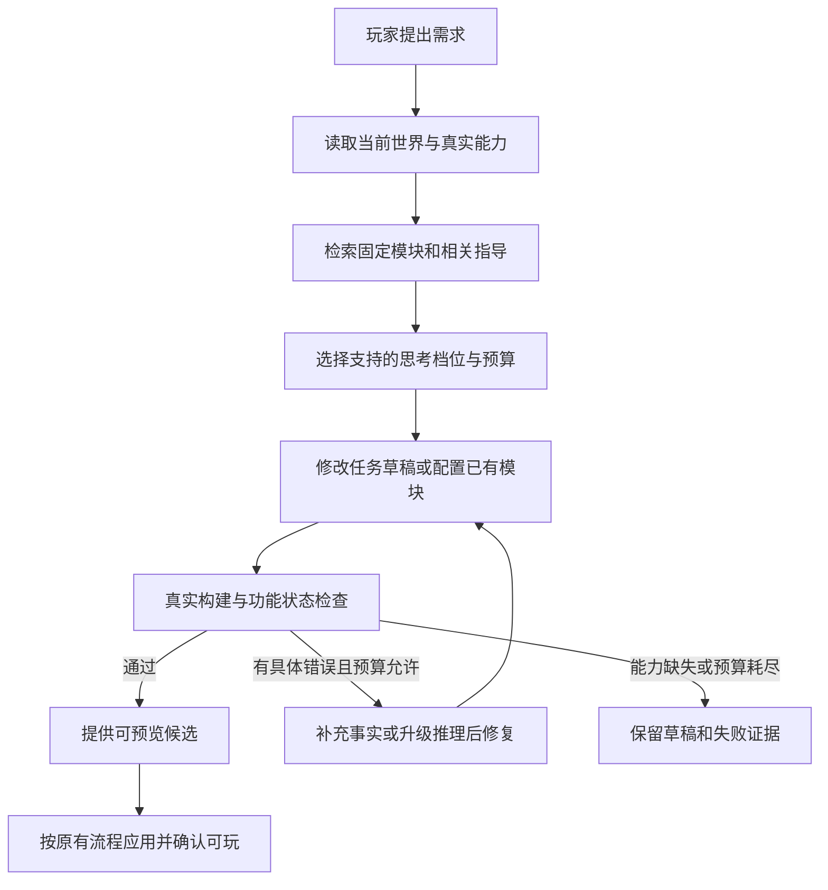

# 最中幻想 / Craftmine World：AI 创作效率与可靠性开发计划书

版本：1.0  
编制日期：2026-09-10  
检查基线：`bcebeb1f88ad9ce4660281fd442bb0abf643c0b4`（本地 master；另有正在推进的源码与未提交计划）  
状态：开发与实验方案；本次仅编制文档，不调整玩家模型设置、不运行付费模型对照、不宣称已有提速结果。

配套：[Godot 总计划](GODOT_MULTIBASE_DEVELOPMENT_PLAN.md)、[创作包与复用计划](CREATION_PACKAGE_DEVELOPMENT_PLAN.md)、[素材库计划](ASSET_LIBRARY_DEVELOPMENT_PLAN.md)、[版本管理计划](VERSION_MANAGEMENT_DEVELOPMENT_PLAN.md)、[社区计划](COMMUNITY_PLATFORM_DEVELOPMENT_PLAN.md)。历史参考：[Harness 开发计划](HARNESS_DEVELOPMENT_PLAN.md)。

## 1. 目标与决策

让玩家用自然语言提出需求后，尽快得到符合要求、能实际运行且保留兼容进度的结果。优化对象是从需求到可玩结果的整条流程，包含检索、推理、工具调用、构建、检查、修复和应用，不能用更早出现一句回复代替实际完成。

采用“按任务选择思考强度＋按需读取文档和 skill＋优先复用固定模块＋真实执行反馈”的组合。简单参数和成熟模块配置优先走快速路径；新玩法、多文件关联、状态迁移和复杂故障使用较强推理。选择依据来自实测和可检查的任务特征，不由模型自行声称有把握就跳过验证。

教程解释知识与接口，skill 组织完成任务的步骤，示例展示可运行实现，模块提供已经实现的功能。它们可以减少重复探索，但不会永久训练模型、增加宿主权限或补出尚未实现的执行器。是否帮助当前模型、能减少多少耗时和失败，需要在本项目中测量。

第一阶段维持同一个已选模型，只研究它实际支持的思考设置和指导资料。自动切换模型/供应商、扩大工具权限和自动发布社区内容分别有额外成本与条件，不借“提速”默认开启。

## 2. 当前基础与真实缺口

| 范围 | 已观察事实 | 本计划补齐 |
| --- | --- | --- |
| 旧 Web 模型入口 | [agent-model.mjs](../app/agent-model.mjs)默认关闭思考，并有开关、强度和输出预算处理 | 旧路径的小样本不能代表 PI/Godot 新路径；按实际请求记录设置和响应 |
| 桌面模型能力 | [模型思考配置](../vendor/pi-desktop/packages/agent-runtime/src/thinking-level.ts)与运行器已有能力映射及会话设置 | 核对 UI 选择、实际请求参数、供应商映射与有效预算，不能只信界面标签 |
| Skill 基础 | [目录生成](../vendor/pi-desktop/packages/agent-runtime/src/plugin-skills-prompt.ts)和[运行器](../vendor/pi-desktop/packages/agent-runtime/src/runtime.ts)已有目录/按需加载机制 | 核对 Craftmine 实际注册、工具过滤、正文读取与记录；不能认为有通用 Skill 工具就已有游戏技能体系 |
| 工具与世界事实 | [Craftmine 上下文](../vendor/pi-desktop/packages/agent-runtime/src/craftmine-context.ts)注入任务、世界、能力与预算；有独立工具允许列表 | 技能读取须通过正确的产品边界；基线中的允许列表需专门验证，不为读取文档开放任意宿主文件 |
| Godot 创作 | [工具声明](../plugins/craftmine-world/manifest.json)区分源码存储、构建作业和执行器状态 | 以当次真实能力与回执判断能否构建/试玩/应用，不能沿用过时的“不可用”说明或虚构已就绪 |
| 复用与历史 | VM/AL/CP 已规划固定资源、实例绑定、升级和恢复，相关实现正在推进 | AI 消费正式接口与准确版本，不另外制造模块历史或直接写正式世界 |
| 高阶策略实验 | GD8 与[当前 R11 任务范围](dispatch-prompts/godot-round2-20260910/R11-l3-l4-after-baseline.md)已有 L4 对照要求 | 本计划细化思考与技能实验，复用冻结评测集合、证据格式和正式集成渠道 |

本次检查是源码与文档阅读，不是实际模型调用或端到端验收。其他任务的新提交要按准确基线重新核对；历史报告中的执行器阻塞、毫秒级生成或单次长推理结果均不能直接当作当前产品结论。

## 3. 先区分失败，再决定处理方法

| 失败类别 | 典型表现 | 正确处理 |
| --- | --- | --- |
| 能力未就绪 | 工具不存在、执行器未注册、目标平台未支持 | 查询真实状态；可保存源码草稿时明确范围，不靠反复推理假装完成 |
| 资料缺失/过期 | 猜接口、用了旧底座参数、不知道资源在哪里 | 读取准确版本文档、实际源码和当前能力；失效资料退出检索 |
| 接口调用错误 | 参数不合法、工具顺序错误、混淆草稿与正式内容 | 改善 schema、工具说明和 skill，返回可操作的错误 |
| 设计/推理不足 | 漏掉库存与货币关联、多处代码不一致、修复方向错误 | 在事实齐全后提高推理强度或拆分受检查的工作步骤 |
| 环境/服务故障 | 网络超时、限流、引擎进程故障、磁盘不足 | 受限重试、恢复原操作或报告环境问题，避免生成另一份相同改动 |
| 要求理解有误 | 做成不同玩法，遗漏玩家后续纠正 | 回读原始需求和当前约定；只有关键歧义才询问玩家 |
| 结果验证不足 | 代码能编译但玩法错误、重启后丢进度 | 运行真实功能与状态检查；检查器结果不能由模型自评替代 |

每次失败记录类别、证据和后续动作；分类不确定时允许标未知，不能把所有失败归为“模型不够聪明”。技能与模型能力是独立改进方向，工具接线和运行验证也分别交付。

## 4. 思考强度与自动选择策略

### 4.1 初始策略

| 任务特征 | 例子 | 起始策略 | 必须保持的检查 |
| --- | --- | --- | --- |
| 明确局部参数 | 改门颜色、调整已支持的移动速度 | 非思考或供应商实际支持的低强度 | 对象身份、参数范围、变更范围及适用的运行检查 |
| 成熟资源复用 | 放入已有宝箱、按现成商店配置商品 | 先检索固定版本，快速模式配置和安装 | 完整依赖、兼容性、独立实例与初始状态 |
| 小型新增行为 | 自动门、简单触发器 | 读取相关接口/示例后用经评测的较低或中等档位 | 交互真实发生、碰撞和保存恢复 |
| 新系统或多处关联 | 从零开发交易/背包联动、组合机关 | 直接使用较强推理，先读取相关工程 | 关联规则、错误分支、旧功能与进度回归 |
| 状态迁移或复杂错误 | 升级任务系统不重复奖励、跨场景持久化故障 | 较强推理，使用状态约定和真实错误 | 隔离迁移、最新进度、失败恢复及正式应用回执 |

此表是待评测的默认假设，不是所有模型都具备同名档位。自动选择先使用任务类型、现成模块是否存在、依赖数量、状态变更和既有错误等信号；模糊任务先读取必要事实。路由判定自身的请求和耗时计入总账，避免为一个简单修改多加数次模型调用。

### 4.2 设置、预算与升级

玩家界面建议提供“自动、快速、深入”，默认自动，详情展示实际模型和档位。明确固定的用户设置优先；用户关闭思考或设置费用上限时，不能静默开启更高档或换模型。自动档中的升级范围在产品策略内说明，普通已授权创作不增加重复确认。

初始候选策略为：同一低强度路径最多进行一次基于具体错误的修复；仍失败且属于推理/设计原因时，在剩余总预算内升级一次。复杂任务可直接进入较强推理。连续相同错误且没有新增证据时，不原样重复请求；仍未解决则保存草稿与结果。次数是待测策略参数，连同时间/费用上限在 AI0 冻结。

全任务预算统一覆盖路由、生成、检索、修复、审核、压缩和供应商重试。切换模式或进入新上下文不重置预算；预留有效代码输出、工具结果和必要检查空间，不能让推理占满预算后返回空内容。仅缩短模型输出不能代替更高效的工程编辑。

每次请求记录“用户选择、策略决定、实际发送、供应商接受/映射”的设置。模型不支持关闭思考或某个强度时，使用明确可支持的选项或报告不支持，不将静默映射显示成确实切换。模型别名、限时版本或默认参数变化时重新校准，历史实验不无条件继承。

DeepSeek 的官方协议分别定义思考开关、强度和工具调用中的推理历史处理；实际适配须按使用的模型版本核对，不能把某一版本的映射套给所有模型。开启思考不等于取得额外工具权限。[DeepSeek 思考模式](https://api-docs.deepseek.com/guides/thinking_mode/)、[工具调用](https://api-docs.deepseek.com/guides/tool_calls/)

模式变化只在安全的请求边界执行；先接收或处理已发工具操作的结果，再继续。供应商要求保留的原始会话/工具关联由适配层维护，不能让模型补写伪造的推理字段、重复工具回包或丢弃既有操作。跨供应商切换暂不作为首版自动策略。

## 5. 文档、示例与 skill 的组织

| 层级 | 内容 | 读取时机 |
| --- | --- | --- |
| 核心规则 | 当前能力入口、草稿/检查/应用区别、用户约束、版本与状态事实 | 精简常驻，每次请求按实际状态更新 |
| 能力目录 | 可用工具、底座接口、资源与 skill 的名称、用途和版本摘要 | 初始可发现；不能把全部正文常驻 |
| 任务 skill | 适用条件、需要的事实、完成步骤、常见错误和结果检查 | 任务匹配后读取，并记录准确版本 |
| 接口参考 | 参数、事件、输入输出、状态结构、失败码与限制 | 按相关底座/模块/版本读取 |
| 可运行示例 | 最小源码、固定资源、运行入口和验收依据 | 需要实现或适配时读取必要部分 |
| 已验证模块 | 可以直接安装或配置的 AssetRef 与依赖 | 适合复用时取得确切内容，不只引用摘要 |

Skill 是按需加载的流程和资源组织方式；少量目录信息帮助选择，正文与参考按需要展开。已有成熟做法支持这种组织方式，但我们的加载、版本控制和收益仍要实际验证。[Agent Skills 设计](https://www.anthropic.com/engineering/equipping-agents-for-the-real-world-with-agent-skills)

资料以当前引擎、底座、模块接口和工具集版本过滤。引用的接口不存在时返回明确缺项；AI 不能根据旧教程自行创造工具。检索优先使用任务与资源关联、确切名称和版本，确有规模问题后再增加向量检索；第一版不为少量教程先建复杂知识平台。

玩家操作教程、模型开发接口说明和未来开发计划分别标明用途与实现状态。运行目录优先提供对应已交付版本的接口和示例；计划里的拟定 API、旧运行器教程或待实现功能不能被检索结果包装成当前可用能力，最终仍以宿主查询为准。

常驻内容保持精简，任务必要事实不得因追求短提示而省略。原始需求与纠正、选中实例、源码读取记录、固定依赖和最新检查结果优先于长篇历史描述；正文超限时保留可继续读取的定位信息，不能悄悄截断后假装已读完。[上下文组织建议](https://www.anthropic.com/engineering/effective-context-engineering-for-ai-agents)

### 5.1 Skill 的最小内容约定

每个任务 skill 至少包括：稳定 ID 与版本、适用/不适用条件、所需真实能力、适配的底座/模块范围、操作流程、引用文档与示例、成功标准、已知错误及恢复方式、来源与证据。正文和引用文件记录哈希；任务绑定具体版本，不在任务中途静默替换说明。

优先复用现有 PI 插件 skill 目录和加载通道，通过受控产品接口提供正文。需要辅助脚本时，脚本进入既有代码审核与执行边界；skill 文件不能自行安装依赖、执行宿主命令或改安全策略。本计划定义的是产品内的指导机制，不自动安装本次开发助手的个人 skill。

第一批指导内容：底座与能力识别、固定模块安装、可交互物件、背包/交易接入、状态保存与迁移、依据构建错误修复。每项先从具体失败与一个最小成功样本提炼，避免先堆积大量未经使用的教程。

### 5.2 商店 skill 示例范围

先读当前底座、背包、货币及保存接口；检索兼容交易模块；固定依赖并确定商品和价格；只补缺少的场景/UI 适配；检查购买、余额不足、背包已满、库存、重复交互以及重启后的数据；生成可预览候选，再由原有应用流程处理。接口尚未具备时报告具体缺口，不承诺商店已可运行。

Skill 给出流程与约束，不限定所有商店必须长成同一样子。已有规则可以配置，原创玩法仍允许开发源码；是否复用、修改了什么及其来源都准确记录。

## 6. 与创作包、模块和社区的关系

运行内容仍采用 CP 的七类划分。教学资料与 skill 属于创作指导，和运行内容类型正交；包里附带的 README/开发说明可以按文件引用读取，不因此自动变成被宿主信任的技能或新增一种拥有特权的包类型。

推荐的提速顺序是：确定已有能力 → 找到可复用版本 → 用文档/skill 正确配置 → 对确实缺失的部分编写代码 → 检查和修复。快路径仍通过 AL/CP 安装提案与 VM/GD 正式应用，不能为节省时间绕过版本、状态和恢复机制。

模块、技能和示例必须一起验证适用范围。例如技能可声明用于某版背包接口，随后接口变化时将对应技能标为待复验或过期，而不是继续向新世界推荐。变更官方指导资料产生新版本并保留回退记录；从成功任务提炼出的经验先作为候选，不自动提升为全局规则。

社区文档、脚本、描述与技能均视为待分析内容；用户导入内容不能要求泄露凭据、切换目标世界、扩大工具权限或自动公开作品。首期只将经过验证的官方指导加入自动选择目录，玩家自有指导限定作用域；社区技能传播与审核按 CC 后续范围接入。

## 7. 执行流程与真实反馈

任务开始就绑定世界、工程、分支、基线和预算；切换界面不改变后台任务目标。只在草稿写入，经可信检查形成候选；应用时读取最新正式进度并完成既有事务。技能和模型自述不能写入“通过/已应用”字段。

错误反馈应提供准确文件/位置、错误类别、关键日志、对应构建与状态身份，以及必要上下文；长日志可分页查询。不给模型只有“失败了”的信息，也不把全部日志无差别塞进上下文。检查器由独立代码依据冻结标准判断，不能由生成模型修改测试来获得通过。

资源检索和必要只读查询可以在不改变语义时合并，编译/预览缓存以确切输入为键。只重新检查未受影响内容的优化必须先证明依赖关系，不能复用不匹配版本的通过记录。工具调用数量下降只有在功能与状态同样正确时才算收益。

## 8. 玩家体验与进度展示

玩家可继续在原正式世界游玩，界面展示真实阶段，如“正在找可复用模块”“正在修改”“正在检查保存兼容性”。等待和取消以真实任务状态为准；不通过展示虚构进度条、提前改变正式世界或把占位模型称为完成来制造速度感。

结果区说明实际完成的需求、使用的模块、待确认范围以及候选入口。技术详情可展开查看思考档位、用量、主要耗时和失败原因；默认不向玩家倾倒完整推理文本。供应商不提供精确内部耗时的部分记为未知或合并时段，不编造“思考花了几秒”。

失败时保留可继续的草稿，列出具体缺项。单次工具响应不确定时先查询原 operationId；取消、重试、提高强度及压缩恢复不能重复安装、应用或发放奖励。

[玩家产品体验与持续创作计划](PLAYER_PRODUCT_EXPERIENCE_DEVELOPMENT_PLAN.md)进一步定义起步引导、直接参数调整、问题现场与修复入口，以及首次成功、有效修改、重新进入和后续创作等产品指标。任务、预算、用量和技术成功率继续复用本计划，避免重复计数或另建自动修复循环；参数调整是否提速、是否减少模型调用，以实际执行记录判断。

[沉浸游玩模式与造物主世界方案](IMMERSIVE_PLAYER_AND_MAIN_WORLD_DEVELOPMENT_PLAN.md)补充游戏内轻量对话与完整面板、指向对象/位置的上下文，以及已有能力、模块组合、实际开发三类路径。收起面板与切换模式不停止任务、不重置预算；自动应用由宿主按既有检查和明确授权协调。语音输入接入同一任务链路，不能用固定转写或演示动画证明真实模型创作。

## 9. 四组对照与任务集

### 9.1 第一轮实验设计

| 组别 | 思考模式 | 任务 skill | 保持一致的条件 |
| --- | --- | --- | --- |
| A | 关闭，且确认供应商支持 | 不提供任务 skill | 同一模型版本、工具、工程、资源库、必要接口文档和验收 |
| B | 与 A 相同 | 提供固定版本 skill | 同上 |
| C | 固定为一个实际支持的开启档位 | 不提供任务 skill | 同上；明确记录该档位和输出预算 |
| D | 与 C 相同 | 与 B 相同 | 同上 |

不提供任务 skill 不等于故意删掉完成任务必需的 API 文档和权限。两组的基础工具、可运行模块和辅助代码能力相同，改变的是任务指导目录与流程；不能同时只给 B/D 多装一个商店模块，再把收益全归给 skill。

先测这种单一变量组合，再分别比较“有无成熟模块”“不同开启强度”“自动策略”。不在同一轮同时更换模型、提示、检查器和底座，否则无法解释改进来自哪里。模型不支持关闭思考时，另建该模型有效档位的实验，不伪造 A/B 的关闭条件。

所有组使用相同的预先冻结任务总时间、工具/修复次数上限与费用上限，并记录每组实际供应商输出限制。若推理与答案共享输出预算，应保证每组都有合理完成空间，并披露差异；可另设固定预算实验，不能用预算耗尽伪装模型能力差异。

### 9.2 首组任务与证据

| 编号 | 代表需求 | 关键验收 |
| --- | --- | --- |
| AI-T01 | 将选中的门改色 | 对象准确、修改局部、无无关变更 |
| AI-T02 | 复用一个已有宝箱 | 固定版本与依赖、独立 ID、初始状态正确 |
| AI-T03 | 新增可交互自动门 | 实际开关、碰撞与保存重启正确 |
| AI-T04 | 用现有交易模块做商店 | 买卖、货币、库存、背包约束和持久化 |
| AI-T05 | 修改背包规则并保留旧物品 | 兼容迁移与满容量错误处理，旧进度不丢失 |
| AI-T06 | 横版双机关联动 | 两机关实际控制目标、重复触发与场景切换正确 |
| AI-T07 | 升级已完成任务的奖励规则 | 保留既有完成记录，不重复发奖，失败可恢复 |
| AI-T08 | 根据真实构建/运行错误修复工程 | 修复实际原因、保留其他功能，不删除验收条件 |

任务按当前已交付的底座与工具选择。正式实验前固定输入、源码、资源、存档、检查器和验收说明；能力尚不支持的任务先记为“产品能力未就绪”，不消耗大量模型重试，也不从完整产品需求报告中隐去。

先选 4 项 × 4 组 × 1 次，共 16 次任务运行检查实验管线，只用于发现接线错误；管线稳定后，建议 8 项 × 4 组 × 3 次，共 96 次任务运行作首轮探索。一次任务可能包含多次模型请求，96 次任务不等于 96 次请求。执行前根据真实样本估算并冻结预算；本次写文档不启动这些调用。

各组随机交错运行，每次从相同干净快照开始，隔离任务记忆、生成资源和失败修复结果。预先固定缓存冷热条件或分别报告，不能先让一组替另一组预热却不记录。底座和接口资料一致，skill 的自动选择与实际加载情况记录在案。

开发 skill 的样本与最终评估样本分开。后续使用未参与调参的新措辞、新场景和组合需求验证效果；若人工纠正或补代码，记录为人工介入，不能算完全自主成功。评测标准由现有 R8/GD 故事及冻结断言维护，本计划不能为提高分数降低标准。

## 10. 指标、事件与判断规则

| 指标 | 定义与解释 |
| --- | --- |
| 首次成功率 | 第一次提交实际检查的候选即通过冻结功能标准；不把已有模块存在计作成功 |
| 预算内自主成功率 | 在任务预算与允许修复次数内通过并可进入验证的游玩流程；记录成功数/全部尝试数 |
| 到候选可用耗时 | 需求被接收到真实检查通过且可加载候选，包含检索、全部模型请求、工具、构建及重试 |
| 到正式可玩耗时 | 同样起点到正式应用确认且实例就绪；实验固定应用时机，另列用户主动等待时间 |
| 返工与失败 | 修改/检查轮数、重复错误、环境失败、权限/能力不足、超时、取消和人工介入 |
| 消耗 | 输入、输出、可取得的推理 token、缓存和真实计价；未知值保留未知，不重复累计供应商包含关系 |
| 技能与检索 | 选择/读取了什么版本、是否匹配、读入量、缺失/过期文档、复用准确版本 |
| 正确性底线 | 未授权修改、跨世界写入、进度损坏、重复奖励、错误兼容判断和虚构成功 |

成功样本的耗时分布与失败/超时率一起报告；不能删除失败后只比较快的成功样本。平均每个成功任务的花费同时计入该组失败消耗，成功数为零时明确无成功，不制造有限“成功成本”。样本不足以可靠估计 P95 时报告样本数、分布与范围，不给出看似精确的尾延迟结论。

保留每个任务的配对结果与重复次数；多次重复同一个需求不等于多个独立需求。报告不确定范围与适用任务类型，首轮小样本只用于选方向，不据此声称所有玩家需求都更快或成功率翻倍。

拟在现有耐久任务日志增加策略版本、请求/供应商 ID、实际模型与参数、工具集版本、世界/源码/资源锁、指导文档哈希、检查器版本、阶段耗时、预算及操作回执关联。复用现有用量与任务事实存储；导出评测报告可用 JSON/CSV，不另建一套与宿主冲突的账目。

原始供应商会话按运行协议与现有隐私策略处理，公开报告只给必要参数、耗时、结果及去敏证据。账号密钥、私人聊天、签名下载地址和完整私人世界不进入公开基准材料。

自动策略的发布条件：所有必须的功能/状态回归通过；在未用于调参的样本上，成功率符合 AI0 预先冻结的质量门槛，且至少一项主要耗时/成本目标改善；没有新增正确性底线事件。允许的成功率差异、最低改进幅度、预算及样本要求必须在看最终结果前确定；达不到时保留原策略并如实报告。

## 11. 开发阶段与依赖

| 阶段 | 交付内容 | 依赖与出口 |
| --- | --- | --- |
| AI0 事实与评测冻结 | 模型有效档位表、实际请求探针、日志字段、任务/预算/质量门槛和版本记录 | 核对当前正式能力；模拟测试与真实提供商探针分别报告，不能只凭 UI 选项确认 |
| AI1 文档与 Skill 接线 | 受控目录/读取、版本过滤、加载记录、过期处理与首批接口参考 | 沿用 PI/Craftmine 工具边界；实际模型能找到并读到准确资料，不开放任意宿主执行 |
| AI2 最小指导与模块样本 | 首批技能、最小可运行示例、固定模块关联和相应检查 | 对接 AL/CP；只为已支持的接口提供指导，官方技能亦通过实际样本 |
| AI3 四组对照 | 完成 A/B/C/D 管线和有预算的真实实验，输出完整失败与配对报告 | 依赖 GD2 的真实执行/候选/状态及现有冻结评测集；结果不能用作者样例替代 |
| AI4 自动选择与有界修复 | 自动档、用户设置优先、预算内升级、错误分类、操作恢复 | 先依据 AI3 结果建立规则，再与固定策略对照；模式变化不重置预算或重复工具 |
| AI5 产品接线与回归 | 真实进度、耗时详情、压缩恢复、切世界、暂停/重试和旧版本回退 | 与 R7/R8 当前正式接线协调；同一发行候选保留完整功能与存档回归 |
| AI6 持续维护 | 失败驱动的技能更新、新模型/版本再校准、更多模块与后续社区指导 | 以留出样本复测和版本化发布；无改善可回退，不自动扩大信任范围 |

AI0/AI1 可以先推进格式、记录和只读资料机制；真实游戏性能对照须等待对应执行与应用能力。基础提示清楚、错误可读和技能可发现属于正常创作接线，不必等待全部 GD8；自动优化效果的结论仍按 L4 实验单独证明。

本计划不另建模型主循环，不重复版本库、素材库和应用协调器。[R7 接线范围](dispatch-prompts/godot-round2-20260910/R7-model-runtime-and-recovery.md)负责正式工具/上下文集成，R8 维持验收标准，R11 可消费这里的策略实验设计。职责说明不表示本次已派发任务或启动多个 Agent。

## 12. 必须覆盖的验收场景

| 编号 | 场景 | 通过条件 |
| --- | --- | --- |
| AI-A01 | UI 档位、实际请求和供应商支持不一致 | 记录实际映射/拒绝，不能假装已关闭或提高思考 |
| AI-A02 | 工具/执行器未就绪 | 返回准确能力缺口或源码草稿范围，不进入无意义推理重试 |
| AI-A03 | Skill 目录存在但实际读取受阻 | 产品端明确失败并可定位；验收必须证明实际加载正文 |
| AI-A04 | 同名技能、过期文档、底座版本不匹配 | 选择准确 ID/版本；错误资料退出候选，不静默套用 |
| AI-A05 | 简单参数与成熟模块复用 | 正确定位与固定资源，快路径仍满足修改范围/实例检查 |
| AI-A06 | 商店、组合机关和状态迁移 | 所有真实功能、错误分支和保存重启符合冻结标准 |
| AI-A07 | 低强度失败后提高档位 | 携带真实错误与现有草稿，继承剩余预算，不丢进度 |
| AI-A08 | 网络限流、磁盘故障或重复相同错误 | 分类处理，有界重试；不把换模型/多思考作为默认解决方法 |
| AI-A09 | 用户固定关闭思考或限定花费 | 不静默越过设置、费用或改用其他模型 |
| AI-A10 | 思考/输出共用预算、空响应和未知用量 | 有明确失败与保留草稿，准确记账，不编造费用或成功 |
| AI-A11 | 工具回包丢失、切模式、取消与恢复 | 查询原操作，无重复安装、应用和奖励 |
| AI-A12 | 切世界或正式版本在任务中变化 | 任务仍绑定原目标，旧候选不能覆盖新正式版本 |
| AI-A13 | 三次压缩后继续任务 | 原始要求、固定引用、加载版本、预算与回执可重建 |
| AI-A14 | 恶意社区教程/技能或错误自测报告 | 不能扩大权限、泄露信息、自动发布或签发检查通过 |
| AI-A15 | 四组条件、缓存、任务顺序与记忆污染 | 环境和可用模块一致，随机交错及干净快照有记录 |
| AI-A16 | 超时、失败、人工介入和小样本 | 全部列入报告并分类，避免仅统计成功样本或夸大结论 |
| AI-A17 | 模型/技能/接口版本变化 | 实验结果范围失效或待复验，任务不静默换资料，策略可回退 |
| AI-A18 | 真正可玩与提前回复/占位预览 | 完成时间绑定检查和实例事实，不能靠界面文案假提速 |

自动验证遵守 [AGENTS.md](../AGENTS.md)：独立 headless/offscreen 进程与测试数据目录，初始化禁用 Pointer Lock；通过 HTTP、页面脚本和引擎状态接口验证，不发送真实鼠标/键盘，不置前窗口，不操作用户浏览器，不运行被禁止的历史测试入口。真实模型、固定作者工程、模拟供应商和人工体验分别报告。

## 13. 启动任务与完成标准

下一批先做五件可独立核对的工作：记录真实模型请求设置；检查 Craftmine 的 Skill 目录/读取边界；整理一套与当前底座一致的接口参考；从宝箱或商店的已验证模块提炼一个最小 skill；冻结四组实验的任务、预算和评分。随后才开展真实付费对照和自动策略实现。

交付包含代码/资料版本、实际命令与结果、失败分母、原始证据、模型与供应商限制、费用记录以及回退方法。工期在 AI0/AI1 确认接线工作与试验成本后估算，本计划不根据“关闭思考很快”推算整个功能的完成时间。

完成标准是玩家需求在明确支持范围内更快、更稳定地成为可玩结果，并有对照与回归证明。写了教程、增加一个开关、模型更快回复或单次样例成功，分别只是局部交付，不能自动代表本计划完成。
