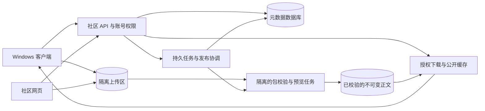

# 最中幻想 / Craftmine World：创作社区与内容分发平台开发计划书

版本：1.0  
编制日期：2026-09-10  
检查基线：`e462147852e36bdfcaf897d3f915c5809fb88670`（本地 master；工作区中已有配套计划）  
状态：产品、技术与运营实施计划；社区尚未因此建立。本次仅编制文档，不创建账号、购买服务、部署网站或上传玩家内容。

配套：[创作包与复用计划](CREATION_PACKAGE_DEVELOPMENT_PLAN.md)、[版本管理计划](VERSION_MANAGEMENT_DEVELOPMENT_PLAN.md)、[素材库计划](ASSET_LIBRARY_DEVELOPMENT_PLAN.md)、[Godot 总计划](GODOT_MULTIBASE_DEVELOPMENT_PLAN.md)、[许可方案](LICENSING_STRATEGY.md)。

## 1. 产品定位与建设顺序

建设一个同时服务客户端与浏览器的官方创作社区。玩家在客户端发布底座、世界、玩法模块、物件、场景、素材和数据；其他玩家搜索、查看兼容性与版本、下载到本地，再由客户端创建世界或生成安装提案。网页提供公开链接、作品展示、作者资料和后续交流。

本地创作与复用先成立，社区在同一包格式之上增加发现、分发和协作。玩家不需要注册 GitHub 才能使用本地功能，也不需要自己管理代码仓库才能上传作品。产品源码仓库、玩家工程历史、社区资源存储分别管理。

首版目标是“找到、看懂、取得准确版本、安装成功、能继续创作”。大型论坛、即时聊天、社交信息流、实时共同编辑、完整 Git 托管、在线云游戏和素材交易不作为首版条件。初期通过审核后的示范作品与精选分类解决内容质量，不以复杂推荐系统替代可用内容。

普通包上传、公开目录与下载不依赖 VM5 的完整 Git 远程同步。AL6 中的远程目录和正文传输可以先交付；完整 Git/LFS 同步、远程改动提案和团队协作在后续接入，避免“为了分享一个宝箱先开发完整 GitHub”。

## 2. 当前基础与首个完整故事

当前仓库有本地作品库、Godot 工程/素材/状态基础，以及 VM/AL 开发计划；尚没有可以据此宣称交付的统一社区账号、资源注册服务、网站、上传发布和运营后台。旧库 API 不等于远程社区 API，Godot 固定样例检查不等于第三方上传检查。[素材库计划](ASSET_LIBRARY_DEVELOPMENT_PLAN.md)、[第 5 轮报告](GODOT_CYCLE_05.md)

首个线上完整故事：甲在客户端保存“可交互宝箱 v1”，选择发布范围和许可，检查后上传；乙在网站查看并下载，或在客户端搜索，导入另一个兼容世界；甲发布 v2，乙仍使用 v1，查看变化后选择升级；乙进一步改造成自己的机关箱，发布时保留来源关系。整个过程都有确切版本、操作结果与错误恢复。

底座与世界扩展故事：甲发布通过底座接口检查的横版底座；乙点击“用此底座创建世界”，完成关卡后发布 world 包；丙安装客户端后打开该世界。浏览器首版显示预览和下载入口，网页内游玩作为独立目标另做验证。

## 3. 用户角色、可见性与权限

| 角色 | 首期能力 | 必须限制的范围 |
| --- | --- | --- |
| 访客 | 浏览、搜索公开页面和版本；按站点限额下载公开包 | 无权访问草稿、私有资料、后台或上传入口 |
| 普通账号 | 管理个人资料、收藏、下载；在开放范围内发布自己的资源 | 不能修改别人的版本、冒用官方身份或访问其他账号任务 |
| 资源所有者 | 编辑描述、创建新版本、提交审核、申请下架和管理来源 | 已发布内容不能以同版覆盖；发布第三方依赖仍需相应权利 |
| 审核者 | 查看分配的审核材料，处理内容、举报和申诉 | 无权读取用户本机存档/对话；下载审核正文有审计 |
| 运维管理员 | 配置额度、处理服务故障、管理账号权限 | 管理行为记录操作者和理由；不能无记录改动发布正文 |
| 团队成员（后续） | 在组织授权范围内协作、读取私有库与提案 | 权限逐资源、逐版本和逐下载检查，不能只隐藏网页入口 |

首期可见性只有“本人草稿”和“公开发布”。“不公开链接”和“团队私有”留到 CC4，以免把猜不到的网址当成访问控制。网页 URL、版本 ID 和正文哈希均不是授权凭据。

账号首选接入维护中的 OIDC 身份服务，先提供一种普通玩家可理解的登录方式；不以 GitHub 登录作为唯一入口，不自行设计密码加密或登录协议。网页使用受保护的服务端会话，客户端凭据保存在宿主管理的凭据存储，通过明确账号流程登录；不将令牌放入包、Git、日志或资源描述。具体身份服务、邮箱能力和会话库在 CC0 固定并记录费用、依赖与退出方案。

所有写请求由服务端验证身份、所有权、版本状态及额度；网页会话写入加入跨站请求防护，客户端令牌限制用途和有效期。审核/管理账号启用额外认证，注销、账号限制及凭据撤销有实际测试。自动化验证使用测试账号和隔离身份环境，不操作用户正在使用的浏览器。

## 4. 网站与客户端功能

### 4.1 信息结构

| 页面/区域 | 必需信息和操作 |
| --- | --- |
| 发现与搜索 | 名称、七类内容、2D/3D/视角标签、底座与引擎兼容筛选、作者、更新时间、精选集合 |
| 资源详情 | 介绍、真实图片/视频或预览状态、作者、准确版本、依赖、许可、检查范围、下载/创建/安装入口 |
| 版本页 | 固定版本链接、变化说明、正文摘要、平台/引擎/底座检查、撤回状态、来源版本和依赖列表 |
| 作者主页 | 作者公开资料、发布作品和来源关系；账号验证与作品技术检查分别显示 |
| 我的发布 | 草稿、上传进度、检查/审核状态、拒绝原因、补充材料、新版本和下载统计 |
| 运营后台 | 待审核、失败任务、举报申诉、资源/账号限制、配额、审计和服务状态 |
| 协作区（后续） | 问题反馈、讨论、Fork 图、改动提案与团队权限 |

网站与客户端共享 API 和字段语义，分别保留适合自己的布局。客户端可按当前世界过滤兼容内容，并显示本地已有版本；网页不知道玩家的本地正式进度，不显示伪造的“已安装”。

Godot 官方资源库支持网站与编辑器内访问，也区分独立项目和装进已有工程的资源，适合参考入口与分类。本平台采用自己的七类包协议，付费或私有内容另按后续产品范围建设。[Godot AssetLib](https://docs.godotengine.org/en/stable/community/asset_library/what_is_assetlib.html)

### 4.2 发布与安装体验

发布：选择本地定版内容 → 查看实际文件/依赖和范围 → 填写介绍、公开作者信息与许可声明 → 本地预检 → 上传并等待服务端检查 → 查看问题或发布回执。用户明确的发布操作授权上传该次显示的范围；自动保存、AI 归库和普通导出不会自动公开内容。

依赖中包含作者自己的未发布资源时，清楚列出将一同公开的内容；存在他人的私有资源或不允许源文件再分享的素材时，不能默认随包公开。自动预检不能替代作者对来源和权利的声明。

取得与安装：选择准确版本 → 解析依赖和目标兼容性 → 下载、校验并登记到本地库 → 用户选择创建世界或生成安装候选 → 沿用 VM/AL/CP 的检查与应用。网页可下载 ZIP；客户端的“从社区链接打开”先解析可信来源和版本，不直接执行深链中携带的命令或代码。

更新由玩家订阅或主动查询后展示，已使用的版本不自动改变。取消上传、关闭客户端、重新登录和响应丢失后可查询原发布任务；不要求用户通过反复点击猜测结果。

[玩家产品体验与持续创作计划](PLAYER_PRODUCT_EXPERIENCE_DEVELOPMENT_PLAN.md)先以本地试玩包和带版本的反馈跑通“朋友游玩—作者修复—再次交付”，不要求完整社区先上线。包与依赖复用 CP，问题现场默认本地保存，上传由玩家选择；社区后续接入相同版本身份与反馈流程，避免再建一套作品分发或问题记录格式。

## 5. 总体架构与选型

首选一个模块化后端应用，独立部署内容检查任务；先复用现有 React/TypeScript 经验与 Rust 包校验逻辑。具体库版本和供应商在 CC0 锁定，避免同时引入多个未经验证的服务。

| 层 | 首选方案 | 边界与依据 |
| --- | --- | --- |
| 网页 | React + TypeScript；独立构建，服务端提供可索引的公开详情页/元数据 | 复用客户端视觉与类型，不复制桌面宿主权限 |
| API | Node.js + TypeScript，Fastify 作为首选候选；OpenAPI 管理公开接口 | 统一校验、认证、分页、错误、限流与日志；实施前固定依赖和许可。[官方文档](https://fastify.dev/docs/latest/) |
| 元数据 | PostgreSQL，数据库唯一约束与事务维护发布身份 | `(assetId, version)` 唯一，所有权、任务与审核写入事务；搜索索引不是事实来源。[约束说明](https://www.postgresql.org/docs/current/ddl-constraints.html) |
| 文件 | 提供 S3 兼容接口的对象存储，隔离上传区与正式正文区 | 实测版本化、条件写入、分块上传和校验语义；兼容接口不等于所有提供商行为相同 |
| 检查器 | 复用 CP 的 Rust 校验核心，通过限定 CLI/协议运行 | 网站与客户端使用相同向量，不各写一套不同的包解析器 |
| 持久任务 | 初期数据库任务表、租约与重试；事务 outbox 驱动索引、通知和发布后续动作 | 进程重启不丢任务；达到实测瓶颈后再考虑专用消息队列 |
| 搜索 | 首期名称、标签、作者精确/前缀检索及数据库索引；中文子串/分词以实际样本验证 | 大规模全文与推荐另行选型，不承诺默认英文全文索引即可解决中文检索 |
| 预览与运行检查 | 静态解码任务与 Godot 运行任务分池，固定引擎/检查器和预算 | 不在 API 进程中导入/运行上传脚本；平台验证使用对应实际环境 |

API 和元数据服务可以使用托管 Linux 环境，这与开发 Linux 桌面客户端是两件事。Windows 目标的运行验证仍使用受管理的 Windows 检查环境；其他平台的成功记录不能作为 Windows 兼容证明。

产品源码继续放 GitHub。大素材正文和发布包放对象存储，作者、版本与依赖放数据库，Git 历史在后续 VM5 接入。首版不把模型音频塞进产品仓库，也不为每张图片创建一个远程 Git 仓库。

## 6. 共同协议与服务端数据模型

包规范遵循[创作包计划第 6 节](CREATION_PACKAGE_DEVELOPMENT_PLAN.md#6-统一包结构与不可变版本)；AssetRef、FileRef、ContentRef、BuildRef、ProgressRef 与锁文件遵循 VM 第 5 节。资源 version 是整数，底座 baseVersion 保留底座清单的版本类型，接口层不将二者混用。

| 实体 | 主要信息 | 不可变/权限规则 |
| --- | --- | --- |
| Account / Namespace | 社区身份、公开署名、账号状态；组织后续增加 | 所有者由认证系统决定，不能相信上传 JSON 的 ownerId |
| Resource | assetId、主要类型、发布所有者、展示信息和来源关系 | 主要身份稳定；官方命名空间保留；改名不改变依赖 |
| ResourceVersion | AssetRef、不可变 manifest、依赖、兼容声明、状态接口和许可文件 | 已发布版本不可覆盖；同版异哈希冲突 |
| Blob / PackageArtifact | 文件/包哈希、字节数、受保护对象键、存储版本及校验状态 | 哈希相同不自动授权访问；ETag 不代替文件 SHA-256 |
| UploadSession | 用户、操作 ID、额度预留、临时键、已收分块、到期及冻结快照 | 只允许会话所有者访问；重复完成返回同一冻结产物 |
| PublishJob / CheckRun | 精确输入、执行器版本、任务租约、检查结果和失败原因 | 用户上传的自测报告只能作附加材料，不能填充服务端通过字段 |
| Release / PublicationReceipt | 根 AssetRef、完整依赖集合、包哈希、发布者、检查摘要及时间 | 发布关联到确切内容；后续下架保留状态记录 |
| Moderation / Audit | 举报、证据引用、处理、申诉、操作者与时间 | 审核修改可见状态，不编辑原版源码来“修复”作品 |
| DownloadGrant | 用户/匿名范围、所授权资源、到期和限额 | 每次授权检查资源状态及权限，不返回存储管理凭据 |

包内作者与社区发布者分别显示；镜像第三方内容不等于该账号就是原作者。已有社区资源 ID 只能由授权所有者发布新版本；未登记的第三方依赖按来源保留为随包内容并检查声明，不能因此抢占官方命名空间或授予原作者认证。来源关系指向准确版本，链接失效仍保留原始记录。

社区独有的下载次数、收藏和审核状态不写入运行内容哈希。服务端在发布回执中绑定 registryId、根 AssetRef、archiveSha256、依赖摘要及检查记录；客户端从可信 API 获取并核对。首版依赖 HTTPS、账号权限和固定内容校验，哈希不冒充作者签名；可验证离线签名与密钥轮换作为 CC3 的增强交付，未实现前不显示“签名已验证”。

## 7. 上传、检查与发布状态机

主状态依次为 `draft → uploading → frozen → validating → awaiting_review → published`。上传可取消/过期；检查失败进入 `failed`，审核拒绝进入 `rejected`，均保留原因。改正文需要新的冻结输入和检查，旧结果不能套给修改后的包。

1. **准备会话**：认证、资源所有权和额度检查后，预留上传空间并产生 operationId；用户获得仅限随机临时键的短时上传地址。首版主要上传客户端生成的完整包，网页上传使用同一协议。
2. **接收数据**：分块/续传与实际字节限额绑定；取消或过期释放额度、安排清理。禁止用户指定正式对象键或读取其他上传会话。
3. **冻结输入**：完成上传不等于通过。服务端绑定对象的不可变存储版本，或复制到上传者无法改写的内部键并再次校验字节；后续任务仅读取这个冻结快照。
4. **静态验证**：共同校验器检查容器、哈希、schema、路径、依赖闭包、声明文件和预算。先静态识别，不能在 API 中加载含脚本的 Godot 资源。
5. **运行/预览验证**：按类型送入实际隔离的图片、模型、音频或 Godot 任务；绑定根内容、依赖、引擎、目标、检查器和策略版本。未开放的执行能力返回不支持，不能放行未验收类型。
6. **审核**：核对公开材料、来源/许可声明及内容规则；首次作者和含代码包首期人工审核，后续根据实际质量再减少重复工作。技术通过与内容审核分别显示。
7. **提交发布**：确认正式正文及完整依赖已耐久可读、状态与权限符合要求后，在数据库事务中登记发布和 outbox。只能从这个已提交版本生成公开目录与下载授权。
8. **返回结果**：查询原 operationId 返回同一结果；索引或通知失败可重试，不重复创建版本。正文已复制但数据库失败形成受保护待回收项，恢复后补齐或清理。

S3 预签名地址在有效期内可以重复使用，并可能覆盖同一个对象键，因此不能把“上传完成一次”当作正文不可变。采用随机临时键、冻结存储版本及服务端正式区写权限隔离，解决检查后被再次覆盖的问题。[S3 预签名地址说明](https://docs.aws.amazon.com/AmazonS3/latest/userguide/using-presigned-url.html)

新依赖的公开行为在发布预览中列明。公开版本不能依赖其他账号的私有正文；私有依赖的哈希命中或已在缓存中，不构成公开权利。已公开依赖须核对确切版本、状态与分发条件；本次合法随包提供的依赖仍保留自身来源，不能统一改成根作者许可。

数据库、对象存储、任务和搜索索引之间没有共同原子事务。CC1 必须通过崩溃注入验证每个持久边界，按 outbox 与操作日志恢复；搜索只能索引已发布记录，未完成操作不能显示“发布成功”。

## 8. 下载、缓存、版本更新与下架

下载先读取指定 AssetRef 的发布状态与许可/访问条件，再发放限定对象、动作和有效期的地址。客户端校验整个包及逐文件正文，全部依赖可用后才登记安装。途中失败继续使用旧世界；部分下载不能被当作安装完成。

公开正文可使用缓存/CDN；私有内容后续采用授权下载和独立缓存规则，不进入公共缓存。去重只降低存储成本，不允许通过“这个哈希存在”推断其他用户的私有内容。签名 URL 不进入长期日志、包清单或共享页面。

首期提供完整 ZIP 下载以保证离线分享；CC2 可增加按哈希取得缺少正文的优化，仍按根发布授权和依赖关系逐项检查。检查器不按照用户 manifest 中任意 URL 抓取资源；外部链接首期只作为来源说明，经专门导入适配后才可能读取。

版本有三个不同撤回状态：作者停止推荐的 `yanked`、处于调查的 `quarantined`、确认停止分发的 `removed`。yanked 从默认推荐隐藏，已有固定引用能否继续取得按公开规则显示；quarantined/removed 停止新的官方分发，保留允许保留的版本标识、原因和申诉记录，不把它静默指向另一个版本。

下架时撤销新的下载授权并清理适用缓存；已签发地址可能在短时有效期内仍能使用，不能承诺即时撤回已下载文件。客户端可提示使用关系与替换方案，但不会远程删除用户文件、静默升级世界或把旧创作变成其他版本。离线本地功能不依赖每次启动都连接社区。

## 9. 内容检查、预览与运营管理

首期公开规则涵盖恶意/越权代码、侵权举报、冒用身份、泄露私人信息、违法内容、垃圾上传、刷量及虚假兼容声明；具体公开措辞在服务地区与运营主体确定后形成版本化规则。用户有举报入口、处理进度和申诉渠道，审核者记录理由和证据，不凭下载量替代判断。

公开上传默认不接收任意可执行安装器、原生库、编辑器插件或个人备份。经 CP4 验证的游戏发行产物以后进入单独发行通道；world 源包与独立 EXE 不能共用一个无需区分的运行入口。服务端解压、图像/模型解码及 Godot 导入均按不可信输入处理。

API 进程不运行用户代码。Godot 检查任务只取得所需冻结输入与有限结果写入通道，无账号数据库凭据、对象存储管理密钥或生产网络权限；设置 CPU、内存、时限、磁盘和进程范围，执行后销毁工作目录。静态扫描、杀毒或容器本身都不能替代本项目实际执行边界的验证。

包内 `@tool`、自定义资源脚本和导入钩子可能在导入过程中参与执行，完整工程导入也必须隔离。检查结果绑定真实进程、策略、引擎和准确输入；模型或上传者不能通过 README/伪造 JSON 声称自己已通过。

首版网页使用静态图片、视频或明确的预览占位状态，不嵌入来自包的任意 HTML。介绍与评论做内容清理，外链有限制，预览资源使用独立内容域。以后增加在线 Godot 试玩时，另做独立来源、网络、存储、跨页面消息和资源预算验证。

建立基础运营流程：检查失败自动分类并可重试；作者得到具体缺项；举报分派并留审计；高风险版本暂停分发；误判可恢复原版状态；长期失效或撤回依赖显示清楚。检查积压时暂停新增提交或显示等待，不跳过检查放行。

## 10. 拟定 API 与客户端边界

以下是待实现的接口职责草案，不是已部署地址。公开协议使用 `/v1` 和 OpenAPI，cursor 分页、错误码、限额、幂等键及认证方式在 CC0 固定。

| 接口职责 | 拟定形式 | 关键语义 |
| --- | --- | --- |
| 检索与详情 | `GET /v1/resources`、`GET /v1/resources/{assetId}` | 默认仅公开已发布；兼容筛选不把作者声明当检查证据 |
| 固定版本 | `GET /v1/resources/{assetId}/versions/{version}` | 返回确切 AssetRef、清单、依赖、状态与检查范围 |
| 准备上传 | `POST /v1/uploads` | 验证身份、范围和额度，生成会话与幂等记录 |
| 完成/取消上传 | `POST /v1/uploads/{id}/complete`、`POST /v1/uploads/{id}/cancel` | 完成冻结输入；重复调用返回原结果，不能替换已检查输入 |
| 提交发布 | `POST /v1/publications` | 引用冻结包、所有者和可见范围；正文变化要新输入 |
| 查询操作 | `GET /v1/operations/{id}` | 只向有权限者返回准确阶段、失败原因和回执 |
| 取得下载 | `POST /v1/download-grants` | 校验根资源与依赖授权，再提供短时下载信息 |
| 撤回/举报 | `POST /v1/resources/{assetId}/versions/{version}/yank`、`POST /v1/reports` | 分别检查所有者或举报身份，保留审计与处理流程 |

明确错误至少包括权限不足、版本内容冲突、依赖不可取得、包完整性错误、不支持的协议/目标、超过额度、待审核/暂停分发和操作过期。客户端不能将 HTTP 接收成功当成资源已发布或已安装。

未来多注册服务保留 registryId 和可信服务配置，但 manifest 不携带服务凭据。复制第三方包或 Git 工程时，记录具体来源而不任意跟随外部地址执行。API 协议与 CP schema 变更需要兼容窗口、客户端能力协商和旧版拒绝说明，不能由前端单方面变更字段含义。

## 11. 运行成本、部署与可恢复性

首期部署由网页/API、托管或受管理的 PostgreSQL、对象存储、必要检查工作机、监控及备份组成。先采用能导出数据库和正文的服务，保留供应商迁移能力；不提前建设 Kubernetes、多地区集群或自研存储。

主要成本是数据库/服务实例、正文与备份存储、下载流量、检查计算、邮件/身份服务和人工审核。估算采用实际容量和供应商当前报价：每月成本 = 固定服务 + 存储 GB 月 + 下载流量 GB + 检查时长 + 身份/邮件 + 运维审核；本计划不给未经核价的人民币承诺。

测算例子仅表达量级：100 个版本，每个未去重包 100 MiB，约 9.77 GiB；每月完整下载 1,000 次约 97.66 GiB 出站流量，尚未计备份、预览和日志。优化去重与缓存要分别测量，不能假设下载成本也自动按存储去重比例下降。

CC0 定义闭测额度配置：单包/解压量、每账号存储、每日上传、下载频率、并发检查与月度预算。具体数值由 CP/AL 的真实样本和选定服务价格确定，在邀请用户之前冻结。建议预算使用率到 70%/90% 通知维护者，达到硬上限时停止新增高成本任务并提供明确状态；不删除玩家本地内容来控制费用。

公开闭测前建议确定以下运维目标并实际演练：数据库备份恢复点不超过 24 小时、关键目录服务恢复不超过 4 小时；这是待验证的内部目标，未验证前不作为对外 SLA。版本正文采用不可变对象与备份，定期核对数据库到正文的完整引用，恢复时发现缺正文的版本不得标为可下载。

备份覆盖数据库、正式正文、许可/审核材料中需要保留的部分和必要配置；身份秘密与应用备份分开管理。发布任务使用租约防止重复执行，未完成上传按保留期清理；已发布、正在审核、活跃下载/构建、申诉保留和法定保留范围在各自策略下受保护。

上线前完成域名与 HTTPS、生产/测试环境隔离、数据库迁移与回退方案、健康检查、失败任务告警、容量与费用面板、备份恢复和故障说明页面。身份、服务、存储或检查器停机时分别显示受影响功能，本地游玩和本地导出仍可用。

运营主体、服务地区、允许用户范围、隐私说明、服务条款、投稿授权及举报处理在正式开放前确认，适用要求按实际部署另行核对。本计划不预设所有地区的登记、支付和数据要求相同，也不替代届时的具体文本。

## 12. 协作、商业功能与权利边界

CC4 增加团队空间、私有库、成员邀请和角色权限，再接 VM5 的 Git/LFS 同步。每次取得代码、包、预览和大文件都核对权限；移除成员后停止新授权，解释已下载副本和已签地址的实际范围。团队私有内容不能经公开 Fork 或依赖解析泄漏。

CC5 增加 Fork 图、问题反馈、改动提案和合并记录。世界工程继续使用真实 Git，社区记录提案与讨论；合并后仍在目标世界按 VM 执行构建、状态迁移和正式应用，网站的“合并成功”不等于某个玩家的运行实例已经更新。

潜在收入先考虑团队私有资源空间、托管存储、协作管理、部署及支持，再评估付费素材交易。是否收费、额度和价格在有真实使用成本后确定，不因企业身份或玩家出售游戏就自动收取额外许可费，沿用[已确认许可方案](LICENSING_STRATEGY.md)。

交易如进入 CC6，需要单独完成作者结算、购买凭证、授权范围、退款争议、税费/支付地区与风控方案。成品使用权、源素材再分发权、修改和转售范围分别呈现；已购买内容如何备份与服务退出也要有明确规则。先完成这些条件，再选择支付服务和收费方式，不把“加一个购买按钮”作为交易完成。

社区投稿授权只覆盖实际需要的托管、展示和分发范围，由正式条款说明；不把发布素材等同于向创作核心提交 CLA，不默认取得作者全部作品的商业再授权权。社区程序自身的代码与依赖仍按逐模块许可清单处理，本轮不修改既有许可。

## 13. 分阶段实施与上线出口

| 阶段 | 工作与交付物 | 前置 | 阶段出口 |
| --- | --- | --- | --- |
| CC0 协议与部署试验 | 身份/数据库/对象存储选型记录、OpenAPI、权限矩阵、状态机、预算与运营规则草案 | CP0、VM0/AL0 的共同契约 | 服务选择有实测与退出方案；接口向量一致；不依赖完整 Git 托管 |
| CC1 邀请上传与公开目录 | 测试账号、上传/冻结/静态检查、人工审核、详情/搜索、固定 ZIP 下载和管理后台 | CP1、AL1/AL2 必要范围 | 静态包由甲发布、乙在干净目录取得；私有草稿不泄漏；崩溃/重试不重复发布 |
| CC2 客户端与可运行创作 | 登录接入、当前世界兼容过滤、安装/升级入口、隔离预览和底座/世界类型逐项开放 | CP2；base/world 需 CP3；GD0/GD2；AL6 的目录/传输子集 | 宝箱与底座故事完整通过，网站和客户端取得相同版本；未验收类型保持关闭 |
| CC3 公开试用与运维强化 | 容量/费用门槛、反滥用、举报申诉、缓存/恢复、版本状态和签名增强评估/实现 | CC1/CC2、CP 的备份与发行相关范围 | 公开发布类型满足验收，恢复和限额演练通过；签名能力按真实实现披露 |
| CC4 团队与私有内容 | 组织角色、私有库、授权下载、团队审计、Git/LFS 同步 | CC3、VM5/AL6 对应同步能力 | 跨账号越权、成员撤销、私有依赖泄漏和同步中断测试通过 |
| CC5 创作协作 | Fork 图、问题反馈、改动提案、版本讨论与审核协作 | CC3 的公开来源；私有协作需 CC4；VM6 | 提案来源、合并版本和本地应用状态准确分离，冲突可处理 |
| CC6 商业与更大规模 | 团队付费服务、计量账单；按需求单独增加素材交易与平台扩容 | 成本/用户需求证据、许可与运营条件 | 计费、授权和退款/退出等适用流程完成，业务与实际权限一致 |

首版社区以 CC1/CC2 加 CC3 中必需的额度、举报、备份和故障处理为范围，不包含交易与完整团队权限。静态资源可以先邀请测试；脚本/底座必须满足实际执行条件后再开放。独立 Windows 游戏发行通道依赖 CP4，可晚于客户端内 world 包分享。

各阶段按功能接口、前端、存储/任务、引擎验证及运营职责拆分；这是实施职责，不表示当前已创建子任务或启动多个 Agent。CC0/CP0 的实际试验后再估工作量和日历排期。

## 14. 必须覆盖的验收场景

| 编号 | 场景 | 通过条件 |
| --- | --- | --- |
| CC-A01 | 网页与客户端搜索/取得同一版本 | 根 AssetRef、依赖、文件哈希与状态一致 |
| CC-A02 | 未登录、其他作者、猜测 ID、被限制账号访问 | 身份和所有权在服务端生效，草稿/任务/正文不越权 |
| CC-A03 | 上传中断、过期、取消、超限与续传 | 额度准确释放或保留，无伪完整包和无限临时存储 |
| CC-A04 | 上传地址重复使用并在检查后改写临时对象 | 发布仍绑定冻结输入；无法替换已校验正式正文 |
| CC-A05 | 发布事务各边界退出、任务租约过期与响应丢失 | 原 operationId 可恢复；索引不提前公开、不重复发布 |
| CC-A06 | 同资源同版异哈希、未经授权抢发新版本 | 冲突或权限拒绝，已发布内容不覆盖 |
| CC-A07 | ZIP 穿越、膨胀、伪装格式、畸形资源与导入脚本 | 验证预算和隔离生效，API 与生产资料不暴露 |
| CC-A08 | 伪造兼容/检查报告、恶意 README 指令 | 仅作为不可信材料，不能签发通过或取得宿主权限 |
| CC-A09 | 公开包依赖私有/撤回/缺失内容 | 不隐式公开，不产生表面可安装的半完整版本 |
| CC-A10 | 通过哈希、缓存和签名地址尝试跨账号读取 | 去重不泄漏存在性或授权；临时地址权限/期限准确 |
| CC-A11 | 同作者新版本、更新通知与旧世界 | 旧世界固定原版，升级进入本地提案与状态检查 |
| CC-A12 | 甲发布宝箱→乙安装→乙改造再发布 | 两世界进度独立，来源版本正确，发布者与作者不混淆 |
| CC-A13 | 玩家底座发布→另一个账号创建 world | 真实生命周期和保存重启通过；不靠官方目录白名单假通过 |
| CC-A14 | 下架、缓存、已签地址、离线副本与申诉恢复 | 新分发按状态停止，期限与副本限制准确显示，不静默改版 |
| CC-A15 | 搜索延迟、检查器故障、数据库/存储暂时不可用 | 有真实状态和重试；不显示假发布、假安装或漏审核 |
| CC-A16 | 公开介绍、预览、外链和恶意深链 | 无脚本注入、任意命令或任意内网抓取；网页不能调用桌面高权限 |
| CC-A17 | 费用/容量阈值、刷上传/下载和队列积压 | 限额与告警实际生效，高成本任务受控且不丢已发布正文 |
| CC-A18 | 数据库与正文备份恢复到新环境 | 发布/审核/依赖一致，缺正文版本不作为可下载，恢复目标有实测 |
| CC-A19 | 私有团队移除成员和公开 Fork | 新授权撤销，预览/依赖/历史不泄漏；已下载范围如实说明 |
| CC-A20 | 真实模型复用社区内容并修改发布 | 有真实工具与版本记录；模型不代替用户公开或伪造检查 |
| CC-A21 | 新旧协议、未知必需字段、官方签名密钥变化（实现后） | 支持范围/迁移或拒绝准确；未验签不能显示已验证 |
| CC-A22 | 付费/退款/权益/退出（实施交易后） | 账单与资源授权一致，适用恢复和退款流程真实可用 |

测量冷/热搜索、详情首屏、包传输、检查排队/执行、失败恢复、带宽和每次成功发布成本。试验从 100/1,000/10,000 个资源目录和不同包体积档递增；这些是测试档位，公开容量依据结果确定。性能记录网络、地区、机器、并发和样本数，不借上游框架基准宣传本站性能。

纯 API/数据库、固定包、真实 Godot 和真实模型分别交付证据。浏览器/客户端测试遵守 [AGENTS.md](../AGENTS.md)：独立 headless/offscreen 进程、独立数据，初始化禁用 Pointer Lock，通过 HTTP、页面脚本及状态接口验证，不模拟真实鼠标键盘、不抢占焦点、不操作用户浏览器。

## 15. 联合路线图与下一批任务

整体顺序是：CP0/VM0/AL0 冻结共同格式 → 本地静态包 CP1/AL1 → 可信执行条件下的 CP2/VM2/AL3 跨世界复用 → 玩家底座与世界 CP3 → CC1/CC2 社区完整样本 → CC3 公开试用 → 按需求进入团队协作和商业服务。CC0 的基础设施试验与 CC1 静态目录可在本地功能推进时开展，不阻挡核心创作开发。

下一批具体交付：一份数据库实体/权限设计；一份 OpenAPI 与错误样例；上传冻结/幂等原型；复用 CP 校验器的恶意与合法包夹具；资源详情和我的发布页面；存储/数据库恢复演练记录；选定服务的价格测算与预算配置；一份邀请测试的发布范围和处理流程。

完成标准是有真实用户路径、确切版本、跨环境安装、失败恢复和可承担的运营成本。每次交付同步实现状态、已开放类型、未验证目标、失败证据和运行手册，文档中的方案不能自动变成“网站已上线”。
