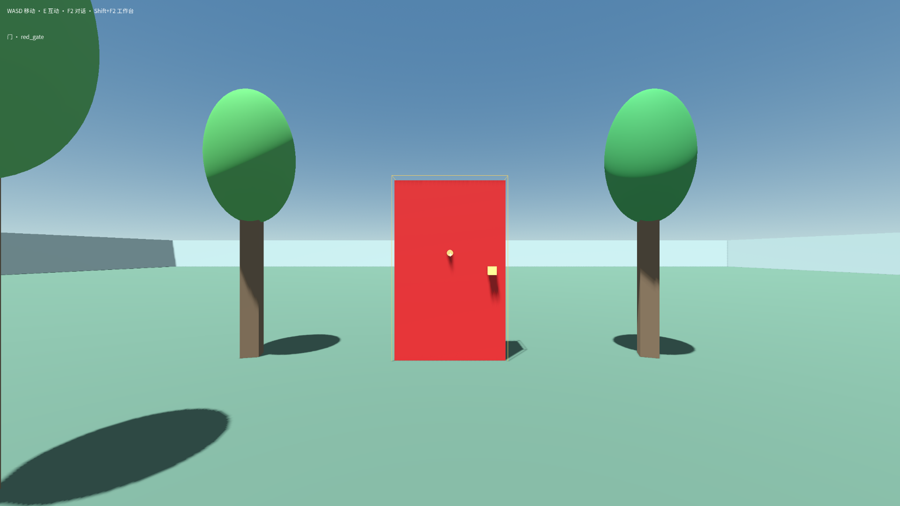
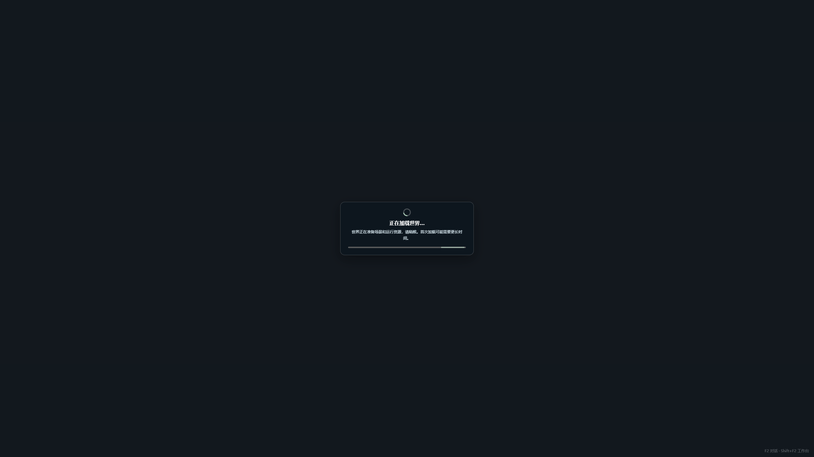

# FB02 九项反馈修复与 Windows 成品复盘

本轮已完成 FB02-001～009 的工程修复、相关恢复路径及修订 Windows 成品验收。结论来自实际解压程序、旧存档副本、普通模型创作和生成作品的实际运行；没有将“源码里已有修改”当作成品通过。原始反馈、失败复测和中间候选记录继续保留。新版尚未获得用户真人确认，物理键盘和前台焦点条件属于明确的验证边界。

## 可以直接测试的成品

- 版本：**0.14.4-preview.17**。
- 产品提交：**8e8ec5348d94e0323f5135518e76ade750eb44cb**，已推送 GitHub `master`。
- [Windows ZIP](../desktop/build/releases/8e8ec5348d94-16b6424a-cdaa-475c-88b7-06d346f122e1/portable-0b61c14f-b296-45ed-af50-47351f73ff21/Craftmine-World-portable-8e8ec5348d94.zip)。
- [已经解压并用于本轮验收的 Craftmine World.exe](../desktop/build/releases/8e8ec5348d94-16b6424a-cdaa-475c-88b7-06d346f122e1/portable-0b61c14f-b296-45ed-af50-47351f73ff21/extracted/Craftmine%20World.exe)。
- ZIP 大小：**1,031,105,827 字节**。SHA-256：`872082cc1ef0a6ce4d8bcd5b9450a841eee22c923f76eb27764fb689fd27c090`。
- 封装、实际解压和验收后再次核对 **1,656 个载荷文件**。包内版本、构建清单、源码归档与产品提交一致。见 [成品验收摘要](assets/fb02-preview17-acceptance/final-acceptance.json) 和 [验收后字节复核](assets/fb02-preview17-acceptance/final-package-byte-recheck.json)。

安装器也已生成并核对静态载荷，版本同上；本轮主要验收对象是 ZIP 中的程序。没有执行干净 Windows 环境下的安装、升级和卸载测试，包的记录为本地未签名预览版。报告与测试证据在产品冻结后单独提交，不会被误记成另一版产品代码。

## 九项原始要求，逐条对照

| 反馈 | 现在的行为 | 验证范围 |
| --- | --- | --- |
| **FB02-001 黑屏等待时需要加载提示** | 首次进入、切换和新建都显示加载状态及进度条；失败可重试或返回。后台兼容恢复完成后，加载层和旧错误提示随实际世界恢复。 | 最终包 E1、E4、E5；真实页面 41 项覆盖等待、失败、恢复通知与关闭竞态。未取得实际进度百分比时不编造百分比。 |
| **FB02-002 世界全屏、Esc 菜单、设置与退出** | 游玩切入系统全屏；Esc 提供暂停、继续、工作台、设置、保存退出。从设置返回保持同一正式世界实例和原有模式偏好。保存失败后能恢复并重试退出。 | 最终包 E2、E3、E8；原生窗口状态及尺寸、暂停恢复、设置同实例和正常退出已核对。受控保存失败另有服务／生命周期测试。 |
| **FB02-003 F2 有提示却没反应** | 主界面、插件、Godot 输入路径都能打开实际对话界面，并能收起或回到工作台；原生视图顺序和输入归属一起调整。 | 最终包 E2 核对四条软件输入路径和实际界面反馈。没有发送物理 F2，不能声称已亲测玩家键盘的全部环境条件。 |
| **FB02-004 二级选择、创建去工作台、纯对话生成** | 有旧世界也先到二级选择；普通创建完成后进入独立工作台；黑色对话入口使用真实世界和普通模型会话，生成后自动进入游玩。取消保留草稿，明确“继续准备世界”后才能恢复并进入。 | 最终包 E2、E3、E8；包含新建、取消后返回、草稿不抢选择、继续准备、首次加载完成和保存退出。 |
| **FB02-005 输入后世界窗口消失** | 首条发送及附件／粘贴物化会话时保留当前世界。流式消息和自动产物不抢走世界视图；切换历史会话时仍保留各自文件隔离。 | 最终包 E2 的真实附件和会话创建链；实际 store、React 及普通创作回归。没有靠复制其他会话的文件页签掩盖问题。 |
| **FB02-006 截图中的 3D 地面过亮** | 指定旧世界的默认地面改为柔和绿色；维护被创作或预览打断后能在空闲时恢复。只迁移精确匹配的发布内容，保留自定义源、草稿、历史与存档。 | 最终包 E1、E6、E7；旧世界实际像素、同实例返回、重新检查采用及多次保存重开均有证据。 |
| **FB02-007 全自动仍反复要权限** | 已选择的 global/session auto 贯通内置 Craftmine 项目修改、构建、检查、采用和结果反馈；不要求额外世界开关、重复权限决定或手动采用。异步检查、修复续作、取消和新意图各自保留准确归属。 | 最终包 E8 使用原玩家模型／max／auto，16 次实际调用，0 次权限决定、0 次人工采用；队列、身份和失败续作有独立服务回归。 |
| **FB02-008 对话中缺少应用提醒与切世界入口** | 普通工作对话显示真实结果卡，绑定准确候选和目标世界，提供预览、采用、返回和切换入口。纯对话完成后保持直接游玩，历史结果不会在重启时再次抢开聊天。 | 最终包 E2、E6、E8；结果可见、完整世界标题、候选操作、重进会话恢复以及 ACK 暂态处理有页面／服务证据。 |
| **FB02-009 原“预览副本”按钮直接失败** | 原检查列表按钮可以打开原候选；返回保持正式世界，采用后可保存重开。维护更新不会把仍合法的历史候选误判成不可用。 | 最终包 E6、E7，直接使用原有候选和原按钮；没有另造一个新候选替代失败样本。 |

表中的“工程完成”不把源码测试、页面测试和最终包运行混为一类，也没有把原反馈里的“未通过”改写成“用户已确认”。原话与图片仍在 [FB02 批次](USER_FEEDBACK_BATCH_002_2026-09-12.md)，历史结论仍在 [逐项审计](FB02_REQUIREMENTS_CLOSURE_AUDIT_2026-09-12.md)。

## 全自动确实走过了普通模型流程

使用与反馈一致的保存会话配置：DeepSeek `deepseek-v4.1-flash-expires-on-0910`、思考 `max`、权限 `auto`。沿用原产品的上下文和输出配置，没有额外添加 token、模型调用次数或整轮时长限制，也没有启用旧受限评测器。

最终包中从二级入口进入纯对话界面，再通过普通 Composer 提交“红门可交互开关、关门阻挡、开门通行，旁边三棵树”的创作要求。模型实际运行 **16 次调用**，全部有结束记录；没有人工权限决定、人工采用或测试脚本改写世界源。模型结束后，宿主采用最后一个通过检查的结果，再自动收起对话进入全屏可玩世界。随后通过 F2 软件路径检查结果卡，正常保存退出并重开；重开没有新增模型调用。

最终生成的门为 `red_gate`，三棵树为 `gate_tree_left`、`gate_tree_right`、`gate_tree_front`。名称由这次模型生成，验收读取真实实体身份，没有要求它沿用上次模型的命名。

之后又运行实际引擎动作与物理移动：

1. 关门时向前走，玩家停在 `z=1.565001`；门碰撞体前沿为 `z=1.25`、玩家半径为 `0.3`，没有穿过关闭的门。
2. 实际交互动作打开门，门的阻挡体关闭；继续行走到 `z=-0.684999`，穿到另一侧。
3. 对准旋转后的门再次交互，门关闭且阻挡体恢复。
4. 保存退出，再完整重开程序。门仍关闭、三棵树仍在，整份保存快照逐字段相同，玩家坐标保持 `[0, 0.898971319198608, -0.684998571872711]`。

该玩法复核新增模型调用为 **0**，没有编辑作品源或直接写入期望状态。见 [实际行为核对](assets/fb02-preview17-acceptance/final-generated-door-review.json) 与 [走动后完整保存重开证明](assets/fb02-preview17-acceptance/final-gameplay-reopen-proof.json)。这里的交互是映射到游戏交互功能的引擎动作，没有发送物理 E 键。

## 为什么之前几轮包仍然看不到修复

之前的判断漏掉了交付和运行之间的连接点：更新新世界模板不等于旧世界的已导出内容也会更新；前端状态改变不等于原生世界视图已经正确显示；项目补丁自动执行不等于检查、采用、回到游玩的后续步骤已经自动衔接。因此用户提供的实际运行目录和失败截图是有效反例，不能归因于“解压错了”。

本轮连续验证还找出并修复了初始化回应丢失状态、JS 与 Rust 查询路由不一致、Godot 模板继承常量冲突、主界面运行状态读取被误拒、初始化后的显示层未恢复、黑色聊天被工作台遮挡、历史结果重复暂停游戏、无准星创作使用错误玩家坐标、旧模板说明与实际资源不匹配等问题。

全自动还有一个关键时序问题：如果模型尚未结束就采用检查结果，会提前结束它的创作事务。现在等待原模型轮次和收尾完成，再采用最后一个有效检查结果；异步失败续作仍保留原始意图，并服从玩家取消或更新的要求。

## 最后验收又拦下了一个真实存档缺陷

`843bdd15a8b2` 候选曾通过界面和普通模型创作，但在实际行走后保存重开失败。原生接触点表明：正常落地后，胶囊底部与平地之间有约 **1.029 毫米**的数值接触深度，略大于旧检查的 **1 毫米**阈值，因此被误判为穿透。该候选的失败记录保留在 [历史候选摘要](assets/fb02-preview17-acceptance/candidate-843bdd15-evidence.json)，没有改写成通过。

修复仍查询完整原生胶囊和真实接触点，仅对胶囊底极点、方向近乎竖直向上的支撑接触增加 **0.1 毫米**数值余量。没有移动玩家坐标、缩小碰撞体或放宽墙面穿透。10 项新物理回归、17 项原碰撞回归和三个实际 Web 导出验证了允许／拒绝边界；1.05 毫米墙面、天花板、斜坡及更深地面穿透仍被拒绝并回滚。见 [当前引擎证据](evidence/fb02-floor-contact-20260912/README.md)。

旧世界也必须修复：先精确识别已发布运行库，在独立分支只替换兼容文件，实际重新检查，再按原保存版本与完整快照进行事务采用。最终包分别验证了冷启动和从健康世界切换进入两条路径：源文件仅该兼容文件改变，主草稿与历史保留，合法 applied 引用前移后旧版本仍是其祖先。

同时修复了同一失败存档被轮询无限重开的行为、恢复通知早于旧打开请求结束时被丢弃、迟到恢复覆盖其他世界界面，以及主界面与世界面板的显式重试不一致。相关 host 生命周期／候选测试 50 项、维护与事务测试 67 项、页面测试 41 项、切换协调器相关测试 39 项通过；这些分别说明自己的范围，不累加为虚构的“全项目覆盖率”。

## 最终解压包的原生验收记录

下列 11 份原始报告共记录 16 次应用启动，均正常退出；每次记录中的输入违规、页面异常、关闭失败数组为空。报告均绑定同一个 `8e8ec534` 解压程序。完整本机日志保存在 `test-results`，仓库归档了 [摘要、哈希与截图](assets/fb02-preview17-acceptance/final-acceptance.json)。

| 证据 | 场景与原始报告 |
| --- | --- |
| E1 | [旧世界加载与绿色地面](../test-results/desktop-native-fb02-FwvyN2/retained-world-report.json) |
| E2 | [二级入口、软件快捷键、设置、附件与纯对话](../test-results/desktop-native-fb02-FwvyN2/workspace-chain-package-report.json) |
| E3 | [新建、取消、保留草稿、继续准备与进入](../test-results/desktop-native-fb02-FwvyN2/world-create-chain-package-report.json) |
| E4 | [旧故障存档冷恢复](../test-results/desktop-native-collision-migration-7HvH9y/collision-migration-report.json) |
| E5 | [从健康世界切换到旧故障存档](../test-results/desktop-native-collision-migration-cNhtv4/collision-migration-report.json) |
| E6 | [原候选预览、返回、采用、维护与重开](../test-results/desktop-native-candidate-HFjU93/candidate-lifecycle-report.json) |
| E7 | [预览打断维护后同实例恢复](../test-results/desktop-native-candidate-Hy6pdV/candidate-lifecycle-report.json) |
| E8 | [普通模型全自动创作与重开](../test-results/desktop-native-ordinary-player-yJzgua/ordinary-player-report.json) |
| E9 | [实际关门阻挡、开门通行](../test-results/desktop-native-ordinary-player-yJzgua/gameplay-6a466225-46f2-4b75-bb27-8829d5a7682b/report.json) |
| E10 | [走动后重开并再次关门保存](../test-results/desktop-native-ordinary-player-yJzgua/gameplay-9e29afdb-f039-4af0-a2ec-322751989b0d/report.json) |
| E11 | [再次完整重开，门状态及全部进度一致](../test-results/desktop-native-ordinary-player-yJzgua/gameplay-81deedcb-4f5b-4f9a-b125-6ea1553f0d52/report.json) |

## 保留的边界与观察项

- **真人确认尚未取得。** 按项目约定，所有验证都使用独立后台、不可聚焦的客户端和独立数据目录，没有真实键鼠、置前、Pointer Lock 或操作用户浏览器。软件 F2/Esc 和引擎交互通过，不等于已亲测所有物理键盘、前台焦点和显示环境。
- **不会用一个作品代表全部生成能力。** 本轮对红门和三棵树做了具体行为验证；宠物、战斗、武器或复杂城市的任意自然语言要求，仍需各自的真实玩法验收。
- **保留开发失败证据。** 一次开发启动曾出现 `Renderer 3 crashed`，同源串行重试与本轮最终包验收未再出现，尚未查明该次崩溃原因。旧截图辅助接口的隔离失败、过时归档测试和测试等待条件误判也保留，没有用后续成功覆盖历史失败。
- **原档案没有被重置。** 测试写入的是独立副本，原玩家档案仅读取。仓库当前仅有主工作树；收尾检查 C 盘约余 67.6 GiB、D 盘约余 241.4 GiB，无须继续删除玩家档案、历史包或有价值的开发证据来完成交付。测试进程均已退出，见 [进程核查](assets/fb02-preview17-acceptance/final-process-exit-check.json)。

## 下一步开发建议

| 优先级 | 工作内容 | 完成标准 |
| --- | --- | --- |
| P0 | 把源码身份、固定资源、ZIP 解压运行、新旧世界和取消／恢复测试接入固定发行流程 | 每次发包都给出对应提交、哈希和实际运行证据，避免只凭内部函数测试宣布修复。 |
| P0 | 固定“实际移动、互动、保存、升级、重开”回归样本 | 覆盖平地、坡面、墙角、门状态及跨世界切换，既保留合法存档，也继续拒绝真实穿透。 |
| P1 | 扩大普通模型玩法验收 | 按原需求测试宠物、战斗、生命值、武器、资源导入和复杂场景，分别记录成功生成与实际可玩的结果。 |
| P1 | 收集新版玩家的物理 F2/Esc、前台焦点和视觉反馈 | 与本轮工程证据对照，发现差异时能定位到输入层、显示层或具体世界，不让用户反复证明自己启动了哪个包。 |
| P2 | 优化启动与界面负载 | 测量各加载阶段耗时，按需加载较大的语法／图表资源；不通过隐藏加载层或提前声明 ready 美化耗时。 |
| P2 | 继续调查偶发渲染器退出并改善诊断 | 保留可复现条件、明确运行身份和阶段，让暂态忙、可恢复失败与真正崩溃容易区分。 |

本轮反馈的修复与成品证据已经落实；后续开发应在这条可验证的发行流程上继续推进。用户对新版的真人复测结果将另行追加，保持工程结论与玩家确认各自可追溯。
