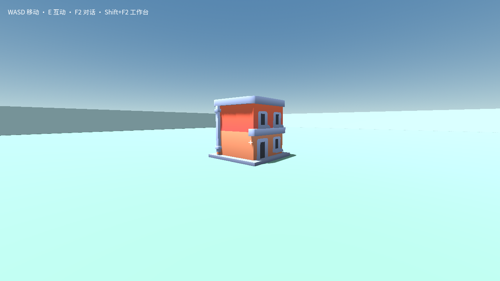

# 普通玩家复用建筑：布局、参数与冷开通行

本轮已在独立后台客户端完成两个自然语言愿望的有限验收：将原来重叠的两栋
Kenney 建筑分开，以及只把左屋放大 2.5 倍、转 90 度、改为可穿过。正式采用与
冷开后，右屋保持原样并继续阻挡玩家；左屋可视觉选中，实际移动可从前到后穿过，
再次冷开后也能反向穿回。精确运行时缩放矩阵尚未直接测量，不能把源码值与截图
包装成原生矩阵测量。

## 真实路径与人工介入

普通配置为用户确认的 `deepseek-v4.1-flash-expires-on-0910` / `max`；读取已保存
配置并核对实际会话设置。没有添加 token、调用次数或整轮时长限制。建世界与
两次原包导入是明确的测试准备，经过正常检查与采用，没有脚本直接修改世界。

初始封包 `2a584796` 在普通输入入口报 `CREATION_MIGRATION_NEEDED`，模型调用
为零。修复完整新版底座识别后，使用封包 `863622e9` 在同一世界和会话正常继续。
入口修复前后的记录分开保留。后续两个愿望及采用/通行始终使用同一 `863622e9`
客户端，世界 `world-6bc73235fe55`，会话 `0fabed78-e6fe-40fc-9f81-26921feb9900`。

布局回合实际调用 14 次，工具自行选择普通源码读取与 patch，只在原有父场景的
两个实例新增 `(-5,0,0)` 和 `(5,0,0)` 位置。人工逐项核对并一次批准草稿列表、
源码补丁与检查，然后通过正常候选界面采用。冷开截图保持分开的原建筑，玩家
状态与采用前相同，采用快照与初始完整进度一致。

参数愿望由产品自行冻结真实左屋准星 capture；模型选择普通源码读取/patch，
没有使用新增的 `module-parameters` 或 `module-parameter-preview`。只修改左屋
三项局部导出属性为 `250 / 1 / false`，右屋为 `100 / 0 / true`。第一次参数回合
保存源码后，测试负责人未及时处理检查授权，授权过期；该回合保留失败记录。
随后通过普通“继续创作”恢复，4 次模型调用完成新检查，未丢草稿。

参数检查作业 `gjob-fffb63d59e0f147c32bba288e5825f70a37f2fc367f449c1ff86e3687b741e09`
通过，正式采用构建 `gbd-989ba90c5608bbc02b8c6e9f3cba593d2cccd287e03ed3c57f196b2d91071b9e`。
源码 revision 5 的 manifest 为 `bdb5c0c2ac2b5496f6b010edae9bc669be65fec06a2b6b99e1f36c4c1b2d291f`。
只读 Git 对比确认 revision 3→4→5 仅 `scenes/creation.tscn` 改变；第二次变更只有
左节点的三个参数，右节点、位置、所有共享资源及注册记录不变。

## 独立通行证据

采用和冷开时玩家状态完整保持；之后测试才通过正常语义移动验证局部碰撞。
所有移动经历实际固定控制器，没有传送、修改运行属性或模拟鼠标键盘。

| 检查 | 实际结果 |
| --- | --- |
| 右屋墙面 | 真实射线命中右屋 StaticBody3D；持续前进 30 帧后水平变化不足 1 cm，仍停在墙前 |
| 左屋正面 | 真实 MeshInstance3D 命中、祖先绑定左屋；玩家从 z≈3.78 前进至 z≈−3.72，穿到后方 |
| 左屋再次冷开 | 新 runtime instance，保存的后方位置保持；反向前进从 z≈−3.72 到 z≈3.77 |
| 视觉选择 | 禁碰撞后仍返回左屋 mesh 与 owning wrapper 祖先，反驳“不能再瞄准”的说法 |

模型回答曾误用 `runtime.frame.distinct` 当跨版本画面对比、声称无碰撞就不能选中，
并猜测建筑尺寸。这些说法没有被采纳为证据；原回答保留，已在后续指导说明中
修正。实际显示的尺寸和朝向变化由截图辅助判断，精确字段来自源码读回。

所有本轮客户端都正常退出，输入/焦点/页面错误/退出审计为空。旧失败、权限
过期、人工批准和后续继续均保留，未合并为“一次自主成功”。

## 覆盖范围

本结果证明受审计建筑的普通源码参数修改、候选采用、冷开、单实例范围与指定
墙面通行。它不证明 typed 参数工具被模型使用、任意模块类型、共享材质编辑、
全场景导航、规模性能或全部 GU0–GU7 完成。参数声明第二世界往返另有 Core
证据，不能合称本次普通模型完成了第二世界复用。

原始记录：[布局](evidence/gu3-player-layout-20260912/summary.json)、
[参数及通行](evidence/gu3-player-parameters-20260912/summary.json)。

