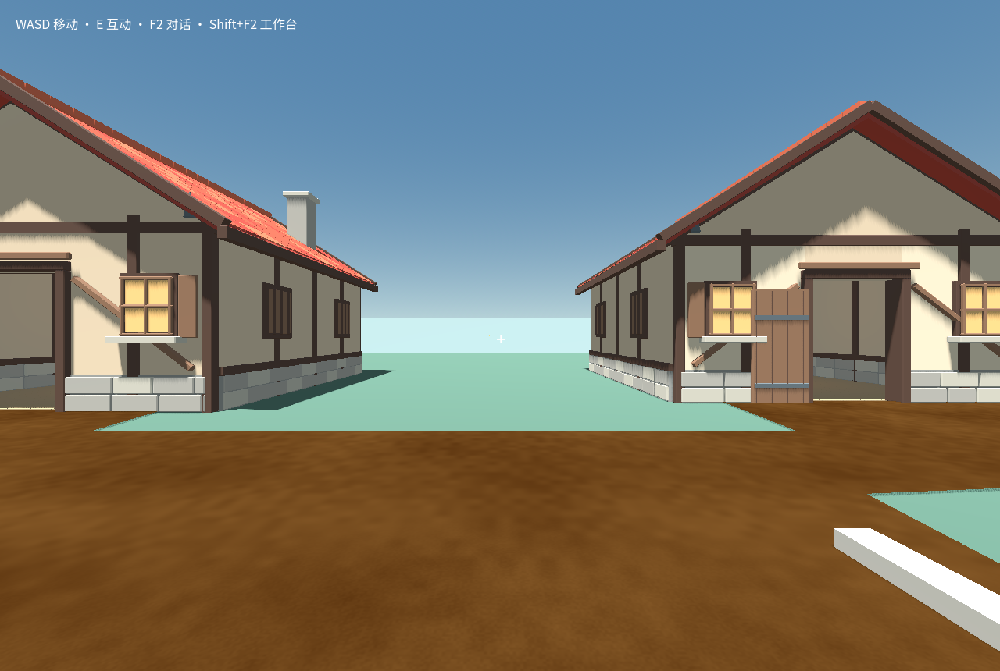

# Same-source applied Godot export reuse

Status: implemented in the managed executor; no Core schema, RPC or ownership change.

## Problem and decision

The courtyard reference benchmark successfully checked, first-loaded, applied,
played and saved its source. A redundant check of the same source subsequently
failed `GODOT_ARTIFACT_CONFLICT` before runtime verification. The original
investigation remains in `PLAYER_COURTYARD_REUSE_LIVE_2026-09-13.md` and its
evidence directory. Nine export files were compared there; only the PCK changed.
Of its 41 entries, three changed: two serialized scenes differed in `node_ids`
arrays, while an imported GLB scene had different compressed bytes. This is
evidence of nondeterministic export bytes, not a proof of semantic equivalence
for arbitrary changed PCKs.

An identical native build ID intentionally has one immutable artifact directory.
Overwriting its PCK or accepting a different hash would invalidate its existing
check and application evidence. The fix instead reuses the already verified
export of the **same currently applied build**, then performs a new native import
and runtime check. It never compares PCKs loosely or modifies serialization.

## Authority and eligibility

1. Core `world.read` must name the claim's exact current build ID. A different
   build takes the ordinary export path, including newly authored source.
2. Core `godotRuntime.describe` must return a formal descriptor for the exact
   world/build/source revision/manifest/base and the claim's artifact root. A
   copied world's foreign build cannot qualify. The native descriptor already
   verifies durable application input/output hashes, successful launch,
   applied candidate, passed check and the complete recorded artifact bodies.
3. An applied candidate and its native `godotBuild.read` passed check must match
   the claim's world/build/revision/source manifest/asset manifest/base/baseBuild.
   The check output hash must match the candidate, and its artifact list must
   exactly equal the formal descriptor. Candidate pagination remains readonly.
4. The originating check's engine version, isolation profile and measured
   toolchain evidence hash must exactly equal this executor's verified values.
   Build identity already includes engine version, renderer, target, source,
   content/asset-lock identity and pinned host resources. The current bridge pin
   is checked again.
5. Every retained artifact is re-read with existing plain-file, path, link,
   size and SHA-256 checks. Creation-sandbox PCK host/source pins are reverified.
   A failed binding or tampered retained file fails closed; there is no repair
   by overwriting the applied artifact.

The executor emits `export.reused` with the originating job/output hash and
`scope: current-applied-build`. The ledger preserves this diagnostic scope
across restart, but the ledger is never reuse authority. Existing failed-check
continuation authority and behavior remain separate and unchanged.

## What still runs

Every requested check still performs a fresh broker import against its claimed
source and a fresh **Core-owned** `godotJob.checkDescriptor` for the current job,
token, input and artifacts. Any current additional check requirements must match
that descriptor exactly. The actual isolated verifier runs again against the
current saved progress; its new failure cannot be replaced by the old pass.
Legacy descriptor fallback is forbidden for reused exports. Application still
requires its separate real first load and native transaction.

This deliberately does not create a general artifact cache for unapplied
candidates, other worlds, arbitrary old builds, changed toolchains or missing
formal files. Such cases retain existing behavior. It does not repair the old
failed benchmark job or claim that previous failures passed.

## Validation

`tests/godot-remaining/C/executor-protocol.mjs` covers normal and refused reuse,
artifact tampering/missing files/hard links/directory links, invalid formal
source/owner/artifact list, missing applied authority, failed original check,
wrong originating output or toolchain, changed bridge, refused or mismatched
current descriptor, cancellation, and an actual new verifier failure. These are
protocol stand-ins, not native gameplay acceptance. The full suite passes with
one existing file-symlink test skipped because this host cannot create that link.

`tests/godot-applied-recheck-native.mjs` uses the original readonly
`matched-reference.zip` (SHA-256
`370db90d64fecd0c7c098c36febd2331acd0a32300e2650c012f4b0e79795e4b`)
through the ordinary player world-template importer/factory/source
initialization in a brand-new profile. It makes **zero model calls** and uses
only the private background native host and ordinary controller commands.

Passed sequence: first real check → real firstload/application → ordinary
movement and save → same-source second real check → second real
firstload/application → save → full host retirement → cold reopen with the
entire saved snapshot unchanged. Both helper guard reports have zero input or
focus violations and zero page errors. The source archive is unchanged.

The native record is
`evidence/applied-artifact-recheck-2026-09-13/native-report.json`; diagnostic
broker attempts/timing are in `executor-observations.json`. The first job used
import + exportWeb; the second used a fresh import and a fresh 2.90-second
runtime verifier, with no export. Check wall times were 18.21 and 7.42 seconds
in this one run, not a general performance promise.

Both checks used revision 2 and manifest
`0f98dfeac8f7a43591f8bcd0f9237818a8049896c9bdb702588337868e908670`.
All ten staged artifact bodies and modification times stayed unchanged. The
6,588,400-byte PCK retained SHA-256
`55349a7409211dc6a5a8f38314d508cb0faa93b62768143f4b7f24da038ab1b2`.
The new native check's progress migration snapshot matched the newly saved
player position, not the original check's default snapshot.

The initial harness attempt also reached two passed native checks but then
asserted an inexistent `output.runtime` property. That test defect was fixed
to inspect the actual native runtime assertions and migration evidence; its
unchanged failed report remains `initial-harness-failure.json`.

Actual formal capture after cold reopen (also byte-identical to the capture
after the second application):



Reproduction requires the existing pinned Windows runtime, the current built
plugin, a valid existing readonly world-template ZIP and a new absolute output
directory:

```powershell
$env:CRAFTMINE_ELECTRON_BIN = 'D:/Craftmine World/vendor/pi-desktop/apps/desktop/node_modules/electron/dist/electron.exe'
$env:CRAFTMINE_GODOT_CACHE_DIR = 'D:/Craftmine World/desktop/build/godot/4.7.2-stable'
node tests/godot-applied-recheck-native.mjs ABS_RUNTIME ABS_BUILT_PLUGIN ABS_REFERENCE_ZIP ABS_NEW_OUTPUT
node --test tests/godot-remaining/C/executor-protocol.mjs
```
