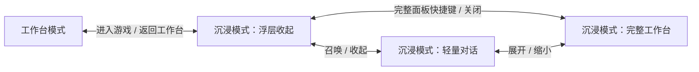

# 最中幻想：沉浸游玩模式与造物主世界开发方案

版本：1.0

编制日期：2026-09-10

检查基线：主工作区 `5195ef5e649eb133a3a95876afeb0d56a4055676`。

状态：产品方案与分阶段开发计划；本次编制文档，不启动功能开发，不改变正在进行的交付任务。

适用范围：先验证 Windows 客户端中的单人世界；沿用现有 Godot 路线，后续对接原生运行。

## 1. 已确认的产品方向与本方案建议

玩家进入世界游玩，通过快捷键呼出轻量对话窗或完整工作台，也可以通过语音说出愿望。Agent 使用当前世界的真实上下文，执行已有能力、组合可复用内容，或开发新增功能；完成检查后让变化出现在世界里，保留玩家进度。

产品主线是：**进入世界 → 说出愿望 → 看见真实变化 → 继续游玩与创造。**

| 决策 | 状态 | 具体含义 |
| --- | --- | --- |
| 工作台与沉浸游玩两种模式 | 用户已确认 | 在外部工作台创造，也能进入游戏后创造 |
| 游戏内提供轻量对话与完整面板 | 用户已确认 | 类似游戏内呼出面板的使用方式，面板关闭后回到原世界 |
| 两种模式共用创作能力 | 本方案落实方式 | 同一世界、存档、会话、任务与历史；切换呈现无需重新导入 |
| 专门服务玩家的主世界底座 | 用户已明确提出 | 官方重点维护一个适合持续“言出法随”的入口 |
| 主世界暂名“造物世界” | 设计建议 | 中文显示名可调整，不代表已注册底座或确定品牌名称 |
| 默认采用 3D 第一人称、单人创造体验 | 设计建议 | 复用现有第一人称能力，优先验证空间指向和连续创作 |
| 常见小改动检查后自动生效 | 设计建议 | 按第 9 节冻结授权和应用规则；复杂影响提供必要提示 |
| 面向新玩家默认进入沉浸模式 | 设计建议 | 先灰度验证，再调整新用户默认值；保留原用户的工作台习惯 |

“主世界”指官方优先打磨的底座与起步体验。每个玩家创建自己的世界实例，拥有独立进度；本方案没有共享服务器、多人经济或所有玩家共用一张地图的含义。

本方案更新此前“中央游戏、右侧对话”的默认呈现方向：该布局继续用于工作台模式，沉浸模式让游戏占据整个客户端内容区。[玩家产品计划](PLAYER_PRODUCT_EXPERIENCE_DEVELOPMENT_PLAN.md)中的参数、现场、玩法保护与试玩能力继续复用。

## 2. 当前可复用基础与需要新增的能力

本次只核对源码和相关记录，没有重跑产品验收。下表记录接入基础，不把接口存在、单模块报告或目录中的示例当作已经完成的沉浸体验。IW0 需记录实际安装包、源码、引擎、模板、运行目标及依赖哈希。

| 已核对的基础 | 证据 | 本方案需要完成的增量 |
| --- | --- | --- |
| 工作台已组合问题反馈、作品包与部分参数入口 | [workbench-ui.mjs](../plugins/craftmine-world/workbench-ui.mjs) | 抽取可复用呈现，挂入完整浮层，保持同一任务和上下文 |
| 创建引导与问题记录已有界面 | [creation-guide-ui.mjs](../plugins/craftmine-world/creation-guide-ui.mjs)、[issue-ui.mjs](../plugins/craftmine-world/issue-ui.mjs) | 游戏内入口、目标上下文、收起后任务继续及回到原状态 |
| 有限参数修改通过草稿和检查处理 | [target-feedback-ui.mjs](../plugins/craftmine-world/target-feedback-ui.mjs) | 按实际能力复用；增加沉浸式结果与自动应用策略，不能直接跳过现有检查 |
| Godot 运行桥含观察、暂停、快照、保存与恢复 | [runtime_bridge.gd](../desktop/godot/shared/runtime_bridge.gd) | 指向上下文、输入归属、统一暂停理由以及主世界的受控创作操作 |
| 当前游戏视图由独立 WebContentsView 承载 | [godot-world-view-host.ts](../vendor/pi-desktop/apps/desktop/electron/main/godot-world-view-host.ts) | 全屏布局、可信浮层的合成与焦点管理 |
| 底座目录与归一化契约可用于创建和分发 | [base-catalog.json](../desktop/godot/bases/base-catalog.json)、[base_contract.mjs](../desktop/godot/shared/base_contract.mjs) | 主世界的专属声明、模块依赖、状态和验收；缺失能力保持缺失 |
| 第一人称有真实对象操作与状态结构 | [base_ops.gd](../desktop/godot/bases/first-person/scripts/adapters/base_ops.gd) | 复用移动、观察和交互经验，不能直接把探针/测试操作开放为玩家的万能命令 |

仓库中的 `mining-sandbox` 是现有 2D 横版挖掘底座，不能因名称含有 sandbox 就视为这份 3D 主世界方案的现成实现。现有第一人称目录也不是任意世界热更新已经完成的证明。

## 3. 两种模式与游戏内两级浮层

### 3.1 工作台模式

沿用世界列表、中央游戏视图、完整对话和创作工具。适合长时间组织需求、选择资源、调整参数、查看检查结果和处理版本。玩家选择“进入游戏”后进入同一世界的沉浸呈现。

### 3.2 沉浸游玩模式

游戏占据客户端内容区，并可进入全屏。普通游玩时只显示必要 HUD、简短快捷键提示和有实际意义的任务提示。首版采用受客户端管理的全屏窗口路线，独占全屏不作为前置条件。

| 浮层状态 | 主要内容 | 常用操作 |
| --- | --- | --- |
| 收起 | 世界与简短任务状态 | 继续游玩，快捷键召唤 |
| 轻量对话 | 当前目标、简短消息、文字/语音入口、任务状态 | 提交愿望、取消任务、展开完整面板 |
| 完整工作台 | 完整对话、素材、参数、任务、历史、问题记录和试玩入口 | 深入创作，缩回小窗或关闭面板 |

完整工作台是现有工具在游戏上方的呈现，不另建一套功能更少且长期分叉的编辑器。首版接入已有可用模块，未接入功能明确显示状态；不把无法执行的按钮做成已完成入口。

轻量对话和完整面板同时只显示一份，草稿输入、滚动位置、当前目标与任务上下文在切换后保留。重复打开不会重发请求；关闭面板只改变呈现，停止任务使用单独的明确操作。

模式选择作为用户偏好保存，不纳入作品源码或改变 `BuildRef`。原用户升级后保留原模式，新玩家默认值按 IW7 的测试结果启用。退出全屏、显示器切换与窗口缩放仍停留在同一世界。

## 4. 快捷键、输入与暂停规则

### 4.1 操作建议

轻量对话与完整面板分别提供可改绑快捷键；可先以 `F2`、`Shift+F2` 作为设计候选，IW0 核对底座和宿主冲突后冻结。按住说话单独配置，避免直接占用底座已有动作。游戏菜单保留相同入口，键盘布局不同或不使用快捷键的玩家也能操作。

快捷键仅在本应用前台且相关世界可用时响应。首版不设置全系统热键、不劫持其他程序的输入；按键重复、组合键松开顺序和窗口失焦都有明确状态处理。

### 4.2 输入归属

| 状态 | 游戏操作 | 输入与暂停行为 |
| --- | --- | --- |
| 正常游玩 | 由底座处理 | 按底座和玩家设置控制视角与鼠标 |
| 轻量文字输入 | 屏蔽角色动作与镜头输入 | 中文输入法组合中的 Enter 不提交；Esc 先处理输入组合，再关闭浮层 |
| 完整面板 | 输入由面板处理 | 主世界首版单人默认暂停模拟，AI 任务继续 |
| 按住说话 | 由主世界配置决定是否允许移动 | 始终显示录音状态；失焦、松键或取消后结束本次录音 |
| 应用新内容 | 由应用协调器控制 | 需要状态交接时短暂冻结；浮层关闭不能解除交接期间的冻结 |

主世界首版文字对话也默认暂停，避免新玩家打字时受到游戏影响；提交并收起后恢复游玩，让 Agent 在后台继续执行。其他底座只在声明支持的情况下使用该策略，多人世界不能默认照搬全局暂停。

暂停按理由管理，例如菜单、对话、人工暂停、应用交接和运行故障。关闭面板仅释放面板持有的暂停理由，不能恢复一个仍在迁移或本来已暂停的世界。暂停、语音录制和任务执行互相独立。

浮层打开时释放游戏对输入的占用。关闭后按底座规则回到游玩；需要平台允许的用户手势时显示“继续游玩”，不通过合成点击或抢占系统焦点恢复鼠标控制。

## 5. 造物主世界的产品设计

### 5.1 第一版的世界

建议采用有边界的 3D 第一人称创造场地：可行走的地面、天空、基础光照、碰撞、可识别的放置位置与稳定出生点。美术先保持清楚、统一、可读，兼容简单几何与已有模型。

初始世界保留空白起点。素材和模块可以已安装在本地库，场景不因此预先摆满房屋、NPC 或任务。可选示例世界用于展示能力，单独选择并标明来源；不把预设样例称为玩家刚刚通过 AI 创造的成果。

主世界默认不设置饥饿、采集材料或战斗胜利等创作门槛。玩家可以要求加入这些规则；后续通过模块形成生存、冒险或经营玩法。创造能力受真实资源、兼容性与预算约束，但不要求先“刷材料”才能体验第一条愿望。

首版不要求无限地图、完整体素地形、复杂 NPC 社会、多人联网或高写实画面。玩家要求超出当前空间或能力的内容时，可以解释范围并形成后续开发任务，不能用相似装饰冒充完成。

### 5.2 底座、模板与模块如何组成

| 组成 | 在现有内容分类中的位置 | 责任 |
| --- | --- | --- |
| 造物底座 | `base`；技术 ID 暂拟 `creation-sandbox` | 复用第一人称基础，提供稳定身份、放置/交互、能力声明、状态与宿主接入 |
| 空白主世界模板 | `world` | 固定底座与初始场地、初始状态和完整依赖锁 |
| 少量常用创作能力 | `module`、`object`、`scene`、`data` | 可组合的互动、物件、布置与参数，拥有各自版本和检查 |
| 模型、声音、纹理 | `raw` | 沿用素材库的来源、预览、许可和正文管理 |

`creation-sandbox` 是方案中的独立官方底座身份，不是当前已存在的注册项。实现时保留来源关系，尽量复用第一人称的公共实现与适配，避免复制后长期维护两套移动和保存逻辑。不得用第一人称原 ID 悄悄替换已有底座语义。

所有组成继续遵守 CP 的七类内容、AL 的固定素材版本与 VM 的应用规则。官方主世界的能力需要版本化声明并可验证；玩家未来制作的底座可实现相同接口，主世界不成为只有官方能访问的特殊工具后门。

### 5.3 首版能力范围

| 能力 | 玩家可以怎样说 | 最小交付要求 |
| --- | --- | --- |
| 放置已有物件 | “在这里种一棵树”“旁边放块石头” | 固定资源、明确位置与朝向，真实可见且有适用碰撞 |
| 修改同一对象 | “把这棵树变高一点”“换成蓝色” | 稳定实体身份、声明过的参数与合法范围，修改后可重开 |
| 复制和布置 | “再放三棵，沿着这条边排列” | 明确数量和锚点，检查占用、距离与对象限额 |
| 组合一次性互动 | “加一个打开后给我奖励的宝箱” | 复用已验证模块，独立状态与奖励记录，不因重试重复发放 |
| 调整环境 | “现在变成夜晚” | 只开放已支持的环境状态；长期默认规则与本次状态区分 |
| 开发新增规则 | “按我指定的顺序触碰石头后，让门打开” | 能生成实际新增逻辑并独立检查，必要时重新构建和载入 |
| 恢复与继续 | “撤销刚才那次创造”“继续完成上次的门” | 关联准确操作，保留兼容进度，任务不因界面切换丢失 |

这些句子是测试意图和示例，不是固定关键词入口。第一次公开试玩前既要证明已有能力复用，也要证明至少一项当前模块尚未提供的新逻辑通过真实开发完成。

## 6. 第一条完整的玩家故事

1. 玩家在世界选择页选择“造物世界”，新建自己的空白场地，直接进入沉浸模式。无需先进入工作区、选文件夹或理解工程目录。
2. 玩家看向一块地面，呼出轻量对话，说“在这里种一棵树”。地面标记显示这次选定的位置。
3. Agent 使用当前底座声明和本地资源完成请求；已有资源按实际来源记录，采用必要检查和适用的生效方式。未完成时显示真实状态。
4. 树出现后玩家走近，说“把这棵树变高一倍”。系统关联同一实体，说明或显示实际范围；改变后仍有正确碰撞。
5. 玩家展开完整面板，查看这棵树的参数或挑选另一份素材，再收起面板。世界、任务和对话连续，不因展开工具而重开一个实例。
6. 玩家提出一个未由现成模块实现的新交互，例如特定顺序开门。Agent 在后台修改真实工程并检查，玩家继续在正式世界游玩。
7. 新玩法准备好后，系统根据影响和当前状态自动应用或提示应用时机；使用交接时的最新正式进度。失败则保留原世界和可继续的任务。
8. 玩家实际完成新交互，退出并重新进入，已有创作、位置和关键进度正确。再提出下一条修改时，前面已接受的玩法仍受检查保护。

IW0 将示例细化为实际资源、状态与独立判定。真实模型试验保留模型版本、输入、工具调用、产物和结果；固定演示动画不能成为该故事的验收证据。

## 7. 让 Agent 理解“这个、这里、刚才那个”

一条愿望由输入、当前上下文和执行边界共同组成。轻量对话只显示玩家需要确认的目标摘要，技术细节保存在任务记录。

| 上下文 | 需要记录的内容 | 使用规则 |
| --- | --- | --- |
| 世界与任务 | 世界、构建、实例、会话与操作身份 | 沿用既有引用；模型不能自行换到别人的世界 |
| 指向对象 | 实体 ID、资源版本、适用组件 | 显示名不作为唯一身份；对象已消失时重新处理目标 |
| 地点与范围 | 采样时位置、坐标空间、表面、法线与必要锚点 | “这里”默认绑定提交时确定的地点，不随玩家后续走动漂移 |
| 当前角色 | 手持物品、相关状态和必要朝向 | 仅读取解释该愿望所需的内容 |
| 连续对话 | 上次操作与产物的稳定关系 | “刚才那棵树”关联产物，不靠相似名字猜测 |
| 世界能力 | 精确底座/模块版本、操作参数、运行目标与限制 | 声明缺失或未验证时不声称支持 |

射线指向没有命中可放置表面时，提供可见的落点选择或必要澄清，不能在空中任取坐标。生成期间目标被删除、地形改变或该位置被占用时，应用前重新检查；玩家明确“跟着我放置”才采用动态目标语义。

上下文按任务需要提供有限邻近对象与必要状态，不默认上传整个世界、全部聊天和所有资源。对象名、世界内书籍、玩家包说明属于内容数据，不能覆盖宿主工具规则或授权。

能力描述包含适用对象、输入结构、影响范围、前置条件、持久化归属、检查方式、可能的生效路径和恢复要求。该描述接入既有底座/模块契约，格式在 IW0 与 CP 共同冻结；本方案不直接新增另一套公共 API。

## 8. 三类执行路径与变化出现的方式

前台统一处理“愿望”，后台根据实际能力选路径；不能仅根据句子长短决定快慢。

| 路径 | 适用情况 | 玩家体验 | 完成依据 |
| --- | --- | --- | --- |
| 已有运行能力 | 底座已声明且许可的状态操作 | 通常可以较快看到反馈 | 实际状态变化与必要耐久保存，不依赖聊天里的完成文字 |
| 资源与模块组合 | 使用已有物件、参数、场景或玩法组件 | 检查后添加或替换；支持局部应用才局部生效 | 新内容版本、正确资源依赖、碰撞/规则与状态检查 |
| 实际开发 | 需要新增或修改脚本、结构和规则 | 后台开发与检查，随后保留进度重新载入或切换 | 真实产物、独立检查、成功交接与对应玩法结果 |

### 8.1 状态和内容各自持久化

“现在变成夜晚”可以是当前游戏状态；“这个世界以后始终是夜晚”改变作品规则。“这里永久多一棵树”“把这棵树改高”通常属于创作内容，需要进入内容版本。不能把所有变化都塞进存档，导致工作台、导出工程和真实世界互不一致。

首版持久创作优先走现有的内容候选、检查和重新载入流程；已有状态操作才走已验证的运行接口。Agent 可以隐藏技术步骤，不能为了视觉上即时变化而先随意改正式世界、稍后再补源码与历史。

### 8.2 局部更新作为独立优化

后续对数据驱动且具有明确适配的内容增加局部应用：先形成持久候选并检查，再由协调器执行有界补丁、核对实际状态和回执。新增内容仍形成相应 `ContentRef` 与 `BuildRef`；允许复用未改变的代码产物缓存，不允许让旧构建身份冒充新内容。

代码、结构、资源装载条件或存档发生不兼容变化时，回到构建与重新载入路径。Godot 可以显示动态场景不等于任意脚本可在运行中安全热替换；不把“所有改动都无缝出现”作为产品承诺。

## 9. 自动应用、进度保护与撤销

### 9.1 应用授权与触发

建议主世界提供“检查通过后自动生效”的明确设置。首次选择时用简短说明解释范围，之后对范围内的普通愿望不反复弹窗。该设置和本次明确提交的愿望共同构成应用授权，最终执行仍由宿主负责。

| 情况 | 建议行为 |
| --- | --- |
| 范围明确、依赖本地可用、状态兼容且恢复已验证 | 检查后按已启用策略自动应用，提供准确的完成与恢复入口 |
| 内容准备好，但正在战斗、移动到危险区域或进行其他关键互动 | 根据底座判断合适时机；必要时显示“已准备好，稍后应用” |
| 大范围删除、存档不兼容、目标歧义或超出本次授权 | 解释具体影响并请求必要选择 |
| 仅讨论想法、查看资源或输入尚未提交 | 不修改世界 |
| 自动应用策略关闭 | 保留试用与主动采用路径 |

自动应用不能由模型自行开启，也不包含公开发布、发送给朋友、购买资源或放宽系统权限。明确要求立即应用的玩家操作仍需满足真实兼容与检查条件。

### 9.2 应用流程

复用 VM 的应用事务：固定内容与检查 → 核对正式基线 → 冻结必要事件 → 获取并耐久保存最新正式进度 → 在隔离副本中迁移 → 载入或应用候选 → 完成引用、部署、进度和回执的一致性确认 → 恢复游玩。

后台构建期间仍可游玩，因此不能使用开始生成时的旧快照替代交接时的最新快照。角色位置、朝向、背包、装备、已领取奖励和任务按实际状态约定保留；新地形与当前位置冲突时采用经过验证的处置或保留原版本，不能把角色埋入物体。

候选试玩的消耗和奖励不写入正式进度。失败保留可恢复的原状态；响应丢失先查询原 `operationId`，不重复应用。每个世界的创作写入按现有租约与基线规则协调，两个面板不能各自成为写入者。

“撤销这次创造”形成有来源的新恢复操作，不简单重放过去的整份存档。已经参与任务、被消耗或被其他内容引用的对象，需要检查依赖和进度兼容性；无法局部撤销时清楚说明选择。恢复对象不能让一次性奖励因旧事件再次发放。

## 10. 界面与运行层的实现方向

### 10.1 首先复用当前客户端

将会话、任务和世界上下文提升到不随面板挂载而销毁的服务层；工作台页面、轻量对话和完整浮层只是不同呈现。共用订阅、操作去重、错误恢复和当前世界绑定，避免多面板分别轮询并重复发起任务。

当前 Godot 画面属于独立 `WebContentsView`。普通页面中的高 `z-index` 不能作为跨视图遮盖已经正确的依据。首选研究由宿主统一管理游戏视图和可信 UI 视图的范围、顺序、显示与输入：工作台模式给游戏保留中央区域，沉浸模式扩展游戏区域，浮层在需要时呈现。

Electron 的 `WebContentsView` 提供独立网页视图及边界管理，同一个 WebContents 只能同时呈现在一个 WebContentsView 中。因此本方案优先复用或重新布局既有 UI 承载，必要时创建共享数据但独立呈现的可信视图；具体合成方案在 IW1 验证，不把同一个视图同时挂两处作为实现。[Electron WebContentsView](https://www.electronjs.org/docs/latest/api/web-contents-view)

完整面板可先采用清晰、不透明的主要内容区域；游戏背景可以保留可见边缘或可信暂停画面。透明点击穿透、模糊效果与复杂动画都不是首版前置条件，但画面叠放、中文输入和关闭后的交接必须实际验证。

### 10.2 与原生运行路线衔接

Godot 的 CanvasLayer 适合固定在屏幕上的 HUD、提示和过渡，可用于主世界的目标标记、任务提示等游戏层界面。[Godot Canvas layers](https://docs.godotengine.org/en/stable/tutorials/2d/canvas_layers.html)

完整工作台初期继续复用可信宿主 UI。原生 Godot 窗口与宿主浮层的合成、焦点和全屏，需要 NR 路线单独验证；不能因为 Godot 能画 HUD 就宣布全部工作台已经能覆盖原生窗口。

游戏内容只取得受控的状态和操作接口，不持有模型 API 密钥、Git 凭据或完整宿主权限。不要为了把聊天放进游戏，把整个 Agent 执行器或账号凭据塞入可由玩家改写的世界脚本。

沉浸模式与原生运行分阶段推进：先在当前已验收目标证明玩家体验，再接入新运行目标。模式切换本身不重建世界；内容应用、切换底座或运行目标仍遵循各自的版本与状态流程。

## 11. 语音、等待和异常体验

第一版先完成文字链路，再接入按住说话。录音、语音识别、语义理解与执行分别记录状态；录音获得权限不代表识别服务已配置。识别可以选用本地或远程适配，IW6 按中文准确率、延迟、设备与成本验证后决定默认方案。

只在主动触发时录音，松键结束，提供取消和必要的文字修正。低置信识别、数量或对象有歧义时请求简短澄清。输入法、游戏音效和旁人的声音不能自动触发创作。首版不需要常驻监听、唤醒词或 Agent 长篇语音播报。

无麦克风、拒绝权限、识别离线或服务失败时保持文字入口可用。音频默认不作为创作包附件或永久聊天附件保存，额外留存需有明确用途与设置；是否使用远程识别以及上传的内容应可查看。

玩家收起面板后，世界边缘只显示实际阶段、完成或需要处理的问题。耗时未知时不展示假百分比；可以收起普通通知，重要保存/应用失败仍有可恢复入口。超过预算、构建失败和模型不可用时，保留已有世界与任务草稿。

基础游玩和本地已经具备的能力应独立于远程 AI 服务运行。模型繁忙不应冻结游戏线程；后台导入和构建按设备能力限制并发，优先保障玩家当前世界。任务成本继续使用 AI 计划的同一账本，模式切换、语音重试和自动应用不会重置额度。

## 12. 分阶段实施与最小可交付版本

阶段编号 IW0–IW7。表中的顺序是依赖建议，不是自动排期；职责表示模块分工，不代表本次已经派发开发任务。不要等待所有专项计划完成才推进可独立验证的部分。

| 阶段 | 模式与交互交付 | 主世界与执行交付 | 主要依赖及完成门槛 |
| --- | --- | --- | --- |
| IW0：基线与契约 | 核实真实客户端能力，冻结快捷键、状态和输入规则 | 确定底座来源、资源范围、能力声明与首个故事 | 客户端、底座、核心共同确认；已有创建、采用、重开和恢复链路可追溯 |
| IW1：两种模式 | 工作台、沉浸画面、轻量对话、完整面板；同一任务连续 | 先使用已验收世界，不等待新底座 | 同一世界往返不丢输入、不重复任务；全屏与视图合成分别留证 |
| IW2：主世界起点 | 世界选择页、沉浸进入、目标标记 | 造物底座、空白模板、最小资源集、状态与正式登记 | 复用 CP/AL 契约；空白世界与重开正确，能力缺失如实报告 |
| IW3：常见愿望 | 请求中的对象/地点绑定，明确作用范围 | 放置、参数、有限复制和一种互动；持久内容先走现有应用链 | IW1–IW2；固定能力真实调用，内容、运行结果和保存一致 |
| IW4：真实开发与连续游玩 | 后台任务、自动/主动应用、必要时机提示和恢复 | 新逻辑真实开发、检查、最新进度迁移与构建交接 | IW3 与既有可信执行器；一项非预置规则闭环，旧玩法仍正确 |
| IW5：减少变化等待 | 根据实际路径展示立即反馈、局部变化或载入 | 对选定数据操作实现并验收局部应用，优化复用与缓存 | IW4 正确性基线；准确内容身份、故障恢复和进度仍通过 |
| IW6：语音与舒适度 | 按住说话、中文转写、权限/失败回退、可读性设置 | 语音使用同一请求、目标和预算链路 | 先有稳定文字版本；真实麦克风测试与预设转写测试分开 |
| IW7：玩家验证与默认入口 | 新手试玩、继续创作、回访后决定默认模式 | 固定主世界版本并衔接 PP6/CP 的好友试玩 | 覆盖硬性正确性案例，真实设备体验达标，再扩大底座和资源范围 |

第一个可供玩家体验的文字版本以 IW0–IW4 为出口：两种模式、两级浮层、一个主世界、常用愿望及一项真实新增规则、保存重开与恢复都在同一构建中可用。局部热更新和语音继续分阶段增强，不阻塞文字版收集真实体验。

主世界底座与通用沉浸外壳分别验收。外壳可以先在已有底座运行，主世界也可以先在工作台验收；最终必须证明二者集成，不能把两个各自通过的结果相加称为玩家版本完成。

## 13. 效果、性能与继续投入的判断

复用 PP 的首次成功、有效修改、重开、修复与继续创作指标，补充沉浸体验指标：全程留在游戏中完成的愿望数、因操作不清楚被迫返回工作台的次数、目标纠正次数、面板收起后任务丢失/重复次数，以及应用造成的打断。

| 观察项 | 测量方式或建议目标 | 判断边界 |
| --- | --- | --- |
| 面板响应 | 已启动客户端、预热后的打开响应 P95 试验目标不高于 200 ms | 内部设计目标，尚未测量；冷启动另列，IW0 固定参考设备 |
| 常用操作反馈 | 分开记录语音识别、模型理解、执行、检查、载入和首次可见变化 | 不把“已接收请求”当作愿望完成，不把完整耗时归功于单个优化 |
| 应用打断 | 冻结时长、恢复首帧和恢复可操作时间分别统计 | 只记录实际操作，不用过渡动画时长替代底层数据 |
| 游玩流畅度 | 同一世界无后台任务与后台构建时的帧时间、内存和崩溃情况 | IW0 按设备与场景冻结预算；未满足时先限制构建并发 |
| 创作可靠性 | 正确目标、检查通过、采用成功、重开正确、后续旧玩法仍通过 | 规定案例中的错误覆盖、进度损坏、重复奖励为阻断缺陷 |
| 创作成本 | 同一类有效结果对应的全部识别、模型与重试费用 | 沿用真实用量；未知价格单列，模式切换不重开统计 |

先邀请少量不会编程的玩家完成固定任务与一个自主愿望，观察其是否理解目标提示、能否持续修改，以及是否愿意回来继续创造。这是建议的后续试验，尚未执行；不预先给出满意率、留存率或“几秒完成任何愿望”的承诺。

第一批验收不能全部使用产品内置提示句。保留未参与调试的表达变体，以及一个未由固定模块提供的需求；能力路由是否选对和实际产物是否正确分别记录。

## 14. 后续开发验收清单

以下 32 项为待执行案例。每项记录源码、客户端、底座、引擎、目标、数据目录、结果和证据；模型、夹具、真实运行及真人试玩分别标注。

| 编号 | 场景 | 必须满足的结果 |
| --- | --- | --- |
| IW-A01 | 新用户与已有用户进入 | 可选择工作台/沉浸模式；旧偏好保留，默认值符合发行策略 |
| IW-A02 | 模式反复切换 | 同一世界与进度，不重复创建实例或任务，不因布局变化重建工程 |
| IW-A03 | 小窗与完整面板往返 | 同一输入草稿、会话、目标与任务；完整工具入口按实际能力可用 |
| IW-A04 | 全屏、缩放、DPI 与显示器变化 | 游戏和浮层位置正确，主要操作可见，退出全屏可继续原世界 |
| IW-A05 | 中文输入与快捷键 | 输入法提交不误发愿望；无按键穿透，重复按键不反复开关 |
| IW-A06 | 失焦、收起与鼠标归属 | 不抢其他应用焦点；按平台规则恢复游戏输入，语音失焦结束 |
| IW-A07 | 多个暂停理由 | 关闭浮层不解除菜单、人工暂停、迁移或故障持有的暂停 |
| IW-A08 | 任务进行中关闭面板 | 执行与预算继续，重开显示同一任务；明确取消才停止 |
| IW-A09 | 新主世界与依赖 | 官方独立身份、空白起点、完整固定依赖，创建与重开可用 |
| IW-A10 | 世界指向与放置 | 表面、坐标、朝向与玩家看到的目标一致，无目标时不乱放 |
| IW-A11 | “这个、刚才那个” | 使用稳定实体和产物关系，同名对象及新消息不导致错改 |
| IW-A12 | 生成期间目标变化 | 玩家移动不改变固定落点；目标删除、占用和版本变化有实际检查 |
| IW-A13 | 复用已有能力 | 真正调用声明操作并观察结果，不以关键词演示代替通用能力 |
| IW-A14 | 永久创作的持久化 | 世界、源码、历史和导出内容一致，重开不丢对象或参数 |
| IW-A15 | 状态与默认规则 | 本次环境状态、作品默认值、个人设置和进度各自归属正确 |
| IW-A16 | 新规则的真实开发 | 至少一项非预置行为由实际产物实现，独立检查与真实互动通过 |
| IW-A17 | 自动应用范围 | 仅在已启用策略和本次授权范围内生效，关闭设置后保留主动采用 |
| IW-A18 | 讨论与高影响请求 | 只讨论不改世界，歧义和不兼容说明具体影响，不伪造完成 |
| IW-A19 | 后台游玩后的最新进度 | 使用交接时快照，保留最新位置、背包、任务与一次性状态 |
| IW-A20 | 候选试用 | 试用奖励、消耗和位置不覆盖正式进度 |
| IW-A21 | 局部应用 | 仅对已验证适配开放，新内容身份和实际状态一致，其他类型回到构建路径 |
| IW-A22 | 两个入口并发与重复响应 | 同一写入规则和操作身份，过期候选拒绝，响应丢失只查原操作 |
| IW-A23 | 故障、磁盘满与重启 | 不把不完整保存当成功；应用可恢复，旧世界与任务记录可追溯 |
| IW-A24 | 撤销与已消费对象 | 检查依赖和最新进度，不重复发奖或静默回退整份存档 |
| IW-A25 | 修改后的旧玩法 | 原有奖励、碰撞、存档等相关规则继续通过，生成者不删失败断言 |
| IW-A26 | 放置规模与碰撞 | 检查数量、资源与占用，不把角色埋入物体；超过限额说明范围 |
| IW-A27 | 真实语音与取消 | 按住/松开、转写、纠错和取消有效；不用预设文字证明麦克风功能 |
| IW-A28 | 语音权限与服务失败 | 不常驻监听，失败可回到文字，录音和上传范围明确 |
| IW-A29 | 不可信世界与资源内容 | 名称、日志、书籍和包说明不能取得宿主权限或改变任务目标 |
| IW-A30 | 成本与性能 | 用量不因切模式重置，面板/后台任务的实际耗时与资源消耗有记录 |
| IW-A31 | 目标平台与发行 | Web/原生能力分别证明，主世界不自动升级覆盖旧实例或误称独立发行 |
| IW-A32 | 无输入验证与真人体验 | 自动测试遵循 AGENTS；合成、焦点、语音与手感有独立真实证据 |

自动验证遵循 [AGENTS.md](../AGENTS.md)：独立 headless 进程和数据目录，在初始化时禁用 `requestPointerLock`；使用 HTTP、页面脚本和纯逻辑检查，不发送真实鼠标/键盘，不使用 Playwright 的 mouse/keyboard/click/fill 验收，不激活或置前测试窗口，不操控用户浏览器。未经另行明确要求不运行历史输入测试。

无窗口检查能证明大量状态与接口行为，无法单独证明可见浮层叠放、真实中文输入法、真实麦克风和第一人称舒适度。后者由安排好的真人试玩确认，不能在用户正常使用电脑时自动抢占输入进行测试。

## 15. 与已有计划的关系及暂不纳入范围

| 配套计划 | 本方案复用的能力 | 本方案增加或更新的内容 |
| --- | --- | --- |
| PP：玩家产品 | 参数、问题现场、玩法保护、常用模块与体验指标 | 两种呈现、沉浸入口、造物主世界；保持 PP 原阶段可独立执行 |
| GD：Godot 多底座 | 当前引擎、创建、运行、候选与底座管理 | 新官方底座和界面模式，不以此覆盖旧实现结果 |
| VM：版本管理 | 内容/构建/进度身份、应用事务、恢复与备份 | 明确愿望提交与自动应用策略的授权关系，复用同一执行路径 |
| AL / CP：素材与创作包 | 正文存储、七类内容、锁文件、安装与导出 | 主世界的能力声明、空白模板和可组合资源 |
| AI：创作效率 | 指导资料、任务、模型、预算、真实用量与验证 | 游戏上下文、执行路径选择、收起面板后的连续任务 |
| NR：原生长期路线 | 原生进程、状态交接与呈现研究 | 浮层和输入适配的新验收场景，首个沉浸版本不等待 NR 完成 |
| CC：社区 | 可选的发布、分发与反馈传输 | 后续分享造物世界作品，首版不依赖账号与网站 |

暂不纳入首版：独立玩家/开发者两套客户端、多人共享主世界、玩家经济和交易、无限体素地图、全套开放世界 RPG、常驻语音监听、任意原生插件、所有脚本热更新、所有底座同时达到主世界的能力覆盖。

主世界后续可以安装更丰富的玩法，也可以导出作品或开放玩家底座开发。所有扩展按实际兼容性进入既有资源与发布流程，不因“官方主世界”身份跳过来源、依赖和发行检查。本方案不改变已确认的许可证与商业授权策略。

下一次启动开发时，先交付 IW0 的基线与最小任务包，再做 IW1 两种模式的真实原型；IW2 主世界在共同契约确认后推进。最终用第 6 节的同一故事验收，避免仅把面板隐藏就宣布“言出法随玩家版”完成。

相关文档：[产品愿景](PRODUCT_VISION.md)、[玩家产品计划](PLAYER_PRODUCT_EXPERIENCE_DEVELOPMENT_PLAN.md)、[Godot 多底座](GODOT_MULTIBASE_DEVELOPMENT_PLAN.md)、[版本管理](VERSION_MANAGEMENT_DEVELOPMENT_PLAN.md)、[素材库](ASSET_LIBRARY_DEVELOPMENT_PLAN.md)、[创作包](CREATION_PACKAGE_DEVELOPMENT_PLAN.md)、[AI 创作效率](AI_CREATION_EFFICIENCY_DEVELOPMENT_PLAN.md)、[原生长期路线](NATIVE_RUNTIME_LONG_TERM_DEVELOPMENT_PLAN.md)、[社区](COMMUNITY_PLATFORM_DEVELOPMENT_PLAN.md)。
