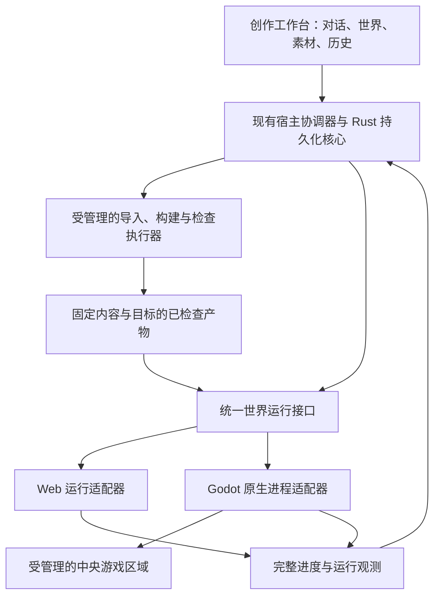

# 最中幻想 / Craftmine World：Godot 原生运行与多目标交付长期开发计划书

版本：1.0  
编制日期：2026-09-10  
检查基线：`c2e592f19cd12f41e8db2d28c858407c22649cbe`（本地 master；另有正在推进的开发分支与未提交计划）  
状态：长期规划，暂不排期。本次仅编制文档；不启动原生运行开发，不改变当前默认运行方式，不调整本轮交付任务。

配套：[Godot 总计划](GODOT_MULTIBASE_DEVELOPMENT_PLAN.md)、[当前选型记录](GODOT_INTEGRATION_DECISION.md)、[版本管理计划](VERSION_MANAGEMENT_DEVELOPMENT_PLAN.md)、[素材库计划](ASSET_LIBRARY_DEVELOPMENT_PLAN.md)、[创作包与导出计划](CREATION_PACKAGE_DEVELOPMENT_PLAN.md)、[社区计划](COMMUNITY_PLATFORM_DEVELOPMENT_PLAN.md)、[AI 创作计划](AI_CREATION_EFFICIENCY_DEVELOPMENT_PLAN.md)。

## 1. 长期方向与启动条件

长期优先探索“现有创作工作台＋Godot 原生游戏进程”。游戏世界直接由 Godot 原生引擎运行，工作台继续组织 AI 对话、工程修改、检查、预览、应用、历史与存档。原生路线通过实际验收后，再考虑成为适合它的世界的默认运行方式；Web 保留为兼容世界的运行、预览和分享渠道。

这项规划承接用户对短期 Web 路线的认可，以及长期扩大游戏能力的要求。它不要求本轮切换引擎运行方式，也不把重做全部客户端界面设为前提。中央原生呈现、独立 Windows 游戏导出、整个客户端脱离浏览器，分别立项、分别验收。

正式启动工程阶段前，应满足以下条件：

- 当前版本的新建、创作修改、应用、退出重开和备份恢复有可追溯的集成证据，已有数据问题有明确处置；不能用运行器迁移替代这些修复。
- 已出现值得投入的需求，例如某项 Web 不支持的渲染能力、原生扩展、独立游戏交付，或实际测得的运行瓶颈。
- 有维护固定引擎、Windows 原生接入与测试环境的资源；启动时重新核对本文引用的官方能力和仓库接口。

NR0 的资料核对与小型技术研究可以单独安排。其余阶段按依赖启动，不设日历承诺，不因本文存在而自动加入当前冲刺；社区、Linux 客户端、完整客户端重写都不是 Windows 原生运行研究的前置条件。

## 2. 编制时的事实与缺口

| 范围 | 已核对的基础 | 原生路线需要补充的内容 |
| --- | --- | --- |
| 客户端世界视图 | [GodotWorldViewHost](../vendor/pi-desktop/apps/desktop/electron/main/godot-world-view-host.ts)通过 Electron `WebContentsView` 承载 Godot Web 导出 | 原生进程、游戏表面与窗口生命周期适配 |
| Web 运行器 | [运行器类型](../desktop/godot/web/runtime.d.mts)定义世界/构建/实例身份，以及加载、快照、保存、暂停、退出等操作 | 抽离通用接口；URL、origin、线程响应头留在 Web 实现中 |
| Godot 侧桥接 | [runtime_bridge.gd](../desktop/godot/shared/runtime_bridge.gd)沿用 `craftmine.godot-runtime/2`，通过 `JavaScriptBridge` 收发请求 | 通用业务处理与传输分离；增加原生连接，不能仅删除 Web 条件判断 |
| 正式运行描述与保存 | [宿主适配器](../vendor/pi-desktop/apps/desktop/electron/main/godot-runtime-adapter.ts)核对 Rust 描述及存档回执，入口校验目前固定为 `web/index.html` | 增加按目标区分的描述与产物验证；保留现有身份和耐久保存校验 |
| 底座和进度 | [共享适配层](../desktop/godot/shared/README.md)已有第一人称、俯视和横版的状态正文及生命周期约定 | 验证相同内容在原生目标下的运行、状态兼容与平台差异 |
| 长期架构位置 | [Godot 总计划第 4.2 节](GODOT_MULTIBASE_DEVELOPMENT_PLAN.md#42-中央游戏画面的接入)已列出原生呈现和 LibGodot 比较项 | 将比较项细化为可独立启动、可停止、可验收的开发阶段 |

检查基线不等于所有交付分支已合入或安装包已更新。已有报告中的“原生 Electron”“原生进度”“headless Godot 通过”，也分别不能证明中央画面已采用 Godot 原生渲染。实施时记录准确提交、引擎/模板/程序哈希和真实运行路径，不按测试名称推断完成状态。

## 3. 技术路线的选择

Godot 的 Windows 导出使用引擎程序与项目资源，最终玩家无需安装完整编辑器。开发期原生运行可以直接加载经过导入和检查的工程；发行期则生成固定可运行产物。[Windows 导出](https://docs.godotengine.org/en/stable/tutorials/export/exporting_for_windows.html)、[命令行运行与导出](https://docs.godotengine.org/en/stable/tutorials/editor/command_line_tutorial.html)

| 路线 | 游戏画面如何运行 | 本计划定位 |
| --- | --- | --- |
| Godot Web＋现有工作台 | 浏览器内核执行 Godot Web 导出 | 保留兼容路径与对照基线 |
| Godot 原生独立进程＋现有工作台 | 原生游戏进程负责游戏；工作台管理它的窗口与状态 | 优先实施的候选路线 |
| 整个工作台改用 Godot UI | 管理界面也由 Godot 界面系统提供 | NR8 可选研究；迁移既有聊天、代码和素材界面需要独立评估 |
| LibGodot 库集成 | 宿主以静态或动态库方式集成引擎 | NR8 可选研究；不作为前期依赖 |

Godot 编辑器本身支持嵌入游戏，且游戏仍在独立进程中运行；可以研究和参考其实现，但不能据此宣称 Electron 中央区域已经具备相同能力。[Godot 游戏嵌入](https://docs.godotengine.org/en/stable/tutorials/editor/game_embedding.html)

截至本次核对，官方将 Godot 4.6 起的 LibGodot 支持标为实验性，范围包含 Windows、macOS 和 Linux。Godot 的 Control 界面系统也用于其自身编辑器。两者说明长期方案可探索，不代表当前工程已有可直接使用的稳定集成层。[Godot FAQ](https://docs.godotengine.org/en/stable/about/faq.html#is-it-possible-to-use-godot-as-a-library)

## 4. 架构与职责

工作台负责用户意图和界面；宿主协调器负责实例选择与操作顺序；Rust 核心继续负责正式内容、应用记录、进度和恢复。Godot 负责游戏规则、场景与可观察的运行结果。构建执行器与游戏运行器分别管理，不能因为游戏能启动就跳过导入、检查或产物校验。

第一阶段保留现有 Electron、React 和 TypeScript 界面，新增原生运行适配与必要的 Windows 窗口桥接。Rust/Node 既有服务按现有边界复用，不另造第二个世界数据库或独立的原生版素材库。

Godot 原生游戏进程与工作台分开，便于分别控制退出、资源限额和故障恢复。这种进程分离不等于不可信代码已得到操作系统隔离；隔离要求见第 10 节。

## 5. 世界、运行目标和构建身份

底座、世界内容、运行目标分别记录。第一人称、俯视、横版属于底座；Web、Windows 原生、未来其他平台属于运行目标。换运行目标不自动产生新的底座，也不自动转换玩家进度。

| 目标类别 | 主要用途 | 需要单独验证的内容 |
| --- | --- | --- |
| 客户端内 Web | 当前兼容运行与预览 | Web 导出、浏览器桥接与宿主保存 |
| 客户端内 Windows 原生 | 原生游戏能力和中央游玩 | 引擎进程、原生桥接、中央呈现与宿主保存 |
| 独立 Windows 游戏 | 离开工作台游玩与分发 | 可运行包、独立保存、资源与宿主依赖替代 |
| 独立 Web 发布 | 浏览器分享兼容作品 | 网站部署条件、独立状态与网络依赖 |

目标的具体枚举和描述字段在 NR1 与 VM/CP 共同冻结，表中名称不是已注册的 API。沿用[VM 第 5 节](VERSION_MANAGEMENT_DEVELOPMENT_PLAN.md#5-与素材库共用的数据契约)定义的 `ContentRef`、`BuildRef`、`ProgressRef`、`OperationContext`，以及固定 `AssetRef` 和素材锁；本文不定义第二套版本或哈希身份。

相同 `ContentRef` 可以分别生成不同目标的构建，但每个构建拥有自己的 `BuildRef` 与实际产物校验。引擎、模板、平台、架构、渲染配置或适配器变化，都需要重新检查；不能把 Web 通过记录复制为原生通过记录。

在构建清单中补充或引用确切引擎/模板哈希、渲染配置、运行适配器版本和产物清单哈希，具体字段沿用既有清单并在 NR1 冻结。构建缓存与 Godot 导入缓存按这些输入区分，不混用不同平台或引擎的 `.godot` 缓存，也不让两个目标同时改写同一个可编辑工程目录。

每个世界声明支持的目标和能力。使用原生专有功能的世界可以仅支持原生；不要求所有高级世界向 Web 的能力范围收缩。增加 Web 支持时产生单独的兼容候选、检查和构建，保留原生版本。

## 6. 统一运行接口与原生通信

### 6.1 复用现有语义

优先保留 `craftmine.godot-runtime/2` 的操作语义，抽离接口所处文件与 Web 传输实现。是否需要升级协议版本，由 NR1 的兼容评审和测试向量决定，不只因换传输就发明一套新存档协议。

| 接口职责 | 现有操作或约定 | 原生适配要求 |
| --- | --- | --- |
| 身份与能力 | 世界、构建、实例身份；`capabilities` | 绑定真实进程、目标和实际支持能力；声明不代替执行证据 |
| 加载与暂停 | `load`、`pause`、`resume` | 初始化暂停；准确状态加载成功后才能游玩 |
| 状态读取与恢复 | `snapshot`、`restore-state` | 完整保留底座状态，不用摄像机位置代替整个进度 |
| 保存与确认 | `save`、`acknowledge` | 区分引擎快照回执与 Rust 耐久保存回执 |
| 退出与取消 | `exit`、宿主请求取消与销毁 | 有界关闭；保存失败不能先销毁唯一有效实例 |
| 错误与观测 | 运行事件、实际场景/实体和错误 | 报告真实目标、阶段与身份，支持 AI 和检查工具读取 |

宿主使用按目标区分的运行描述：Web 描述含 URL/来源，原生描述含确切程序、产物、连接与呈现方式。不得让原生实例伪造 `web/index.html` 以通过旧校验，也不能把缺少必需字段的对象强行转换为现有类型。

### 6.2 通信候选

首个原型优先验证仅监听本机的有界 WebSocket 控制通道：Godot 用内置 `WebSocketPeer` 接入宿主，减少初期额外原生扩展。WebSocket 是通信协议，原生进程使用它不需要浏览器。连接建立与 `poll()` 等行为以实际引擎版本验证。[Godot WebSocketPeer](https://docs.godotengine.org/en/stable/classes/class_websocketpeer.html)

如果隔离策略不允许这条连接，或测量表明其不适合，再比较受限管道或其他本地传输；不能通过放宽玩家进程的网络权限来绕过问题。NR0 比较可实现性，NR1 固定一种首发传输，保留替换接口。

每个实例使用独立连接凭据和请求关联，限定可访问方法、消息大小、队列长度与时限。凭据通过受控启动配置或句柄传入，不放进作品源码、公开包、命令行或普通日志。请求与响应绑定 `worldId/buildId/instanceId`；旧实例的延迟响应不得进入新世界。

连接成功、引擎就绪、状态加载成功、首次画面、正式可游玩是不同状态。初始化超时或断连必须显示实际失败；不能收到连接回包就把世界标记为可玩。首次画面验证与无窗口逻辑验证分别留证。

现有状态正文与消息限额先沿用已冻结规则；基线宿主对进度正文有 1 MiB 校验。需要扩大时同时修改两端、持久化与包协议并验证内存压力，不让原生传输单方面放开上限。运行日志走独立有界通道，不能混入协议数据。

## 7. 预览、应用与故障恢复

原生运行复用[VM 应用事务](VERSION_MANAGEMENT_DEVELOPMENT_PLAN.md#7-应用事务与故障恢复)与现有候选协调器。正式实例和候选实例使用独立身份、状态副本和写入资格；候选试玩的奖励、消耗与位置不进入正式进度。

应用时遵循统一顺序：

1. 固定准确内容、资源锁、目标构建与检查证据，核对任务基线和当前正式世界。
2. 冻结正式实例的必要游戏事件，捕获并耐久保存最新进度；不能直接使用开始生成时的旧快照。
3. 在状态副本上验证新构建可加载，必要迁移也在副本中执行；失败时保留旧世界。
4. 沿用 VM 操作日志和条件更新，关联内容、部署、进度与回执。新实例尚未完成确认时，不将其显示为正式应用成功。
5. 宿主确认全部记录一致后交接可写资格并恢复游玩，再释放旧实例。

在已保存、已准备新实例、已推进部分记录和响应丢失等边界注入故障，重启后根据同一操作身份恢复。未确定结果的写操作先查询原操作，不靠重发创建第二次应用或重复奖励。

Web 与原生即使使用相同的状态结构，也必须通过跨目标载入和恢复检查。状态继续绑定真实 `BuildRef`，通过正式转换操作产生目标进度；不能修改快照里的 buildId 冒充兼容。原生新增字段若不能被旧目标保留，就拒绝直接回切，提供经过验证的转换或保留副本。

## 8. 中央原生游戏区域

首选研究 Windows 原生游戏窗口进入受管理区域。Godot 提供 `--wid` 父窗口请求；Electron 可取得 Windows `HWND`。这些是集成入口，尚需原生适配层把工作区区域与子窗口对应起来，普通 HTML 元素本身不等于可用的原生子窗口。[Godot 命令行](https://docs.godotengine.org/en/stable/tutorials/editor/command_line_tutorial.html)、[Electron 窗口句柄](https://www.electronjs.org/docs/latest/api/browser-window#wingetnativewindowhandle)

NR4 至少验证：中央区域随侧栏/聊天/窄窗变化正确缩放，100%/125%/150%/200% 缩放与多屏移动一致，最小化/还原和世界切换正常，模态窗口不被游戏挡住，输入法与聊天焦点互不干扰。原生窗口的所有权、销毁顺序和错误提示由宿主管理。

跨进程窗口父子关系需核对窗口样式与 DPI 感知模式。Microsoft 明确说明 `SetParent` 不会自动修改相关窗口样式，不同 DPI 感知模式可能导致错误或非预期行为，不能把一次成功嵌入当成全部窗口条件通过。[Microsoft SetParent](https://learn.microsoft.com/en-us/windows/win32/api/winuser/nf-winuser-setparent)

如果直接窗口集成不能满足裁剪、遮挡或平台要求，再研究原生图像/纹理合成；另测复制成本、延迟、输入和维护复杂度。如果 Electron 参与最终合成，应如实说明，不能把“游戏由原生引擎渲染”宣传为“整个客户端完全没有浏览器”。不以循环截图或视频串流充当已完成的原生窗口方案。

独立游戏窗口可用于验证原生引擎与生命周期，但不能替代中央嵌入验收。只完成独立窗口时，交付状态应明确为“原生运行原型”。

## 9. 构建、素材与 AI 创作接入

原生构建从固定源码和完整素材锁开始，在隔离目录导入资源、检查脚本和生成产物。普通用户不需要打开 Godot 编辑器；工作台通过受管理的工具链执行。引擎、导出模板和运行依赖由客户端按确切版本提供，不能依赖开发者机器的全局安装路径。

底座和资源使用既有七类创作包及 `AssetRef`，不额外建立“原生素材版本号”。同一原始素材可以生成不同目标的导入产物；原始正文、导入设置和派生缓存分别管理，导入结果变化需要新的构建证据。Windows 独立包、Web 包和客户端内原生包分别核对依赖闭包。

原生可使用 Godot 不同渲染路径，但第一轮对照先沿用相同的 Compatibility 配置；Forward+ 等高级配置作为独立能力档案验证。渲染模式切换可能需要场景、光照和环境适配，不承诺相同工程在所有模式下画面完全一致。[Godot 渲染器说明](https://docs.godotengine.org/en/stable/tutorials/rendering/renderers.html)

AI 每次创作读取实际目标、引擎/底座版本、可用工具、素材和能力限制。增加原生目标不直接增加宿主权限，也不能让模型用原生专有能力修改一个只支持 Web 的世界。沿用[AI 创作计划](AI_CREATION_EFFICIENCY_DEVELOPMENT_PLAN.md)的文档/Skill 按需加载与检查反馈，增加对应原生运行目标的资料和示例。

补齐原生运行的可观测接口：当前场景、稳定实体 ID、玩家与镜头状态、装备/交互对象、关键玩法结果和实际错误。图像证据绑定具体世界、构建与实例，不能用另一个窗口或固定示例截图代替本次结果。模型的解释、静态通过和引擎真实运行分别记录。

## 10. 进程管理与执行边界

原生运行沿用 GD0 的执行前提。导入、工具脚本、构建、状态迁移和游戏运行都可能执行项目代码，必须分别核对执行边界；不能只在最终游戏窗口启动时做限制。边界未通过时，仅在适当隔离环境中验证固定作者样例，不把玩家任意工程标为可执行。

进程管理至少包括确切程序路径及哈希、创建时间、进程身份、所属任务与世界、资源限额、启动/退出期限和退出原因。优先使用平台提供的可靠进程句柄及进程树管理；禁止按进程名称批量结束 Godot，也不能仅凭可能复用的 PID 终止进程。子进程管理能力不能充当文件或网络隔离证明。

游戏进程仅获得当前任务需要的只读产物、受限临时目录和受控接口，不直接读取模型凭据、Git 管理目录、宿主数据库或其他世界。保存通过已有宿主接口完成；社区包不能自带高权限宿主插件或任意系统命令作为默认运行步骤。

原生动态库、GDExtension、自定义引擎和额外外部程序分别登记目标、来源、依赖、版本与执行范围，纳入后续扩展验收。声明能力仅表示请求；下载安装或静态检查通过不自动授予运行资格。

所有自动验证遵守[AGENTS.md](../AGENTS.md)：独立 headless/offscreen 进程和测试目录，不操作用户正在使用的浏览器，不发送真实鼠标键盘事件，不请求 Pointer Lock、不捕获系统鼠标、不激活或置前测试窗口。浏览器初始化禁用 `requestPointerLock`；不运行被禁止的历史输入测试。

纯逻辑和协议检查通过场景方法、领域接口与受控状态调用完成。中央可见合成、多屏与实际操作手感保留单独验收，由玩家自主操作或安排独立测试环境；不得用后台逻辑通过替代可见效果，也不得为了完成验收抢占用户当前桌面。

## 11. 独立 Windows 游戏导出

沿用[CP 第 8 节](CREATION_PACKAGE_DEVELOPMENT_PLAN.md#8-三种导出产品与运行目标)的“分享创作、发布游戏、个人备份”区分。NR5 负责给 CP4 提供原生运行适配和证据；CP 继续负责导出用途、清单、包与界面，避免两个独立导出系统。

发布游戏包含确切引擎程序、目标资源、必要依赖、初始内容和声明。Godot 的 Export Project 提供程序与资源，Export PCK/ZIP 只提供资源包，后者不能独自作为可运行游戏交付。[Godot 导出方式](https://docs.godotengine.org/en/stable/tutorials/export/exporting_projects.html)

逐项替代或声明工作台依赖：

| 依赖 | 独立游戏的交付要求 |
| --- | --- |
| 保存与恢复 | 有独立保存位置、格式版本、可靠写入与重启恢复；进度不混入工作台世界 |
| 资源读取 | 必需正文随包可用；不引用开发者绝对路径、个人缓存或临时下载地址 |
| 输入与窗口 | 无工作台仍能进入游戏、暂停、退出并处理窗口变化 |
| 游戏功能接口 | 必要宿主调用有随包实现；缺少时不能标为独立可玩 |
| AI 与在线功能 | 按作品需要另行声明与实现；不携带作者账号凭据或假设玩家拥有作者环境 |
| 版本与升级 | 标明内容、构建和状态版本；升级后可恢复兼容存档，失败保留旧数据 |

默认发布使用作品初始状态，不附带作者私人进度、聊天或密钥。若作品把在线 AI 作为游戏机制，需独立配置与断连行为验收；可离线游戏则要在无工作台、无开发工具、无网络的干净 Windows 环境实际证明。

原生备份复用 VM/AL 归档，覆盖新增目标描述、应用/状态映射、固定资源正文和必要构建记录。恢复需要确切运行器时先核对可用性；缺项明确显示未可运行，不能换成最新引擎冒充恢复。恢复到新目录和清理旧缓存后都应保留原有世界内容与进度。

发行材料继续沿用[项目许可方案](LICENSING_STRATEGY.md)和既有来源核对。Godot 引擎及其第三方依赖的版权/许可材料应与实际分发版本匹配；官方建议可随包提供 `GODOT_COPYRIGHT.txt`。本文不改变项目或玩家作品的许可安排。[Godot 分发说明](https://docs.godotengine.org/en/stable/about/complying_with_licenses.html)

## 12. 开发阶段与依赖

阶段编号 NR0–NR8 表示工作范围，不代表固定时间表。每阶段交付准确代码/产物版本、自动验证、未验证项和决策记录。被依赖方的真实交付优先于历史任务编号；阶段开始时重新核对，不凭旧报告重复实现。

| 阶段 | 工作与交付物 | 依赖 | 验收出口 |
| --- | --- | --- | --- |
| NR0 重新核对与小型研究 | 固定版本和参考工程；核对窗口、通信、隔离与工具链；建立 Web/原生对照方案与预算 | 本计划、当前源码与实际需求 | 有可复核的路线决策、测量方案和未解问题；没有适合方案时可停留在研究状态 |
| NR1 统一运行契约 | 拆分 Web 特有字段；目标描述、能力矩阵、通信身份和兼容向量；AI 目标上下文 | NR0；VM/AL/CP 共享契约 | 既有 Web 行为保持有效，原生描述不伪造 Web 身份，两端约束一致 |
| NR2 Windows 原生运行器 | 固定引擎与产物启动、本地连接、加载/保存/退出、进程和隔离管理 | NR1；适用的 GD0 执行条件 | 固定 2D/3D 工程完成真实原生生命周期；明确哪些只验证了无窗口逻辑 |
| NR3 接入创作与恢复 | 首次创建与构建；原生检查、候选、预览/取消/应用；跨目标进度与完整备份 | NR2；VM 应用恢复及 AL 固定依赖能力 | 同一客户端完成完整创作故事，故障恢复不串档、不重复奖励、不丢已确认状态 |
| NR4 中央原生呈现 | 窗口接入、尺寸/DPI/焦点/遮挡、渲染诊断和销毁恢复 | NR2；最终联测消费 NR3 | 中央区域通过实际可见验收和生命周期验证；独立窗口不算完成 |
| NR5 独立 Windows 交付 | 独立保存/资源/必要接口；导出与干净机器运行证据 | NR2、NR3 的状态规则；CP 内容与依赖能力 | 给 CP4 提供脱离工作台的启动、游玩、保存、升级与重启证据 |
| NR6 默认路线评估与渐进发布 | 同条件性能对照、世界兼容范围、安装升级、回退条件与运行偏好 | NR3、NR4；对应发行检查 | 符合冻结门槛的目标范围可推广；保留旧世界与不适用硬件的明确路径 |
| NR7 扩展原生能力与平台 | 经验证的高级渲染、原生扩展；按实际需求推进其他架构/系统 | Windows 路线稳定；每项扩展独立定义范围 | 按目标发布能力与证据，不以 Windows 成功推断其他平台可用 |
| NR8 整个客户端原生化研究 | 比较 Godot UI 或届时可用的 LibGodot；制作关键界面迁移样例 | 有量化需求与维护资源；重查官方成熟度 | 形成继续采用混合架构或单独迁移的决策；不倒置为 NR2–NR6 的前提 |

NR4 和 NR5 可分别推进：中央嵌入不阻挡独立游戏导出，独立导出也不证明中央嵌入完成。NR6 的客户端默认运行评估不强制等待独立导出产品。如果现有 CP4 先通过另一条合格的原生导出路径，NR5 复用其成果，不重置完成状态或增加重复等待。

NR7/NR8 是可选扩展，长期保留混合架构也可以是一项正式决策。其他系统的游戏导出、其他系统的最中幻想客户端和社区服务器操作系统分别排期。

## 13. 验收矩阵

以下均为待实施场景。原生路线的新增测试应验证真实风险与用户结果；资料整理、文案或低影响可逆调整不额外堆积模拟测试。

| 编号 | 场景 | 必须证明的结果 |
| --- | --- | --- |
| NR-A01 | 新建 2D/3D 世界到首次游玩 | 从客户端入口走完物化、登记、构建、检查、加载；不手工植入已应用记录 |
| NR-A02 | 识别实际运行方式 | 产物、进程与引擎身份为原生；游戏区域没有加载 Godot Web/WASM，保留的 Electron 管理界面单独说明 |
| NR-A03 | 原生连接错误与越界响应 | 错误身份、错误凭据、重复/超大/超时消息被处理；另一世界不受影响 |
| NR-A04 | 预览和取消 | 候选物品、奖励和位置不污染正式进度，取消后可继续原世界 |
| NR-A05 | 生成期间玩家继续游玩 | 应用使用最新已确认进度，保留装备、背包和一次性奖励 |
| NR-A06 | 保存失败或磁盘满 | 不显示保存成功，不销毁唯一有效状态，恢复空间后可继续 |
| NR-A07 | 应用回包丢失 | 查询同一操作确定结果，不重复提交、复制物品或再次发奖 |
| NR-A08 | 部分提交后宿主退出 | 各持久边界重启恢复一致，未恢复操作不冒充正式部署 |
| NR-A09 | 原生进程崩溃或无响应 | 保留工作台和已确认进度，退出诊断明确，重开绑定正确构建 |
| NR-A10 | 旧实例响应与进程身份复用 | 不串入新世界，不因复用 PID 或同名进程结束其他任务 |
| NR-A11 | Web 与原生来回转换 | 兼容状态通过正式转换保留；不兼容字段明确拒绝，不静默清空 |
| NR-A12 | 中央尺寸、缩放与多屏 | 实际可见区域、裁剪和指针坐标一致；缺少真机证据时保留未验收 |
| NR-A13 | 聊天、中文输入、弹窗与最小化 | 游戏和工作台交互正确，后台不抢焦点，窗口恢复不丢状态 |
| NR-A14 | 反复创建、切换和关闭 | 无失控实例、连接或持续资源增长；按 NR0 冻结次数与持续时间测量 |
| NR-A15 | 含脚本工程的导入和运行边界 | 文件、网络、进程及其他世界访问范围符合执行约定，导入阶段同样覆盖 |
| NR-A16 | 固定资源与目标缓存 | 缺失、篡改或错目标产物不能进入正式运行；改一目标不污染另一目标 |
| NR-A17 | 完整备份到新目录 | 原生新增映射和正文齐全；没有来源工作树也能恢复可用状态 |
| NR-A18 | 独立 Windows 游戏干净环境 | 无工作台/编辑器/个人缓存仍可启动、游玩、保存、重开；离线声明经断网验证 |
| NR-A19 | 独立游戏及客户端升级失败 | 失败保留旧程序所需内容与旧存档，不能用进度清空实现降级 |
| NR-A20 | AI 修改同一原生世界 | 模型读取真实目标与运行反馈，修改、检查、预览和应用完整完成 |
| NR-A21 | 原生专有内容申请 Web 发布 | 给出具体兼容缺口，不复制原生通过记录或静默删功能 |
| NR-A22 | 性能与体积对照 | 同源、同配置、同硬件的完整样本与失败记录可追溯，报告包含所有相关进程 |
| NR-A23 | 包与发行内容一致 | 引擎、模板、依赖、目标和声明对应实际安装包，外部缓存不能冒充已随包提供 |
| NR-A24 | 自动测试遵守用户偏好 | 无真实输入、Pointer Lock、鼠标捕获和测试窗口置前；缺失的可见验收明确保留 |

每条证据记录准确源码、输入内容/资源锁、引擎和模板、目标/渲染配置、产物哈希、环境、结果及限制。夹具证明夹具范围，纯 Rust/协议测试证明对应模块；同一客户端故事、真实模型和实际安装包分别留证，不能互相替代。

## 14. 性能对照与默认切换条件

NR0 在实现优化前冻结设备档位、场景规模、分辨率、画面配置、样本数量、资源预算与验收门槛，保留测量脚本和原始数据。本文不填写未经测量的“提升几倍”、统一 FPS 或完成天数。

| 维度 | 记录内容 | 比较规则 |
| --- | --- | --- |
| 启动 | 冷/热启动到可交互，以及引擎/资源初始化 | 缓存条件分组，成功与失败样本都计入 |
| 创作等待 | 修改到检查完成、预览可用、应用完成 | 分开统计模型、导入、构建、检查和载入，不把模型变化算为运行器收益 |
| 帧时间 | 分布、长帧与波动；CPU/GPU 可用观测 | 同一场景与画面档位；高级原生效果另列场景，不混入等质量对比 |
| 内存与资源 | 工作台、浏览器、原生实例和检查进程的总量，显存及句柄等可测项目 | 候选和正式实例共存期间也计入，不只测游戏进程 |
| 包体与磁盘 | 安装体积、版本共存、共享引擎与目标缓存 | 按实际文件计算；可重建缓存与不可删除正文分开 |
| 稳定性 | 崩溃、保存/恢复失败、断连、反复切换后的资源增长 | 固定场景和持续时间，保留失败及环境差异 |

NR6 默认切换需同时满足：验收范围内的数据丢失、串档和重复奖励失败为零；已识别的严重缺陷已关闭；中央呈现和发行包通过；至少一项真实需求得到解决；性能、资源与稳定性达到 NR0 冻结的可接受门槛。必要用例缺乏证据时，仅维持已证明范围的原型或可选运行方式。

切换按世界支持目标和设备能力逐步开放。既有世界保留确切构建与引擎，不因客户端升级静默迁移；玩家选择原生运行后先完成兼容检查和备份。原生失败只有在同内容及最新进度都能兼容时才可回到 Web，否则保留数据并报告待处理问题。

引擎升级同样生成受检查的候选；旧版本引擎、素材与产物在受保护引用仍需要时不能清理。运行器回退、游戏内容回退和个人进度恢复分别处理，不能用回退程序掩盖存档结构不兼容。

## 15. 主要风险与后期决策

| 问题 | 应对与决策条件 |
| --- | --- |
| 原生窗口无法稳定融入工作台 | 保留独立原型状态；比较其他原生呈现方案，未满足中央体验前不切默认 |
| 原生运行收益不足以覆盖维护成本 | 保留 Web 路线与已完成接口；不以技术名称决定必须迁移 |
| 共享接口抽象削弱目标校验 | 使用按目标区分的严格描述与能力检查，禁止任意字段和模糊降级 |
| 高级内容使 Web 不再兼容 | 作品按目标声明能力，各目标分别检查；原生功能不强制回退到最低公共范围 |
| 原生执行扩大项目代码访问范围 | 先完成适用的隔离与权限边界，独立进程或目录不能代替证明 |
| 目标、缓存与引擎版本增加体积 | 按哈希共享可共享正文，按引用保护所需版本；先清可重建缓存 |
| 全客户端重写拖延游戏能力 | NR8 独立研究；只有既有界面有明确瓶颈且样例证明迁移收益时才启动 |
| LibGodot 成熟度或接口变化 | 启动时重查官方版本与样例，测维护与崩溃影响，保留不采用结论 |

整个客户端原生化研究至少制作聊天长列表、Markdown/代码展示、差异查看、素材浏览、中文输入与中央游戏协同的真实样例。比较现有体验、性能、可访问性和迁移成本，再决定是否替换 Electron；不能只展示一个 Godot 按钮窗口就宣布重写可行。

## 16. 与现有计划的分工及重新启动入口

| 计划 | 继续负责的内容 | 本计划的衔接 |
| --- | --- | --- |
| GD：Godot 总计划 | 当前底座、创作闭环、执行前提与可用版交付 | 本计划细化原生路线，暂不改变当前 Web 候选和任务排序 |
| VM：版本管理 | 唯一内容身份、应用事务、进度关联与恢复 | 原生构建/状态登记进入同一套数据和操作恢复 |
| AL：素材库 | 固定资源正文、索引、安装与使用关系 | 增加目标兼容和派生缓存信息，不重复建库 |
| CP：创作包 | 七类内容、包格式、导出用途与玩家接口 | NR5 提供或复用 Windows 原生交付能力；不产生新的包类型 |
| CC：社区 | 上传、审核、发布、下载与后续协作 | 分发确切目标产物及能力证据；网站上线不成为原生本地运行的前提 |
| AI：创作效率 | 思考策略、按需资料、模块复用与真实验证 | 提供原生目标知识、可用工具和真实观测，复用原有策略与实验方法 |

将来重新启动时，先建立 NR0 的当前基线记录：准确源码与安装包、执行器可用范围、已完成/未完成的产品故事、固定引擎版本，以及选择原生的具体需求。随后选一份小型 2D 工程和一份代表性 3D 工程，定义可比较的状态、画面与性能指标，再拆分运行接口、原生进程、中央呈现和独立导出的工作。

本次交付是长期计划及相关文档入口。NR0–NR8、验收矩阵和性能对照均未因编制本文而执行；后续完成状态以对应版本的实际产物和证据更新。
