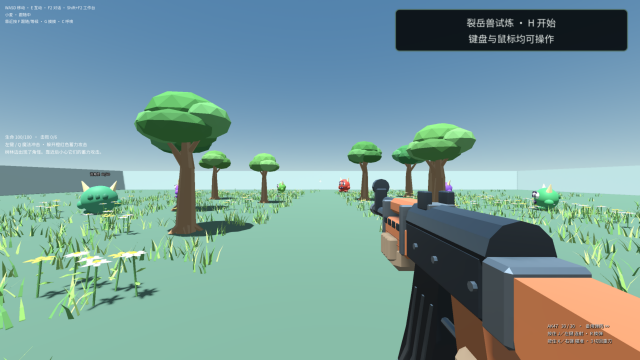

# 玩家接入与试玩反馈验收

2026-09-14，集成源码 `ad6bd63f`、应用 `0.14.4-preview.23` 的实际 PI Desktop 原生反馈流程通过。使用两个独立本地资料目录，全程后台离屏运行，没有鼠标、键盘或焦点抢占。此记录属于源码构建验收，最终 Windows 分发包需要另行验证。

## 已实现

- 在原有设置中展示安装、重新检测、登录、验证和保存步骤；检测 PATH、Codex Desktop 和 npm 的已安装本机程序，逐项解释版本兼容性。
- 严格保留所需 CLI 版本与 `gpt-6-astra / xhigh`。官方通用安装指引不能保证取得项目指定的 alpha 版本，因此没有加入未经验证的自动安装器；界面说明这一分发限制和提供商后端替代入口。
- 在原素材库界面中编写、预览、导出和导入试玩反馈；显示世界、构建、引擎、应用版本及内容指纹，支持关联回复与 AI 检查草稿。
- 截图默认不附带。勾选后展示素材库打开前捕获、仍与正式世界绑定的原生画面，确认后导出同一图片与文字。导入图片验证大小和 IHDR 尺寸。
- Rust 保存反馈。导入预览不落库，确认后才保存；重复导入不会重复创建，原始玩家文字不会被回复覆盖。

## 实际原生验证

1. 作者通过普通示例入口创建世界，保存并导出世界模板 ZIP。
2. 朋友使用空资料目录导入模板，创建独立世界，填写反馈并主动勾选截图。
3. 预览后执行正常进度保存，再确认导出；截图 Base64 与预览完全相同，原记录的历史身份和文字保持不变。
4. 作者预览后导入反馈，重复导入仍只有一条；正常关闭应用、重启后从界面读取。
5. 通过普通按钮准备 626 字的世界修复对话草稿，包含反馈及来源标识和不可信玩家数据说明，没有提交模型请求。
6. 作者导出关联回复，朋友导入，正常重启后再次读取并核对关联编号。

六次应用启动均正常以退出码 0 关闭，违规记录与退出失败均为空。会话持久化指标显示模型调用为 **0**。这里验证的是检查草稿交接，不代表已经让 AI 执行修复，也没有声称真实玩家或外部干净 Windows 完成验收。

## 首次截图的恢复情况

作者首次准备一次成功。朋友首次准备耗时约 2.67 秒，返回 `GODOT_VIEW_CAPTURE_BUSY`，已超过从准备开始计算的两秒重试窗口。界面明确提示后，驱动执行一次普通关闭、重新打开素材库；原文字和截图勾选保留，第二次准备成功。

原始错误和恢复动作保留在 `capturePreparationRetries`。本次是包含真实恢复步骤的完整通过，不能描述成首次操作无恢复通过。没有注入截图、使用失败运行的内容替代本轮创作，或放宽世界身份检查。

实际截图为 640×360、148,682 字节，SHA256：`005b3e52d5f5f45c0b60f2549c721fdc80d2b6eaabdc9ed3bc2365d0a1ac1540`。

## 证据

- [结构化摘要](evidence/player-feedback-native-20260914/summary.json)
- 原始报告：`D:/cm-product-feedback/test-results/desktop-native-feedback-T37D9w/report.json`
- 原始目录保留预览 PNG、作者与朋友反馈文件、模板 ZIP、各次原生应用日志和退出审计。
- 先前失败和单独诊断目录保持原样，不并入本次通过记录。

针对性验证还包括 Rust 反馈验证与持久化 4 项、素材预览与反馈边界测试 13 项、实际 React 反馈界面 9 项及接入界面 8 项；TypeScript 类型检查通过。
