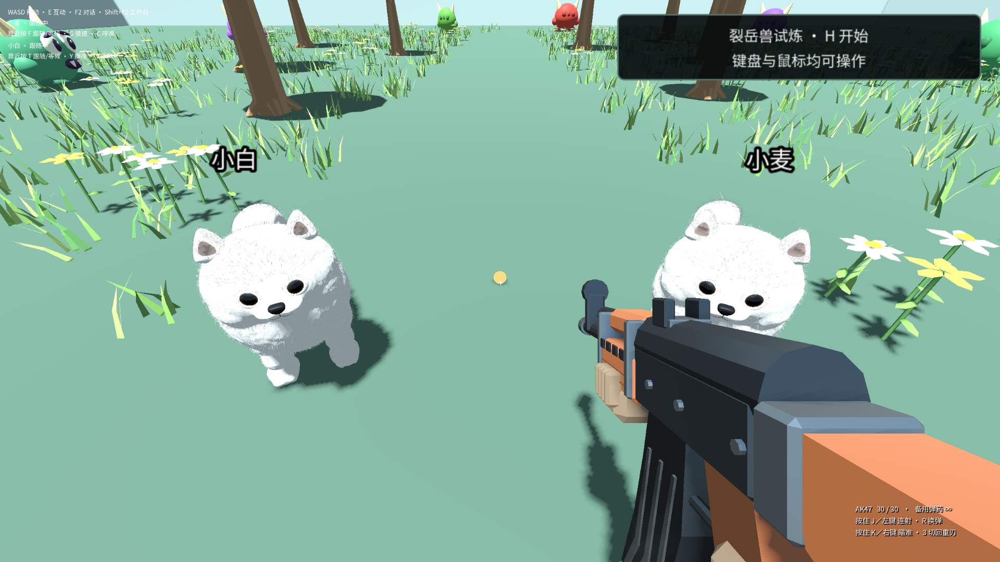

# 玩家候选预览、刷新与画面恢复验收

2026-09-14，在最终 Windows ZIP 的实际解压副本上完成验收。8 项通过，7 张原生画面均通过身份绑定、实际附着和非黑检查；两次启动均正常退出，未调用模型，未发送真实鼠标/键盘输入。

## 成品与输入

- 应用：`D:/Craftmine Releases/PlayerFix-preview24-c04cef7e.verify-70651ec5-4d9c-4ade-9dc9-08e93af5714c/PlayerFix-preview24-c04cef7e/output/win-unpacked`。
- 输入为已经正常关闭的独立双狗测试档案 `D:/cm-player-dog-fix/test-results/desktop-native-product-ZgZfL2/profile`；只读复制到新的测试档案，原始资料未修改。
- 世界：`world-bd900f064cf2`，原正式构建 `gbd-0bdc0cfdcaa4414f6964971353f7a6b66f03bf805718acdf951e5d2960a7b572`。
- 两次启动的 builtin registry 都明确指向本次解压包的 `resources/plugins/craftmine.world`，没有沿用原输入档案的旧包路径。
- 包内文件清单运行前后 SHA256 均为 `0eae486db1ff0d4b88cc9e2489aca86c1627ffe57642209f5d893392d8dadf64`。

## 实际链路

使用现有历史检查入口重新检查原来已经写好的源码，得到真实候选；测试没有修改源码、直接制造候选或伪造检查结果。

1. 在真实检查列表打开预览，验证侧栏切换在候选锁定期间被拒绝，原正式实例与候选实例都未改变。
2. 对独立 Electron 中的插件页面执行真实 reload。页面先对账遗留预览，再打开世界；恢复原正式实例 `d90a780afc313c34124f50e4`，没有产生额外采用事务。
3. 再次预览，通过原主窗口预览控件返回原世界；完整持久进度与该次预览开始时一致。
4. 再次预览，通过同一个普通控件采用。采用后页面再次 reload，正式实例保持 `209d29e918a32fa9d5a0df5a`。
5. 正常保存并退出，重新启动应用。构建保持正确，新的原生实例为 `a606132d7105e1d910696363`，两只狗仍在画面中。

实际检查作业：`gjob-2fa410fc5928ffe3ddf128301c8347bc544053c213429223cb1345b759a9f845`，源码 revision 6。

实际候选：`gcan-4e26de9e4031a89a5467282983e1862f957506bef25bf1743fc70ffa33ae3e1d`，新构建 `gbd-4f5bcc7107630427b481367de9ab5e6f9e0360bd63663db91d0407d7a5fb95de`。最终只读数据库审计确认该候选恰好一个 applied 事务：`5a3de836-cc74-4754-9fc4-e40c8dfef7fa`。

## 画面与存档证据

使用现有 `godotCaptureBoundView`，其采集前后都会验证 host 可见状态、surface 可见状态、目标 WebContentsView 确实附着在所属窗口，以及世界/构建/实例和尺寸。不是仅对隐藏 WebContents 截图后声称玩家能够看见。

7 张图像的中心区域各采样 46,656 个点，全部不透明，至少 45,916 个点不为暗色，量化颜色数 745–771。正式刷新、采用和冷开后的页面均无错误、加载遮罩已关闭，世界标签恢复为选中。原检查页内普通“返回原世界”保留检查标签状态，但正式原生视图已恢复附着；没有把这一状态说成标签已切回世界。

存档比较以**正常退出完成后真正持久化的完整文档**为准，与冷启动后正式文档的整个 snapshot 精确比较。包括 `pet-dog-01`、`pet-dog-02`、玩家、库存、巨兽、武器和其他所有组件，未筛除未知字段。

恢复运行状态另作完整字段差异记录，本轮差异为 0。截图时宿主记录为 paused，因此不把本轮结果扩大为“任意继续游玩后 NPC 坐标也不会改变”。原双狗创作验收中记录的巡逻 NPC 动态差异仍保留。

两次应用退出均 `code: 0`，`violations`、`pageErrors`、`shutdownFailures` 全为空数组，没有强制退出。GPU 在验收结束后释放给后续测试。

## 原失败记录保留

以下均为运行旧测试驱动时发现的适配问题，未修改最终成品包：

- 首次预检仍只寻找旧 `offscreen: !!headlessAcceptance` 文本；补充识别当前等价的 `isOffscreenAcceptance()` 安全入口，该次未启动应用。
- `BU8ZYy`：在 host-ready 之后过早读取尚未落盘的 builtin registry；改为实际世界加载完成后再核验。应用正常退出，审计为空。
- `YMNurR`：旧 `primaryMode(create)` 控件已被新的世界选择器取代，记录 `Mode entry is not ready`。改走当前真实世界打开表单；该轮 pageErrors 原样保留，未当作通过。
- `cjg4l1`：错误地要求两次 UI 操作之间整个原生子视图层叠顺序不变；主预览控件正常置顶使这一断言失败。改为核验准确世界/候选身份不变，并再次执行实际附着采集；所有原始原生记录仍完整保留。

最后通过记录目录：`D:/cm-final-candidate-recovery/test-results/desktop-native-candidate-VDmLsk`。

完整原报告 `candidate-lifecycle-report.json` SHA256：`c0c4da17eb1807e763b90fa0ff91dd6ad349ae4a157951acebca9c7ecfe32fea`。运行时 driver SHA256：`c76be1663bb40e55352334d65c88dc37112b217c9fe70ff1f82eae2221f51128`。

版本库内的 [摘要和证据索引](evidence/player-candidate-recovery-20260914/summary.json) 保留每张图、每次退出、唯一采用事务与历史失败报告哈希。测试范围是候选生命周期及保存恢复，不代替真实玩家的操作手感验收。
