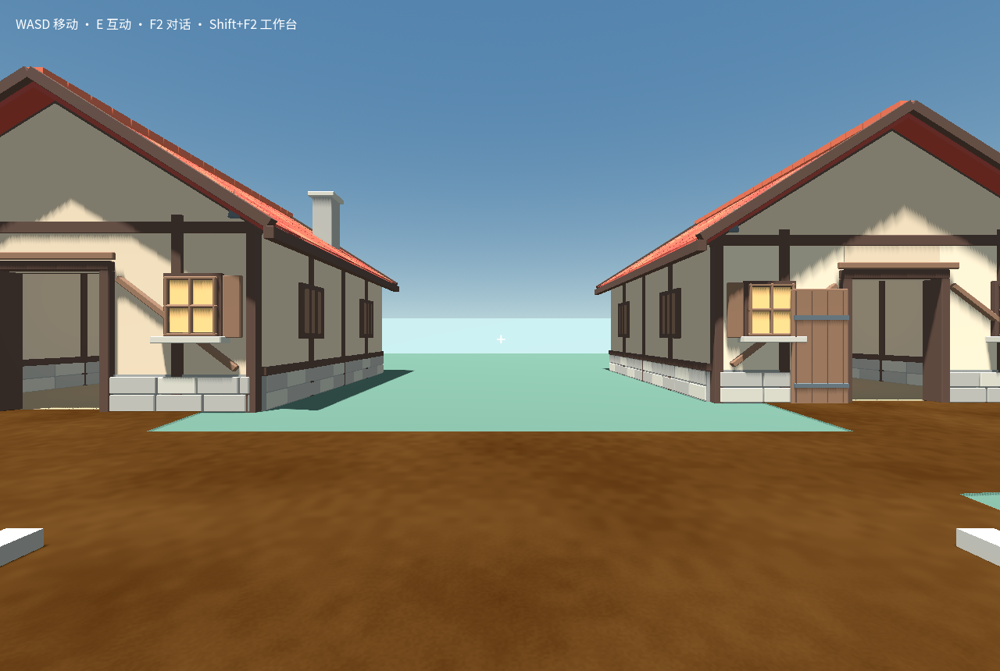
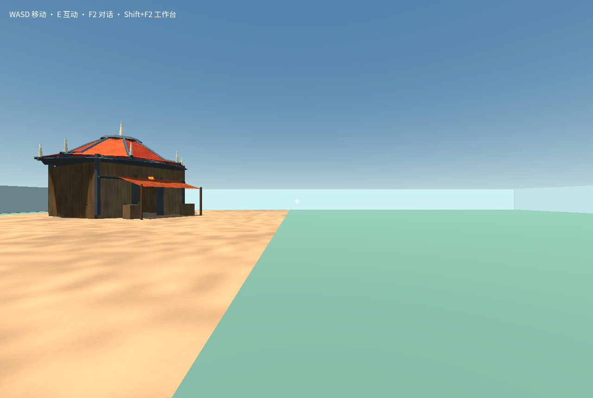
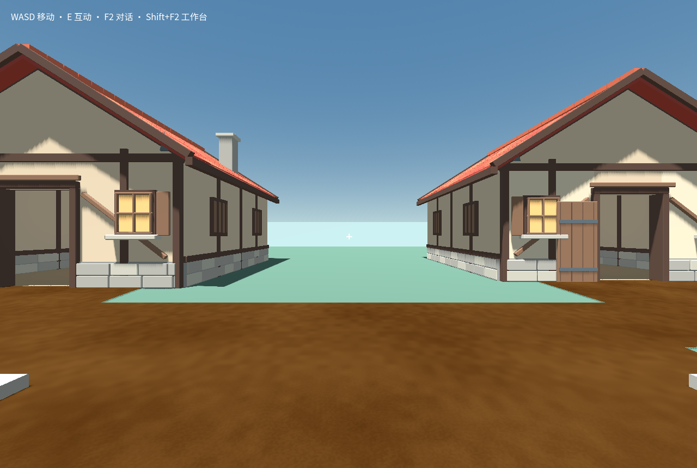

# Matched courtyard reuse: actual CLI and native gameplay results

Date: 2026-09-13. This pilot completed three independent playable courtyard
worlds using the real project Codex CLI, `gpt-6-astra`, `xhigh`, and ordinary
source/library/template tools. All three passed native application, ordinary
controller movement through the gate and both houses, saving, and a new runtime
reopening the saved world. One redundant reference-world check failed; its
original successful application and separate gameplay proof remain valid.

This measures a modest courtyard, not recreation of the four full promotional
worlds. The common objective was two enterable red pitched-roof timber/stone
houses, an open twin-tower gate with short walls, and a flat sandy street within
the original 64×64 m field. Player, spawn, normal controls, and existing base
content were preserved. Layouts and architectural styles differ. This is a
functional comparison, not a pixel-matched or blinded quality study.

## Measured costs

| Condition | Actual Agent/tool active time | Total tokens | Cached input | Uncached input | Output | Native application | Gameplay/save/cold reopen |
| --- | ---: | ---: | ---: | ---: | ---: | ---: | ---: |
| Fresh authoring, including real road repair | 971.854 s / 16m12s | 4,445,963 | 4,254,592 | 165,467 | 25,904 | 31.125 s over two applications | 67.879 s including a blocked shortcut and routed return |
| Final fixed component library | 184.351 s / 3m04s | 762,268 | 707,968 | 50,816 | 3,484 | 39.253 s including installation and check | 73.776 s, all 14 waypoints and cold reopen |
| Matched reference template, optional fresh-Agent review | 186.578 s / 3m07s | 1,589,220 | 1,512,832 | 73,133 | 3,255 | 2.193 s native source creation plus 20.547 s check-to-first-frame | 52.535 s, all 12 waypoints and cold reopen |
| Earlier development library, including world-local repair | 511.741 s / 8m32s | 4,966,820 | 4,732,928 | 222,465 | 11,427 | 56.575 s over two applications | 71.119 s, all 13 waypoints and cold reopen |

The final component sample used about 81% less active Agent/tool time and 83%
fewer total tokens than the completed fresh sample. These are observations from
one run each, with partly concurrent execution, not a guaranteed speedup. The
earlier library sample used more tokens than fresh creation because inspection
and repair added large cached contexts. Reuse does not guarantee lower tokens.

The reference already contained the matched completed source and saved progress.
Native cloning and first load required **zero model calls**. Its 186.578 s /
1,589,220-token Agent review was extra inspection, including a redundant failed
check; it was not the cost of creating the template copy. Preparing and exporting
the native reference archive took 3.229 s, separately from the original fresh
authoring cost. The two reported native creation stages exclude helper startup
and the observed orchestration gap between source creation and initialization.
The initial check itself took 17.432 s. No complete interactive UI latency is
inferred from these separated native operations.

CLI version was `0.154.0-alpha.6.2`. Each main condition started with a fresh
thread, independent world, profile, and catalog snapshot. No token, model-call,
or whole-turn time limit was added. Counts use actual per-turn differences of
CLI cumulative usage; reasoning tokens are already included in output. Parent
development-agent work, product/catalog preparation, experimental orchestration
gaps, and native operator time are excluded from Agent totals and identified
separately. No prices are inferred. All author requests and original events are
retained in the dataset; final text alone was not accepted as completion.

## What actually ran

Fresh authoring used the controlled bundled Blender pipeline. Its first native
view showed a visibly bad pale/noisy road despite a passing check. A real second
Agent turn repaired the road mesh/material. Both original and repaired source,
model costs and native application receipts are retained. The gate and both
doors passed actual traversal. A final diagonal shortcut collided with a road
curb; the operator returned through the real street junction without teleporting
or changing source. That first failed route remains recorded.

The earlier library run discovered and proposed existing street and gate
components. The actual initial image exposed coplanar sand/base-floor flicker.
A real Agent repaired only that world's base-floor visual, leaving its collision
and approved library source intact. The full three-turn cost is retained as a
development diagnostic. It is not silently replaced by the fixed catalog.

The final library run used the frozen final catalog built from integrated city
fix `bc841be2` / upstream `a2ab3312`. The Agent placed street `(-16, 0, -9)` and
gate `(-4, 0, 22)`, outside the standing player's footprint as required by the
20 mm raised sand metadata. It proposed normal source-library installation;
the native operator confirmed the proposal, checked, previewed, applied and
saved. The Agent did not rewrite source or run Blender. The ordinary player
walked through the gate, along the street, into and out of both houses, and back
near the original spawn. No operator authored replacement source.

All gameplay operators used the normal page/controller path in private hidden,
non-focusable offscreen runtimes. An ordinary W event first produced motion;
subsequent waypoint steering used the actual CharacterBody3D controller,
acceleration and collision. There were no OS input events, teleports, focus
requests or Pointer Lock requests. This proves the tested playable routes and
saved state, not human control feel or exhaustive collision coverage.

| World | Source and applied OID before/after walk and cold reopen |
| --- | --- |
| Fresh | `36bf1c249ddee4ebdffdddd0302c5e7dbda7d29e` |
| Development library | `d1d2ca051c053bf23390358292286c49a5ae426d` |
| Final library | `445acb28b4219e1db958cd28bed3b34e9756fdf5` |
| Reference | `e8d0c991d6125b67209210f057e32c3da7f57a55` |

## Preserved reference-check failure

The template's original check `gjob-7958e4f0…` passed and candidate
`gcan-656838a1…` was applied. The review Agent made no source changes, then
requested another check of the same revision 2 / manifest
`5509a612e28882939e7ec0d5925289799c529a89ba3cefad1c098679a18f2edc`.
That job `gjob-17dec161…` failed `GODOT_ARTIFACT_CONFLICT`; its runtime check was
not run. The failed candidate was not adopted. No failed status was rewritten.

Read-only byte comparison found eight of nine export files identical. Only the
6,588,400-byte `index.pck` differed:

- Original: `9bbd8efa4c399fd296be65065fd3fc2cf480e51b23142542b85fcd05dc53d7a0`.
- Repeat: `c21e14157c4efa8b4f39de24d590175db2c78783f9a331b2a73509c7ba5a3124`.

Of 41 PCK entries, 38 were identical, including scripts and UID entries. The two
uncompressed exported `creation.scn` and `canyon_courtyard.scn` differed
exclusively in serialized `node_ids` arrays (8 and 2 integers). The compressed
imported `canyon-court.glb…scn` also differed, 818,283 versus 818,284 bytes; its
compressed contents were not decoded in this bounded diagnosis. Evidence points
to generated scene-node IDs/import export nondeterminism, rather than a changed
authored source or `.gd.uid` content. It does not establish that every compressed
resource difference is semantically equivalent.

Original and repeat artifacts remain in separate native executor task folders
`ex-375b7cf415c14d7e94bb0512` and `ex-40464514ef1f4c739653bc5c` under the reference
profile. The original stored build was not overwritten. A product fix needs
separate deterministic-export or checked-artifact reuse design; disabling the
immutable artifact conflict guard is not justified by this benchmark.

## Reusable sample and evidence

The optional sample is a real player-world-library portable ZIP, created by
native `save/exportArchive` and accepted by native `importArchive` plus the
normal world factory. It is separate from the sealed 28-entry builtin catalog.
It uses explicit saved progress and does not silently reset the player.

- Archive: `test-results/courtyard-benchmark-20260913/reference-ready/matched-reference.zip`.
- Size: 4,672,617 bytes.
- SHA-256: `370db90d64fecd0c7c098c36febd2331acd0a32300e2650c012f4b0e79795e4b`.
- Asset: `player.world.courtyard-384b60233c06f788`, version 1.
- Content hash: `652e46148eff4b11f0e2c56bb32e55f580e9b8dca1a4b11d5518870eaee566a2`.

The archive is in the isolated benchmark worktree for release assembly; it is
not stored in Git. Generated model rights remain unverified; publication does
not confer a verified license. The first reference harness attempt used an
incorrect factory argument and stopped before model dispatch; its separate
`reference` directory is retained, while `reference-ready` is the completed run.

[Machine-readable results](evidence/courtyard-reuse-2026-09-13/results.json)
contain exact requests, usage, timestamps, catalog/archive hashes, source pins,
native report paths and hashes, every waypoint's observed final position,
capture bindings, and the artifact comparison. Original profiles/logs remain at
`D:/Craftmine Worktrees/reuse-benchmark-20260913/test-results/courtyard-benchmark-20260913`.
These files are local evidence, not a promise that absolute paths work on another
machine. The benchmark spec documents the reusable runner and cancellation.

Actual final frames, copied without image editing:

