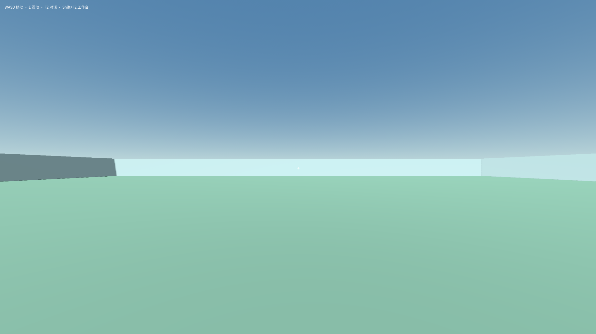
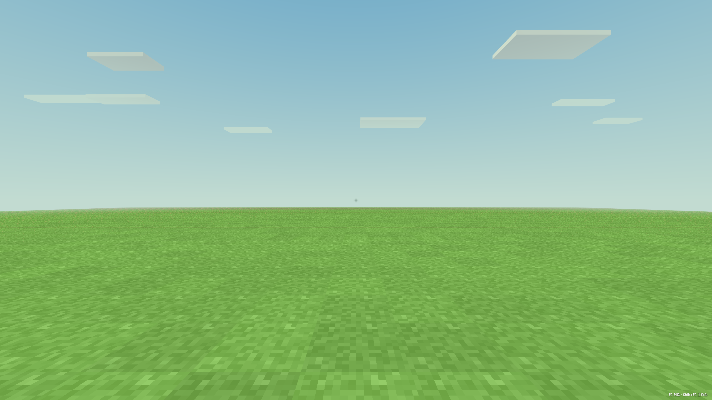
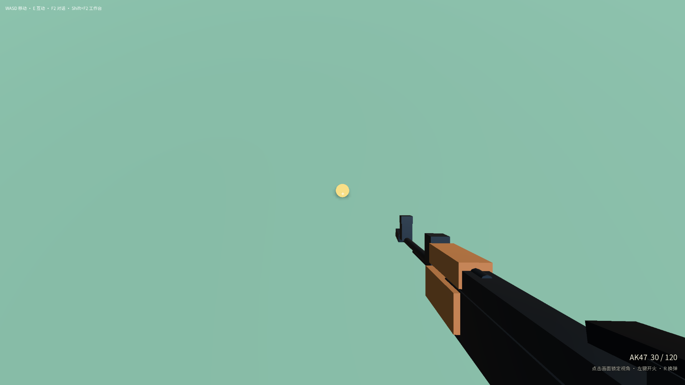

# 双世界 preview.20 开发与验收复盘

日期：2026-09-13。产品提交：`03bc893a0243a4845ef1865164dab26dcffcaeed`，版本：`0.14.4-preview.20`。

本轮完成了双世界方案中 TW-01～TW-06 的首个可验收版本，并验证原拾取故障的修复成果。默认流程已收敛为两个主世界、世界内对话、暂停与保存退出。本报告不把这批交付称为整个长期方案全部完成，也不把工程验收改写成真人已经确认。

## 1. 现在可以怎样测试

| 用途 | 入口 |
| --- | --- |
| 直接继续已经修复的原世界副本 | [Continue-Repaired-World.cmd](../desktop/build/player-test-03bc893a/Continue-Repaired-World.cmd) |
| 模拟全新玩家 | [New-User-Test.cmd](../desktop/build/player-test-03bc893a/New-User-Test.cmd)；每次创建新的独立资料目录 |
| 继续上一次新玩家测试 | 新用户脚本运行后，同目录的 `Continue-Last-User.cmd` |
| 普通 Windows ZIP | [Craftmine-World-portable-03bc893a0243.zip](../desktop/build/releases/03bc893a0243-646b1ec8-cf9a-4891-8402-63a7247f1d18/portable-3f274a64-aae8-4a36-b630-ec14ce905b46/Craftmine-World-portable-03bc893a0243.zip) |
| 已修复内容的正式备份 | [Repaired-AK47-World.cmarchive](../desktop/build/player-test-03bc893a/Repaired-AK47-World.cmarchive) |

**原用户资料没有被直接改写。** 新 EXE 使用默认资料目录时，仍会打开用户原来的内容。已经通过拾取验收的内容在独立副本里，因此要立即测试这个成果，请使用上面的修复世界入口。该入口使用最新 EXE 和已验证副本，不要求重新调用模型。首次体验入口也已从旧 `125f1814` 更新为 `03bc893a`。

备份是完整隔离域备份，不是单一世界文件。它包含源码、进度和依赖，官方导出回执明确排除凭据；已经通过官方验证，并恢复到全新空目录，正式构建一致。文件为 62,656,546 字节，SHA-256 为 `a6586ac21f70b0d6cca47998cbcbdfbf69a5f5e28d64483db0b533f921ea2152`。

## 2. 这次真正改了什么

| 玩家问题 | 实现与闭环 |
| --- | --- |
| 世界、模式、底座和起点选择太多 | 默认只有 Godot 3D、Web 两个固定主世界。分别保留内容、进度与对话；旧作品留在设置的高级存档管理，未转换或删除。 |
| 新建或进入中途失败，反复操作又建出副本 | 保存固定创建操作身份；Web 增加持久创建回执。丢失回复后找回同一世界，重试原初始化。缺失存档不会被悄悄替换为空世界。 |
| 准备中切换、取消或重启后卡住 | 取消与进入共用操作锁，复查当前选择；显式进入会恢复已选中的未完成世界。取消完成后第一次重试点击即可生效。 |
| 打开入口就可能触发旧世界工作 | 两槽位读取与旧存档列表的状态查询保持被动，进入或当前世界的恢复流程才启动相应初始化。 |
| 切换后带错对话，或覆盖正在输入的文字 | 进入目标世界后核对其持久会话绑定，保留原文字和附件；过期响应不能覆盖更新的输入或选择。 |
| Web 已点进入，却仍需要内部第二次进入 | 可信沉浸状态直接启用游戏输入；补齐外层页面到游戏 iframe 的受限按键路由。对话、暂停、保存冻结、切离和失焦清理按键，恢复后可继续。 |
| 保存退出被早期请求回执当作完成 | 暂停菜单跟随实际确认、保存、失败和取消事件；保存期间禁止重复操作，失败保留现场。 |
| 退出中断被记录为完成 | 区分实际中断、错误和完成，保留部分回复与草稿；旧回合和子回合不能结束新回合。 |
| 重开后继续直接失败 | 新玩家消息可恢复同世界、同会话的草稿，保留预算所有者和历史。补齐有界上下文之外的持久请求类型查询，消除 `REPLAY_MISMATCH`。 |
| 应用关闭久了，旧任务已经过期 | 明确续作时，在原事务内续开有限请求窗口；保留其他限额、计数、Token、结算和草稿。重复恢复不会反复延期，无限窗口保持无限。模型无法自行传入这个可信意图。 |
| 自动完成文字与真实结果不一致 | 结果与本次请求、目标世界和实际构建对应。原配置的普通模型流程经过检查、自动采用并回到可玩世界，无人工权限接受或手动采用。 |
| 原 AK47 按 E 捡不起来 | 原样保留的模型修复解决初始化时取不到父级世界的问题；实际引擎 E 动作取得枪和弹药，正式包保存与重开保留，重复 E 不回补。 |

## 3. 最终验收证据

| 层次 | 结果与边界 |
| --- | --- |
| 实际 React/store | 双入口 21 项通过，含草稿/附件、错世界、取消失败、取消成功后立即首次重试。 |
| Web 实际游戏与可信路由 | 20 项通过，验证 W 位移、E 原处理器、表单/修饰键隔离、失焦恢复、按键释放及错误身份拒绝。没有产品测试旁路。 |
| Rust / 真实 Core | 恢复、持久预算和工作区 34 项测试通过；真实旧档案副本使用发布版 Core 的恢复检查通过。草稿、历史、计数保留。 |
| 最终包新玩家 normal 流程 | 10 项通过：两入口、真实取消→立即重试→同 Godot 世界进入、完整视口、F2/Shift+F2、两槽位保存、Godot 重启完整快照一致。两次正常退出。 |
| 最终包视觉观察 | Godot 正常渲染的事后绑定画面、独立 offscreen Web 画面已亲自检查。Web 视觉观察 2 项通过。等待连续自然尺寸稳定，没有为截图改产品尺寸或强制重绘。 |
| 原配置普通模型 | 使用玩家的 `deepseek-v4.1-flash-expires-on-0910`、max、Auto，4 次实际模型调用；0 次手动权限接受，0 次手动采用。此生成阶段在 `eebaa1bd`，其成果在最终 `03bc893a` 复验，没有因界面重试修订再跑模型。 |
| 最终包原世界成果 | 两次启动/退出通过。真实 E 拾取、重复 E 不回补、对话暂停时交互被拒绝、完整快照保存重开一致。没有调用手动 resume 来使结果可玩。 |
| 原样生成源码引擎 | 14 项及新进程恢复通过。真实输入触发开火、耗弹、冷却和换弹；暂停不射击；非初始弹药 `29/116` 恢复。此层没有修改生成源码，不冒充成品物理鼠标射击验收。 |
| 最终包退出中断协议 | 3 项通过：回复中退出保留 aborted/未完成草稿，部分回复重开仍在，新消息继续后正常完成。使用明确标注的本地响应 fixture，不冒充真实模型能力。两次正常退出。 |
| 正式备份 | 官方完整导出、验证及新目录恢复通过，正式构建一致。 |

最终 `03bc893a` 的上述 7 次应用启动均正常退出，输入隔离、页面错误及退出审计未发现异常。没有运行用户禁止的历史鼠标键盘测试，没有抢占用户浏览器、焦点或 Pointer Lock；物理键鼠与玩家前台亲测仍未执行。

可追溯证据：[双世界报告](assets/two-world-preview20-acceptance/normal-worlds-report.json)、[视觉复核](assets/two-world-preview20-acceptance/visual-review.json)、[原世界验收索引](assets/two-world-preview20-acceptance/player-acceptance-index.json)、[退出协议摘要](assets/two-world-preview20-acceptance/quit-protocol-summary.json)。

## 4. 为什么这次没有只凭“测试通过”就交付

候选测试发现了真实的恢复请求类型冲突、关闭时间导致的截止窗口过期、Web 内部输入门与跨 iframe 按键缺口、取消完成后首次重试被旧界面锁吞掉的问题，均修复后复验。

也纠正了验收本身的错误：仅“非零尺寸”可能截到缩放中间帧；`saved` 标签不等于暂停；等待新请求绑定时不能把旧回合状态当成本轮结局。实际 E 和持续物理帧证明保存标签下世界仍可玩。所有早期失败和误判现场保留，没有改写成成功或归咎于模型。

一次文档构建进程异常退出已记录，单独重试与后续完整构建均成功。它不被计作一次成功构建，也没有跳过所需打包检查。

## 5. 包的身份

ZIP：1,035,954,743 字节；SHA-256：`7cfa508d0d8daca6ad052ebb1238dc59591eb58b4eebf2d42af00f2aa4c5252b`。

载荷：1,658 个文件，1,035,540,261 字节；摘要：`669df038ba9a6f0ba17abce3bf49206b2fb8f57e12b26a2c737dee5fe8812fb8`。全部验收后再次逐文件核对及核对 ZIP，结果一致，见[最终字节复核](assets/two-world-preview20-acceptance/final-package-byte-recheck.json)。

安装器也已生成并验证解包载荷，但本轮没有执行安装器或进行干净 Windows 安装验收。建议本次使用已经实际运行验收的 ZIP。

## 6. 下一步优化

1. 将“世界是否可玩”与“最近一次保存结果”拆成独立状态，避免再让界面或测试从 `saved/ready` 一个标签推断所有事实。
2. 把本次验证有效的世界引用延迟解析、拾取/装备与持久状态合同沉淀成通用造物组件，减少生成脚本重复犯初始化错误。
3. 扩展正常对话的连续样本：从空白创造→修改已有对象→保留其他内容→保存→重开。覆盖具体玩法，不把所有开放式愿望概括为已经通过。
4. 优化首次准备速度，先验证起步内容缓存与每世界身份隔离，再决定随包提供预编译内容。
5. 继续收回重复入口与后台查询，完善历史项目路径迁移和缓存引用清理。社区、更多世界类型、原生 Godot 窗口迁移和独立 Blender 工作不作为本轮入口的前置条件。

## 7. Git 与清理

产品源码、测试、规范和 ADR 已整合；成品固定在上述产品提交。后续报告和测试脚本提交不改变成品代码。工作树证据在删除前归档并核对摘要，磁盘清理与保留原因由[收尾记录](assets/two-world-preview20-acceptance/closeout.json)明确列出，未把残余目录称为全部删除。

entry、save 的工作树注册及已合并分支已删除；标准文件删除留下残余。save 残余目录的删除被自动审批以“blocked by policy”拒绝，没有进一步理由，未绕过。player 工作树保留，因为修复副本的一个历史项目仍引用其空目录，现有正常 API 无法保留项目身份修改该路径。D:/CMR 中的测试档案和所有有价值证据均保留；独立 Blender 工作树未动。

总控已额外归档 2,059 个证据文件并逐文件核对。最终 Git 推送及总控工作树清理结果见[本机最终收尾记录](../test-results/two-world-closeout-final.json)。
