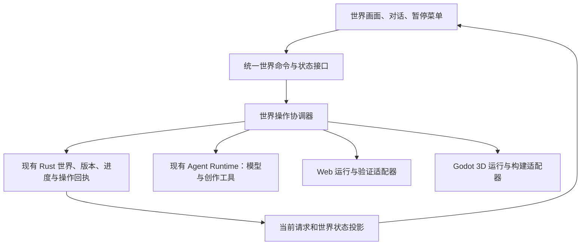

# Craftmine World：双世界收敛复盘与改进开发方案

日期：2026-09-13。审计源码：`7c01617a69ff4986476afffde4697a78fe398b29`。

本方案依据用户最新要求：只需要一个 Web 世界和一个 Godot 3D 世界，先不考虑其他世界；全面复盘项目和交互逻辑，再提出大的改进开发方案。

本文是下一阶段的设计与实施方案，不表示以下重构已经交付。已复核产品入口、两条运行链、创作与应用、保存与恢复、模型调用、测试与发布、历史资料；没有逐行审计整个上游桌面项目，也没有在本轮重新证明全部玩法可用。

## 1. 结论与产品边界

项目已经具备真实生成、运行、版本和存档能力，但普通玩家完成一次创作仍需跨越过多状态和入口。继续增加底座、工具和独立修补，难以持续改善“能做出来、能进去、能保存”的体验。

建议下一阶段围绕两个固定主入口交付：

| 主入口 | 实现基础 | 玩家定位 | 本阶段边界 |
| --- | --- | --- | --- |
| Web 世界 | 现有网页／体素运行器，桌面中的 `craftmine-web/5` | 轻量搭建、已有 Web 玩法、快速修改 | 延续现有引擎与作品，不再另造一个 Web 编辑器 |
| Godot 3D 世界 | 现有 `creation-sandbox` | 第一人称沉浸造物、普通三维场景与可编程玩法 | 唯一继续开发的 Godot 造物底座；相机、战斗、采集等作为这个世界里的能力 |

“两个世界”按两个主世界槽位设计，每个槽位有自己的内容、进度和对话。保存版本、撤销记录与旧作品归档不算新增世界类型。默认界面不再暴露通用多世界大厅、底座选择器和模板目录。确有必要的备份、导入与历史恢复放在设置的存档管理内。

这里的 Web 世界指已有自研 Web／体素运行器。Godot 3D 当前也通过 Godot Web 导出，在 Electron 的独立游戏视图里运行；它与自研 Web 世界是两个引擎实现。此次收敛无需同时迁移原生 Godot 窗口。原生迁移会引入新的输入、窗口合成、通信和恢复工作，应单独论证后再启动。

最终玩家主流程只有：**打开世界 → F2 对话 → 描述或修改 → 系统完成检查并更新世界 → 游玩 → 自动保存 → 重开继续。**

## 2. 本次复盘依据及尚未完成的工作

### 当前状态

- 玩家确认新一轮问题来自正常打开 `125f1814` 包，而非新用户测试脚本。
- `preview.18 / 125f1814` 曾通过两条指定样本的分层验收，之后玩家仍遇到真实问题。旧样本成功不能推翻新反馈。
- `preview.19 / 7c01617a` 已包含入口查询、创建重试、保存回执恢复、退出状态及任务结局修复，已生成并封存候选包；本轮最终原生验收未完成，不标为已验收交付。
- 最新真实世界 `world-2e4f85375427` 的拾取故障已在正式 PCK 副本复现；修复后的拾取、进度保存和重开仍未闭环。
- 最新请求退出中断、回合结局及旧结果混淆有真实记录；另一次短目录继续请求捕获到 `TURN_ENDED`，根因尚待定位，不能把它归为模型能力不足。
- 并行测试子 agent 因运行额度不可用而停止，未执行的驱动和现场均保留。复盘继续由主控完成；没有以此将未执行验收标为通过。
- 仓库还有独立 Blender 开发工作树。本报告不将其未合并内容视为当前主线能力，也不删除或擅自合并这些工作。

### 事实、推断与提议分开

| 观察 | 证据与判断 | 处理 |
| --- | --- | --- |
| 新建需选择模式、世界、底座、起点，再进入 | 实际 `CraftmineModeEntry`、`WorldCreatePanel` 存在这些层次 | 合并为两个主入口及统一对话创建 |
| Web 与 Godot 创建流程不对称 | Web 插件直接创建随机世界 ID；Godot 工厂按 operationId 幂等创建；面板协调器合并两份选项 | 用统一创建命令入口，保留不同底层实现；为 Web 补等价幂等语义 |
| 任务辅助读取阻塞可玩世界入口 | 实际 React 反例已复现，`ad077797` 已修 | 把“可进入事实”与辅助信息分离，纳入统一查询投影 |
| 创建失败表单再次提交可能走错路径 | 原世界已注册，却再次调用 create，或更名后触发冲突；`612b7d03` 已修 | 重试同一操作，不另建世界或让玩家寻找第二个重试入口 |
| 保存落盘但回执丢失可导致持续版本冲突 | 独立真实 Core 复现，`7d489bcb` 已修；尚不能认定解释了全部玩家保存故障 | 保存结果必须有持久操作身份和可查询回执 |
| 退出请求被界面当成已经完成保存 | 原 IPC 早期 ACK 与后台保存不同步；preview.19 已补生命周期事件 | 一处保存退出入口，展示真实进行／失败状态 |
| 玩家“按 E 捡不起来”可复现 | 距离拾取物约 0.73 米，真实 E 动作已分发，背包仍为空、物品仍在 | 必须验证玩法与状态变化，不能只依赖构建通过 |
| “已修好”的文字不等于修复落地 | 最新一轮仅完成读取；下一模型响应被退出中断，未提交补丁，turn 却记为 completed | 修结局归档、结果归属和中断续作，不篡改原模型文字 |
| “本轮结果”可能来自上一轮 | 原可见结果卡显示旧已采用构建；preview.19 增加请求归属 | 结果必须绑定请求／操作／构建，禁止按会话最后一个 job 推断本轮成功 |
| 测试路径长会引入额外环境失败 | 隔离 fixture 的执行路径为 248 UTF-16 单位，超过 broker 245 门槛 | 测试使用短根；产品提前解释路径问题，保留草稿；不让模型盲修环境错误 |
| 文档与实际产品漂移 | 根 README 仍写 9 月 10 日交付快照及早期 Web 操作，用户指南包含过时的手动采用说明 | 建立一个当前交付入口，旧文档明确归档 |

补充规模观察：本基线主进程 `index.ts` 约 10,670 行，`App.tsx` 约 2,129 行，`app-store.ts` 约 4,863 行；main 目录有约 100 个以 creation/godot/craftmine 命名的文件，插件清单声明 40 个工具。这些数字说明需要审查职责与依赖，不是删到某个行数就能解决问题，也不代表所有工具每轮同时暴露。

## 3. 先收敛什么，保留什么

| 范围 | 下一阶段决定 | 原因 |
| --- | --- | --- |
| 两个主世界 | 保留，明确默认 Godot 3D，Web 同级可见 | 对齐用户要求，避免引擎选择藏在底座列表里 |
| Godot 第一人称／俯视／横版／采矿的新建入口 | 下架新建入口并停止专项扩展 | 核心体验不需要五套新建与存档验收矩阵 |
| 上述旧世界及底座文件 | 先保留兼容读取与必要运行依赖 | 隐藏入口不等于删存档，旧场景不能直接改 baseId 假装完成迁移 |
| 空白／训练场／矿营／遗迹／小镇模板选择器 | 移出玩家主流程 | 以后可变成一句话创作示例或经验证的场景方案，不再变成独立产品入口 |
| 工作台与沉浸模式的首次二选一 | 合并为世界内一套界面 | “我要开始创造”无需先理解开发工具模式 |
| F2 与 Esc | 两引擎统一；始终有可见对话按钮 | 保留已有使用习惯，避免依赖单个快捷键才能恢复 |
| Shift+F2 高级面板 | 初期保留兼容入口，默认隐藏开发信息 | 不再作为玩家必须经过的步骤；后续按实际用途精简 |
| 源码、候选、检查、快照、应用事务 | 后台保留 | 这些是防止作品损坏的必要机制，应隐藏复杂性而非删除保护 |
| 模型账号、供应商、思考强度 | 设置内保留 | 不擅自换模型；初次只呈现最必要配置 |
| 普通桌面 IDE 面板、复杂项目／子任务管理 | 移出默认玩家界面 | 先做展示隔离，不立即删除上游共享实现 |
| 社区、联网、更多世界、原生窗口迁移、独立游戏导出扩展 | 本轮不排入交付主线 | 集中投入可创造、可进入、可保存；已有导出与历史源码保留 |
| Blender／高精度资产扩展 | 不作为双世界主流程的前置依赖 | 资产生产可后续接入，同期独立成果仍可保存 |

## 4. 玩家交互重新设计

### 4.1 第一次打开

1. 显示两个入口：**Godot 3D 世界**、**Web 世界**。各一行用途说明和一个“进入”按钮，默认突出 Godot。
2. 未初始化时自动准备该槽位的基础世界。世界名称先给可修改默认值，取消底座／起点／工程目录这些必填选择。
3. 显示真实的“准备世界、加载场景、即将进入”阶段。没有真实百分比的阶段用进行动画，不能卡在假 90% 或提前显示 100%。
4. 基础世界可本地进入、移动、暂停。没有配置模型时，在首次打开对话发送创作请求时引导配置；不让账号配置阻塞本地游玩。
5. 进入后只显示简短移动与 F2 提示，几秒后收起，但保留可见对话按钮。全屏按已有偏好处理。

建议研究随包提供已验证起步场景，减少首次“复制→导入→编译→检查”的等待。前提是验证 worldId、资源路径和初始存档如何独立绑定；不能直接复用内嵌旧身份的 PCK。若未完成这一验证，继续使用已验证初始化路径，但把阶段与恢复做好。

### 4.2 日常打开

默认进入上次所在的主世界及最后确认进度；另一个主世界在 Esc 菜单中可切换。

有未完成创作时，先进入最后可玩的版本，对话区说明“上次创作尚未结束”。可证明属于原授权、没有后续请求且可安全续作的任务由系统恢复；无法证明时保留现场并提供“继续”，不重新执行含糊的历史请求，也不阻塞世界进入。

### 4.3 对话创造与修改

- F2 或对话按钮打开一个对话框；关闭对话只收起界面，不停止创作。
- 玩家说“做一个能进出的小屋”“修好地上的枪，按 E 拿起来”，系统沿当前世界的同一创作记录执行。
- 普通实现细节由系统决定；确实需要玩家审美、玩法或目标选择时才提问。不让玩家选择脚本、底座、构建或采用工具。
- 短状态条显示“正在制作→正在检查→正在修复／正在放入→已放入”。每次状态都属于当前请求。
- 世界在后台制作时继续可玩；在实际切换版本与保存的短窗口暂停输入。不能在整个模型思考期间冻结玩家。
- 全自动模式内的正常项目修改无需手动 Check、预览、Apply。显式 Ask 仍按玩家已选策略；对已有完整世界重建等需要处理存档影响的行为，应先保留可恢复版本。
- 不强行打断正在输入的下一句话；更新完成后保留草稿与附件，玩家主动关闭对话后继续游戏。

### 4.4 “重新创造一个世界”

仍在两个固定主入口内处理。玩家选择该槽位“从空白开始”，或通过对话明确提出重新开始；系统先归档当前作品及存档，再为该槽位准备新内容。旧作品可从存档管理找回。不要仅靠模糊语句“做个新世界”就清空当前记录。

本阶段不新增一套任意底座、任意世界列表的常规流程。若需要多个作品，先用命名存档／归档版本承载，再根据实际使用决定是否恢复作品库式入口。

### 4.5 保存、切换与退出

日常自动保存显示“已保存／保存中／保存暂未完成”，用同一保存服务处理。Esc 菜单只保留：继续、切换世界、设置、保存并退出。版本历史与恢复放在设置内。

“保存并退出”先等待必要的当前保存，再退出；保存过程中有明确反馈，重复点击合并为一次操作。失败后保留当前世界与可重试按钮，不无限转圈、不直接结束进程。

必须区分三个容易混淆的东西：

| 玩家关心的内容 | 系统含义 | 退出时行为 |
| --- | --- | --- |
| 我已创造的作品 | 已应用内容版本 | 保留可重建源码、依赖及正式版本指向 |
| 我玩到的位置与背包 | 当前版本上的运行进度 | 保存最新持久快照与回执 |
| AI 还没做完的修改 | 未完成的创作草稿与任务 | 保存草稿与中断状态，不伪装为完成、不顶替正式世界 |

### 4.6 失败后的出口

| 情况 | 玩家看到 | 默认恢复路径 |
| --- | --- | --- |
| 新世界准备失败 | 准备未完成，原描述仍在 | 原位置“重试”，复用同一创建操作 |
| 模型或网络错误 | 制作暂时中断，已完成部分保留 | 按实际可重试原因继续原请求 |
| 编译或玩法检查失败 | 正在修复；原世界仍可玩 | 将真实检查原因交回同一创作流程 |
| 权限、磁盘、路径、执行器故障 | 显示可理解的具体原因 | 先恢复环境；不能让模型反复修改无关源码 |
| 新版本不兼容当前进度 | 更新尚未完成，继续原世界 | 回到旧实例，保留草稿与原快照，再做明确迁移 |
| 保存回执不确定 | 正在确认保存结果 | 查询同一操作回执，禁止凭超时判断未保存并重复写入 |
| 已保存文件损坏或缺失 | 需要恢复该存档 | 首先尝试已验证上一快照／重新构建，不静默开空世界 |

## 5. 后台精简：统一入口，保留两种执行适配器

建议采用以下结构。名称为拟议职责，不表示已有同名模块全部存在。

### 职责收口

1. **WorldEntryService**：选择两槽位、初始化、进入、切换。对玩家返回统一事实，不让 UI 自己拼多个状态再决定能否进入。
2. **CreationCoordinator**：请求、工具修改、构建、检查、修复、准备应用。模型回合结束只是其中一个事件，不等于创作完成。
3. **SaveCoordinator**：定时保存、退出保存、切换前保存、应用前保存都进入同一机制。使用每世界写入序列及不可变回执，不引入全应用长期互斥锁。
4. **RuntimeAdapter**：Web 与 Godot 各实现 load、observe、pause、captureProgress、restoreProgress、dispose；不强行统一各自源码格式与物理实现。
5. **PlayerStateProjection**：根据持久操作及当前运行实例生成玩家状态、原因和可执行操作。事件通知变化，轮询仅用于断连恢复。
6. **DesktopBootstrap**：主进程 index 保留装配、依赖注入和平台启动，逐步迁出领域分支。仅按行数拆文件没有价值，必须同步收回重复权限和状态判断。

沿用现有 Rust Core、桌面会话数据库和内容仓库，不另建一套平行的“世界数据库”。UI 的 localStorage 只保留面板宽度等偏好；它不应成为正式构建、保存成功或活动任务的权威来源。

### 不用一个大枚举描述所有状态

世界可以“可玩”，同时 AI 正在制作新版本；如果把两者压成单个 busy，就会再次锁死入口。建议用三个小状态维度，由一个协调入口控制合法组合：

| 维度 | 基本状态 | 谁决定 |
| --- | --- | --- |
| 当前世界 | 未准备、加载中、可玩、待恢复 | 运行适配器＋持久世界事实 |
| 当前创作 | 无任务、制作、检查、修复、等待安全更新、已更新、中断／失败 | 创作操作记录 |
| 当前保存 | 已保存、有新进度、保存中、结果待确认、失败 | 保存操作及持久回执 |

UI 根据这三者显示一句当前最重要的状态，但不自行伪造阶段。只有真正有冲突的动作互斥，例如相同世界保存与正式版本切换；看列表、打字、读取帮助不应被它们全部阻塞。

## 6. 内容更新和存档保护规则

一次自动更新必须完成：

1. 持久记录 `requestId / operationId / worldId / 原正式构建 / 草稿版本`，同一请求可含多个模型 turn 和检查 job。
2. 保存源码与依赖，生成候选；旧正式世界继续可用。
3. 检查源码、启动、关键玩法及进度合同；失败进入对应修复，不能提交空壳成功。
4. 准备切换时捕获旧世界最新进度，核对该运行实例与正式版本仍匹配。
5. 隔离加载候选、验证进度迁移；完成前不改正式世界指向。
6. 经现有事务机制提交正式版本＋进度关系，再切换实际显示；记录阶段回执，支持崩溃后确认完成或回退。
7. 从新正式实例读取可用状态后，才对玩家显示“已放入世界”。

跨数据库与进程的操作不能因为包在一个函数里就被称作原子事务。应沿用应用日志／回执，把每个不可逆提交点、重试条件与回退位置明确下来，避免双写失联。

持续保存需要稳定 `saveId` 和按期望版本写入的语义。同一 saveId 重试只查询／返回原结果；回执丢失先确认准确快照，禁止放开版本冲突后覆盖别人或后续更新的数据。

恢复来源顺序应可解释：当前已确认快照 → 经校验的上一快照 → 明确的恢复界面。源码、进度和账号凭据分别归属；完整备份包含必要作品依赖，不将密钥混入可分享作品。

保留已有保护：独立世界／构建／运行实例身份、正式与候选隔离、存档校验、操作幂等、旧版本回退、显式权限、失败草稿。这些不是本轮删减目标。

## 7. 提升造物成功率，减少模型无效工作

### 7.1 两套精确能力清单，一套玩家愿望流程

根据当前引擎只暴露适用工具、真实场景、对象、存档接口和可用模块。Web 请求不混入 Godot 编译步骤；Godot 请求不套用旧体素坐标或验证器。

用户描述 → 读取当前世界 → 判断已有能力是否可复用 → 实际修改 → 独立验证 → 应用。重复读取、构建轮询和保存协调由宿主承接适当部分，不让模型用大量调用轮询已知状态。保留模型选择和思考强度，不为了测试通过换成另一个模型。

### 7.2 可靠组件作为起点，不限制开放创作

优先把移动、E 交互、拾取、库存、门、宝箱、武器与存档做成接口稳定、可组合的基础组件。每个组件至少约定：稳定实例 ID、依赖就绪、动作入口、状态捕获、状态校验、恢复和版本迁移。

最新拾取故障说明，子节点 `_ready` 与父节点初始化顺序不能成为临时生成代码反复猜测的问题。可采用显式依赖注入／就绪合同；模板、示例与实际检查一致。必要时允许模型编写新玩法，但新增可变状态必须接入保存合同。

资产搜索补齐中英文名称与同义词，区分视觉模型和可玩组件；“枪模型存在”不能替代“能拿起来、射击和保存弹药”。逐步提炼真实成功作品作为复用组件，同时保留原创路径，不按关键词伪装通用造物能力。

### 7.3 验证承诺，而不是只验证程序启动

验收结果至少分为四层：可启动、交互正确、进度可恢复、画面可用。构建通过只能证明其中一部分。

给 Godot 补可控的引擎动作测试接口与观察合同，覆盖 interact、移动、装备、开火、换弹等具体动作。接口只在隔离验收或受授权测试场景生效，绑定世界／构建／实例；不发送 Windows 鼠标键盘，不通过改源脚本或直接设置背包来伪造玩法成功。

模型提出的断言不能同时成为唯一裁判。优先由宿主的稳定检查验证前后状态，再由独立画面检查发现裁切、不可见或明显不符合请求的问题。任何验证盲区如实显示，不宣称所有开放式愿望都已自动证明。

不为普通玩家验收添加额外 token、模型调用次数或整轮时长上限。记录完整成本和耗时，取消由玩家意图与具体运行故障决定；现有生产边界另做显式审计，不能靠隐藏测试开关获得不同产品行为。

## 8. 分阶段开发与每阶段出口

| 阶段 | 主要工作 | 可审阅产物 | 完成条件 |
| --- | --- | --- | --- |
| A：冻结范围与保留现场 | 两个主世界定义；清点旧 baseId／存档；统一当前交付身份；保留未合并源码和失败现场 | 范围清单、数据分类、当前能力与缺陷表 | 能说明每个旧世界如何保留；不存在误把候选当最终包 |
| B：完成可靠性修订 | 验收 preview.19 的入口、创建重试、退出中断、保存回执恢复；处理 `TURN_ENDED` 和真实拾取故障 | 同一成品的失败前后证据、实际操作报告 | 原失败可复现，修后可交互、可保存、可重开；未完成草稿有出口 |
| C：玩家界面收敛 | 两卡入口；统一 world-first 界面和 F2；去底座／起点必填；简化 Esc；初次模型设置 | 可实际点击的双世界入口与新用户流程 | 两槽位都能从零开始与继续；无工作台技术步骤依赖；旧记录可找回 |
| D：流程与保存收口 | 抽离 Entry／Creation／Save 协调器；统一状态投影；按操作身份更新结果；减少重复轮询与锁 | 命令接口、状态转换、旧新并行校验日志 | 旧新实现对同一实际事实结论一致；失败注入与重启行为正确后切写入入口 |
| E：强化基础玩法 | 依赖就绪合同；拾取、门箱、装备和持久状态；隔离动作验证；资源发现改善 | 可复用组件、真实玩法测试矩阵 | 至少完成下述 Web 与 Godot 样本集，且保留旧玩法 |
| F：清理与发布 | 移除已无人调用的重复入口／旧写路径；更新文档；按引用清缓存；构建并重测最终包 | 唯一交付清单、复盘、迁移说明、回退包 | 从实际 ZIP 解压复验并复核字节；无悬空任务或遗失存档；清理未完成项明确列出 |

顺序为 A → B → C/D → E → F。C 与 D 可在接口确定后并行，但不能同时让两套协调器对同一世界写入。B 未通过时，不把 UI 简化当作保存可靠性的替代。

建议拆成小型可回退提交：先引入查询投影及适配层，再切入口，最后删除旧路径。每次集成只替换一个状态所有者。测试证据跟随源码与包身份，不以“某 agent 已完成”作为总体验完成依据。

这是跨前端、宿主、Core、运行器和发布的中到大规模收敛，不宜承诺一两天整体完成。先完成 A/B 并测出两引擎基线，再给剩余阶段日历估算；交付按上述出口推进。

## 9. 玩家验收矩阵与质量目标

两引擎都跑：首次无历史用户、已有存档用户、同世界多轮修改、Web↔Godot 切换、取消后继续、模型失败、执行器失败、保存失败、退出中断、冷重开。

| 引擎 | 创作样本 | 必须观察的结果 |
| --- | --- | --- |
| Web | 一棵树→修改外观→可采集→获得物品 | 同一对象正确修改、动作可触发、库存与采集状态重开不重置 |
| Web | 开关门与一次性宝箱 | 门碰撞与开关状态正确、奖励不重复、模型修改不重复发奖励 |
| Web | 多轮小场景搭建与撤销 | 新内容保留、被撤销的修改范围明确、旧进度未清空 |
| Godot 3D | 地面武器按 E 拾取→装备→开火／换弹 | 地面物与背包状态一致；弹药、装备与拾取状态可保存重开 |
| Godot 3D | 可进出小屋、门和宝箱 | 真正穿过门口、室内可活动、开门与奖励状态正确 |
| Godot 3D | 森林→增加建筑→再修改已有对象 | 可走进场景、碰撞正常、不落地穿透、原有玩法和存档保持 |

发布硬门槛：无已知静默数据丢失；不能把中断标为完成；同一操作重试不重复创建／领奖／应用；保存成功必须有持久证明；两个主世界均有实际解压包的持续游玩与冷恢复证据。

稳定性建议目标：两个主世界各完成 10 次进入／保存／重开循环，覆盖真实状态变化；这是固定回归样本量，不是模型调用上限。任何失败都计入结果并定位，修后复测不能删除失败记录。

体验指标先采基线，再制定数值目标：首次可移动时间、首次进入对话时间、从愿望到可玩结果的耗时、首次成功率、返工轮数、保存耗时与恢复率、每个有效愿望成本。不能先承诺未经测量的 30 秒完成或 100% 生成成功。

自动测试继续遵守用户约束：独立后台、独立数据、无真实鼠标键盘、无 Pointer Lock、无窗口抢焦点。正常渲染的软件输入验证、离屏场景检查、真实模型流程和下一次真人测试各自记录，不相互替代。协议失败可用明确标注的本地响应 fixture；模型能力验收仍走原配置与普通流程。

## 10. 旧数据与代码迁移

1. 只读清点所有世界：runtimeKind、baseId、正式构建、源版本、保存版本、待办任务、依赖和最后进入状态。明确两主槽位初始指向，不能按最后修改时间随意覆盖用户选择。
2. 已有 Web 世界可作为 Web 主槽位；已有 creation-sandbox 可作为 Godot 主槽位。多个旧作品先进入存档管理，保留原 ID 和会话绑定。
3. 其他 Godot 底座停止新建，先保持兼容访问或只读导出。若决定转换，复制作品再迁移并比较源码、资源和进度；失败仍保留原作。不得直接重命名 baseId。
4. 先加可回退的范围配置，再隐藏旧入口；验证旧数据仍可恢复后，才清理没有引用的底座／模板载荷。仅隐藏类型不会立即显著缩小包体。
5. 两运行器使用共同命令外壳，但进度正文保留各自 schema 与明确迁移版本。不强行把所有 Godot 游戏状态转换成旧 Web 五类实体。
6. 旧写接口先转发到新协调器，再逐个删除没有调用者的实现。保留读取兼容层的周期由实际旧档数量决定。

## 11. 工程组织、磁盘与交付

- 模型运行、Godot 构建、游戏进程、测试图像和发布解压件分类保存；为诊断使用短目录，报告记录原路径与归档映射。
- 构建／运行缓存由内容哈希与引用关系管理。最后可用正式构建、最近恢复点、未完成草稿、被发布引用的载荷不可当普通缓存清理。
- 清理遵循“生成清单→确认归档与引用→删除可重建产物”，不用手工扫描日期后全删。此前自动审批拒绝的残余目录仍按原状态保留，不能借本轮重构绕过删除拒绝。
- 发布只有一个交付清单：源码 commit、版本、ZIP 路径和摘要、载荷摘要、验收报告、已知问题。源码已合并、包已构建、包已验收、玩家已确认分别标记。
- 更新根 README、Windows 指南和产品愿景入口；旧多底座与多阶段方案加历史状态链接，不让它们继续指导默认开发。
- 单元／Core 合同测试证明边界；实际 React 验证交互；非离屏原生测试验证窗口及快捷键；实际 PCK／Web 玩法验证行为；最终解压包承接发布验收。测试按同一玩家需求组织，减少许多彼此无法对照的“全通过”报告。
- 并行开发按界面、协调器、存档／运行器、验收分工；同一主进程入口由一人集成。原生测试只占一个受控运行槽，避免竞态和用户输入影响。

## 12. 开发任务清单与下一批交付

| 编号 | 工作包 | 主要落点 | 依赖 |
| --- | --- | --- | --- |
| TW-01 | 双主世界策略、兼容旧档清单 | 世界选项、Core 世界读取、范围配置 | 无 |
| TW-02 | 当前可靠性补丁成品复验与最新拾取故障闭环 | preview.19、原世界副本、任务／进度记录 | 无，与 TW-01 并行 |
| TW-03 | 双入口及统一世界内对话 | ModeEntry、WorldCreatePanel、App、layout | TW-01 |
| TW-04 | 统一进入与状态查询 | 世界 controller、panel coordinator、状态投影 | TW-01/02 |
| TW-05 | 同一保存服务与回执恢复 | runtime adapter、view host、Core save/application | TW-02 |
| TW-06 | 创作操作跨 turn/job 的结果归属与恢复 | request status、auto queue、turn lifecycle | TW-02/04 |
| TW-07 | Godot 交互／保存基础组件和动作验收 | creation-sandbox、shared state、测试动作桥 | TW-05/06 |
| TW-08 | Web 对等的创建幂等、状态与保存流程 | main.cjs、view.mjs、Web adapter | TW-04/05 |
| TW-09 | 移除默认技术面板与旧新增底座入口 | UI、选项目录、文档 | TW-03/04；旧档核对通过 |
| TW-10 | 统一发布清单、缓存引用清理与最终测试 | build-client、seal、验收入口、README | 全部关键门槛 |

下一批建议只承诺 **TW-01～TW-06 的第一个可验收版本**：两个固定入口、统一进入与对话、真实保存状态、创建失败可重试、中断不假完成，并完成原拾取故障的成品复验。基础组件可做并行准备，社区、新世界种类和画面大规模扩展暂不进入交付条件。

这一版本通过后，再推进 Web 与 Godot 的完整玩法样本集和清理工作。这样每批都能直接回答玩家的三个问题：**我能进去吗？我说的东西真的能用吗？下次打开还在吗？**

## 13. 源码与证据索引

以下为本次审阅的关键来源；原始玩家档案只读，本文不包含凭据或数据库正文。

- [玩家原始 FB03](USER_FEEDBACK_BATCH_003_2026-09-12.md)、[preview.18 分层复盘](FB03_PREVIEW18_RETROSPECTIVE_2026-09-13.md)。
- [首次模式入口](../vendor/pi-desktop/apps/desktop/src/components/CraftmineModeEntry.tsx)、[新建表单](../vendor/pi-desktop/apps/desktop/src/components/craftmine/WorldCreatePanel.tsx)、[布局状态](../vendor/pi-desktop/apps/desktop/src/lib/craftmine-layout.ts)、[对话创建](../vendor/pi-desktop/apps/desktop/src/lib/use-dialogue-world.ts)。
- [世界列表控制器](../vendor/pi-desktop/apps/desktop/src/hooks/use-craftmine-worlds.ts)、[暂停菜单](../vendor/pi-desktop/apps/desktop/src/components/CraftminePauseMenu.tsx)、[结果呈现](../vendor/pi-desktop/apps/desktop/src/components/CraftmineCreationResult.tsx)。
- [Web 插件入口](../plugins/craftmine-world/main.cjs)、[Web 世界视图](../plugins/craftmine-world/view.mjs)、[Web 运行器](../app/world-runtime.mjs)、[旧 Web 服务](../app/server.mjs)。
- [Godot 选项与面板路由](../vendor/pi-desktop/apps/desktop/electron/main/godot-panel-coordinator.ts)、[初始化工厂](../vendor/pi-desktop/apps/desktop/electron/main/godot-world-creation.ts)、[底座目录](../desktop/godot/bases/base-catalog.json)。
- [运行视图宿主](../vendor/pi-desktop/apps/desktop/electron/main/godot-world-view-host.ts)、[保存适配器](../vendor/pi-desktop/apps/desktop/electron/main/godot-runtime-adapter.ts)、[Core 世界保存](../vendor/pi-desktop/crates/craftmine-core/src/worlds.rs)、[组件状态](../desktop/godot/shared/component_state.gd)。
- [自动采用](../vendor/pi-desktop/apps/desktop/electron/main/creation-auto-apply-service.ts)、[恢复队列](../vendor/pi-desktop/apps/desktop/electron/main/creation-auto-queue.ts)、[应用失败分类](../vendor/pi-desktop/apps/desktop/electron/main/creation-application-repair.ts)、[任务结局](../vendor/pi-desktop/apps/desktop/electron/main/turn-terminal-outcome.ts)。
- [构建验证器](../vendor/pi-desktop/apps/desktop/electron/main/godot-build-verifier.ts)、[受控交互](../desktop/godot/shared/headless_play_action.gd)、[模型上下文](../vendor/pi-desktop/packages/agent-runtime/src/craftmine-context.ts)、[工具清单](../plugins/craftmine-world/manifest.json)。
- [包构建](../desktop/build-world-plugin.mjs)、[封存 ZIP](../desktop/seal-portable.mjs)、[本次证据索引](assets/two-world-review-20260913/evidence-index.json)。
- 最新未完成修复现场、短目录请求的 `TURN_ENDED` 和 preview.19 候选身份见上述本地证据索引。它们仍是开放项。
