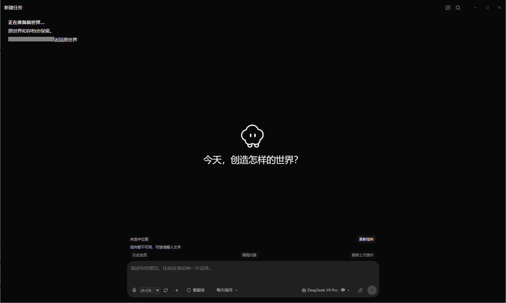
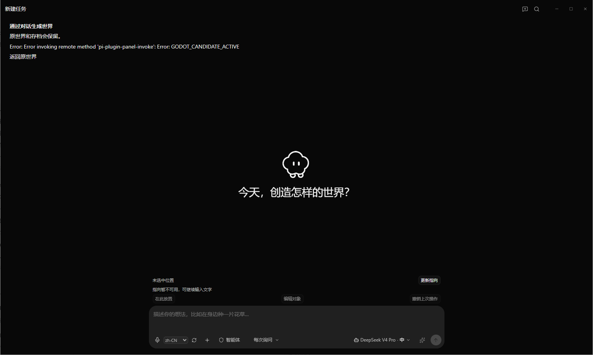
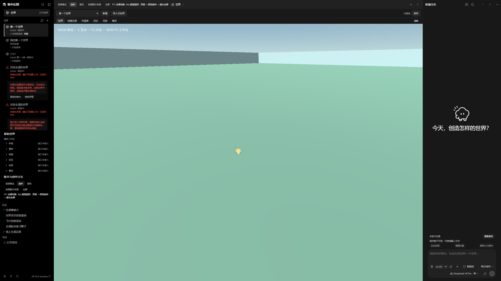
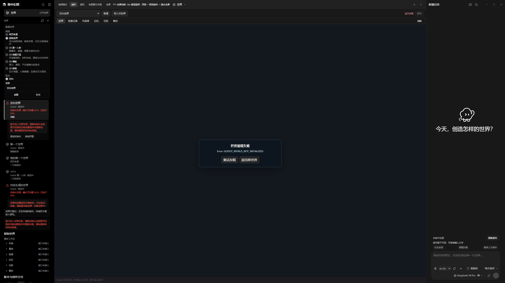
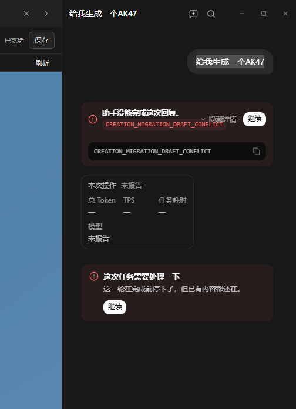

# 真人试玩反馈 FB03：游玩与测试受阻

- 批次：FB03；收件已结束。
- 收件范围：2026-09-12 23:04 至 23:11（Asia/Shanghai，为本次收件记录时间；实际问题发生时间未提供）。
- 汇总更新时间：2026-09-12 23:12:43 +08:00。
- 数量：7 条反馈、2 次补充、5 张原始截图。FB03-004 是 FB02-003 的持续问题证据，不额外计为全新缺陷。
- 测试版本：仅 FB03-005 截图明确显示 v0.14.4-preview.17；其他条目版本未提供，不自动回填。
- 整体状态：用户明确报告当前体验阻断，无法继续游玩和测试；问题原因及方案待讨论。
- 本批收件整理仅归档反馈，未进行开发或测试，未删除世界或操作游戏。

## 用户批次结论

> 以上是这一批所有内容 阻断了 完全没法玩 没法测试

用户已明确反馈整体体验受阻；不以历史工程验证替代本次真人结论。当前全屏已生效、Esc 有效是局部反馈，不代表整体可玩，也不代表其他退出路径已验收。

## 条目索引

| ID | 反馈 |
| --- | --- |
| FB03-001 | 对话创建新世界时对话窗无法输入 |
| FB03-002 | 点击返回原世界显示错误 |
| FB03-003 | 进入第一个世界后鼠标光标仍可见 |
| FB03-004 | F2 无法呼出对话窗，Shift+F2 同样无效，Esc 有效 |
| FB03-005 | 左侧对话生成失败的世界应支持删除 |
| FB03-006 | 建立新世界选择造物世界后创建失败 |
| FB03-007 | 世界对话输入生成AK47后直接失败 |

## FB03-001：对话创建新世界时对话窗无法输入

- 收到时间：2026-09-12 23:04 Asia/Shanghai（本次收件记录时间）
- 反馈发生时间：未提供
- 条目更新时间：09/12/2026 23:05:17
- 状态：待讨论
- 测试版本：未提供
- 复核版本：未提供
- 环境：截图为中文界面；其他环境参数未提供
- 模式 / 世界 / 存档：对话创建新世界

### 用户原话

> 点击对话创建新的世界的时候对话窗无法输入

### 事实与期待

- 用户报告点击对话创建新世界后无法在对话窗输入
- 截图显示“正在准备新世界…”及“原世界和存档会保留。”
- 截图输入区域上方显示“指向暂不可用，可继续输入文字”，与用户报告的无法输入体验不一致；静态截图不能独立验证输入行为

- 玩家期待：能够在对话窗输入文字以创建新世界（依据反馈整理）
- 用户方案：未提供
- 分类：对话创建世界 / 输入受阻
- 复现性：本次报告一次，重复复现情况未提供
- 影响：玩家无法通过对话输入继续创建世界
- 临时绕过：未提供
- 关联：FB02-004 涉及对话生成世界入口；本条为新批次独立输入故障，不判定重复
- 本批报告次数：1；补充不增加复现次数。
- 讨论结论：仅记录，未排查原因或开发
- 其他证据：未提供

### 截图与错误证据



- 原始附件来源：C:/Users/WINDOWS/AppData/Local/Temp/codex-clipboard-7a853847-9420-4057-93b4-b7760a8af3b3.png
- 截图时间：未提供
- SHA-256：5F7F0B608C14B47BD4D5062C8AA3CA40B65E875A1EA88B9E0F04EFCA008897D5
- 原图归档，未裁剪、压缩或涂改。

## FB03-002：点击返回原世界显示错误

- 收到时间：2026-09-12 23:06:18 +08:00（本次收件记录时间，Asia/Shanghai）
- 反馈发生时间：未提供
- 条目更新时间：2026-09-12 23:06:18 +08:00
- 状态：待讨论
- 测试版本：未提供
- 复核版本：未提供
- 环境：截图为中文界面；其他环境参数未提供
- 模式 / 世界 / 存档：通过对话生成世界

### 用户原话

> 点击返回原世界显示错误

### 事实与期待

- 用户报告点击“返回原世界”后显示错误
- 截图仍显示“通过对话生成世界”界面及“返回原世界”入口，顶部显示 GODOT_CANDIDATE_ACTIVE 错误

- 玩家期待：点击返回原世界能够正常返回（依据反馈整理）
- 用户方案：未提供
- 分类：返回原世界 / 导航失败 / 错误提示
- 复现性：本次报告一次，重复复现情况未提供
- 影响：返回原世界操作受阻
- 临时绕过：未提供
- 关联：FB03-001：同一对话创建新世界流程，前条为无法输入，本条为返回时报错
- 本批报告次数：1；补充不增加复现次数。
- 讨论结论：仅记录，未排查原因或开发；错误码不作为根因结论
- 其他证据：视频、存档、日志未提供

### 截图与错误证据

```text
Error: Error invoking remote method 'pi-plugin-panel-invoke': Error: GODOT_CANDIDATE_ACTIVE
```



- 原始附件来源：C:/Users/WINDOWS/AppData/Local/Temp/codex-clipboard-da7c7b4b-92b9-47b9-be18-d9fe6c7a99dd.png
- 截图时间：未提供
- SHA-256：DA11E517C3F41961B6858EFB99BD5EDF5F2D57878B210FA9DCFD585045485527
- 原图归档，未裁剪、压缩或涂改。

## FB03-003：进入第一个世界后鼠标光标仍可见

- 收到时间：2026-09-12 23:07:19 +08:00（本次收件记录时间，Asia/Shanghai）
- 反馈发生时间：未提供
- 条目更新时间：2026-09-12 23:07:40 +08:00
- 状态：待讨论
- 测试版本：未提供
- 复核版本：未提供
- 环境：用户明确补充当前已全屏；鼠标光标仍可见；平台、分辨率及输入设备详情未提供
- 模式 / 世界 / 存档：进入第一个世界；具体模式与存档未提供

### 用户原话

> 进入第一个世界之后 屏幕上还是有鼠标鼠标还是没有隐藏

补充收到时间：2026-09-12 23:07:40 +08:00（本次补充收件记录时间，Asia/Shanghai）

> 上一条的补充 现在是全屏了 但是鼠标没有隐藏

整理说明：补充 FB03-003 的全屏状态，不新增条目、不增加复现次数；不据此将历史全屏问题整体标记已验收

### 事实与期待

- 用户报告进入第一个世界后屏幕上的鼠标光标仍然可见，没有隐藏
- “还是”表达问题仍然存在；未据此推断具体历史版本或复现次数
- 用户补充确认：当前已全屏，但鼠标没有隐藏。

- 玩家期待：进入世界后隐藏鼠标光标（依据用户反馈整理）
- 用户方案：未提供具体实现方案
- 分类：世界游玩 / 鼠标光标显示
- 复现性：本次报告一次，重复复现情况未提供
- 影响：未提供进一步影响说明
- 临时绕过：未提供
- 关联：未确认与其他条目重复，暂独立记录
- 本批报告次数：1；补充不增加复现次数。
- 讨论结论：仅记录，未运行游戏、模拟输入或排查开发
- 其他证据：视频、存档、日志、错误文本均未提供

### 截图与错误证据

本条未提供截图。

## FB03-004：F2 无法呼出对话窗，Shift+F2 同样无效，Esc 有效

- 收到时间：2026-09-12 23:08:01 +08:00（本次收件记录时间，Asia/Shanghai）
- 反馈发生时间：未提供
- 条目更新时间：2026-09-12 23:08:18 +08:00
- 状态：待讨论
- 测试版本：未提供
- 复核版本：未提供
- 环境：前条用户明确当前已全屏；本条沿用同一游玩场景仅为对话上下文推断；平台、分辨率及输入设备详情未提供
- 模式 / 世界 / 存档：进入第一个世界后的游玩场景（对话上下文推断）

### 用户原话

> F2还是完全不能呼出对话窗

补充收到时间：2026-09-12 23:08:18 +08:00（本次补充收件记录时间，Asia/Shanghai）

> shift +F2也是一样没用 但是esc是有用的

整理说明：补充 FB03-004，不新增条目、不增加复现次数；Esc 有效仅为当前场景的用户反馈，不外推其他退出功能已验收

### 事实与期待

- 用户报告 F2 仍完全无法呼出对话窗
- 本次没有新增截图；未进行按键测试或原因排查
- 用户补充：Shift+F2 同样无效，但 Esc 有效；未说明 Esc 触发的具体界面或行为。

- 玩家期待：按 F2 能正常呼出对话窗
- 用户方案：未提供
- 分类：世界游玩 / F2 快捷键 / 对话入口
- 复现性：本次报告一次，实际重复次数未提供
- 影响：无法通过 F2 打开对话窗
- 临时绕过：未提供
- 关联：FB02-003（首次问题 ID）：F2 提示创作但按下无反应。本条为该问题在 FB03 的新反馈证据，不作为全新缺陷重复计数；FB03-003 提供当前全屏场景补充
- 本批报告次数：1；补充不增加复现次数。
- 讨论结论：用户报告问题仍存在；当前测试版本未提供，不推断具体版本回归或修复状态
- 其他证据：视频、存档、日志、错误文本均未提供

### 截图与错误证据

本条未提供截图。

## FB03-005：左侧对话生成失败的世界应支持删除

- 收到时间：2026-09-12 23:09:04 +08:00（本次收件记录时间，Asia/Shanghai）
- 反馈发生时间：未提供
- 条目更新时间：2026-09-12 23:09:04 +08:00
- 状态：待讨论
- 测试版本：截图左下角显示 v0.14.4-preview.17（截图证据，用户未另行说明）；不回填其他条目版本
- 复核版本：未提供
- 环境：中文工作台界面；原图2560×1440（附件元数据），不推断实际屏幕分辨率或窗口模式
- 模式 / 世界 / 存档：工作台 / 左侧世界列表

### 用户原话

> 左侧对话生成的世界失败了 应该可以删除才对

### 事实与期待

- 用户报告左侧对话生成的世界失败，并希望可以删除
- 截图左侧有两个“对话生成的世界”条目，均带红色警告及初始化失败信息
- 截图可见“重试初始化”“查看详情”等入口，当前可见区域未见删除入口；未检查其他菜单

- 玩家期待：玩家能够删除左侧列表中生成失败的世界
- 用户方案：提供删除生成失败世界的操作
- 分类：世界管理 / 失败世界清理 / 删除入口
- 复现性：本次报告一次，实际复现次数未提供
- 影响：玩家无法按意愿清理失败的世界条目（依据反馈整理）
- 临时绕过：未提供
- 关联：FB03-001、FB03-002 同属对话创建世界流程；不推断共同根因
- 本批报告次数：1；补充不增加复现次数。
- 讨论结论：仅记录诉求，未删除世界、修改存档或进行开发
- 其他证据：视频、存档、日志未提供；截图中的初始化失败提示保留在原图

### 截图与错误证据



- 原始附件来源：C:/Users/WINDOWS/AppData/Local/Temp/codex-clipboard-c1ebe3e6-40df-438d-b246-361e2f1bfee8.png
- 截图时间：未提供
- SHA-256：3F2F5C74717A6ADF6EE6B4D549DCB386063A81C9AFBCD64E810FBAD8134F88C2
- 原图归档，未裁剪、压缩或涂改。

## FB03-006：建立新世界选择造物世界后创建失败

- 收到时间：2026-09-12 23:10:17 +08:00（本次收件记录时间，Asia/Shanghai）
- 反馈发生时间：未提供
- 条目更新时间：2026-09-12 23:10:17 +08:00
- 状态：待讨论
- 测试版本：未提供；不从前条截图回填
- 复核版本：未提供
- 环境：中文工作台界面；附件原图2560×1440，不据此推断实际屏幕分辨率
- 模式 / 世界 / 存档：新建世界 / 造物世界 / 空白起点；名称为空白世界（截图可见）

### 用户原话

> 点击建立新世界  造物世界 创建失败

### 事实与期待

- 用户报告点击建立新世界并选择造物世界后创建失败
- 截图新建世界面板选中“造物世界”、起点“空白”，名称为“空白世界”
- 中央显示“世界加载失败”及“Error: GODOT_WORLD_NOT_INITIALIZED”，可见“重试加载”“返回原世界”按钮
- 左侧空白世界条目显示初始化失败，阶段为确认可加载(4/4)，进度90%；顶部显示运行失败

- 玩家期待：能够成功创建并进入造物世界（依据反馈整理）
- 用户方案：未提供
- 分类：世界创建 / 造物世界 / 初始化与加载失败
- 复现性：本次报告一次，实际复现次数未提供
- 影响：本次新建造物世界无法正常加载进入
- 临时绕过：未提供；截图可见重试入口，不代表已尝试或有效
- 关联：FB03-001、FB03-002、FB03-005 涉及世界创建流程；本条为新建造物世界入口的独立记录，是否同根因待判断
- 本批报告次数：1；补充不增加复现次数。
- 讨论结论：仅记录，未排查原因或进行开发；不根据错误码判定根因
- 其他证据：视频、存档、日志未提供

### 截图与错误证据

```text
Error: GODOT_WORLD_NOT_INITIALIZED
```



- 原始附件来源：C:/Users/WINDOWS/AppData/Local/Temp/codex-clipboard-cef87c71-cc42-498a-86ec-e3fa501b734c.png
- 截图时间：未提供
- SHA-256：F136DCCE0485275606AD687B7C1B799BD3E1D48B508ABFA2336A98FB9EF6A931
- 原图归档，未裁剪、压缩或涂改。

## FB03-007：世界对话输入生成AK47后直接失败

- 收到时间：2026-09-12 23:11:34 +08:00（本次收件记录时间，Asia/Shanghai）
- 反馈发生时间：未提供
- 条目更新时间：2026-09-12 23:11:34 +08:00
- 状态：待讨论
- 测试版本：未提供
- 复核版本：未提供
- 环境：中文世界对话界面；截图中本次操作的模型与用量均为未报告，不推断实际选用模型
- 模式 / 世界 / 存档：世界对话窗；具体世界与存档未提供

### 用户原话

> 尝试在世界对话窗写给我生成一个AK47   直接失败

玩家输入：给我生成一个AK47

### 事实与期待

- 用户报告在世界对话窗输入生成请求后直接失败
- 截图显示用户消息“给我生成一个AK47”
- 错误卡显示“助手没能完成这次回复。”，错误码为 CREATION_MIGRATION_DRAFT_CONFLICT
- 另有“这次任务需要处理一下”提示，说明这一轮在完成前停下，已有内容仍在；界面提供“继续”按钮

- 玩家期待：提交世界创作请求后能够正常完成生成（依据反馈整理；未提供外观或交互功能细节）
- 用户方案：未提供
- 分类：世界对话创作 / 生成失败 / 草稿冲突错误提示
- 复现性：本次报告一次，实际复现次数未提供
- 影响：本次创作请求未完成
- 临时绕过：未提供；截图可见继续按钮，未确认尝试或有效
- 关联：FB03-001 涉及世界对话入口，本条为已提交消息后的生成失败，分别记录
- 本批报告次数：1；补充不增加复现次数。
- 讨论结论：仅记录，未执行生成、点击继续、排查或开发；错误码不作为根因结论
- 其他证据：视频、存档、日志未提供

### 截图与错误证据

```text
CREATION_MIGRATION_DRAFT_CONFLICT
```



- 原始附件来源：C:/Users/WINDOWS/AppData/Local/Temp/codex-clipboard-f7a6f306-dfe1-40a9-a855-639ac6c250e3.png
- 截图时间：未提供
- SHA-256：1297FD7378513CCB1D9DC73E600CBEA033D37A62A85AC2E7E9DEBFA242398740
- 原图归档，未裁剪、压缩或涂改。

## 收件结束后的开发授权与验收目标

用户随后提供本文件及总登记册，并明确要求“查看再给我修复开发”。上述“仅记录／待讨论”属于收件时状态，不构成对本轮开发的禁止。

开发进行期间，用户再次明确最终体验目标：

> 你做完再复盘一下 我现在的要求很简单 就是模拟正常不会开发游戏的玩家 直接进入沉浸式世界 可以呼出对话框进行对话有造物主的体验 或者想要自己创造一个世界 通过对话开始创造一切 现在的目标就这么简单

本轮因此按两条完整玩家流程验收：已有沉浸式世界内通过对话创造并游玩；从对话入口描述新世界，完成后进入游玩。玩家不需要理解源码、候选版本或构建操作。此前“全自动不用玩家操作／允许内置 Craftmine 项目补丁自动执行”的授权继续有效。

这段补充不增加 FB03 问题数量，也不表示七条反馈已修好；工程实现、实际成品验证与下一次真人复测分别记录。
