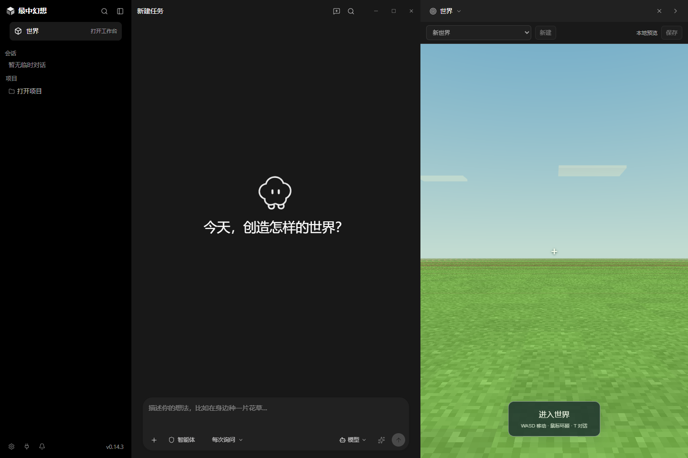

# Windows 客户端第 1 批开发报告

日期：2026-09-09。项目：craftmine world / 最中幻想。

这一批已经把“复用 PI”推进到实际代码和可打包的程序目录。**W0 接入探针完成，W1 完成第一批，整个项目还没有做完。** 持续开发目标和自动接续保持启用。

## 你关心的两个决定

**Rust 从现在开始承担核心。** 新桌面的世界、进度和任务事务已经由 Rust 保存；重复调用不会重复改草稿，取消后的任务不能继续写入，旧面板不能覆盖新的世界进度。现有游戏画面与玩法代码仍沿用经过测试的运行器，PI 的 Agent 循环继续复用。

**前端沿用完整 PI 桌面，并加入世界创作。** 保留会话侧栏、聊天输入、工具记录、标签页、设置和主题；新增固定的“世界”入口、较大的默认世界面板，以及最中幻想的品牌和中文创作提示。作品库、候选比较、验收面板和沉浸游玩布局将继续加入。

下面是实际 React 组件的后台布局截图。会话数据和原生窗口传输使用测试适配器，因此这张图只能证明组件与布局效果，不能代替完整 Electron 客户端验收。

[查看浅色布局](evidence/windows-batch-01/desktop-light.png)

## 这批实际做成了什么

- 固定并导入 PI 源码，完成 Rust、前端和 Agent 运行器构建，留下来源记录。
- PI 插件能启动并关闭 Rust 服务，并传递真实的会话、轮次和工具调用标识。
- 世界面板可以新建、切换和保存不同世界。切换前保存，每 10 秒保存一次；重启服务后能读回各自进度和上次选择。
- 新程序使用独立的 Craftmine 数据目录，关闭上游 PI 的应用自动更新地址。
- 生成了 Windows 程序目录，包内带 Rust 程序、Agent 运行器和世界插件；构建流程同时附带来源、许可证和对应源码。
- 修复旧世界代码中的新增玩法资源、验收装载扩展、玩法依赖保留和重开扩展传递问题。

## 验证结果

| 验证范围 | 实际结果 | 能证明什么 |
| --- | --- | --- |
| 原项目逻辑回归 | 274/274 | 这批世界接口修改未破坏已有逻辑回归 |
| 扩展实际 Worker 与游戏 | 7/7 | 扩展真正扣血、只触发一次并保存状态 |
| Rust 任务与世界存储 | 7/7 | 取消、恢复、重复调用、世界隔离与写入冲突 |
| 桌面品牌、目录、更新、语言与分栏 | 21/21 | 针对这些改动的回归 |
| 实际 React 布局与主题 | 7/7 | 会话、输入、可见世界面板与深浅主题 |
| 包内插件与 Rust 服务 | 8/8 | 使用打包文件可以真实启动服务和调用工具 |
| 包内世界保存与重开 | 9/9 | 实际插件、Rust、游戏之间的数据往返；Electron 页面传输使用测试适配器 |

可追溯结果保存在 [本批证据目录](evidence/windows-batch-01/)。开发与构建方法见 [desktop/README.md](../desktop/README.md)。没有启动可见测试窗口，没有操控你的鼠标或键盘，没有访问你正在使用的浏览器。

## 还不能当成完成的部分

目前 **不能把新客户端交给模型，就认为它已经可以自主开发世界**：Craftmine 在 PI 中暂时只接入运行状态工具，创作工具循环属于 W2。以前网页端的真实模型成绩也不能直接算到新客户端上。

完整原生窗口验收、安装流程、关闭前最后一次保存的确认、旧存档副本导入还没完成。现在若关闭刚改动的世界，最后一次定时保存之后的进度仍可能未落盘，开发预览应先手动保存。桌面图标和部分上游文案也还需要整理。

真实模型三次压缩后完成任务、取消恢复不串任务、作品跨世界复用，以及生命／近战／射击组合，都继续保留为后续验收门槛。本批没有调用真实模型，不能报告这些项目通过。

## 下一批继续做

1. 完成 W1 的关闭保存屏障、旧存档副本导入，以及不显示测试窗口的原生运行验收。
2. 让 PI 会话绑定真实世界，把现有创作、草稿、验证和候选应用工具接入 pi 循环。
3. 先用可控场景验证完整流程，再用真实 DeepSeek 需求验证“生成 → 检查 → 应用 → 保存 → 继续修改”。

开发使用 `codex/pi-client-20260909` 独立分支与工作树；本批整理后合并回本地 `master`，保留上游导入与各项修复的提交。没有推送远程。旧网页服务、个人模型配置和用户世界没有被迁移或覆盖。
