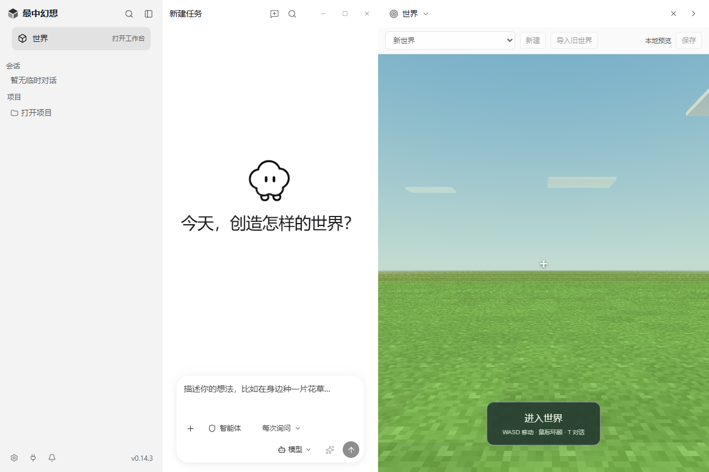
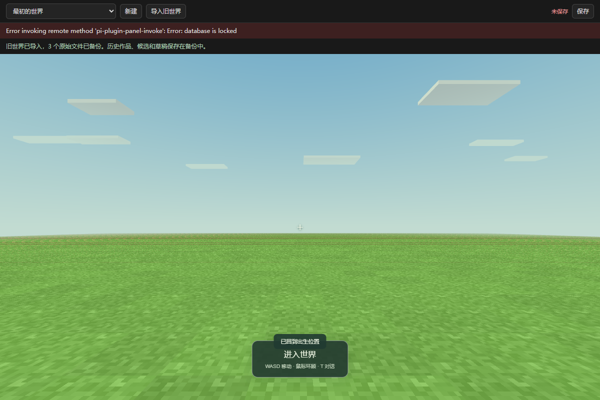

# Windows 客户端第 2 批开发报告

日期：2026-09-09。项目：craftmine world / 最中幻想。

**这一批把桌面版的“打开世界 → 导入旧世界 → 保存 → 退出 → 重开”跑通了。开发版和打包后的 EXE 都通过了真实原生进程验收。** W1 的核心运行链路已有证据，接下来进入 W2 的模型创作接线；整个开发目标仍在执行。

**现在的新客户端还不能靠一句话自动开发世界。** PI Agent 已随程序启动，但 Craftmine 的创作工具、候选应用和作品检索还没有接入它。本批没有调用真实模型，旧网页的模型测试成绩也没有算进这次桌面验收。

## 对你来说，已经有什么变化

| 你要做的事情 | 本批实现的结果 |
| --- | --- |
| 打开程序看看世界 | 首页直接打开世界工作台，不必先创建一个聊天会话 |
| 边聊天边看世界 | 保留 PI 的侧栏、会话、输入框和工作面板；窄聊天栏的中文按钮可以正常换行排布 |
| 把旧世界带过来 | “导入旧世界”先保存当前世界，再完整备份选中的旧目录，校验后创建一份新的桌面世界 |
| 关掉程序 | 先读取游戏的最后状态，等 Rust 确认保存成功后再退出 |
| 遇到保存失败 | 世界和刚才的进度仍保留，恢复操作后可以再试；不会直接关闭丢掉现场 |
| 重新打开 | 恢复上次选中的世界和退出前保存的位置 |

Rust 正在实际管理世界、玩家进度、任务草稿、调用回执和导入档案。前端继续使用 PI 的 Electron、React 和 TypeScript，Agent 继续使用 pi 循环，游戏继续使用已有运行器。这个分工已经落实在代码中。

下图来自实际 React 组件的独立后台布局测试：左边会话、中间输入、右边世界。**这张组合布局图的会话与原生窗口传输是测试夹具**，用于检查布局；原生客户端另有独立验收。

[深色布局](evidence/windows-batch-02/desktop-dark.png) · [浅色布局](evidence/windows-batch-02/desktop-light.png)

## 保存失败是怎样验证的

不是只检查“保存成功”几个字。测试先导入玩家位置为 `x=8` 的旧存档，再通过真实游戏消息回到出生点 `x=0.5`。

随后故意占用测试数据库，让 Rust 暂时写不进去，再请求原生窗口关闭。结果是：客户端保持运行，世界里仍是新位置，磁盘上仍是旧位置，界面允许重试。

解除数据库占用后再次退出，Rust 保存了 `x=0.5`，客户端正常关闭。再启动一个新的 Electron 进程，读取到了同一个世界和 `x=0.5`。开发版与包内 EXE 都完成了这一流程。

下面是**包内 EXE 的真实世界页面**在故障发生时的离屏截图。故障是测试主动制造的数据库写锁；截图中的错误提示和保留下来的世界都来自实际运行。

原生桌面与世界使用独立离屏表面，分别截图。本批没有证明可见 Windows 窗口的最终合成效果，也没有模拟鼠标双击或操作系统文件夹对话框。

## 旧存档和“记住作品”处理到了哪一步

导入器会保留当前世界的场景、进度、素材和扩展源码。旧目录中的历史作品、尚未应用的候选、未完成草稿也会完整备份。测试逐个比对原文件和副本的哈希，确认原项目没有被修改或重启旧任务。

最早一版存档的校验依赖 JSON 字段顺序，跨 Rust 传递时会出现兼容问题。本批修复为：先用原始文件验证，再把可玩的副本转换为已有的新格式；原格式和原版本号仍留在备份中。较新的格式保持原构建版本。

本批还修复了旧作品系统中的两个问题：带扩展依赖的作品不能正确入库/复用，以及真实扩展错误被误报成“过期消息”。新的回归检查覆盖了扩展版本匹配和真实 Worker 错误。

**“备份了作品”还不等于“新桌面的 Agent 已经会自动找出来复用”。** 新客户端的作品库界面、自动检索和跨会话复用属于下一阶段。

## 实际验证结果

| 验证范围 | 结果 | 证据含义 |
| --- | --- | --- |
| 领域逻辑回归 | 276/276 | 包含旧功能、扩展记忆和早期存档转换 |
| Rust 事务和导入 | 10/10 | 世界隔离、冲突、取消、回执、档案完整性 |
| 桌面定向检查 | 47/47 | 关闭屏障、首页工作台、插件环境和隔离配置等 |
| React 布局 | 9/9 | 无会话打开世界、深浅主题、分栏与中文控制布局 |
| 原生开发版 | 17/17 | 实际 Electron、插件进程、Rust、保存失败重试与重启 |
| 包内 EXE | 17/17 | 用交付包里的程序和 Rust 文件重复原生流程 |
| 包内任务核心 | 8/8 | 实际任务回执去重、跨会话拒绝和取消后拒绝迟到修改 |
| 包内世界组件 | 14/14 | 多世界保存、切换、关闭等待和重开；页面传输是适配器 |
| 完整旧世界导入 | 14/14 | 大素材、扩展实际扣血、重开不重复扣血、原文件完整保留 |
| 扩展 Worker | 14/14 | 沙箱和真实源码执行；其中模型评审钩子是固定测试数据 |

客户端类型检查、样式检查和 Windows 程序目录构建均通过。这些检查存在覆盖重叠，不把数量相加当成功能数量。

原生测试中发现并修复了：首页工作台要求已有会话、原生插件缺少 Rust 程序路径、早期存档字段顺序兼容、退出时重新请求已停止的服务，以及窄栏中文标签挤成竖排等问题。测试夹具和原生客户端分别记账。

所有运行都使用独立数据目录。没有发送真实鼠标/键盘操作，没有请求鼠标锁定，没有显示或置前测试窗口，没有控制你正在使用的浏览器，也没有修改你的个人 PI 配置或世界。

## 本批程序在哪里

内部 Windows 程序目录：

`D:/Craftmine World/desktop/build/windows-preview-batch-02`

入口是该目录中的 `Craftmine World.exe`，旁边的文件需要一起保留。程序包携带 Rust 服务、Agent 运行器、世界插件、来源与许可证文件、对应实现的源码归档和构建说明。

这是**未签名的内部程序目录**，本批没有制作或验收安装器。原生 EXE 已做离屏运行验收；实体双击、可见窗口体验和干净 Windows 环境的安装验收仍待后续完成。首轮引导和图标也需要继续适配游戏创作产品。

包内实现对应提交 `7a2376d`。后续 `3490f46` 扩展了包内 EXE 的验收脚本，没有改变包内运行代码。完整校验值见 [包记录](evidence/windows-batch-02/package.json)，构建方法见 [客户端说明](../desktop/README.md)。

## 下一批按什么顺序开发

1. **让一次创作真正绑定一个世界。** 把 PI 的会话、任务、草稿、调用回执与 Rust 世界关联起来，处理重复调用、取消和并发修改。
2. **把开发工具接进 PI Agent。** 支持读世界、查已有作品、新增或修改资源、提交验收作业、读取结果和修复草稿。
3. **补上候选和作品界面。** 沿用 PI 的工作面板，展示待应用版本、具体变化、试玩结果和可复用作品。
4. **跑真实 DeepSeek 创作。** 完成生成树、修改树、预览应用、重启、新会话复用的完整证据链；失败时留下可继续的草稿。
5. 再推进 W3 的长任务压缩与恢复，随后是血量/近战/射击组合、备份恢复和最终安装包。

对抗评审继续保留，设计意见作为建议；硬性通过条件来自可复核的检查。真实压缩后完成任务、跨会话自动复用和玩法组合仍没有被记为完成。

## 开发记录

本批在独立分支 `codex/pi-client-w1-20260909` 和工作树 `D:/Craftmine World-worktrees/pi-client-w1-20260909` 中完成。主要提交：

- `bce706d`：关闭前等待世界保存。
- `6f8c137`、`6e17b79`：扩展作品复用及错误信息修复。
- `569adfa`、`58d7f08`：旧目录完整副本导入与早期格式兼容。
- `5539fb6`：无会话首页工作台和窄栏布局。
- `780e6bc`：原生插件的 Rust 程序路径。
- `7a2376d`、`3490f46`：原生与包内 EXE 无输入验收。

本批交付合并到本地 `master`；远程未推送。合并及工作树清理结果在交付消息中说明。更早那批被自动审核拒绝清理的残留目录仍保留，没有再次尝试删除。

证据在 [第 2 批证据目录](evidence/windows-batch-02/)，原始运行数据与日志在 `D:/Craftmine World/test-results/windows-batch-02`。目标和定期接续保持启用。
