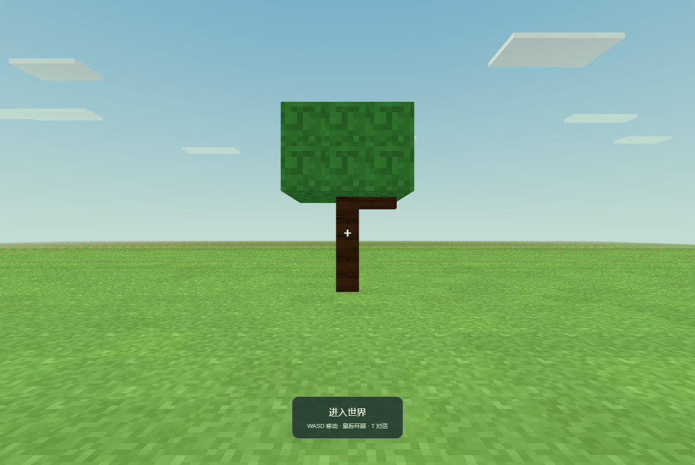
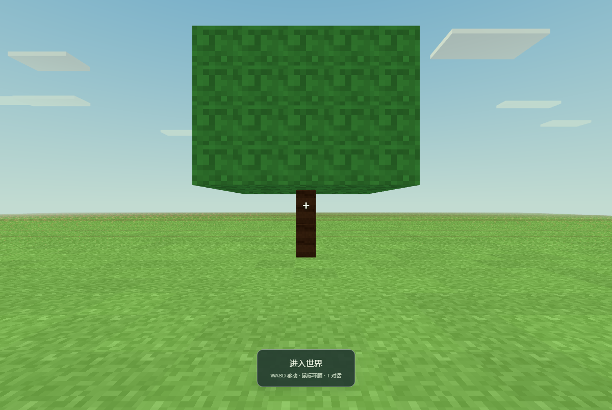

# Windows 客户端第 3 批开发报告

日期：2026-09-09。项目：craftmine world / 最中幻想。

**这一批接通了 PI 的世界草稿工具。真实 DeepSeek 已经能生成一棵树，把源码保存到 Rust；重启服务后，再继续修改同一棵树。** 开发目标仍在执行，W2 尚未全部完成。

**现在完成的是“写好并记住草稿”。** 新客户端还缺少候选验收、预览、玩家应用和跨会话作品复用的完整接线，不能把这一批说成“一句话之后世界里已经能玩”。上一批的 EXE 程序目录也没有更新成本批代码。

## 已经能做什么

| 你的想法 | 本批实现 |
| --- | --- |
| “让 LLM 真正帮我开发” | PI 现在有查看世界、查能力说明、读取资源、修改草稿四个领域工具，实际经过编译器和 Rust 存储 |
| “别改错我的世界” | 首次创作把会话绑定到当时选中的世界；之后切换面板不会把正在运行的创作带到另一个世界 |
| “两个聊天会不会互相覆盖” | 同一时间一个世界只允许一个创作任务持有写入权，其他会话会明确收到占用提示 |
| “刚写好的代码别丢了” | 每次有效修改保存草稿、版本和调用回执；重启后可以继续读取 |
| “失败后再试会不会多生成一次” | 相同工具调用找回原回执，不重复新增；版本过期、资源哈希不对或编译失败时保留原草稿 |
| “我按停止之后别继续改” | 停止会保留草稿并拒绝迟到修改；即使当时数据库写入失败，也先阻止后续工具，之后可以补写停止记录 |

这里的“记住”目前指**同一会话后续轮次能继续已有草稿**。将树保存为作品、换一个会话自动检索出来、安装到另一世界，仍是 W2/W3 的待办。

底层继续按已确定的分工推进：Rust 管世界、任务、版本与回执；PI 管模型循环；现有 JavaScript 编译器检查游戏代码；游戏代码在隔离运行器中执行。没有新建另一套模型循环。

## 真实模型做出来的结果

测试先要求在指定位置生成一棵有树干和树冠的树，再重启插件和 Rust，让模型放大树冠、保留树干和位置。以下两张图使用真实模型生成的源码，在桌面插件所用的实际游戏沙箱中渲染。

初稿：

继续修改后：

**截图的外层数据桥是独立测试夹具，没有把候选应用到你的世界。** 它证明这些几何数据能被实际游戏显示；不能替代新桌面完整的“预览 → 应用”验收。这里也只是基础方块树，尚未做美术细化。

测试沿用项目现有的 `deepseek-v4.1-flash-expires-on-0910` 和 high 思考配置。最终一轮包含 11 次真实模型请求、10 次工具调用、0 次工具报错，6 项检查通过。模型回报总计 70,983 tokens，其中缓存读取 59,520、非缓存输入 6,725、输出 4,738；没有估算费用。

原有密钥文件只用于读取授权配置，没有复制个人 PI 配置，也没有修改你的世界。模型循环采用固定依赖的 pi-agent-core/pi-ai 0.85.1。**这次真实模型测试使用隔离的调用会话，桌面模型设置到创作的整条流程仍需后续单独验证。** 原生桌面的工具分发则另有实际 Electron 验收。

## 实测发现并修好的问题

第一次真实运行时，能力说明同时给了两个场景格式，模型添加了当前格式不支持的 `appearance`。编译器拒绝后，模型自行修复。现在说明只给出当前世界适用的格式。

更关键的问题是树干悬空。模型把部件位置当成中心点，而引擎按部件的最小角计算。最初的检查只验证了创建、保存、续改和高度，漏掉了接地条件；虽然工具链通过，树的效果仍不合格。现在已明确坐标规则，并增加“树干实际接地”的检查，重新真实运行通过后才保留上面的结果。

还补了中文载荷按实际 UTF-8 字节限长、停止写库失败后的拒绝与重试，以及“继承来的草稿虽然版本号从零开始，也不能在世界版本变化后被丢弃”的回归检查。

## 实际验证范围

| 检查 | 结果 | 证明什么 |
| --- | --- | --- |
| 原有领域逻辑 | 276/276 | 复用编译和补丁逻辑后，原有回归仍通过 |
| Rust 核心 | 16/16 | 会话绑定、独占写入、重启、取消、冲突与草稿保留 |
| 真实 PI 插件与 Rust 探针 | 16/16 | 新增和替换、回执、身份拒绝、停止失败与补写；调用身份由测试提供 |
| 核心旧接口探针 | 8/8 | 服务生命周期、旧任务回执和取消仍可用 |
| 原生 Electron 开发版 | 23/23 | 实际 PI Rust 分发、utility process、草稿工具、停止、保存失败及完整重启 |
| 插件身份传递回归 | 5/5 | 宿主提供的项目、会话、轮次和调用身份跨进程保留 |
| 真实 PI + DeepSeek 草稿创作 | 6/6 | 生成接地树、重启续改、保持原树干及正式世界 |
| 实际游戏渲染 | 2/2 | 两版真实生成的几何能显示；已人工检查截图 |

客户端构建、类型检查与 Rust release 构建通过。各组覆盖有重叠，数量不相加当作功能数量。没有重打安装包，没有验收可见窗口合成或物理双击，没有把旧网页测试当成完整新客户端模型验收。

整个过程中未发送真实鼠标/键盘操作、未申请 Pointer Lock、未置前测试窗口，也未控制你正在使用的浏览器。原生验收的输入调用和页面未处理异常均为零。

## 前端与下一批安排

PI 的项目/会话侧栏、流式聊天、工具记录、文件审阅、模型设置、主题和分栏继续保留。本批主要完成它们背后的世界工具接线，尚未交付新的作品库或候选面板。

下一批继续 W2，按以下顺序推进：

1. 把草稿、验收作业和不可变证据交给 Rust 记录，让实际隔离游戏检查生成代码。
2. 在 PI 工作面板中加入候选差异、验收证据与独立预览，保留当前世界和当前玩家进度。
3. 玩家确认后正式应用候选；遇到版本或位置冲突时保留草稿，不覆盖新进度。
4. 接入最小作品检索和固定版本复用，再通过实际桌面模型设置完成“生成树 → 修改 → 预览应用 → 重启 → 新会话复用”。

随后才进入 W3 的强制压缩与恢复、W4 的玩法组合、W5 的安装器和备份交付。持续目标保持开启。

本批实现提交：`bc5ff3a`（Rust 会话草稿）、`b360559`（PI 工具与原生接线）、`d526ebb`（真实生成后的契约修复）。使用分支 `codex/pi-client-w2-20260909` 和独立工作树开发；合并与清理结果记录在 `WINDOWS_DEVELOPMENT_LOG.md`。未推送远程。本批没有创建新的程序包；便携证据在 `docs/evidence/windows-batch-03`，完整隔离运行记录在主项目 `test-results/windows-batch-03`。

交付结果：5de1c7c 及本批实现已合入本地 master，开发分支和工作树登记已移除，未推送远程。Git 删除工作目录返回 Directory not empty；自动执行审核随后拒绝了该目录的递归清理，理由仅为 blocked by policy。D:/Craftmine World-worktrees/pi-client-w2-20260909 的残留保留且不再重试，不影响后续开发。
