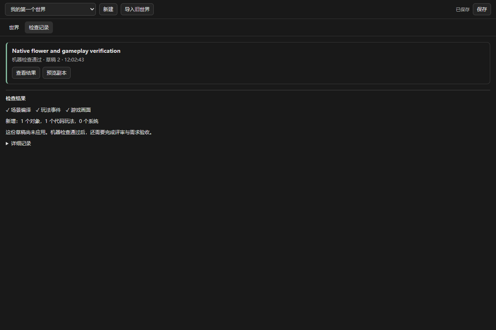
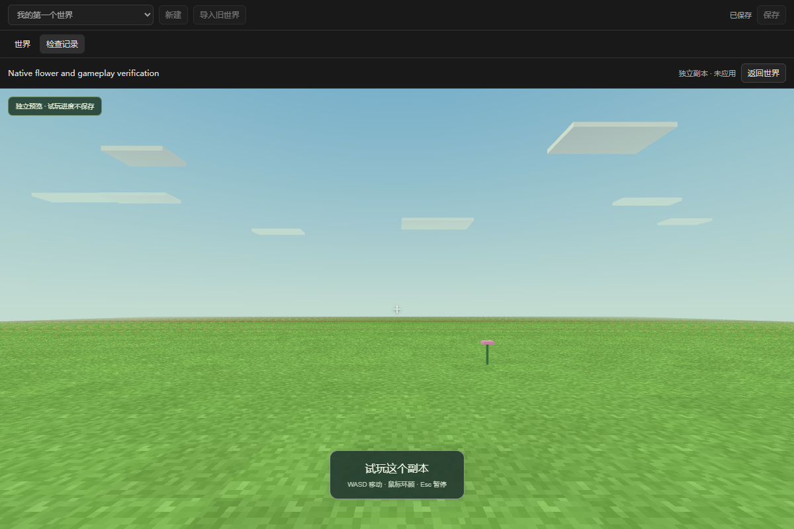

# Windows 客户端第 4 批开发报告

日期：2026-09-09。项目：craftmine world / 最中幻想。

**这一批完成了“保存草稿 → 后台检查 → 查看结果 → 独立预览”，并生成了新的 Windows 预览程序。** PI 原有的项目、会话、聊天、模型设置和工作面板继续保留。W0–W5 持续目标仍在执行，W2 尚未全部完成。

新程序：[Craftmine World.exe](<D:/Craftmine World/desktop/build/windows-preview-batch-04/Craftmine World.exe>)。请保留这个文件夹中的全部文件，再双击程序。它是未签名的程序目录，约 393 MiB，尚不是安装器；第 2 批程序目录仍保留。

**本批还不能把预览正式应用到世界。** 模型评审、玩家需求验收、应用事务、作品复用和真实模型在桌面内完成整条创作流程，继续作为下一批任务。不会把“检查通过”显示成“已经应用”。

## 现在多了什么

| 你关心的事情 | 本批结果 |
| --- | --- |
| 代码写完到底能不能运行？ | PI 可以提交后台检查，实际执行游戏代码并绘制场景；检查会保留结果和失败原因 |
| 检查会不会把聊天卡住？ | 提交后先返回记录编号，后台继续运行；可以查看状态或取消 |
| 检查过程中又改了代码怎么办？ | 检查绑定送检时的草稿版本。继续修改、取消或开始新一轮时，旧检查不能替新草稿作数 |
| 程序中途关闭怎么办？ | Rust 保留检查输入，重启后标记为“已中断”；不会伪装成成功，也不会永远显示运行中 |
| 我想先看看生成效果 | “世界 → 检查记录”中可以查看结果、打开预览副本 |
| 预览会不会弄坏原世界？ | 打开前保存并暂停原世界。预览使用独立游戏副本，关闭时丢弃副本进度，原世界继续保留 |
| 前端是否还像 PI？ | 保留完整 PI 桌面，在世界工作面板中增加检查记录、结果摘要和副本预览；详细技术记录折叠显示 |

这批检查包括场景编译、玩法事件、代码恢复和实际画面。它能发现一部分真实运行问题，**还不等于完全理解并满足玩家的愿望**，也没有替代后续评审。

检查面板：

预览副本：

截图来自本批包内 EXE 的实际离屏验收。这里的小花和玩法代码是固定测试输入，本批没有调用真实模型。第 3 批真实 PI/DeepSeek 生成树和继续修改的证据仍独立保留，不能与本批拼成一条尚未跑过的模型全流程。

## 真跑发现的问题

1. **旧语法检查器把 Electron 当 Node 启动，检查超时。** 桌面已改用打包的静态语法解析器，检查时不会运行玩家代码，也不会启动另一个 Electron 程序。
2. **第一次通过检查的预览截图仍是黑屏。** 原因是隐藏画布调整尺寸后被清空，而常规绘制循环没有继续。已修复重绘，并增加实际画面像素检查。旧黑屏结果保留为失败案例，不算最终视觉通过。
3. **正常开门代码被误判为没有关闭碰撞。** 验收快照漏记碰撞和颜色；已改为读取真实运行状态，并补齐物品、资源观察。
4. **切换世界后短暂出现前一个世界的检查卡片。** 现在切换时立即清空旧列表并返回世界视图。
5. **后台领取或保存检查结果失败，可能一直显示运行中。** Rust 增加 60 秒失效和重启恢复；已取消的任务拒绝迟到成功记录。后台取消通道报错也不会阻止任务停止。

共享检查器新增了一条本地静态模块路由，因此同步了该文件的冻结哈希。验收断言、权限规则和冻结检查保留；游戏内 Agent 没有修改这些规则的工具。

## 实际验证了什么

| 验证 | 结果 | 范围 |
| --- | --- | --- |
| 领域回归 | 276/276 | 原有功能、共享编译与冻结规则 |
| Rust 核心 | 22/22 | 任务版本、回执、身份、取消、重启、过期与证据完整性 |
| 插件草稿回归 | 16/16 | 实际插件与 Rust；身份由测试提供 |
| 共享浏览器检查器 | 3/3 | 实际 HTTP 路由、玩法变化与恢复、顶层代码异常隔离 |
| 取消与语法解析 | 2/2 | 取消通道故障、迟到结果拒绝、静态检查不执行源码 |
| 黑屏回归 | 1/1 | 有 HUD 的黑画面仍被拒绝 |
| 原生开发版 | 31/31 | 实际 PI Rust 分发、后台检查、副本、保存失败重试与重启 |
| 包内 EXE | 31/31 | 对真正交付的程序重复完成上述原生流程 |

类型检查、Rust release 构建和 Windows 打包通过。包内所有 58 个文件复制后逐个校验一致。各组覆盖有重叠，数字不相加当作功能数量。

最终原生验收记录的鼠标锁定、焦点调用和页面未处理异常均为零。测试使用独立数据目录和不显示、不可聚焦的离屏窗口，没有操控用户浏览器。可见桌面窗口的最终合成、物理双击操作、正式安装与升级恢复仍未验收。

## 如何体验与后续开发

打开新程序后，可以继续使用 PI 原有的模型设置和聊天入口。新世界工具支持修改草稿和提交后台检查；在世界面板打开“检查记录”，查看结果后选择“预览副本”。这里仍是开发预览，实际模型设置到完整创作闭环尚待专项实测。

下一批继续 W2：

1. 接入必须执行但只作建议的模型评审，以及玩家需求验收证据。
2. 完成“玩家确认 → 保存最新进度 → 载入候选 → 正式提交”的 Rust 事务，处理版本、位置、状态迁移和失败恢复。
3. 把验收通过的作品保存成固定版本，支持检索和新会话复用。
4. 使用真实桌面模型设置，完整跑通生成树、修改、预览应用、重启和复用。

之后继续 W3 自动压缩与记忆恢复、W4 生命/近战/射击组合、W5 安装器、备份恢复和中文指南。没有把这些后续任务记成完成。

## 交付记录

- 开发分支：codex/pi-candidates-20260909；工作树：D:/Craftmine World-worktrees/pi-candidates-20260909。
- 实现提交：1a497f8（Rust 检查作业），2f12573（原生后台检查与预览），2566c4f（取消与语法回归）。程序基于 2566c4f 构建。
- 便携证据：docs/evidence/windows-batch-04；原始记录：D:/Craftmine World/test-results/windows-batch-04。
- 程序目录：D:/Craftmine World/desktop/build/windows-preview-batch-04，附 PI 许可证、静态解析器许可证、对应源码 ZIP 和构建说明。
- EXE SHA256：52db7aaa2a8e77e4b2924ba6f56e4fed29e7d325b532d65afe6194213ae1c3be。
- 源码 ZIP SHA256：d941f6fced8c5833b5439550e082337a8aecb97a3601c123191eff772c4f111b。
- 合并与清理：交付记录提交后合入本地 master；随后记录实际清理结果。未推送远程，未修改个人 PI、模型配置或世界。
