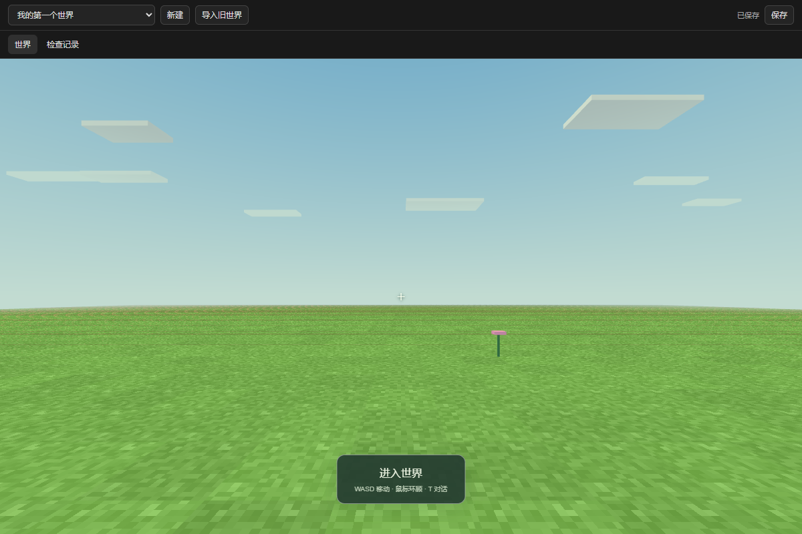

# Windows 客户端第 5 批开发报告

日期：2026-09-09。项目：craftmine world / 最中幻想。

**这一批完成了“检查草稿 → 评审需求 → 实际验证效果 → 应用到世界”，并生成了新的 Windows 预览程序。** PI 原有的项目、会话、聊天、模型设置、工具记录和工作面板继续保留；世界面板增加了评审结果、需求检查、重试/取消和应用操作。

程序：[Craftmine World.exe](<D:/Craftmine World/desktop/build/windows-preview-batch-05/Craftmine World.exe>)。保留整个文件夹中的 60 个文件后运行，约 394 MiB。当前交付为未签名的程序目录，安装器和干净 Windows 环境验收属于后续阶段。

W0–W5 目标继续执行，当前仍在 W2。**原生 Agent 从一句话自动完成全部创作、跨会话找回并复用作品，还没有完整验收。** 本次真实模型测试评审的是事先准备好的测试草稿。

## 现在多了什么

| 你关心的事情 | 现在的处理方式 |
| --- | --- |
| 代码能运行，但没有做出我想要的效果 | 评审从你的原始需求提出检查条件，在独立游戏副本里实际执行。例如要求隐藏花，只改颜色会被发现并拒绝应用 |
| 模型不断提出新设计意见 | 颜色、平衡、冷却等建议会显示给你；评审的“不同意”本身不阻止应用，实际检查失败才会拦截 |
| 我先看看，再决定用不用 | 预览保留独立副本。检查和需求验收通过后，可从预览里的“应用到世界”提交 |
| 应用新内容会不会把当前位置和已有进度清掉 | 使用应用前最新保存的进度，检查状态能否迁移、是否与玩家碰撞，再由 Rust 一次完成保存 |
| 应用成功了，但程序没收到回执 | 查询原来的应用记录恢复结果；不会重复应用，也不会拿另一份评审冒用同一条记录 |
| 我修改草稿或取消了评审 | 旧结果不能替新草稿作数；取消后迟到的模型回复不能再成为成功结果 |
| 下一轮继续改刚应用的内容 | 下一轮从已应用的世界继续；其他尚未应用的脏草稿仍保留冲突保护 |
| Agent 如何知道哪里没满足需求 | 查询检查结果时，会得到简短的失败条件和实际观察结果，供下一轮修复 |

存储、版本与应用事务由 Rust 管理；桌面交互继续使用 PI 的 React/TypeScript，Agent 循环继续复用 pi。玩家生成的玩法代码在受控游戏 Worker 中运行。

## 真实测试得到了什么

| 测试 | 结果与范围 |
| --- | --- |
| 原有领域回归 | 276/276，覆盖现有世界、作品与玩法基础 |
| Rust 事务测试 | 28/28，覆盖评审、应用、版本冲突、取消、重启和回执 |
| 本批定向检查 | 8/8，覆盖状态迁移、丢失回执、取消后的迟到回复、静态解析等 |
| 开发版原生固定场景 | 39/39；PI/Rust/游戏/面板真实运行，模型回复来自固定服务 |
| 最终包内 EXE 固定场景 | 40/40；另外确认 Agent 能读到失败需求的信息 |
| 开发版真实 DeepSeek 评审 | 33/33；模型提出的 14 条需求断言全部实际执行通过 |
| 最终包内 EXE 真实 DeepSeek 评审 | 33/33；模型这次独立提出的 8 条断言全部实际执行通过 |
| 构建与类型检查 | 通过；程序携带 Rust 服务、Agent bundle、许可证、对应源码和构建说明 |

这些场景存在共同检查，不能将数字相加当成互不重复的功能数量。固定服务的回复与 usage 都是测试数据。

真实模型沿用本地已配置的 `deepseek-v4.1-flash-expires-on-0910`，thinking=high，通过独立测试档案中的 PI 模型配置调用。三次真实评审记录合计 **23,296 tokens**：第一次失败 9,523，开发版成功 7,752，程序包成功 6,021。没有将 reasoning tokens 重复叠加到总量。

所有自动验收都使用独立离屏进程和独立数据目录，初始化禁用 Pointer Lock 和焦点请求；真实鼠标/键盘调用、窗口显示/置前调用和退出页面异常均为 0。没有操控你正在使用的浏览器。

## 本次发现并修复的问题

第一次真实评审失败，原因是缺少运行事实：模型以为地面应该在 y=0，并认为隐藏对象后还应保留绘制模型。我们的地表实际在 y=6；隐藏时保留逻辑对象，暂时移除绘制模型，恢复后重新绘制。提示词现在带上这些规则，并区分模块自测中的夹具字段与真实渲染器观察。失败原文与成功复验都留有证据。

另一轮在离屏画面尚未完成绘制时过早截图，得到黑帧。现在主动请求重绘，并在最多 2.5 秒内要求得到实际非黑像素；持续黑帧仍然失败。

还补了两个边界：取消回执失败仍会停止实际模型/验证任务；应用回执丢失时按同一记录恢复，不重复改变世界。

## 接下来继续开发

1. **作品记忆与复用**：将已经做好的树、花、玩法代码按固定版本存储并检索；新会话可以找到实际源码和验证记录，再安装到草稿中。
2. **原生 Agent 完整创作验收**：在实际桌面会话里由真实模型生成树、修改、检查、评审，再由玩家应用，重启后到新会话复用。先完成这条链再记 W2 完成。
3. **长任务可靠性**：请求预算、上下文压缩、任务恢复、世界记忆重建，完成三次强制压缩后仍成功收尾的真实测试。
4. **玩法与最终交付**：生命值、近战、射击组合，历史恢复界面，安装/升级和中文使用说明。

目前的需求断言仍是模型对自然语言的理解。美术造型、声音、真实走动和枪械操作体验需要各自的后续验收。当前花朵测试图只是流程样本，不作为最终花草美术质量验收。

## 证据与源码记录

- [证据索引](evidence/windows-batch-05/README.md)、[程序文件哈希清单](evidence/windows-batch-05/package-manifest.json)、[完整开发计划](WINDOWS_CLIENT_REUSE_PLAN.md)。
- 分支：`codex/pi-apply-20260909`；独立工作树：`D:/Craftmine World-worktrees/pi-apply-20260909`；基线：`1793f5d`。
- `75dbc0e`：Rust 评审与应用事务。`0a5667f`：PI 需求评审、实际效果验收、面板应用和相关证据。
- 程序构建提交：`0a5667f9d8e968e15e4fcf5950a7f187e69c59ad`。60 个文件从构建输出复制到交付目录后逐个哈希一致，总计 412,854,922 字节。
- EXE SHA256：`dc5ad95867bbc61901950d487e56a2f9c942b4da90c64705e184969853a91fa9`。
- 对应源码 ZIP SHA256：`0ee33ac16e4c7ba4ddb80d212b7575b7b6942725aab831e6d632783ae733f099`。源码及 BUILD.md 在程序目录 `resources/source/`，上游许可证与来源记录在 `resources/licenses/`。
- 合并及工作树清理结果会记录在 [开发日志](WINDOWS_DEVELOPMENT_LOG.md) 和 [当前状态](DEVELOPMENT_STATUS.json)。本批不涉及 GitHub Issue/PR，未推送远端。

