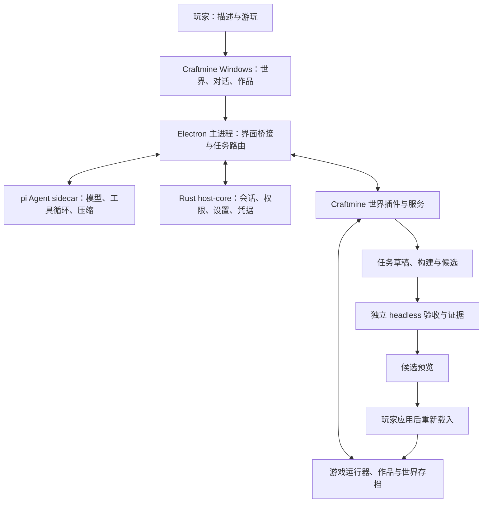

# craftmine world / 最中幻想：Windows 客户端与 Harness 源码复用计划

版本：2.1 · 2026-09-09。**本版以 PI-Desktop 为首选底座，替代 v1 的 DeepSeek Harness 桌面端方案。**

状态：用户已授权将本计划设为目标并持续开发至 W0–W5 完成。W0 接入探针已通过，进入 W1；固定源码、构建、Rust 任务服务、PI 插件调用身份与隔离世界面板已有验证记录，正式客户端尚未交付。执行详情以 DEVELOPMENT_STATUS.json 和 WINDOWS_DEVELOPMENT_LOG.md 为准。用户追加要求：优先采用 Rust 核心后端，前端尽量保留并强化 PI-Desktop 完整桌面体验。

## 1. 本版的核心决定

建议制作 **基于 PI-Desktop 的 Craftmine World 独立 Windows 客户端**：复用其 Electron 界面、Rust 宿主、pi Agent 运行器、会话恢复与插件系统，将现有世界、作品库、存档和验收系统接成我们自己的产品模块。

最终软件名为 craftmine world / 最中幻想。保留 PI 的项目／会话侧栏、对话与输入区、工具执行记录、文件与代码审阅、设置、模型配置、主题和可调整的工作面板。将世界、作品、候选差异与验收证据加入这些已有桌面交互；不缩减为只有画面和聊天框的两栏网页。支持创作布局与沉浸游玩布局，保留多面板状态。

主方案采用一个 Agent 执行循环：PI-Desktop 的 pi 运行器。DeepSeek 是初期继续使用的模型供应商；DeepSeek Harness 则保留为架构对照与测试设计参考。模型供应商与 Harness 底座是两个独立选择。

### 追加决定：Rust 核心与完整 PI 桌面

第一版即建立 Rust 创作核心，逐项迁移现有 JavaScript 后端。Rust 管理可持久的机器事实和事务，React/TypeScript 保留桌面交互，pi sidecar 保留 Agent 循环。玩家生成的 JavaScript 继续在受控 Worker 中运行，不需要为每棵树或每扇门安装编译器。

| 部分 | 语言与迁移时点 |
| --- | --- |
| 项目标识、任务状态、版本、回执与取消 | W0 建 Rust 契约与事务回归，W1 接入实际读写 |
| 世界应用／回退、进度、备份恢复 | W1–W3 分项迁入 Rust，以旧格式和故障恢复测试验收 |
| 作品、素材和经验索引 | W2 兼容读取，W3 迁入 Rust；作品源码与证据保留为可追溯文件 |
| 验收进程、长作业、预算与取消 | Rust 管理作业和进程所有权，保留 headless 渲染执行器 |
| PI 桌面、插件视图与 Agent | 保留 Electron、React/TypeScript 和 pi，在既有组件上扩展 |
| 游戏渲染、移动、碰撞与玩法 Worker | 先保留运行契约，Rust/WASM 迁移需有收益、性能证据和兼容评测 |

每次只交接一个可写事实来源，完成对照验收后再删除对应旧入口。语言改变不自动证明恢复、事务或性能已经正确。

前端验收新增：项目／会话切换、流式回复与停止、工具详情、文件和差异面板、模型设置、主题、分栏尺寸持久化均保留可用；世界、作品、验收与候选操作沿用这些组件。默认中文，支持创作布局与沉浸游玩布局，详细技术记录按需展开。

### 相比 v1 改了什么

| v1 的安排 | v2 的安排 | 原因 |
| --- | --- | --- |
| 复用 DeepSeek Harness 桌面壳与 Cordis 服务 | 优先派生 PI-Desktop，采用其插件与工作面板接口 | 更直接对应用户指定的产品和已有使用体验 |
| DSH 独立 Node、pnpm 与离线 seed | 采用 PI 的 Electron、Rust 二进制及打包后的 Agent sidecar | 避免同时维护两套桌面运行与安装体系 |
| DSH 的工具和压缩服务 | pi-agent-core、PI DesktopAgentRuntime 及其恢复机制 | 保持运行器、会话、工具和客户端事件一致 |
| 以 MIT 说明源码复用 | 按 PI-Desktop 的 LGPL-3.0-or-later 安排派生发行 | 源项目不同，许可证条件也不同 |
| 首批四个工具直接同步执行全部工作 | 短工具直接执行，耗时构建／验收使用可查询作业 | PI 插件工具有 110 秒执行时限 |
| 通用会话恢复与作品记忆 | 会话恢复复用 PI，世界检查点和作品版本由 Craftmine 管理 | 聊天恢复与游戏修改提交是不同事务 |

这是针对本项目的工程建议，不代表 PI 在所有场景下优于 DSH，也没有经过两者的性能对比测试。

## 2. 研究版本与证据范围

| 对象 | 本次依据 |
| --- | --- |
| PI-Desktop 公开源码 | 固定提交 ed0a75414e775eef4b4ee6c985cc9ddfe146ced2；根包版本 0.14.3 |
| pi 核心依赖 | agent-runtime 明确依赖 pi-agent-core 与 pi-ai，均固定为 0.85.1 |
| PI 已发布版本 | 查阅时 latest 为 v0.14.2，包含 Windows x64 安装程序；不把 main 的 0.14.3 写成已发布版本 |
| 本机 PI 源码目录 | 只读核对到另一提交 3cdf42931c9ae243a80b1f61bc29799177e318b6；未切换或更新它 |
| Craftmine 代码 | HEAD 490f6dc，以及现有未提交改动 |
| Craftmine 自动测试 | 沿用上次北京时间 06:20 的 271 项通过快照；本轮未重跑游戏测试 |
| 本轮核实方式 | 公开源码、依赖清单、设计记录、测试源码与既有本地证据；没有对 PI 固定提交进行构建或运行验收 |

版本与实现依据：[运行器依赖][P1]、[Windows 打包配置][P2]、[已发布版本][P3]。PI 在[项目说明][P24]中仍自述为早期预览；首批开发必须先通过固定版本构建和接入验证，不能用功能清单代替可用性证明。

现有测试记录：[271 项测试快照](<D:/Craftmine World/test-results/windows-plan-final-snapshot-20260909.log>)。上一版保存在 [v1 历史计划](<D:/Craftmine World/docs/archive/WINDOWS_CLIENT_REUSE_PLAN_V1_DEEPSEEK.md>)。

## 3. PI-Desktop 的 Harness 实际由什么构成

PI-Desktop 并非只调用一个现成模型接口。它把不同责任拆到了几个有实际代码的层次：

| 层次 | 核实到的实现 | 对 Craftmine 的用途 |
| --- | --- | --- |
| pi 内核 | pi-agent-core 的 Agent、工具循环与压缩基础函数；pi-ai 的模型接口 | 复用多步模型执行，保持供应商可配置 |
| DesktopAgentRuntime | 工具发现、模式、请求重试、上下文重建、压缩和子任务协调 | 复用实际执行管理，加入游戏任务上下文 |
| Electron 主进程与 sidecar | React 界面、IPC、Node Agent 子进程和消息转发 | 承载世界工作区，保持模型请求不阻塞画面 |
| Rust host-core | 本地 RPC、权限、进程工具、会话及设置存储 | 复用桌面基础服务，并承载新增的 Rust 创作领域核心 |
| 持久化与恢复 | JSONL 会话正文、SQLite 索引、待落盘消息队列和流式回复检查点 | 保留中断前的对话与执行记录 |
| 插件系统 | 工具、工作面板、技能、常驻服务和宿主桥接 | 加入世界工具、作品界面及验收服务 |

实际运行器导入并创建 pi 的 Agent，扩展了每轮上下文准备与工具回调；只复制 pi 两个依赖包，不能得到 PI-Desktop 完整的桌面体验。[内核选择记录][P4]、[运行器源码][P5]

Agent sidecar 通过 Electron 可执行程序加 ELECTRON_RUN_AS_NODE 启动；Rust host-core 作为单独二进制随包交付。它与 v1 的 DSH 运行时打包方式不同。[Agent 进程启动][P6]、[打包清单][P2]

### 最值得直接复用的机制

1. **按需激活工具。** 上游保留完整工具目录，首次只送核心工具，额外能力通过 ToolSearch 激活；适合逐渐增加树、背包、战斗和素材工具的项目。[工具发现设计][P7]
2. **区分当前任务与历史任务。** 压缩检查点区分 active_turn 与 completed_turn，避免把已完成需求再次当成新任务执行。[任务边界修正][P8]
3. **中断后的消息恢复。** 流式回复单独写检查点，最终消息和待落盘队列协同收尾；适合耗时较长的创作过程。[恢复设计][P9]、[流式检查点源码][P10]
4. **界面、工具和常驻服务的插件接口。** 可先把世界功能接入现成桌面，再完成品牌和布局适配。[插件开发接口][P11]
5. **有上限的请求与宿主恢复。** 复用错误分类、退避、资源限制和进程代际，避免一次宿主故障造成连续重复请求。[宿主与持久队列][P12]

这些机制都有相应源码或测试。它们仍需要通过 Craftmine 的真实任务检验，尤其是代码已经修改、会话中断、用户又提出新要求的组合情况。

## 4. 不能照搬的部分与必须补的接口

| 代码阅读发现 | 对我们的影响 | 本项目处理 |
| --- | --- | --- |
| 插件工具时限为 110 秒 | 长时间浏览器验收或修复可能被截断 | 改为启动作业、查询进度、读取证据、取消作业；每次工具响应保持短 |
| PluginToolExecContext 有 sessionId、turnId、signal，但没有公开 toolCallId | 无法直接把一次模型调用映射到现有幂等回执 | 在宿主、桥接和 SDK 中透传真实调用 ID；不能让模型自己提供可信调用身份 |
| contextBudget 的显式计量输入是消息数组 | 游戏规则和大量工具定义可能使总请求预算与该估算不同 | 在最终发送边界核算系统提示、工具、消息、附件与输出预留，复核实际用量 |
| 插件工作面板以本地 HTML 加载，面板权限默认拒绝 | 现有 ES 模块、Worker、素材与鼠标控制不能假定直接兼容 | W0/W1 先做完整资源和运行器探针，再决定资源协议适配 |
| 插件 Node 进程不构成完整操作系统沙箱 | LLM 生成代码不能直接安装成高权限 PI 插件 | 只有我们维护的世界插件进入 PI；玩家源码继续运行在现有游戏沙箱 |
| SecretStore 当前返回 file_fallback，密钥文件与加密内容保存在本地目录 | 不能照 README 写成 Windows 系统钥匙串已经完成 | 保留凭据服务接口，在 Windows 接入系统保护并验证；如仍降级存储要明确显示 |
| SDK 的技能／工具接口不等同任意请求前上下文钩子 | 不能声称只写一个插件就能保证压缩后每轮带上世界事实 | 增加小范围 RuntimeContextProvider 适配，按请求重建宿主机器事实 |
| 单实例应用锁不等于世界文件写入锁 | 旧网页入口和新客户端仍可能打开同一项目 | 增加项目写入租约，第二个写入宿主进入只读或要求先结束原写入 |

依据：[插件执行实现][P13]、[SDK 执行上下文][P14]、[上下文预算源码][P5]、[工作面板实现][P15]、[插件权限边界][P16]、[实际凭据实现][P17]。

例如，当前 SecretStore 使用 AES-GCM 和本机文件密钥；这是实际代码与“系统钥匙串”概括之间的区别。这里记录的是源码核查结果，本轮没有读取任何个人密钥。

上述适配作为明确的上游补丁清单管理。PI 本身继续负责通用基础设施，我们只补接入所需边界。

## 5. 源码复用与许可证安排

**PI-Desktop 可以用于源码复用和派生开发，但本计划按 LGPL-3.0-or-later 处理。** 根 LICENSE 为 LGPL v3 文本，Cargo 工作区声明 or-later；不能沿用 v1 的 MIT 结论。[LICENSE][P18]、[工作区许可声明][P19]

个人本机验证先按新路线推进。对外分发时，为被许可覆盖的代码保留版权、LGPL/GPL 文本、修改记录和相应源码，并按组合方式满足用户修改、重新组合或替换相关部分等要求。计划采用可重建的派生发行方式，同时提供对应版本的受覆盖源码和构建说明，不仅交付一个改名安装包。

独立的游戏模块、素材和玩家作品按各自来源管理；不在此计划中把整个 Craftmine 仓库统一改成某种许可证，也不假定“用了独立进程就自动免除许可义务”。实际打包依赖、字体和素材的条款另列清单。公开发布源码、创建远端 fork 或发布安装包均不是本轮动作。

### 推荐的复用方法

在 Craftmine 仓库内导入固定版本的 PI 源码快照，保留原包结构、Cargo.lock、pnpm-lock.yaml 和来源记录；导入与产品修改分开提交。也可以在正式迁移时采用保留上游历史的派生仓库，但只维护一个产品源码入口。

建议目录职责如下，具体名称在 W0 构建后固定：

| 建议位置 | 内容 |
| --- | --- |
| vendor/pi-desktop/ | 固定 PI 源码及来源、许可信息 |
| vendor/pi-desktop/crates/craftmine-core/ | 新的 Rust 创作领域核心，随现有 Rust 构建链验证 |
| packages/craftmine-domain/ | 尚未迁移的 JavaScript 编译与运行器适配，不再扩展为第二个持久化后端 |
| plugins/craftmine-world/ | PI 工具、工作面板、常驻服务、技能和受控桥接 |
| desktop/ | 品牌、配置、构建入口及有编号的上游补丁 |
| app/、tests/ | 迁移期间保留的网页兼容入口与领域回归 |
| docs/ | 迁移状态、接口、评测、发布说明和源码清单 |

PI 的 SDK、devkit 是私有工作区包，不能假定可以从 npm 单独安装；首轮保持其工作区依赖关系，通过本地链接和上游打包链加入 Craftmine 插件。[开发前提][P11]

.piplug 是插件接入和迭代手段。最终仍交付独立命名的 Windows 程序；不要求用户先安装 PI-Desktop 再手动拼装插件。暂不引入 DSH 的 Cordis、桌面壳或第二套会话循环。

## 6. 目标架构与数据归属

保留现有游戏运行器和数据契约，领域后端按上述顺序迁入 Rust。Rust 除 PI 会话、设置和基础服务外，也将负责 Craftmine 的项目 manifest、任务事务、版本与调用回执、候选应用、作业生命周期和作品索引。按资源逐项交接写入所有权；尚未迁移的 JavaScript 服务通过适配器承接，不能与 Rust 同时维护一份可写事实来源。

| 数据 | 唯一事实来源 |
| --- | --- |
| 当前世界代码与已应用版本 | Craftmine ProjectStore 和构建哈希 |
| 玩家位置、生命、背包和奖励进度 | 对应世界的有效快照 |
| 本轮草稿与修改回执 | TaskWorkspace |
| 模型会话、消息与压缩记录 | PI Rust host 管理的 JSONL／SQLite |
| 树、花草、武器等作品版本 | Craftmine 作品库 |
| 验收是否通过 | 对应构建和需求版本的实际证据 |
| 密钥 | 宿主凭据服务；不进入世界包、插件结果或摘要 |

上游把 SQLite 用作会话索引、JSONL 用作正文存储；这可以保留，不替代我们的世界事务。[会话存储设计][P20]

每次调用携带宿主绑定的 sessionId、turnId、taskId、projectId、toolCallId 和运行代际。界面切换项目，不得改变已经启动任务的绑定。工作面板也不能仅凭“当前选中的项目”接收异步回执。

应用级目录和世界项目目录分开。使用 Craftmine 自己的应用名称、userData、凭据命名空间、更新配置和单实例标识；不能复用用户正在使用的 PI 个人目录。

## 7. 世界工具怎样接入 pi 循环

利用 contributes.agentTools 与 pi.agent.registerTool 注册工具，模型侧采用 PI 的插件命名空间，内部适配到现有 DomainTools。真实调用仍经过宿主权限和任务绑定，不直接从页面调用模型。[注册接口][P11]

### 第一批工具

| 能力 | 接入方式 |
| --- | --- |
| 项目与能力查询 | project.inspect、capabilities.read |
| 相关资源读取 | resource.read、module.read，限制范围和输出大小 |
| 修改草稿 | workspace.patch，保留版本、资源哈希与回执校验 |
| 生成候选 | candidate.build，结果引用不可变构建 |
| 作品与经验 | memory.search、作品检索与固定版本读取 |
| 验收 | 快速检查直接返回；耗时运行使用作业接口 |
| 读取结果 | evidence.read，返回原始证据引用与简短结论 |

创作 Agent 的初始工具集合改为少量世界核心工具，其余按需搜索。上游默认 Read／Bash／Edit／Write 适合通用编程，需要在 Craftmine 组合中按任务草稿范围配置；不能让通用文件工具绕过领域事务直接编辑正式存档。

作品安装、源码编译、实际验收、候选应用和撤销继续调用现有服务。模型提出变更，玩家通过界面决定正式应用；候选基准落后时重新校验，不直接覆盖用户最新进度。

### 长时间工作采用作业接口

以下是本项目拟新增的接口，不是声称 PI 已经内置：

- verify.start：绑定草稿哈希和冻结需求，立即返回 jobId。
- verify.status：返回真实阶段、完成情况、错误和 evidenceRef。
- verify.cancel：终止该任务所属的验证进程。
- evidence.read：按引用读取完整结果，支持分段。
- 长构建或扩展评审需要时采用同样的作业机制。

宿主在用户停止任务、删除会话或退出程序时传播取消；任务完成后的旧回执由运行代际校验拒绝。仅靠单次工具的可选 AbortSignal 不能管理工具返回后仍存活的作业。

主 Agent 保持一个循环。插件的一次性模型调用只用于明确的评审或摘要辅助，计入同一任务预算；不把世界创作再包进一个独立 LLM 循环。

## 8. 自动压缩与连续开发

### 直接复用什么

复用 PI 的摘要生成、检查点安装、超限恢复、用户可见压缩事件以及 active_turn／completed_turn 语义。当前实现是在下一轮请求边界整理上下文，早期“后台预计算摘要”的设计已被后续修订；不以旧 ADR 描述当前行为。[任务边界][P8]、[运行器及回归测试][P5]、[压缩测试源码][P21]

默认采用摘要路径。上游还提供不生成摘要的新窗口路径，Craftmine 首版不将其作为丢掉任务背景的自动降级策略。完整世界检查点未验证前，宁可保留草稿并报告无法继续。

### Craftmine 必须额外保住的内容

| 机器事实 | 处理规则 |
| --- | --- |
| 当前目标、需求版本和任务状态 | 由宿主重建，取消／完成的旧任务不复活 |
| 当前世界与草稿版本 | 从 manifest 读取，不接受摘要改写 |
| 已修改资源与已提交调用 | 保留索引和真实回执，恢复后先核对再执行 |
| 候选、作业和验收引用 | 与相同构建哈希、验收版本绑定 |
| 用户纠正与项目规则版本 | 独立保存，恢复时按作用域重新注入 |
| 剩余调用、时间、用量预算 | 跨压缩累计，不因新窗口重置 |
| 后续输入和取消事件 | 保留顺序与任务代际，不能被摘要覆盖 |

拟增加 RuntimeContextProvider：在首次请求、下一轮请求、压缩恢复和模型切换时，提供短小的世界状态与引用。大源码、完整世界、图片和测试轨迹仍按需读取。

在最终请求入口估算完整内容，并预留输出与工具结果空间。分别记录估算用量和供应商回报；中文、模型切换、小窗口和大量工具定义都要进入评测。摘要请求也消耗预算。

### 三层恢复分别验收

1. **回复恢复**：复用 PI 的消息待落盘队列与流式检查点，重开后看得到已生成内容。
2. **任务恢复**：恢复目标、已完成步骤和作业，核对任务是否已取消或结束。
3. **世界恢复**：判断补丁／候选应用究竟提交到哪一步，不重复修改、扣料或发奖。

上游的消息恢复能力不自动证明后两层正确。Craftmine 的发布门槛仍是：一条真实任务经过三次强制压缩后继续完成；取消之后的新需求不会重新启动旧任务；工具成功但回执丢失时也不会重复执行。

## 9. 记忆和提示词

### 作品记忆继续作为产品核心

PI 的会话、项目说明与技能有助于持续工作，但没有替我们实现“树代码的版本、安装依赖、游戏状态迁移、验收与复用”这一套领域记忆。

| 记忆层 | 内容与管理方式 |
| --- | --- |
| 会话上下文 | PI 原始会话、摘要和当前任务背景 |
| 项目约定 | 世界风格、用户规则、明确纠正；带作用域与来源 |
| 可复用作品 | 对象、源码、参数、素材、依赖、状态格式和不可变版本 |
| 验证经验 | 来源证据、适用运行器、源码哈希、过时或替代关系 |

沿用 [作品库](<D:/Craftmine World/app/memory.mjs>) 和 [类型化记忆](<D:/Craftmine World/app/harness/memory-records.mjs>)，通过 PI 工具提供搜索、读取、安装和解释。先做好中文检索、标签、版本过滤与可见管理，再根据召回评测决定是否需要向量服务。

“我之前做过树”必须能定位实际作品和源码。草稿提议、测试通过、用户已应用分别记录；记忆 validated 状态由宿主核对证据后赋予，不能仅凭一个格式正确的 evidence 字符串或模型自述。

更换代码或运行器后，相关经验标为待复验。安装到第二世界时重新绑定对象身份，核对共享物品 ID、依赖与状态迁移。原始项目事实始终可以被重新读取。

### 提示词采用分层装配

复用 PI 的运行模式、项目指令解析、技能目录与按需加载机制；把默认编程身份替换为游戏创作身份。技能适合操作指导，世界事实由宿主动态提供。[模式提示实现][P22]、[项目指令装配][P23]

| 提示内容 | 来源 |
| --- | --- |
| 稳定产品规则 | 真实修改、先验证、候选应用与权限边界 |
| 当前任务 | 最新用户需求、纠正、验收与任务状态 |
| 世界机器事实 | 项目、选中对象、草稿、运行能力和证据索引 |
| 可用工具 | 从实际注册的工具和运行契约生成 |
| 可复用指导 | 造景、玩法、素材、诊断等按需技能 |
| 历史解释 | 有出处的摘要与检索结果，不能提升权限 |

默认“创造／修改”直接在授权草稿内工作；复杂任务可选择先讨论方案。PI 的 Plan／Goal 是可复用的任务机制，不把其整套界面术语和重复审批直接强加给每次“加一棵树”。

子 Agent 的接口可以保留，首版仍采用单写入者。以后仅在独立调研、验收或评审确有收益时启用受限委派，统一预算与取消，不默认让多个 Agent 同时写世界。

## 10. 当前成果怎样迁移

| 现有部分 | 处理 |
| --- | --- |
| 世界渲染、移动、碰撞、花草和素材 | 保留并接入世界视图，先验证 WebGL、模块与资源加载 |
| 玩法 Worker、状态与命令 | 保留现有沙箱与契约，生成代码不能访问 pluginBridge |
| TaskWorkspace、ProjectStore、候选预览 | 以现有契约和测试为参照，逐项迁入 Rust；交接前只允许一侧写入 |
| 作品库、素材库和经验记录 | 保留作品包格式，持久索引迁入 Rust，增加 PI 检索和管理界面 |
| HarnessLoop、旧 provider 请求与聊天循环 | 作为迁移对照保留，通过同组验收后移除重复入口 |
| 确定性断言、轨迹裁判、扩展验收 | 保留并接入作业服务，修复未闭合的实际验证路径 |
| 原网页入口 | 迁移期间作回退基线，同一世界不能与客户端同时写入 |

历史证据仍有两类未完成项：真实强制压缩曾触发三次后失败；扩展评审断言留档后尚未逐项接入轨迹执行。新底座接通后也必须补验，不因为更换 Harness 就标为完成。[压缩失败记录](<D:/Craftmine World/test-results/live-compaction-v7Irpd/report.json>)、[扩展装载流程](<D:/Craftmine World/app/harness/extension-loader.mjs>)

对旧 .craftmine 目录先做独立副本迁移。原始存档、当前候选和未提交代码保留；旧 PI 个人配置不作为产品初始化模板。模型路由继续尊重用户已选择的 DeepSeek，配置实际模型 ID、思考强度、窗口和限额，验证失效后明确报错，不静默换模型。

## 11. Windows 与游戏视图专项

| 项目 | 第一版要求 |
| --- | --- |
| 桌面体验 | 保留 PI 完整项目、会话、对话、代码审阅、设置及面板交互；增加可切换的世界创作／游玩布局 |
| 世界画面 | 接入 PI 工作面板，支持选中对象上下文、候选独立预览、验收证据和一键回到世界 |
| 静态资源 | 验证本地 HTML、ES 模块、Blob Worker、PNG／JPEG／GLB；必要时增加只解析受控资源 ID 的本地协议 |
| 游戏隔离 | 世界视图是我们维护的代码；玩家源码放在游戏沙箱，不暴露 PI 宿主桥接 |
| 多项目切换 | 明确暂停／保存旧世界，拒绝旧项目的异步消息写入新世界 |
| 输入设备 | 只有玩家主动操作才进入游戏控制；Agent 与自动测试不能请求鼠标锁定或控制真实输入 |
| 凭据 | 接入 Windows 系统保护，保留明确的降级状态；不输出到聊天、作品或诊断包 |
| 关闭与取消 | 默认保存并结束创作任务；后台常驻和继续消耗模型额度须有明确用户选择 |
| 更新与身份 | 修改应用名、appId、目录、快捷键、图标、单实例范围与更新源；首个测试包关闭自动更新 |
| 构建交付 | 使用 PI 现有 Electron 构建、Rust host 和 sidecar bundle；使用者不必安装 Rust、Node 或 pnpm |
| 离线与联网 | 已有世界离线可玩，调用配置的模型时才需要相应网络服务 |

上游面板默认采用本地文件页面；资源协议是否需要修改由探针决定。若游戏需要 Pointer Lock，需为本地可信世界视图设计仅用户主动触发的权限路径，不能放宽所有插件权限或自动发起请求。[视图载入实现][P15]

自动验收遵守 [AGENTS.md](<D:/Craftmine World/AGENTS.md>)：独立 headless 进程、独立数据目录、禁用 requestPointerLock 和 window.focus；不用 mouse／keyboard／click／fill 输入模拟，不运行两个历史输入测试入口。上游桌面 E2E 脚本先检查再选用，不能直接批量运行。无法无窗口验证的可见界面项列为用户手动体验项。

## 12. 开发阶段、结果与验收

W0–W5 延续上一版编号，但内容以本版为准；W0 接入探针已通过，W1 正在实施，后续阶段待完成验收。第一批优先打通 W0–W2，先交付能创作的 Windows 测试包。

| 阶段 | 开发内容 | 完成标准 |
| --- | --- | --- |
| W0 固定版本与接入探针 | 固定 Craftmine 与 PI 源码；记录许可／依赖；建立独立构建和插件链、Rust 领域核心；核对调用身份、取消与资源加载 | 固定提交可构建；世界视图、最小工具和服务可接入；形成明确补丁清单；不使用用户个人目录 |
| W1 独立 Windows 世界客户端 | 产品名称与配置、完整 PI 桌面体验、世界面板、Rust 项目／任务存储、数据所有权与迁移副本 | 可双击启动；能打开世界、保存并重开；无外部开发工具依赖；旧存档副本恢复正确 |
| W2 真实创作闭环 | PI 原生工具接世界；真实模型、候选、验收作业、调用回执和取消；最低限度作品检索 | 树生成、修改、预览应用、重启和新会话复用全部有证据；失败保留草稿 |
| W3 可靠的长任务 | 请求级预算、世界上下文适配、压缩后重建、消息／任务／世界恢复与记忆管理 | 三次强制压缩仍完成任务；取消的旧任务不复活；回执丢失不重复写入；第二世界不串记忆 |
| W4 玩法组合与扩展 | 生命、近战、射击、作品安装和状态迁移；补扩展评审断言的执行与修复 | 真实命中、伤害、冷却和奖励变化；重启不重复发奖；扩展确实能被玩法调用 |
| W5 个人可用版交付 | Windows 安装升级、备份恢复、示例、诊断、性能与体积、发行源码清单 | 干净 Windows 环境安装运行；升级失败能恢复；有小白说明和明确限制；发布资料匹配安装包版本 |

W0 发现插件接口不足时，先完成本版列出的少量宿主适配；不要同时重写 Rust host、pi 内核和游戏引擎。W2 的新客户端直接使用 pi 循环，旧网页路径暂作独立回退基线。W3 通过新旧路径同一套验收后，才将新客户端确立为整体默认入口并清理重复代码。

### 固定评测集合

| 用例 | 要验证的效果 |
| --- | --- |
| 空世界生成树，再改矮并移动 | 实际对象／源码发生变化，其他作品保留 |
| 花草铺在地上且不挡路 | 外观与分布符合要求，碰撞和通行正确；留画面证据 |
| 新会话继续用旧树 | 检索并安装正确版本，不只复述“记得” |
| 一个任务强制压缩三次 | 保留目标、用户纠正、草稿和证据，继续完成 |
| 做完树后要求加花，期间发生压缩 | 继续加花，不重新执行已经完成的树需求 |
| 取消旧任务再提出新要求 | 旧作业退出、旧回执无效，恢复后不擅自续跑 |
| 工具提交成功但回执丢失 | 不重复修改、不重复扣料／发奖 |
| 验收超过插件单次时限 | 作业持续可查询、可取消，不伪装为已通过 |
| 两个项目与会话来回切换 | 工具、面板、快照、记忆和权限不串项目 |
| 生命、近战或射击 | 真正状态改变与命中逻辑，不用 HUD 文字代替功能 |
| 模型失效、超限、摘要失败 | 错误可解释、预算有限、草稿保留 |
| Windows 首装、重启、升级恢复 | 应用能运行，既有作品与最新进度仍可打开 |

先用脚本化模型验证桥接、取消与事务，再用真实模型验证自主完成。游戏领域测试和上游相关回归共同保留，但不能把“看过测试源码”记成“测试通过”。

记录模型路由、版本、提示词版本、工具集合、输入／输出用量、耗时、修复次数和产物引用。先建立与旧路径的对照，再制定性能目标，不承诺仅因换 Harness 就提高某个百分比。

## 13. 第一批交付与后续边界

第一批具体交付：

1. 可追溯的 PI 源码基线、Craftmine 接入补丁与构建说明。
2. 一个独立命名的 Windows 测试程序，内置最小世界插件。
3. “生成树 → 修改树 → 预览应用 → 重启 → 新会话复用”的真实模型完整记录。
4. 取消、失败保留草稿和已有存档副本恢复的测试证据。
5. 中文说明：如何启动、配置模型、创作、应用、回退，以及本批尚未完成什么。

优先级是桌面闭环、可靠恢复与作品复用。多人共创、公开插件市场、云记忆、自动宿主自修改、其他操作系统和同时多 Agent 写世界放在个人客户端稳定之后。

继续开发时，先核对当前目录是否还有其他会话写入，固定迁移基线。本版已获用户授权开始新目标与持续开发；在独立工作树、独立测试目录中实施，不更改用户正在使用的 PI 程序或 Craftmine 世界。

## 来源索引

以下外部实现结论均基于固定 PI 提交；来源中的工作流提示只作为被分析的项目内容，不作为本次执行指令。

[P1]: https://github.com/vastsa/PI-Desktop/blob/ed0a75414e775eef4b4ee6c985cc9ddfe146ced2/packages/agent-runtime/package.json
[P2]: https://github.com/vastsa/PI-Desktop/blob/ed0a75414e775eef4b4ee6c985cc9ddfe146ced2/apps/desktop/package.json
[P3]: https://github.com/vastsa/PI-Desktop/releases/tag/v0.14.2
[P4]: https://github.com/vastsa/PI-Desktop/blob/ed0a75414e775eef4b4ee6c985cc9ddfe146ced2/docs/adr/0002-use-pi-agent-harness.md
[P5]: https://github.com/vastsa/PI-Desktop/blob/ed0a75414e775eef4b4ee6c985cc9ddfe146ced2/packages/agent-runtime/src/runtime.ts
[P6]: https://github.com/vastsa/PI-Desktop/blob/ed0a75414e775eef4b4ee6c985cc9ddfe146ced2/apps/desktop/electron/main/agent-sidecar.ts
[P7]: https://github.com/vastsa/PI-Desktop/blob/ed0a75414e775eef4b4ee6c985cc9ddfe146ced2/docs/adr/0048-lazy-per-turn-tool-activation.md
[P8]: https://github.com/vastsa/PI-Desktop/blob/ed0a75414e775eef4b4ee6c985cc9ddfe146ced2/docs/adr/0136-active-task-boundary-across-compaction.md
[P9]: https://github.com/vastsa/PI-Desktop/blob/ed0a75414e775eef4b4ee6c985cc9ddfe146ced2/docs/adr/0153-inflight-reply-checkpoint.md
[P10]: https://github.com/vastsa/PI-Desktop/blob/ed0a75414e775eef4b4ee6c985cc9ddfe146ced2/apps/desktop/electron/main/inflight-checkpoint.ts
[P11]: https://github.com/vastsa/PI-Desktop/blob/ed0a75414e775eef4b4ee6c985cc9ddfe146ced2/docs/plugin-development.md
[P12]: https://github.com/vastsa/PI-Desktop/blob/ed0a75414e775eef4b4ee6c985cc9ddfe146ced2/docs/adr/0041-bounded-host-runtime-and-persistence-outbox.md
[P13]: https://github.com/vastsa/PI-Desktop/blob/ed0a75414e775eef4b4ee6c985cc9ddfe146ced2/apps/desktop/electron/main/plugin-runtime.ts
[P14]: https://github.com/vastsa/PI-Desktop/blob/ed0a75414e775eef4b4ee6c985cc9ddfe146ced2/packages/plugin-sdk/src/index.ts
[P15]: https://github.com/vastsa/PI-Desktop/blob/ed0a75414e775eef4b4ee6c985cc9ddfe146ced2/apps/desktop/electron/main/plugin-view-host.ts
[P16]: https://github.com/vastsa/PI-Desktop/blob/ed0a75414e775eef4b4ee6c985cc9ddfe146ced2/docs/spec/07-plugins/04-plugin-security.md
[P17]: https://github.com/vastsa/PI-Desktop/blob/ed0a75414e775eef4b4ee6c985cc9ddfe146ced2/crates/host-core/src/secrets.rs
[P18]: https://github.com/vastsa/PI-Desktop/blob/ed0a75414e775eef4b4ee6c985cc9ddfe146ced2/LICENSE
[P19]: https://github.com/vastsa/PI-Desktop/blob/ed0a75414e775eef4b4ee6c985cc9ddfe146ced2/Cargo.toml
[P20]: https://github.com/vastsa/PI-Desktop/blob/ed0a75414e775eef4b4ee6c985cc9ddfe146ced2/docs/spec/03-runtime/04-data-storage.md
[P21]: https://github.com/vastsa/PI-Desktop/blob/ed0a75414e775eef4b4ee6c985cc9ddfe146ced2/packages/agent-runtime/src/runtime.test.ts
[P22]: https://github.com/vastsa/PI-Desktop/blob/ed0a75414e775eef4b4ee6c985cc9ddfe146ced2/packages/agent-runtime/src/mode-prompts.ts
[P23]: https://github.com/vastsa/PI-Desktop/blob/ed0a75414e775eef4b4ee6c985cc9ddfe146ced2/packages/agent-runtime/src/project-instructions-prompt.ts
[P24]: https://github.com/vastsa/PI-Desktop/blob/ed0a75414e775eef4b4ee6c985cc9ddfe146ced2/README.zh-CN.md
