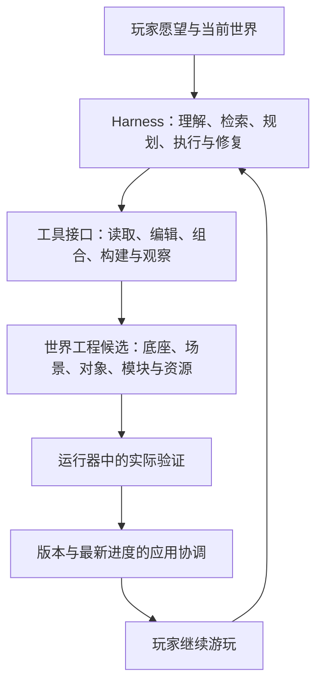

# 最中幻想：一句话愿望的 C / D / L 描述框架与北极星提案

版本：0.1（讨论稿）

日期：2026-09-11

背景：用户希望从创造能力、实现难度和架构三个方面描述一句话的构建。本文保留已有 L0–L4 定义，整理 C0–C6，并提出 D0–D5；这些是项目内部的候选分类，不是行业标准或已实现能力声明。

状态：用于继续讨论和形成统一规则，不重新编号既有开发阶段、不替代既有数据协议，也不启动功能开发或模型任务。

## 1. 建议的北极星

**让普通玩家用自然语言，持续把想象变成可玩、可改、可保存的世界；让同等要求的愿望越来越容易、越来越快、越来越省地实现。**

C / D / L 用来说明目标、选择实现路径和观察进步。北极星衡量玩家得到的结果，不能以“达到更高编号”“增加更多工具”或“模型写了更多代码”代替。

对于同一项体验，成熟模块可以降低实现难度、减少平台改动，玩家得到的功能和质量仍保持。这种“同等目标更容易完成”是平台应追求的进步。更丰富的创造范围与更可靠的交付也需要同步观察。

建议的主指标为：**每周完成至少一个有效愿望并继续游玩的创作者数**。有效愿望需要满足约定的结果、必要检查、真实应用与实际游玩；需要持久化的内容还应有重开证据。暂未观察到重开的记录列为待观察，不直接记成生成失败。

## 2. 三个主维度，外加一份明确的任务说明

| 维度 | 回答的问题 | 记录方式 |
| --- | --- | --- |
| C：创造能力 | 玩家想创造或改变什么体验 | 主类别加关联类别，可以同时涉及多个 C |
| D：实现难度 | 在这次环境与要求下，有多难完成 | 提交前的估计、区间、依据、置信程度；完成后的实际成本另记 |
| L：技术改动范围 | 为实现愿望，要改动哪类实现或契约 | 预计与实际涉及的层集合，不强制只记最高一层 |

三个编号不能完整表达自然语言需求。还需记录：玩家原话、期望行为、作用范围、质量要求、验收条件、当前底座/运行目标、可复用资源与预算。这些信息作为任务说明和现有元数据，无需不断增加新的字母等级。

建议表达：**愿望 = 结果要求 + C 分类 + D 估计 + L 路径 + 验收与实际结果。**

不要相乘 C、D、L 作为统一能力分数。它们不是等距的数值量表；完成一个 C6 世界样例也不能证明任意角色、机制和世界都能生成。

## 3. C：描述玩家获得的创造能力

沿用 C0–C6，作为便于交流的能力类别和展示顺序。C4–C6 包含整合和范围特征，不构成严格的难度排序；实际难度由 D 表达。

| C | 创造能力 | 例子 | 判断要点 |
| --- | --- | --- | --- |
| C0 | 修改已有属性 | 伤害翻倍、已有重力数值变小、换颜色 | 已有语义和接口内的调整，不额外创造新规则 |
| C1 | 创造对象与形态 | 树、人物形象、飞机外形、房屋 | 外观、结构、尺寸和所要求的基础空间表现 |
| C2 | 赋予对象行为 | 狗跟随、树生长、怪物追击 | 对象能按要求行动、反应与互动 |
| C3 | 创造玩法系统 | 钓鱼、制作、宠物成长、飞机驾驶 | 多个行为组成可使用的机制，输入、状态和结果连贯 |
| C4 | 塑造环境与生态 | 城市、河流地貌、季节与动植物关系 | 环境结构、空间使用和所要求的系统关系 |
| C5 | 定义或改写世界规律 | 局部重力反转、时间回溯、空间连接 | 规则对相关对象产生约定的实际影响，而非只改外观 |
| C6 | 组织完整可玩世界 | 能进入、行动、成长并持续发展的世界 | 环境、对象、机制与规律形成完整体验 |

一个请求可以标为“主 C3，关联 C1/C2”，例如制作可驾驶飞机。C 的变化不能仅由对象名决定：白色博美的模型属于 C1，跟随属于 C2，培养与技能成长属于 C3。

此前对 C6 使用“从零创造”的表述应进一步拆开：C 描述结果，生成来源另行记录。成熟模板也可能交付玩家需要的完整世界；应如实标为模板复用，而不是据此证明从零自主设计能力。复用成功不降低玩家结果的价值，也不能冒充原创开发证据。

“修改环境”同样依任务区分：把已有天气切成雨天可以是 C0；新建一套影响植被和动物活动的天气系统涉及 C3/C4。修改一个已开放的重力参数属于 C0，设计多个区域之间不同的重力规则才体现 C5。

## 4. D：描述本次交付难度

D 是基于环境的估计，不是物品名称的固定属性，也不是等待时间承诺。相同愿望的难度会随底座、资源、模块、模型和质量要求改变。

| D | 建议名称 | 典型实现形状 |
| --- | --- | --- |
| D0 | 直接调整 | 已有明确字段和校验，能直接配置 |
| D1 | 成熟复用 | 已有兼容资源或完整模块，只需选择、放置和少量配置 |
| D2 | 局部开发 | 编写有限行为、适配资源或连接少量已知接口 |
| D3 | 子系统开发 | 新增一个有输入、状态、界面与完整使用流程的系统 |
| D4 | 多系统集成 | 多个机制、复杂资源、较大场景、性能或迁移要求共同作用 |
| D5 | 探索与研发 | 关键方法尚未验证，存在底层能力缺口或高不确定性，需要先做实验 |

信息不足时标“难度待评估”，不要为了填满表格强行给出 D5。D5 也不意味着只要多花 token 就一定能完成；需要说明不确定项、实验与后续判断点。

### 4.1 难度依据

- **资源准备**：是否已有合适模型、动画、音效和可复用模块。
- **行为复杂度**：状态数量、交互条件、输入方式和需要处理的边界情况。
- **系统关联**：是否影响战斗、背包、任务、存档和已有世界规则。
- **规模与性能**：对象数量、地图尺度、同时运行的系统和目标设备。
- **质量要求**：示意几何、统一风格、精细模型、动作与声音的完整度。
- **验证难度**：能否可靠观察结果，是否需要真实物理、长时间运行或真人体验。

首版按上述依据给出人工可审阅的等级或区间，不用未经校准的加权公式产生虚假的精确分数。后续以固定任务和实际记录校准估计。

### 4.2 难度的使用规则

记录估计时所用的底座、模块、资源、模型、运行目标和质量要求。将“需求本身需要的复杂体验”与“当前平台交付它的难度”分开保留，D 主要指后者。

同一愿望从没有飞行模块时的 D3/D4，变成有成熟模块时的 D1/D2，是可能的产品进步；这些数字必须经实际样本校准，不能只通过重新打标签证明提效。

失败任务不能在统计时偷偷改成更高 D，成功任务也不能事后降低原始要求。提交前估计与完成后实际耗时、费用、重试和人工介入分别记录；难度可修订，但保留原因和旧值。

## 5. L：描述需要改动的技术范围

| L | 修改范围 | 例子 |
| --- | --- | --- |
| L0 | 世界内容、参数和资源绑定 | 场景文件、物体属性、已支持模块配置 |
| L1 | 普通游戏工程中的规则与脚本 | 宠物跟随、飞行控制、交互、游戏 UI |
| L2 | 可复用扩展的实现、接口或包契约 | 将飞行系统整理成独立模块，声明接口、依赖、升级与状态迁移 |
| L3 | 运行器、宿主或引擎底层能力 | 原生运行接入、底层性能组件、缺失的宿主接口实现 |
| L4 | Agent 的创作策略 | 检索、规划、工具选择、模型路由、失败修复和记忆策略 |

L 描述本次实际改动。普通愿望使用现有策略，不表示每次都修改了 L4；策略版本是环境信息。安装现成模块也不一定要开发 L2，可以只涉及 L0 配置；只有新增或升级可复用能力实现与契约时，才记录相应 L2 工作。

一个局部空间法则可能是 C5、D3、L1，因为已有引擎允许在工程内实现它。一个后台日志修复可能涉及 L3，但没有新增玩家创造能力。C、D、L 因此分别记录，不互相推导。

## 6. 底座、世界、模块、插件、词表、内核与策略

这些名词描述的是不同关系，需要分成“游戏怎样组成”和“Agent 怎样改变游戏”来理解。

### 6.1 游戏怎样组成

**世界作品由底座、场景与对象、玩法模块、素材与数据共同组成，并由游戏运行器执行。**

| 名词 | 在项目中的位置 | 例子 |
| --- | --- | --- |
| 运行器/引擎 | 执行场景、画面、输入、物理和声音的基础 | Godot、现有自研 Web 运行器 |
| 底座 base | 基于运行器提供某类游戏的共同起点与接入约定 | 第一人称、俯视、横版；包括控制、场景组织、观察与状态适配 |
| 世界 world | 玩家实际创作的完整工程/作品 | 玩家自己的森林、城市或飞行世界 |
| 模块 module | 可复用的一组玩法实现 | 背包、宠物、飞行、钓鱼 |
| 对象与场景 object/scene | 具体角色、物体与空间组合 | 博美、飞机、商店建筑、城市街区 |
| 素材与数据 raw/data | 被其他内容使用的资源和配置 | 模型、声音、纹理、物品表、技能数值 |

继续使用 CP 的七类包与 VM/AL 的引用、依赖和状态约定，不为 C/D/L 增加另一套资源格式。底座提供共同接口，但不要求每个底座预置所有可能的玩法。

### 6.2 Agent 怎样改变游戏



**词表/工具接口**是 Agent 能发出的操作以及输入、结果和约束。例如读取工程、修改文件、安装已验证模块、执行构建。它是操作通道，不是和“宠物模块”并列的一种游戏内容。普通脚本编辑工具本身就能表达许多新玩法，不必为每个名词新增专用工具。

**插件**是扩展软件的装载和交付形式，具体属于哪一层取决于职责。游戏玩法插件可以按模块处理；宿主插件可能增加模型后端、文件接口或平台服务，权限和发行边界不同。不要把每个游戏模块都强制变成宿主插件。

**内核**需要指明对象：游戏引擎内核负责引擎执行；Harness 的可信核心负责身份、工具权限、任务与预算、检查、正式应用和恢复。修改前者或后者都不等同于写普通玩法脚本。

**策略**属于 Harness 的决策部分，决定怎样调用现有能力。策略可以版本化改进，但不能通过更改本次评分条件或忽略失败来证明自己更强。平台维护可以有独立版本开发与验收，玩家创作任务不会自动获得修改整个平台的权限。

## 7. 树与歼20：如何避免只按名词估计

下表是分类示例，假设采用支持相应接口的 3D 底座；D 仅为讨论区间，不是当前项目实测或已经支持的承诺。

| 玩家期望 | C 描述 | D 示意及前提 | L 路径 |
| --- | --- | --- | --- |
| 一棵有合适外形与碰撞的树 | C1 | 已有树资源时 D1 | L0 |
| 树能砍伐、掉木头、过一段时间重新生长 | 主 C2，关联 C3 | 无对应模块时 D2–D3 | L0、L1；整理为复用模块时涉及 L2 |
| 树具有复杂生长、季节与生态关系 | C2、C3、C4 | 通常需多系统开发，D4 或先探索 | L1 为主，按实际缺口决定扩展 |
| 一架用于展示的精细歼20模型 | C1 | 有合适模型可为 D1；需制作高质量资源时可能 D3–D4 | 通常为 L0；资源制作另记来源与成本 |
| 玩家能进入飞机、起飞、转弯、降落并退出 | 主 C3，关联 C1/C2 | 没有飞行系统时 D3–D4；成熟资源与模块齐全时可能 D1–D2 | L0、L1；不自动认定需要 L3 |
| 飞机还具备高要求气动、天气、仪表、战斗与损伤 | C3，按环境涉及 C4/C5 | D4–D5，需要明确模拟精度与验证范围 | 先判断工程能力，再决定是否需要 L3 |
| 利用完整成熟模板交付可玩的世界 | C6 | 目标已被模板覆盖时可能 D1–D2 | 主要为 L0 配置，按差异增加实际改动 |
| 在小房间中创造一种新的时间回溯规律 | C5 | 范围虽小，仍可能 D3–D5 | 可能为 L1；取决于状态记录与恢复能力 |

树与飞机都有不同的默认使用期待。解释“一棵树”时，先看当前世界是否已有采集规则；解释“驾驶飞机”时，至少包含操纵与实际飞行，不能只交付一个展示模型。飞行还需要匹配的空间、速度和镜头范围。

不要自动把“生成飞机”扩成完整专业模拟器，也不要默认降成静态摆件。结合上下文给出简短理解摘要，例如“做一架能起降和转弯的街机驾驶飞机”；只有不同解释会显著改变结果、时间或费用时再澄清。玩家可以继续补充或纠正。

## 8. 一个愿望如何进入系统

1. 保留玩家原话，读取相关世界、对象与资源上下文。
2. 形成结果说明：要出现什么、能够做什么、影响哪里、做到什么质量。
3. 拆成必要子任务并标注 C；例如外形、操纵和驾驶流程分别处理。
4. 查询当前能力、模块和素材，估计 D 并说明关键未知。
5. 选择 L 路径：配置、组合、普通脚本、复用扩展或独立平台提案。
6. 在既有任务中执行，按实际检查、应用和状态流程返回结果。
7. 保留实际成本、失败与恢复证据，更新可复用内容和后续估计依据。

### 愿望卡片示例

```text
原话：我想驾驶歼20。
理解：能进入、操纵、起飞、转弯、降落和退出的街机式飞行体验。
范围：当前世界中的一架飞机，以及足够完成这些动作的飞行区域。
质量：约定的机体辨识度与操纵体验；模拟精度另有要求时单列。
C：主 C3；关联 C1、C2；若需扩展环境，再标注 C4。
D：待查询资源与飞行模块；缺少模块时暂估 D3–D4。
L：预计 L0＋L1；发现工程内无法实现的能力再评估扩展。
验收：实际进入和操纵，完成规定飞行动作，退出可继续原世界；
      应用和重开后内容与应保留的状态正确，原玩法继续通过。
结果：尚未执行。耗时、token、采用与重开证据均留空。
```

该卡片是需求说明示例，不是新增公共 API。实施时复用现有需求记录、任务、版本身份、用量与操作回执；不把 D 估计变成新的授权，也不另建第二套计费或存档系统。

## 9. 如何用它衡量项目是否在进步

| 观察方向 | 应测什么 | 应避免的误判 |
| --- | --- | --- |
| 创造范围 | 固定样本中不同 C 与不同领域的实际成功情况 | 一项 C6 演示成功就宣布所有层级全覆盖 |
| 同等目标的可达性 | 相同规模与质量的任务在更新前后的结果 | 缩小功能或降低质量后称为成功率提高 |
| 难度与成本 | 按提交前 D 分组的成功率、耗时、费用、修复和人工介入 | 只改难度标签，或把失败从分母移走 |
| 架构承载力 | 普通愿望中需要修改宿主的比例，以及明确的能力缺口 | 为每个对象增加一个专用工具，再称为通用创造 |
| 复用收益 | 相同结果在无模块/有成熟模块时的实际差异 | 把模板安装冒充模型从零开发 |
| 玩家价值 | 采用、实际游玩、可恢复、继续修改和回访 | 用代码量、工具次数或生成对象数代替满意体验 |

C/D/L 分类本身不证明成功。结果至少区分：已达到约定要求、部分完成、需要澄清、能力缺口、执行失败、玩家取消、观察未完成。部分完成可以有价值，但要保留未完成项；取消与数据未知不能被伪装成技术失败或成功。

建立固定的代表任务与保留样本，按底座、资源/模块、模型、策略版本和质量要求记录，比较时说明哪些条件改变。难度估计冻结于尝试前，实际结果独立记录；保留原始日志，避免分类变化掩盖回归。

面向玩家默认显示“我理解你想得到什么、现在在做什么、还差什么、实际完成了什么”。C/D/L 放在进阶详情和研发视图，不要求玩家学会编号才能表达愿望。

## 10. 对研发决策的实际作用

同一类高频愿望反复出现在 D3/D4 时，优先判断能否沉淀为模块或完善底座接口；收益应通过后续真实任务验证。若很多普通 C1/C2 愿望都要求 L3 平台开发，应检查底座和工具的表达能力是否过窄。

如果低 D 任务仍经常失败，优先检查目标绑定、参数校验、真实运行、版本和恢复，不急于增加更高 C 的宣传样例。若已有能力齐全而 Agent 仍反复走错路径，再通过 L4 的指导、检索与策略对照改善。

长期路线可以同时表现为：更多创造类别可达、相同体验难度降低、普通愿望更少需要平台维护、有效创作成本下降、玩家持续留下作品。不能只沿着 C 或 D 的最大值安排开发。

## 11. 与既有方案衔接

- [产品愿景](PRODUCT_VISION.md)：保留“走进去、说出想法、看见变化、继续创造”的体验；本文件提供候选描述和衡量方式。
- [L0–L4 架构评估](AGENT_LAYERS_ARCHITECTURE_REVIEW_2026-09-11.md)：L 表示改动范围，已发现的真实运行与验证缺口仍需按原证据处理。
- [创作包计划](CREATION_PACKAGE_DEVELOPMENT_PLAN.md)：底座、世界、模块、物件、场景、素材与数据仍使用原七类内容。
- [玩家产品计划](PLAYER_PRODUCT_EXPERIENCE_DEVELOPMENT_PLAN.md)：首次成功、有效修改、修复、继续创作和试玩指标继续复用。
- [AI 效率计划](AI_CREATION_EFFICIENCY_DEVELOPMENT_PLAN.md)：D 校准与策略收益使用真实任务、相同条件和既有用量记录。
- [沉浸主世界方案](IMMERSIVE_PLAYER_AND_MAIN_WORLD_DEVELOPMENT_PLAN.md)：愿望卡片与 C/D/L 服务后台理解和研发，前台保持轻量表达。

后续可先选少量真实愿望，以这套描述填写卡片，检查不同人是否能得到接近的分类和难度估计，再决定正式冻结定义。本次提案不代表已经接受为全项目唯一北极星。
