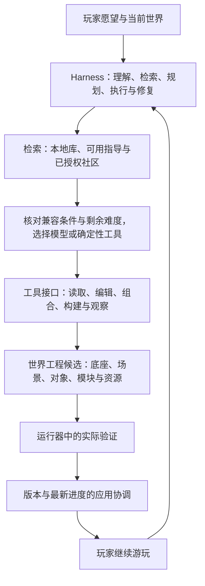

# 最中幻想：C / D / L 愿望框架、模型分工与社区复用总体方案

版本：1.0（汇总 C / D / L、模型分工、知识与内容复用）

日期：2026-09-11

背景：用户希望从创造能力、实现难度和技术改动范围描述一句话的构建，并通过成熟模块、社区与小模型降低重复开发成本。本文件汇总已讨论方向，作为 C0–C6、D0–D5、L0–L4 的产品定义与整体流程入口。这些是项目内部分类，不是行业标准或功能完成声明。

状态：产品与研发方案。C / D / L 的定义按本文组织；字段落盘、模型选择阈值、社区接口、任务数与性能目标在实施前按现有契约和实测冻结。本次只整理文档，不启动开发、安装本地模型、调整玩家设置、运行模型实验或部署社区。

检查基线：`0deefb07dfa57ecb3a0a8a2f0d358f478d31b2e8`。历史架构审计、已交付工程与当前安装包各有对应证据；本文不重写历史结论，也不以新增方案改变已有 Alpha 完成范围。保留原文件路径以兼容已有链接。

阅读顺序：第 1–7 节说明目标、分类与架构；第 8–13 节定义愿望执行、模型分工和社区复用；第 14–16 节说明评测、实施与验收；第 17–18 节列出职责和参考资料。

## 1. 项目北极星与积累方向

**让普通玩家用自然语言，持续把想象变成可玩、可改、可保存的世界；让同等要求的愿望越来越容易、越来越快、越来越省地实现。**

C / D / L 用来说明目标、选择实现路径和观察进步。北极星衡量玩家得到的结果，不能以“达到更高编号”“增加更多工具”或“模型写了更多代码”代替。

对于同一项体验，成熟模块可以降低实现难度、减少平台改动，玩家得到的功能和质量仍保持。这种“同等目标更容易完成”是平台应追求的进步。更丰富的创造范围与更可靠的交付也需要同步观察。

能力积累的方向是：**让一次成功的创造，成为更多玩家下一次创造的起点。** 创作者与较强模型完成新能力，经过整理与验证形成模块、资源、模板及指导；后续愿望可以由更轻量的模型与自动化工具完成配置和组合。是否变快、变准、变省由第 14 节的实测决定。

主指标采用：**每周完成至少一个有效愿望并继续游玩的创作者数**。有效愿望需要满足约定的结果、必要检查、真实应用与实际游玩；应持久化的内容还要有同一版本的重开正确性证据。技术验证、玩家实际游玩和回访分别记录，自动探针操作不能充当真人游玩记录。

统计周、时区、去重身份及重开观察窗口在实施前固定；本地统计使用本地用户配置，远程去重仅在相应统计授权范围内进行。尚缺重开或游玩观察的结果列为待观察，可另报已采用结果，不直接列入完整确认数或记为生成失败。回访与继续修改仍是独立的留存信号，不能只为提高主指标强制玩家重开。

## 2. 三个主维度，外加一份明确的任务说明

| 维度 | 回答的问题 | 记录方式 |
| --- | --- | --- |
| C：创造能力 | 玩家想创造或改变什么体验 | 主类别加关联类别，可以同时涉及多个 C |
| D：实现难度 | 在这次环境与要求下，有多难完成 | 理解需求后的初估、检索后的执行前估计、区间与依据；实际成本另记 |
| L：技术改动范围 | 为实现愿望，要改动哪类实现或契约 | 预计与实际涉及的层集合，不强制只记最高一层 |

三个编号不能完整表达自然语言需求。还需记录：玩家原话、期望行为、作用范围、质量要求、验收条件、当前底座/运行目标、可复用资源与预算。这些信息作为任务说明和现有元数据，无需不断增加新的字母等级。

建议表达：**愿望 = 结果要求 + C 分类 + D 估计 + L 路径 + 验收与实际结果。**

不要相乘 C、D、L 作为统一能力分数。它们不是等距的数值量表；完成一个 C6 世界样例也不能证明任意角色、机制和世界都能生成。

原始愿望、澄清后的范围和质量要求、C 分类不能因选择较小模型或发现低质量模板而悄悄降低。D 与 L 可以随可复用条件变化而更新，但要保留原值和依据。低 D、L0 或合法 JSON 均不能代替权限、影响范围和实际验收。

## 3. C：描述玩家获得的创造能力

沿用 C0–C6，作为便于交流的能力类别和展示顺序。C4–C6 包含整合和范围特征，不构成严格的难度排序；实际难度由 D 表达。

| C | 创造能力 | 例子 | 判断要点 |
| --- | --- | --- | --- |
| C0 | 修改已有属性 | 伤害翻倍、已有重力数值变小、换颜色 | 已有语义和接口内的调整，不额外创造新规则 |
| C1 | 创造对象与形态 | 树、人物形象、飞机外形、房屋 | 外观、结构、尺寸和所要求的基础空间表现 |
| C2 | 赋予对象行为 | 狗跟随、树生长、怪物追击 | 对象能按要求行动、反应与互动 |
| C3 | 创造玩法系统 | 钓鱼、制作、宠物成长、飞机驾驶 | 多个行为组成可使用的机制，输入、状态和结果连贯 |
| C4 | 塑造环境与生态 | 城市、河流地貌、季节与动植物关系 | 环境结构、空间使用和所要求的系统关系 |
| C5 | 定义或改写世界规律 | 局部重力反转、时间回溯、空间连接 | 规则对相关对象产生约定的实际影响，而非只改外观 |
| C6 | 组织完整可玩世界 | 能进入、行动、成长并持续发展的世界 | 环境、对象、机制与规律形成完整体验 |

一个请求可以标为“主 C3，关联 C1/C2”，例如制作可驾驶飞机。C 的变化不能仅由对象名决定：白色博美的模型属于 C1，跟随属于 C2，培养与技能成长属于 C3。

此前对 C6 使用“从零创造”的表述应进一步拆开：C 描述结果，生成来源另行记录。成熟模板也可能交付玩家需要的完整世界；应如实标为模板复用，而不是据此证明从零自主设计能力。复用成功不降低玩家结果的价值，也不能冒充原创开发证据。

“修改环境”同样依任务区分：把已有天气切成雨天可以是 C0；新建一套影响植被和动物活动的天气系统涉及 C3/C4。修改一个已开放的重力参数属于 C0，设计多个区域之间不同的重力规则才体现 C5。

## 4. D：描述本次交付难度

D 是基于环境的估计，不是物品名称的固定属性，也不是等待时间承诺。相同愿望的难度会随底座、资源、模块、模型和质量要求改变。

| D | 建议名称 | 典型实现形状 |
| --- | --- | --- |
| D0 | 直接调整 | 已有明确字段和校验，能直接配置 |
| D1 | 成熟复用 | 已有兼容资源或完整模块，只需选择、放置和少量配置 |
| D2 | 局部开发 | 编写有限行为、适配资源或连接少量已知接口 |
| D3 | 子系统开发 | 新增一个有输入、状态、界面与完整使用流程的系统 |
| D4 | 多系统集成 | 多个机制、复杂资源、较大场景、性能或迁移要求共同作用 |
| D5 | 探索与研发 | 关键方法尚未验证，存在底层能力缺口或高不确定性，需要先做实验 |

信息不足时标“难度待评估”，不要为了填满表格强行给出 D5。D5 也不意味着只要多花 token 就一定能完成；需要说明不确定项、实验与后续判断点。

### 4.1 难度依据

- **资源准备**：是否已有合适模型、动画、音效和可复用模块。
- **行为复杂度**：状态数量、交互条件、输入方式和需要处理的边界情况。
- **系统关联**：是否影响战斗、背包、任务、存档和已有世界规则。
- **规模与性能**：对象数量、地图尺度、同时运行的系统和目标设备。
- **质量要求**：示意几何、统一风格、精细模型、动作与声音的完整度。
- **验证难度**：能否可靠观察结果，是否需要真实物理、长时间运行或真人体验。

首版按上述依据给出人工可审阅的等级或区间，不用未经校准的加权公式产生虚假的精确分数。后续以固定任务和实际记录校准估计。

### 4.2 难度的使用规则

记录估计时所用的底座、模块、资源、模型、运行目标和质量要求。将“需求本身需要的复杂体验”与“当前平台交付它的难度”分开保留，D 主要指后者。

同一愿望从没有飞行模块时的 D3/D4，变成有成熟模块时的 D1/D2，是可能的产品进步；这些数字必须经实际样本校准，不能只通过重新打标签证明提效。

失败任务不能在统计时偷偷改成更高 D，成功任务也不能事后降低原始要求。执行前估计与完成后实际耗时、费用、重试和人工介入分别记录；难度可修订，但保留原因和旧值。

具体顺序为“初步理解与 D 初估 → 查询可复用条件 → 评估剩余工作并固定本次 D → 选择模型与执行路径”。发现候选模块不等于难度已下降：版本、资源完整性、接口冲突、安装适配与验收成本仍需评估。检索本身可能需要模型理解，但不必因此直接启动高成本工程开发。

## 5. L：描述需要改动的技术范围

| L | 修改范围 | 例子 |
| --- | --- | --- |
| L0 | 世界内容、参数和资源绑定 | 场景文件、物体属性、已支持模块配置 |
| L1 | 普通游戏工程中的规则与脚本 | 宠物跟随、飞行控制、交互、游戏 UI |
| L2 | 可复用扩展的实现、接口或包契约 | 将飞行系统整理成独立模块，声明接口、依赖、升级与状态迁移 |
| L3 | 运行器、宿主或引擎底层能力 | 原生运行接入、底层性能组件、缺失的宿主接口实现 |
| L4 | Agent 的创作策略 | 检索、规划、工具选择、模型路由、失败修复和记忆策略 |

L 描述本次实际改动。普通愿望使用现有策略，不表示每次都修改了 L4；策略版本是环境信息。安装现成模块也不一定要开发 L2，可以只涉及 L0 配置；只有新增或升级可复用能力实现与契约时，才记录相应 L2 工作。

一个局部空间法则可能是 C5、D3、L1，因为已有引擎允许在工程内实现它。一个后台日志修复可能涉及 L3，但没有新增玩家创造能力。C、D、L 因此分别记录，不互相推导。

## 6. 底座、世界、模块、插件、词表、内核与策略

这些名词描述的是不同关系，需要分成“游戏怎样组成”和“Agent 怎样改变游戏”来理解。

### 6.1 游戏怎样组成

**世界作品由底座、场景与对象、玩法模块、素材与数据共同组成，并由游戏运行器执行。**

| 名词 | 在项目中的位置 | 例子 |
| --- | --- | --- |
| 运行器/引擎 | 执行场景、画面、输入、物理和声音的基础 | Godot、现有自研 Web 运行器 |
| 底座 base | 基于运行器提供某类游戏的共同起点与接入约定 | 第一人称、俯视、横版；包括控制、场景组织、观察与状态适配 |
| 世界 world | 玩家实际创作的完整工程/作品 | 玩家自己的森林、城市或飞行世界 |
| 模块 module | 可复用的一组玩法实现 | 背包、宠物、飞行、钓鱼 |
| 对象与场景 object/scene | 具体角色、物体与空间组合 | 博美、飞机、商店建筑、城市街区 |
| 素材与数据 raw/data | 被其他内容使用的资源和配置 | 模型、声音、纹理、物品表、技能数值 |

继续使用 CP 的七类包与 VM/AL 的引用、依赖和状态约定，不为 C/D/L 增加另一套资源格式。底座提供共同接口，但不要求每个底座预置所有可能的玩法。

### 6.2 Agent 怎样改变游戏



**词表/工具接口**是 Agent 能发出的操作以及输入、结果和约束。例如读取工程、修改文件、安装已验证模块、执行构建。它是操作通道，不是和“宠物模块”并列的一种游戏内容。普通脚本编辑工具本身就能表达许多新玩法，不必为每个名词新增专用工具。

**插件**是扩展软件的装载和交付形式，具体属于哪一层取决于职责。游戏玩法插件可以按模块处理；宿主插件可能增加模型后端、文件接口或平台服务，权限和发行边界不同。不要把每个游戏模块都强制变成宿主插件。

**内核**需要指明对象：游戏引擎内核负责引擎执行；Harness 的可信核心负责身份、工具权限、任务与预算、检查、正式应用和恢复。修改前者或后者都不等同于写普通玩法脚本。

**策略**属于 Harness 的决策部分，决定怎样调用现有能力。策略可以版本化改进，但不能通过更改本次评分条件或忽略失败来证明自己更强。平台维护可以有独立版本开发与验收，玩家创作任务不会自动获得修改整个平台的权限。

本地模型和云端模型通过同一任务编排及受控工具入口接入。参数或模型权重变化不会产生第二个世界写入者、独立存档或第二套预算账本。游戏内 Agent 与本项目开发用的 Codex 子 agent 是不同运行上下文，本方案不调整开发调度或替换现有产品后端。

## 7. 树与歼20：如何避免只按名词估计

下表是分类示例，假设采用支持相应接口的 3D 底座；D 仅为讨论区间，不是当前项目实测或已经支持的承诺。

| 玩家期望 | C 描述 | D 示意及前提 | L 路径 |
| --- | --- | --- | --- |
| 一棵有合适外形与碰撞的树 | C1 | 已有树资源时 D1 | L0 |
| 树能砍伐、掉木头、过一段时间重新生长 | 主 C2，关联 C3 | 无对应模块时 D2–D3 | L0、L1；整理为复用模块时涉及 L2 |
| 树具有复杂生长、季节与生态关系 | C2、C3、C4 | 通常需多系统开发，D4 或先探索 | L1 为主，按实际缺口决定扩展 |
| 一架用于展示的精细歼20模型 | C1 | 有合适模型可为 D1；需制作高质量资源时可能 D3–D4 | 通常为 L0；资源制作另记来源与成本 |
| 玩家能进入飞机、起飞、转弯、降落并退出 | 主 C3，关联 C1/C2 | 没有飞行系统时 D3–D4；成熟资源与模块齐全时可能 D1–D2 | L0、L1；不自动认定需要 L3 |
| 飞机还具备高要求气动、天气、仪表、战斗与损伤 | C3，按环境涉及 C4/C5 | D4–D5，需要明确模拟精度与验证范围 | 先判断工程能力，再决定是否需要 L3 |
| 利用完整成熟模板交付可玩的世界 | C6 | 目标已被模板覆盖时可能 D1–D2 | 主要为 L0 配置，按差异增加实际改动 |
| 在小房间中创造一种新的时间回溯规律 | C5 | 范围虽小，仍可能 D3–D5 | 可能为 L1；取决于状态记录与恢复能力 |

树与飞机都有不同的默认使用期待。解释“一棵树”时，先看当前世界是否已有采集规则；解释“驾驶飞机”时，至少包含操纵与实际飞行，不能只交付一个展示模型。飞行还需要匹配的空间、速度和镜头范围。

不要自动把“生成飞机”扩成完整专业模拟器，也不要默认降成静态摆件。结合上下文给出简短理解摘要，例如“做一架能起降和转弯的街机驾驶飞机”；只有不同解释会显著改变结果、时间或费用时再澄清。玩家可以继续补充或纠正。

## 8. 一个愿望如何进入系统

1. 保留玩家原话，读取相关世界、对象与资源上下文。
2. 形成结果说明：要出现什么、能够做什么、影响哪里、做到什么质量。
3. 拆成必要子任务并标注 C；例如外形、操纵和驾驶流程分别处理。
4. 查询当前能力、本地库与可用社区，取得少量固定版本候选；核对功能、兼容性、依赖、使用权限与实际检查范围。
5. 根据未被现成能力覆盖的工作固定执行前 D，记录预计 L、模型选择和未知项；整体结果复杂不等于每个子任务都必须使用强模型。
6. 调用确定性工具，或让经该类任务评测的模型配置、适配、开发；任务绑定同一世界、原始要求、基线和总预算。
7. 通过真实构建、功能与状态检查，再沿用现有主动采用或已授权自动应用流程；失败时修正具体问题、有限升级或保留草稿。
8. 记录实际成本、来源与结果。适合复用的成果先形成本地候选，再由玩家保存或按明确规则归库；公开发布使用独立授权入口。

### 愿望卡片示例

```text
原话：我想驾驶歼20。
理解：能进入、操纵、起飞、转弯、降落和退出的街机式飞行体验。
范围：当前世界中的一架飞机，以及足够完成这些动作的飞行区域。
质量：约定的机体辨识度与操纵体验；模拟精度另有要求时单列。
C：主 C3；关联 C1、C2；若需扩展环境，再标注 C4。
D：待查询资源与飞行模块；缺少模块时暂估 D3–D4。
检索：查询当前库与已授权社区中的可驾驶飞行能力，区分静态模型和完整模块。
复用判断：版本、依赖、输入、镜头、保存与飞行区域均相容后再下调 D。
L：预计 L0＋L1；发现工程内无法实现的能力再评估扩展。
模型分工：兼容成熟模块的选择与配置可由经验证的小模型完成；
          新增控制逻辑或复杂状态适配使用更强模型，安装与检查由工具执行。
验收：实际进入和操纵，完成规定飞行动作，退出可继续原世界；
      应用和重开后内容与应保留的状态正确，原玩法继续通过。
结果：尚未执行。耗时、token、采用与重开证据均留空。
```

该卡片是需求说明示例，不是新增公共 API。实施时复用现有需求记录、任务、版本身份、用量与操作回执；不把 D 估计变成新的授权，也不另建第二套计费或存档系统。

## 9. 如何用它衡量项目是否在进步

| 观察方向 | 应测什么 | 应避免的误判 |
| --- | --- | --- |
| 创造范围 | 固定样本中不同 C 与不同领域的实际成功情况 | 一项 C6 演示成功就宣布所有层级全覆盖 |
| 同等目标的可达性 | 相同规模与质量的任务在更新前后的结果 | 缩小功能或降低质量后称为成功率提高 |
| 难度与成本 | 按提交前 D 分组的成功率、耗时、费用、修复和人工介入 | 只改难度标签，或把失败从分母移走 |
| 架构承载力 | 普通愿望中需要修改宿主的比例，以及明确的能力缺口 | 为每个对象增加一个专用工具，再称为通用创造 |
| 复用收益 | 相同结果在无模块/有成熟模块时的实际差异 | 把模板安装冒充模型从零开发 |
| 玩家价值 | 采用、实际游玩、可恢复、继续修改和回访 | 用代码量、工具次数或生成对象数代替满意体验 |

C/D/L 分类本身不证明成功。结果至少区分：已达到约定要求、部分完成、需要澄清、能力缺口、执行失败、玩家取消、观察未完成。部分完成可以有价值，但要保留未完成项；取消与数据未知不能被伪装成技术失败或成功。

建立固定的代表任务与保留样本，按底座、资源/模块、模型、策略版本和质量要求记录，比较时说明哪些条件改变。检索前与检索后的难度都保留，执行前冻结用于本次比较的 D，实际结果独立记录；保留原始日志，避免分类变化掩盖回归。

复用成果完成同等愿望可以计为产品成功，另记录“直接复用、配置复用、适配复用、新增开发、混合实现”等来源。衡量从零开发能力时单独使用对应任务与证据，不能把复用成功算成自主发明了全部系统。

面向玩家默认显示“我理解你想得到什么、现在在做什么、还差什么、实际完成了什么”。C/D/L 放在进阶详情和研发视图，不要求玩家学会编号才能表达愿望。

## 10. 对研发决策的实际作用

同一类高频愿望反复出现在 D3/D4 时，优先判断能否沉淀为模块或完善底座接口；收益应通过后续真实任务验证。若很多普通 C1/C2 愿望都要求 L3 平台开发，应检查底座和工具的表达能力是否过窄。

如果低 D 任务仍经常失败，优先检查目标绑定、参数校验、真实运行、版本和恢复，不急于增加更高 C 的宣传样例。若已有能力齐全而 Agent 仍反复走错路径，再通过 L4 的指导、检索与策略对照改善。

长期路线可以同时表现为：更多创造类别可达、相同体验难度降低、普通愿望更少需要平台维护、有效创作成本下降、玩家持续留下作品。不能只沿着 C 或 D 的最大值安排开发。

## 11. 小模型、快速模型、强模型与确定性工具的分工

### 11.1 路由依据

先核对请求、目标和可复用条件，再按剩余开发量、关联范围、验证难度和模型实测能力选择执行方式。D 是输入之一，不是硬编码的模型选择表；高 C 的成熟模板可能容易安装，低 C 的修改也可能触及复杂关联。

| 工作 | 建议承担者 | 前提与实际完成依据 |
| --- | --- | --- |
| 参数面板的明确调整 | 确定性程序 | 对象与字段已选定，类型、范围和关联约束可校验；无需模型重新解释 |
| 简短愿望理解、查询词和有限参数提取 | 经评测的小模型或快速模型 | 紧凑上下文、明确目标、有限接口；理解和来源有据可查 |
| 成熟资源选择、模块配置 | 经评测的小模型或快速模型 | 宿主先筛选兼容候选；安装、校验和应用由工具完成 |
| 小量适配与已知故障修复 | 对该类任务有证据的模型 | 明确接口和具体错误，改动范围受限；不因“小任务”免除检查 |
| 新机制、多文件开发、复杂迁移 | 较强模型 | 保留原始需求、必要工程上下文和独立验证，实际预算允许 |
| 底层方法尚未成立 | 独立研发任务与适当模型 | 先做验证性实验；模型升级本身不能补齐缺失的运行环境 |
| 下载、解包、依赖解析、构建、检查、保存和应用 | 确定性宿主服务 | 使用既有 CP/AL/VM/GD 流程、固定身份与真实回执 |

一项复杂愿望可以由强模型规划或补写缺失部分，小模型完成明确的配置，工具完成确定性执行；不要求每个请求经过全部模型。已经足够明确的任务可以直接执行，避免为一个简单修改增加多轮分类与转述。

### 11.2 本地 4B 的可验证边界

本地 4B 模型适合作为有限理解、候选选择和参数配置的实验对象。它收到的应是当前任务必要信息、少量筛选过的候选、准确字段及短示例；需要时再按固定引用读取更多资料。

以 Qwen3-4B-Instruct-2507 为例，官方模型卡提供了工具调用与本地部署说明，说明该方向有实现基础。这里仅作技术例子，不选定生产模型、不承诺其能达到本项目的成功率或速度。[官方模型卡](https://huggingface.co/Qwen/Qwen3-4B-Instruct-2507)

参数规模、非思考模式和本地部署是三个不同属性。模型能输出 JSON 或调用函数，不代表选对了对象、理解了愿望或完成了游戏开发。宿主校验结构、目标和范围，再由实际运行判断功能；模型自报置信度只能辅助，不能单独放行。

在游戏同时运行时测量实际首响应、完整完成耗时、帧时间、内存及显存占用；记录具体模型版本、量化方式、上下文设置和设备。权重文件大小不等于总运行占用，本地运行也不等于无成本或总比云端快。

### 11.3 升级、失败与任务连续性

任务可以提出更强模型的执行路径，但仅在玩家已配置的模型选择、联网范围和费用上限内使用。固定本地或禁止云端的设置持续有效；不可用时保留草稿与具体缺口，不自动向未授权服务发送世界资料。

优先返回具体错误并按 AI 计划有限修复；属于推理或设计不足且仍有预算时再升级。依赖不存在、版本冲突、磁盘满和服务断连分别处理，不把它们全部变成“大模型重写”。较强模型开始时接收必要事实、原始要求、已完成产物及原操作状态，避免从头重复安装。

路由、检索、识别、生成、修复、评审、重试与远程服务用量都计入原任务预算。操作结果不确定时先查询原回执；切换模型不会取消已完成写入、重置额度或使已提交操作重复执行。语音识别服务与创作模型分开配置，转写成功不等于创作已完成。

## 12. 从参考资料到可执行的复用能力

### 12.1 四种不同的帮助

| 复用材料 | 已经提供什么 | 本次仍需完成什么 |
| --- | --- | --- |
| 教程、说明、Skill | 知识、接口和操作步骤 | 理解并实现或配置；说明中的接口与实际版本要一致 |
| 可运行参考工程 | 有源码和运行样例 | 查找相关部分、抽取依赖、适配当前工程，可能仍是复杂开发 |
| 标准化模块/对象/场景 | 已封装实现、参数和兼容接口 | 选择、配置、安装与当前世界组合验证 |
| 完整世界模板 | 已组织好的可玩整体 | 创建独立世界、按差异修改，或另外开展功能提取 |

“社区有一个飞行世界”不自动等于“当前世界能直接装上其中的飞行功能”。功能可能与特定地形、角色、镜头、全局脚本和进度结构绑定。可以整体创建独立世界；抽取模块需要重新检查边界与依赖，并据此估计 D。

即使使用成熟模板，仍以原愿望的玩法、范围和质量为准。完整世界可以作为 C6 的产品交付，来源记录为复用；从零开发能力的评测使用单独证据。

### 12.2 让社区内容适合 Agent 使用

一个可复用版本至少应带有：

- 准确的内容类型、不可变资源引用、作者与派生来源。
- 面向用途的能力说明，例如“支持进入、起降、转弯和退出”，而不只有“飞机”标签。
- 必须的底座、引擎、运行目标、接口与完整依赖，区分必需和可选能力。
- 可配置参数、实例身份、状态结构、初始状态与适用的迁移说明。
- 可执行安装入口或受控安装配方，以及实际检查记录和已知限制。
- 使用与分发范围，正文取得方式、版本状态和撤回信息。

“安装配方”表示对既有受控工具的步骤和参数约定，不是可任意执行宿主命令的说明书。需要辅助脚本的部分按原包类型和执行边界审查。元数据扩展由 CP/AL/CC 共同冻结，沿用七类包；不新增拥有特殊权限的第八类“AI 技能资源”。

作者描述、系统静态检查、真实运行证据、目标世界的安装结果分别记录。作者写了“兼容”或社区标为热门，不能替代当前组合的运行验收。过期、不完整或不可信的证据显示实际范围。

### 12.3 能力如何积累


可从成功任务提炼说明、参数和检查草案，减少作者整理负担；自动提炼的说明不自动成为可信指导，发布也不从自动保存触发。保留失败场景和兼容性问题，帮助后续筛选与修复，而不只收集成功截图。

前期增长主要来自资料、模块、工具和检索供给。把内容放入社区不会自动改变模型权重。微调或蒸馏属于后续独立方案，需要适用数据权利、质量与效果证据；不能把普通分享等同于授权训练。

## 13. Agent 查询社区与复用的完整流程

### 13.1 同一目录，两种使用入口

网站提供浏览、预览、版本详情和发布；Agent 通过结构化目录接口查询相同的可见内容。权限、资源引用、兼容信息和状态语义一致，但返回给模型的内容更紧凑。

先查当前世界与本地已安装资源，再查已配置和授权的社区来源。没有社区或处于离线状态时，本地功能仍可运行；陌生网页只作为参考线索，不能绕过正规包校验成为可安装资源。

检索输入只包含完成搜索所需的功能、底座、目标和接口约束；本地目录与私人源码不随查询自动上传。检索记录和缓存遵循用户作用域及访问权限，不能通过缓存暴露其他账号的私有内容。

### 13.2 查询、筛选与核验

1. 从愿望取得必需功能与质量边界，保留原话以及解释依据。
2. 按可见范围、资源类型、底座/引擎/目标、已知不兼容和版本状态进行筛选。未知兼容性单列为待验证候选。
3. 用功能标签、关键词和语义匹配寻找少量候选；具体召回与排序方式按规模和失败样本选择，不默认引入复杂向量平台。
4. 排序优先考虑功能匹配、兼容证据、依赖和适配成本，再参考质量与使用反馈；下载量和营销描述不能单独决定安装。
5. 按固定引用读取候选详情、必要源码、参数、检查范围与限制。正文按需读取，结果数量与总上下文有界。
6. 确认实际内容和版本后评估剩余 D、预计 L 与模型需求，锁定依赖；搜索命中本身不是安装成功。

### 13.3 安装、升级与反馈

取得准确版本 → 校验正文与完整依赖 → 在当前世界草稿安装/配置 → 检查输入、镜头、UI、场景、状态和规则冲突 → 实际运行与进度兼容检查 → 按既有授权应用 → 保存结果与来源。

模型负责提出选择与参数，宿主执行下载、解包、依赖解析、检查和应用。用小模型省掉开发工作时，必要检查仍然保留；检查已知缓存只在输入和条件匹配时复用。

安装新版不自动替换当前使用版本；发布者撤回、内容缺失或校验失败时按 CC 的撤回与恢复规则处理。新建实例使用准确初始状态，升级保留兼容进度；复制资源不能共享一次性奖励账本。

无合适候选时，可以适配已有实现、开发缺失部分、形成平台能力提案或解释当前范围。无结果缓存需要条件与时效，不能永久认定社区没有某能力。循环查询没有新信息时停止重复检索。

普通创作请求可以包含已授权范围内的读取与本地安装流程；不会自动授权购买付费资源、公开发布作品或扩大宿主权限。社区描述、代码注释、README 和 Skill 均不能代替玩家授权或签发通过结果。

## 14. 如何验证小模型和社区复用是否有效

### 14.1 先验证管线，再进行效果比较

第一轮从当前实际可用模块中挑选 4 类任务：明确参数、单实例安装、两个模块组合、已知不兼容的处理。比较本地 4B、快速云模型和较强模型三个候选，共 12 次任务用于发现接线问题。候选模型不可用时如实列缺项，不以模拟器充当该模型结果。

这 12 次仅是建议的管线试验，不足以估计稳定成功率。本次不运行；实施前确认允许的模型、硬件、预算、数据范围和真实接口。已在会话授权范围内的设置不重复请求，新的费用或数据范围按实际需要处理。

### 14.2 三个问题分别做对照

| 实验 | 改变的条件 | 保持一致的内容 | 要回答的问题 |
| --- | --- | --- | --- |
| 模型选择 | 本地 4B、快速云模型、较强模型 | 相同模块、工具、输入世界、质量和验收 | 哪些明确任务能可靠交给较小模型 |
| 复用收益 | 仅必要说明/参考实现，与提供可安装模块 | 同一模型、愿望、底座、质量和判定；其余资源条件固定 | 模块化本身减少了多少开发、错误和等待 |
| 自动路由 | 经评测的自动路径与固定模型路径 | 同一整批任务、资源、预算口径和结果标准 | 包括检索、分流与失败升级后，整体是否更好 |

必要 API 文档不因“无模块组”而被删除；参考工程和可安装模块的差别作为明确实验变量记录。查社区的成功率先与“已经给定正确候选”的模型能力分开，再在整条流程上测量检索错误造成的影响。

每类任务在预算内重复独立运行，随机交错顺序，固定起始快照与记忆条件；任务数和观察窗口在开始前冻结。模型训练/提示调优样本与最终保留样本分开。模型、量化、上下文、引擎、模块、策略和设备版本全部记录。

已有 AI 计划中的“思考模式 × Skill”实验继续单独执行。不能在一个对比里同时换模型、增加模块、修改提示词和减少验收，再将全部改善归给小模型或社区。

### 14.3 指标与失败口径

分别记录：需求解释、候选检索、工具调用合法性、正确目标与参数、真实安装/运行、采用、保存重开和原玩法回归。JSON 合法率不是愿望成功率；模型调用工具返回成功也不是最终可玩结果。

从提交到结果的耗时包括检索、下载、推理、导入/构建、验证、修复与应用，另列用户暂停和网络等待。冷热缓存分开报告，游戏同时运行与空载分别测量；只比较 token 生成速度不足以说明玩家体验。

费用统计包含该批次成功和失败任务的实际消耗及升级重试；有成功结果时可报告“总实际费用 / 完整成功愿望数”，分母为零时不计算该比值。缺失价格、未结算请求、仅本地资源消耗和外部服务费用分别记录，不把未知写成零。

缺少资源、兼容失败、模型理解错误、实现错误、环境故障、玩家取消、人工介入和观察未完成分别统计。整条产品流程保留能力缺口，评估模型配置能力时另报已具备完整资源条件的子集，不能只留下成功安装样例。

官方资料和别人的评测只用于选择实验候选，不能代替本项目的验收。正式推广前，所覆盖任务中的身份串用、静默覆盖、重复应用、进度损坏或虚报完成应全部解决；速度与费用目标在取得基线后确定。

## 15. 实施次序与职责

本节 WR0–WR5 表示本方案的六个工作包，用于衔接已有能力；不重新定义 P、IW、AI、CP、AL、VM、CC，也不加入当前 Alpha 的既定完成条件。本次不自动派发任务。

| 工作包 | 交付 | 依赖与出口 |
| --- | --- | --- |
| WR0：统一愿望记录与基线 | 原话、范围、质量、C、多次 D 估计、预计/实际 L、原任务和结果关联 | 复用现有需求、任务和用量；少量任务分类可审阅，指标去重与状态口径明确 |
| WR1：本地可复用能力 | 小型经过验证的模块/模板集，参数、兼容说明、固定依赖和安装检查 | 复用 AL/CP/VM；能在独立世界安装重开，问题不由社区规模掩盖 |
| WR2：小模型配置试验 | 接入实际可用模型，有限候选/参数流程，真实失败和成本记录 | WR1 与 AI 工具链；先证明有限配置任务，再扩大小模型范围 |
| WR3：社区查询与本地安装 | 结构化目录、适用过滤、按需详情、权限与版本一致性 | 使用 CC 目录/下载子集与 WR1，不等待完整论坛、交易或团队协作 |
| WR4：自动路由与复杂适配 | 检索后分流、局部升级、原操作恢复及统一总预算 | WR2/WR3 的实际证据；整条流程对照优于或明确适用于固定路径 |
| WR5：能力沉淀与持续评测 | 成功成果整理、版本验证、明确发布、反馈与失效处理 | CP/AL/CC 与原有回归；再次复用的收益有相同质量下的真实证据 |

WR1 和 WR2 可以先完全在本地进行。WR3 的社区网络能力单独交付；没有网站不阻止参数、小模型与本地模块试验。需要安排并行开发时遵循 AGENTS，使用 Codex 子 agent，由总控安排依赖与集成。

首个实作样本宜选择当前已验证的对象参数或简单互动模块。飞行、城市和完整世界保留为目标与后续任务，不能为了给小模型造演示样例，先默认它们已经可安装。

## 16. 必须覆盖的验收场景

以下 24 项为后续待执行案例，结果绑定准确版本和证据。普通文档检查不算这些功能已验收。

| 编号 | 场景 | 完成依据 |
| --- | --- | --- |
| WR-A01 | 同一名词有不同用途 | 静态飞机与可驾驶飞机的行为和质量分别描述，不用模型替用户降低目标 |
| WR-A02 | 高 C、低 D 的成熟模板 | 允许复用达成完整结果，来源准确，不宣称从零开发 |
| WR-A03 | 检索改变剩余难度 | 保留初估、检索条件与执行前 D，找到候选不自动记为兼容安装 |
| WR-A04 | L 与模型规模的关系 | 只记录本次实际技术改动，不把使用策略等同于修改 L4 |
| WR-A05 | 参数面板直接修改 | 已知操作由程序完成，原授权、范围和应用检查正确 |
| WR-A06 | 小模型调用工具 | 类型与必需字段校验，实体身份由宿主核对，合法 JSON 不冒充功能成功 |
| WR-A07 | 搜索结果过多或说明很长 | 先筛选和分页，必要内容按需取得，关键要求不因截断丢失 |
| WR-A08 | 参考工程抽取模块 | 发现实际依赖与适配成本，不把有样例自动视为可安装模块 |
| WR-A09 | 无资源或不兼容 | 如实报告缺项，选择合理适配或开发，不无限重复检索或盲目升级模型 |
| WR-A10 | 私有内容与缓存 | 各账号的检索、下载和缓存权限一致，不泄漏资料或凭据 |
| WR-A11 | 版本变更与内容篡改 | 固定引用和哈希一致，旧世界不被最新版本自动覆盖 |
| WR-A12 | 社区声明与验证证据 | 作者说明、历史检查和当前目标验证分开，不凭热门标签放行 |
| WR-A13 | 恶意 README、Skill 或脚本描述 | 不增加权限、不自动执行任意宿主命令、不自行上传世界 |
| WR-A14 | 组合模块冲突 | 输入、镜头、UI、全局名、实体和状态冲突被发现并有具体结果 |
| WR-A15 | 新实例与升级存档 | 新实例使用独立初始状态，升级保留兼容进度与一次性奖励记录 |
| WR-A16 | 安装或应用的丢回复 | 查询原 operationId，切换模型和重试不重复写入或发奖 |
| WR-A17 | 固定本地模型与费用限制 | 不静默换云端、不重置预算、不因路由放宽工具能力 |
| WR-A18 | 模型升级与失败保留 | 仅在允许范围内升级，复用原事实和产物，失败保留可恢复任务 |
| WR-A19 | 低成本但功能缩水 | 验收仍依据原愿望和质量，不把静态摆件算成驾驶系统 |
| WR-A20 | 模型、复用和路由对照 | 单独控制变量，冷热缓存、设备、失败、重试和人工介入记录完整 |
| WR-A21 | 来源提炼和社区发布 | 自动提炼先形成草案，作者发布范围明确，不从普通保存自动外发 |
| WR-A22 | 大型内容下载及游戏并行运行 | 记录完整耗时和资源占用，本地模型不以游戏卡顿换取虚假提速 |
| WR-A23 | 有效愿望与留存统计 | 按稳定操作和创作者去重，未观察重开/游玩单列，探针不算真人 |
| WR-A24 | 后续复用与新版本回归 | 同等要求下再次安装仍正确，接口变化使原证据待复验，未通过版本不推广 |

测试继续遵循 [AGENTS.md](../AGENTS.md)：使用独立 headless 进程和数据目录，初始化禁用 `requestPointerLock`，不发送真实鼠标/键盘、不抢焦点、不操控用户浏览器，不使用 Playwright 输入模拟验收。真实麦克风、输入手感和游戏舒适度另由安排好的真人试玩证明。

## 17. 与已有方案的唯一职责关系

| 计划 | 负责的规则 | 本文件与它的关系 |
| --- | --- | --- |
| 本文件 | C / D / L、愿望说明、检索后分流、复用收益与主指标 | 作为连续讨论的整体设计入口；不定义第二套运行 API |
| [产品愿景](PRODUCT_VISION.md)、[玩家产品计划](PLAYER_PRODUCT_EXPERIENCE_DEVELOPMENT_PLAN.md) | 玩家流程、结果展示、首次成功、继续创作与试玩 | 使用相同北极星和统计口径，C/D/L 默认留在详情 |
| [AI 效率计划](AI_CREATION_EFFICIENCY_DEVELOPMENT_PLAN.md) | 模型适配、思考强度、Skill、预算与具体实验 | 加入小模型和检索后路由，原思考/Skill 实验独立保留 |
| [素材库计划](ASSET_LIBRARY_DEVELOPMENT_PLAN.md) | 本地正文、索引、版本与使用关系 | 为复用提供准确资源和紧凑元数据 |
| [创作包计划](CREATION_PACKAGE_DEVELOPMENT_PLAN.md) | 七类内容、开发接口、固定依赖、安装和导出 | 管理能力、参数及安装配方的归属，不新增包体系 |
| [社区计划](COMMUNITY_PLATFORM_DEVELOPMENT_PLAN.md) | 账号权限、上传、目录、分发、撤回与反馈 | 人和 Agent 共用资源身份与权限，提供结构化检索入口 |
| [版本管理计划](VERSION_MANAGEMENT_DEVELOPMENT_PLAN.md) | ContentRef/BuildRef/ProgressRef、操作、应用与恢复 | 所有模型与复用路径使用同一正式状态来源 |
| [沉浸主世界方案](IMMERSIVE_PLAYER_AND_MAIN_WORLD_DEVELOPMENT_PLAN.md) | 游戏内表达、目标、任务和变化呈现 | 多模型和社区细节由后台承担，玩家仍通过愿望持续创造 |
| [整体实施计划](OVERALL_DEVELOPMENT_PLAN_2026-09-11.md) | 当前 Alpha 工作包与既定出口 | 本文后续工作独立安排，不倒改原交付条件 |

已有[架构评估](AGENT_LAYERS_ARCHITECTURE_REVIEW_2026-09-11.md)保留对应版本的审计事实；后续实现已变化的部分按新证据复核，不把历史缺口原样写成当前阻塞。

## 18. 外部参考与本版变更记录

以下资料在本次连续讨论中查阅，用于说明方法与实验候选，不用于证明最中幻想已达到相同能力或指标：

- [Qwen3-4B-Instruct-2507 官方模型卡](https://huggingface.co/Qwen/Qwen3-4B-Instruct-2507)：提供 4B 模型的工具调用与本地使用示例。生产适配需按实际模型、量化和推理程序版本验证。
- [Qwen 工具调用说明](https://qwen.readthedocs.io/en/stable/framework/function_call.html)：说明工具描述、结构化参数和执行后返回结果的组织方式；工具格式约束不能替代语义和运行验证。
- [Anthropic：Building effective agents](https://www.anthropic.com/engineering/building-effective-agents)：给出检索/工具增强、路由及按任务选择模型的设计参考，适合用来组织候选方案。

v1.0 在原 0.1 讨论稿上统一了北极星、执行前 D 的时机、模型分工、四种复用材料、社区查询/安装、能力沉淀、对照实验、六个工作包和 24 项待执行验收。保留原路径和 C0–C6、D0–D5、L0–L4 定义，实际资源与运行契约继续由原专项维护。
