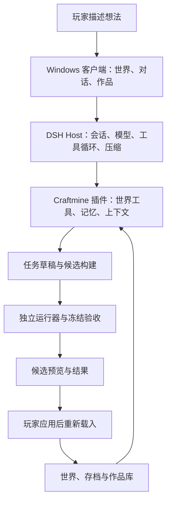

> 历史版本：本文件保留 2026-09-09 的 v1 决策与复盘记录，已由 [当前 v2 计划](<D:/Craftmine World/docs/WINDOWS_CLIENT_REUSE_PLAN.md>) 替代。本文不作为开发执行指令。

# craftmine world / 最中幻想：Windows 客户端与 DeepSeek Harness 源码复用计划

版本：1.0 · 2026-09-09。代码复盘基线：490f6dc，并包括本轮开始前已有的未提交改动。复盘期间另有增量改动；最终自动测试快照时间为北京时间 06:20。

**执行状态：本线程的旧持续开发任务已取消。本轮完成复盘与重新规划，尚未开始桌面迁移，也未创建新的目标或定期任务。** 本文作为后续开发的建议主计划；旧 P0–P7 与 M1–M5 记录继续保留为历史证据。

## 1. 建议调整的方向

采用 **DeepSeek Harness 的桌面端和 Agent 内核作为底座，把 Craftmine World 已有的游戏系统接成产品插件**。通用会话、工具循环、模型连接、提示词装配、自动压缩和桌面进程管理，优先直接复用源码。我们的主要开发精力转向世界创作、玩法验证、作品记忆和使用体验。

上一版把 Windows 交付放在路线后段，并继续补自己的通用 Harness。现在将 Windows 客户端提前，先证明上游底座能够承载我们的世界，再逐步替换已有的通用基础设施。

最终产品仍然是：打开一个 Windows 软件，进入自己的世界，一边游玩一边描述想法，Agent 查找已有成果、编写实际代码、验证效果，交付可预览的新版本。你决定何时应用；重新载入后继续游玩。树、花草、血条、枪械和近战，都是可以保存、修改、组合的创作成果。

首个客户端继续面向你本人在 Windows x64 本机使用。开发、游玩、素材三个工作区作为产品布局，默认显示世界画面与创作对话，详细代码、任务轨迹和调试信息按需展开。

## 2. 当前项目到底做到哪里

最终复盘快照运行 npm test：**271 项通过，0 失败、0 跳过**。最初快照为 267 项；因随后工作区新增了代码和测试，末次复跑覆盖了这些变化。这是本地自动测试结果，本轮复盘没有新发起付费模型任务，也未启动用户浏览器。[最终测试日志](<D:/Craftmine World/test-results/windows-plan-final-snapshot-20260909.log>)

| 部分 | 代码与记录支持的现状 | 接下来如何处理 |
| --- | --- | --- |
| 世界与外观 | 已有 3D 世界、移动、碰撞、对象、花草表达和图片／GLB 素材绑定；仍是有限世界的原型 | 保留当前引擎和素材系统，先迁移承载方式 |
| 真实玩法代码 | 已有 Worker 运行器、状态、事件、命令、资源／背包、生命值、音效及状态迁移 | 作为游戏领域核心保留，继续通过实际运行验收 |
| 作品复用 | 已有包含对象、源码、参数、版本与依赖的作品库，以及导出、跨项目安装和回退能力 | 接入新客户端的作品／素材工作区 |
| 创作交付 | 已有任务草稿、局部补丁、候选构建、差异预览、应用事务和最新进度保存 | 保留这套领域事务，接到上游工具入口 |
| 自建工具循环 | 已有 14 个领域工具及分步协调器；代码默认仍要显式设置 CRAFTMINE_HARNESS_LOOP=1 才走此路径 | 领域工具保留，循环调度迁往 DSH；不能把“代码存在”写成“默认入口已全面切换” |
| 记忆与压缩 | 已有类型化记忆、预算、检查点；未提交改动增加了压缩后恢复和短账目续接 | 记忆保留并加强证据校验；通用语义压缩采用上游实现 |
| 独立验收 | 已有冻结需求、确定性断言、轨迹裁判和反造假测试 | 保留并接入真实任务；当前 runHarness 的 verify.run 仍主要是接口／事件检查，并不等于玩家需求验收 |
| 能力扩展 | 最近两次提交已把扩展命令接入玩法路径和游戏页面；工作区另有扩展作者入口等改动 | 基础机制保留；真实模型端到端成功和长时间运行仍需证据 |
| Windows 客户端 | 当前启动入口仍是 Node 服务与网页；没有 Electron 客户端工程和安装包 | 新路线的首要交付 |

主要代码依据：[协调器与实际入口](<D:/Craftmine World/app/agent.mjs>)、[领域工具](<D:/Craftmine World/app/harness/tools.mjs>)、[草稿工作区](<D:/Craftmine World/app/harness/workspace.mjs>)、[世界存储](<D:/Craftmine World/app/store.mjs>)、[玩法运行时](<D:/Craftmine World/app/world-runtime.mjs>)、[记忆记录](<D:/Craftmine World/app/harness/memory-records.mjs>)。

### 最近开发中需要如实保留的缺口

- 2026-09-09 06:03 的真实模型记录中，强制压缩确实发生了三次，随后模型反复读取资料，最终仍因上下文阈值失败。它证明压缩路径被触发，尚未证明任务连续性。[现有失败报告](<D:/Craftmine World/test-results/live-compaction-v7Irpd/report.json>)
- 扩展的对抗评审断言目前会被保存，但 stageExtension 没有把这些新增断言逐一交给轨迹裁判执行；这需要补接，不能用“评审没有阻断”代替实际验证。[装载流程](<D:/Craftmine World/app/harness/extension-loader.mjs>)
- 旧计划中的“扩展未接入游戏”已被后续提交解决；状态 JSON 中“从 P0 开始”也已落后。因此本次以代码、提交和测试分别判断状态。
- 未提交的压缩恢复、扩展生成等改动先保留。迁移前整理成可复现基线，并把已验证部分与实验部分分开登记。
- 复盘期间的新扩展记录显示，真实模型已经能生成扩展提议并通过自带测试，但一轮仍被对抗评审阻断；另一份报告只记录了起始世界检查，不能算端到端通过。[完整失败记录](<D:/Craftmine World/test-results/live-extension-s9WEHQ/report.json>)、[仅有起始检查的记录](<D:/Craftmine World/test-results/live-extension-aANCjU/report.json>)

本轮还停止了上一轮遗留的 live-compaction 测试及其 12 个所属进程（含测试主进程），确认这些进程均已退出。未重启个人创作服务或修改个人存档。

**并行活动说明：** 复盘期间另一个 PI Desktop 进程在本目录启动了 live-extension 测试，工作区也出现了新的未提交改动。没有关闭该应用或覆盖这些代码；本文件的通过数量只对应上述测试快照。W0 必须先统一开发入口并固定代码，避免不同会话同时写入。

## 3. 上游哪些内容可以直接用

本次固定查阅 DeepSeek Harness 提交 **5dda764ed3aa172535a7967b06ff95d9cbfe536a**，其桌面包版本为 0.1.5-alpha.1。固定提交用于可复现研究和首轮接入；不自动跟随 master，也不把预览版本当成我们的稳定性保证。[上游仓库](https://github.com/deepseek-ai/deepseek-harness)

| 上游内容 | 复用方式 | Craftmine 需要补的部分 |
| --- | --- | --- |
| apps/desktop、apps/desktop-host | 复用 Electron 壳、独立 Node Host、进程生命周期、单实例、版本配套和通信 | 产品名称、独立数据目录、游戏资源路由、Windows 构建配置 |
| core/agent-loop、core/session、core/tools | 复用多步模型调用、取消、持久会话与工具执行入口 | 注册我们的世界工具，将会话绑定到正确项目与草稿 |
| llm/llm-deepseek、llm/token-meter | 复用模型连接、流式响应、路由配置与计量 | 接入现有用户模型配置，记录实际请求的模型与用量 |
| compaction/compaction-basic、compaction-tool-result-pruner | 复用历史整理、摘要、超限恢复和原件关联机制 | 注入世界检查点、重要约定、资源版本与未完成验收 |
| core/system-prompt | 复用有顺序、按作用域装配的提示词机制 | 编写游戏创作身份与工作流；能力描述从真实契约生成 |
| client/ui-chat、ui-workspace、ui-settings 等 | 复用对话、会话、模型设置、任务结果等成熟界面组件 | 世界画布、对象选择、候选预览、作品库与素材面板 |
| 客户端模块与 UI 插槽 | 通过插件加入产品界面，保留上游模块生命周期 | 实现 Craftmine 世界插件及少量布局适配 |
| Windows 打包与 seed 准备 | 复用安装包、配套运行时、依赖离线安装与升级恢复思路 | 我们自己的发布身份、内部测试构建、更新策略与资源清单 |

对应源码说明：[桌面端](https://github.com/deepseek-ai/deepseek-harness/blob/5dda764ed3aa172535a7967b06ff95d9cbfe536a/apps/desktop/README.md)、[Agent 循环](https://github.com/deepseek-ai/deepseek-harness/blob/5dda764ed3aa172535a7967b06ff95d9cbfe536a/packages/core/agent-loop/README.md)、[工具注册](https://github.com/deepseek-ai/deepseek-harness/blob/5dda764ed3aa172535a7967b06ff95d9cbfe536a/packages/core/tools/README.md)、[模型适配器](https://github.com/deepseek-ai/deepseek-harness/blob/5dda764ed3aa172535a7967b06ff95d9cbfe536a/packages/llm/llm-deepseek/README.md)。

客户端有正式的插件声明与插槽组合入口，适合加入世界界面；具体布局适配须在第一阶段验证，不能假定原聊天界面零修改即可成为游戏工作台。[客户端模块](https://github.com/deepseek-ai/deepseek-harness/blob/5dda764ed3aa172535a7967b06ff95d9cbfe536a/packages/client/modules/README.md)、[UI 插槽](https://github.com/deepseek-ai/deepseek-harness/blob/5dda764ed3aa172535a7967b06ff95d9cbfe536a/packages/client/ui-slots/README.md)

### 许可证与发布配置

根许可证是 MIT，允许复制、修改和分发其代码，保留版权和许可文本即可。这支持我们直接复用源码。[LICENSE](https://github.com/deepseek-ai/deepseek-harness/blob/5dda764ed3aa172535a7967b06ff95d9cbfe536a/LICENSE)

执行时同时保留实际引入依赖的许可证与 notices；上游明确说明第三方依赖各有条款。第一版只组装 DeepSeek API 与必要依赖，Claude Code 等可执行载荷不随整仓快照自动进入我们的安装包。[第三方清单](https://github.com/deepseek-ai/deepseek-harness/blob/5dda764ed3aa172535a7967b06ff95d9cbfe536a/THIRD_PARTY_NOTICES.md)

客户端使用 craftmine world / 最中幻想 的名称、图标与发布身份，关于页面可注明基于 DeepSeek Harness。按上游品牌说明清楚标明项目关系。[品牌说明](https://github.com/deepseek-ai/deepseek-harness/blob/5dda764ed3aa172535a7967b06ff95d9cbfe536a/BRAND_GUIDELINES.md)

上游 Windows 发布配置要求代码签名，并绑定自己的更新服务。需要增加独立的 Craftmine 内部测试构建配置，提供本机可用的未签名测试包并关闭更新；正式分发再配置我们的签名和更新源。源码里的强制签名要求不是“做个人 Windows 客户端必须先购买上游同款证书”。[Windows 构建配置](https://github.com/deepseek-ai/deepseek-harness/blob/5dda764ed3aa172535a7967b06ff95d9cbfe536a/apps/desktop/electron-builder.config.mjs)

上游 base 组合还包括通用文件／Shell 工具与反馈上传机制。Craftmine 组合须逐项配置：首版关闭会话上传与官方反馈入口，模型只获得当前创作所需工具；后台不启用定期任务。这是接入默认组合时的实际工作。[base 组合说明](https://github.com/deepseek-ai/deepseek-harness/blob/5dda764ed3aa172535a7967b06ff95d9cbfe536a/packages/bundle/base/README.md)

## 4. 源码怎样搬，后续怎样维护

建议在当前仓库内保存一份可追溯的上游源码快照，保持其包结构、构建脚本、锁文件和 vendor 依赖。以单独的导入提交记录原始来源，Craftmine 改动另做提交。这样可以直接使用整套依赖关系，并在以后比较和合入上游修复。

目录安排为建议，正式路径在首次构建验证后定稿：

| 位置 | 职责 |
| --- | --- |
| vendor/deepseek-harness/ | 固定版本的上游源码及许可证 |
| packages/craftmine-domain/ | 从现有 app 中逐步提取的世界、作品、存档和验收服务 |
| packages/craftmine-harness-plugin/ | DSH 工具、项目上下文、任务和记忆适配 |
| packages/craftmine-world-client/ | 游戏画布、候选预览与作品界面插件 |
| desktop/ | 产品配置、品牌、构建入口及有记录的上游补丁 |
| app/、tests/ | 迁移期间保留的兼容入口和现有回归测试 |

开发时使用本地包链接；发版时把 Craftmine 插件及其依赖纳入上游的离线 seed。只建立一个明确的构建入口，验证 Cordis／核心服务没有被重复装载，不把需要的文件散拷到多个位置。

首轮保持上游结构便于跑通。依赖体积精简放在可用客户端之后，以实际打包依赖图为依据。每次升级固定新提交、记录补丁并跑客户端与领域回归；通过后才更新产品依赖。

## 5. 目标结构与关键边界

DSH 负责通用执行循环；Craftmine 负责世界事实与交付事务。会话日志记录“谁调用了什么”，世界 manifest 决定“当前真正生效的是哪一版”。两者通过 projectId、taskId、buildId、evidenceId 对齐。

上游桌面端以自定义协议和进程管道通信；现有游戏依赖 /game、静态资源、旧 REST API 和 iframe 消息。接入时将世界操作暴露为 Host 服务，把游戏静态资源接到桌面协议，逐步替换旧 HTTP 入口。这个路由与资源适配必须写代码验证，不能只把原 server.mjs 放进桌面包便视为迁移完成。[Desktop Host 实际分发代码](https://github.com/deepseek-ai/deepseek-harness/blob/5dda764ed3aa172535a7967b06ff95d9cbfe536a/apps/desktop-host/src/index.ts)

首个接入应验证图片、GLB、ES 模块、Blob Worker、iframe 隔离和保存通信在桌面协议下都能工作。保留游戏运行器的权限校验；客户端、游戏 iframe 和生成的玩法代码均不获得任意 Node／文件系统访问。

我们编写的 DSH 原生插件属于受信任宿主代码。LLM 为玩家生成的树、枪械或扩展代码继续通过游戏沙箱加载，不能直接当作有宿主权限的 Cordis 插件安装。

迁移期间旧网页入口作为稳定回退路径。每个项目同一时刻只允许一个写入宿主；DSH 不再调用旧 HarnessLoop 去执行第二套模型循环。新路径通过同一组验收后，再移除重复的 provider 请求、循环与聊天历史维护代码。

## 6. 第一条创作闭环怎样接通

首批先注册 project.inspect、resource.read、workspace.patch、candidate.build，再接 capabilities.read、verify.run、evidence.read 和作品／记忆检索。每个工具使用上游的原生结构化参数和结果声明，内部调用现有领域实现。[原生工具接口](https://github.com/deepseek-ai/deepseek-harness/blob/5dda764ed3aa172535a7967b06ff95d9cbfe536a/packages/core/tools/README.md)

写操作保留现有草稿版本、资源哈希与调用回执校验，标为需顺序执行的工具；取消传到模型和验收进程。用户应用候选仍走现有应用事务，不由模型直接覆盖当前世界。恢复时核对已提交回执，避免一次修改重复执行。

验收接入顺序：编译和契约检查 → 隔离运行 → 针对玩家要求的冻结断言 → 独立预览。模型“说自己完成了”、JSON 合法、命令曾被发送，均不足以证明世界效果实现。

若以后开放通用源码文件编辑，写入范围是任务草稿，并由编译与候选事务导入世界。已应用的世界存档、证据和宿主代码仍由领域服务维护。

首个代表任务：**在空白世界生成一棵树，将它保存为可复用作品；继续要求改矮并移动位置；预览应用；关闭重开后世界仍在；新会话能找到这棵树的实际代码和版本。** 需要新内容时由模型生成实际对象／源码，不能用关键词触发固定演示来代替。

## 7. 自动压缩、记忆与提示词

### 自动压缩：直接使用上游机制，补上世界连续性

复用 compaction-basic、工具结果裁剪和 token-meter。它能整理历史、保留近期消息，并在确定的上下文超限时尝试恢复；固定提示、工具定义和不可拆分的大单项仍可能无法压缩。因此保留按需读取、分页与短结果引用。[压缩机制与限制](https://github.com/deepseek-ai/deepseek-harness/blob/5dda764ed3aa172535a7967b06ff95d9cbfe536a/packages/compaction/compaction-basic/README.md)

本项目增加以下规则：

1. 每次恢复或构造新请求时，从宿主重建当前项目、需求版本、草稿头、已完成步骤、候选、验收和剩余预算引用。摘要只解释背景。
2. 对重要用户纠正保留明确记录；压缩期间的新输入在其后继续进入会话，取消立即生效。
3. 原始源码、大型工具结果与证据留在产物存储；摘要携带可读取引用。草稿已写入哪些变更须能直接查询，减少反复从头读取。
4. 模型用量与估算值分别标明；不照搬上游默认模型的窗口和输出上限。预算包含摘要调用，跨压缩不重置整个任务额度。
5. 摘要无效或重建失败时保留原件与草稿；不要让用户丢掉已经完成的修改。

上游解决的是通用历史整理。**三次强制压缩后仍完成玩家要求**，才是我们的验收条件。压测先确认固定规则和工具本身能装入测试窗口，避免用不可容纳的基线制造无意义失败。

### 记忆：保存实际作品，也保存有依据的经验

| 记忆种类 | 保存什么 | 真相来源 |
| --- | --- | --- |
| 会话记忆 | 本轮意图、纠正、讨论和上下文摘要 | DSH 持久会话 |
| 项目约定 | 风格、规则和明确的用户偏好 | 项目规则记录与用户来源 |
| 创作作品 | 树、花草、血条、枪械、近战等模块的源码、参数、依赖、状态格式和测试 | 现有作品库与不可变版本 |
| 验证经验 | 何种做法在何种运行器、源码版本和条件下通过 | 能实际读取并核对的验收记录 |

“记得做过树”应当返回可安装的作品 ID、版本、源码与适用条件。新世界安装旧树时重新绑定对象身份、核对依赖和状态迁移，再走候选与验收。

沿用现有 MemoryStore 和作品库，不用另一个通用聊天记忆库替换游戏事实。先改进中文／标签检索、版本过滤、过时经验处理，以及用户查看、修改、停用记忆的界面。只有召回评测确有需要，再考虑向量检索。

记忆的 validated 状态必须由宿主核对真实证据和资源版本后赋予；仅有格式正确的 evidence 引用不够。提议、验证通过、用户已应用是不同状态，不能互相冒充。压缩摘要也不会自动成为已验证经验。

DSH 的第三方记忆 MCP 示例默认关闭，且不会自动安装数据库或完成游戏作品迁移；无需为了“有记忆”再引入一套外部服务。[上游记忆接入范围](https://github.com/deepseek-ai/deepseek-harness/blob/5dda764ed3aa172535a7967b06ff95d9cbfe536a/docs/user/guide/mcp-memory.md)

### 提示词：通用装配复用，游戏内容自己负责

采用上游 system-prompt 的有序分段与作用域能力。保持稳定的创作身份和规则；动态加入当前目标、选中对象、可用能力、相关作品和待验收项。能力字段从编译器与运行器的真实契约生成，避免提示词允许一个实际不存在的字段。[提示词装配](https://github.com/deepseek-ai/deepseek-harness/blob/5dda764ed3aa172535a7967b06ff95d9cbfe536a/packages/core/system-prompt/README.md)

系统规则、项目约定、当前需求、工具返回和导入源码保持来源边界。不同任务按需加载造景、玩法开发、诊断或素材使用指导。压缩后重新加入机器事实；更新源码契约时同步更新提示词版本和评测。

## 8. 数据、模型与 Windows 使用体验

- 安装目录存应用和运行时；独立的 Craftmine 应用数据目录存会话、设置、缓存与工作区索引；用户选择的项目目录存世界、作品和证据。内部使用的 DSH_HOME 指向 Craftmine 专属目录，不能共享用户已有 DeepSeek Harness 的配置。
- 旧 .craftmine 项目先复制成迁移测试副本，验证后通过“打开已有项目”导入。保留原项目与迁移前版本；应用升级不能静默重写全部存档。
- 世界代码版本、玩家当前进度、Agent 会话分别管理。重启恢复当前世界与未完成草稿；回退代码时检查进度兼容，不重发已领过的奖励。
- 凭据留在 Host 的凭据服务。迁移时采用本机系统保护机制保存，不进入会话、世界包、提示词或诊断导出；本轮未读取或迁移密钥内容。
- 沿用用户已选择的 DeepSeek 路线，模型 ID、思考强度和限额可见、可配置。现有模型名带临时到期标记，需在设置中检测可用性并让用户选择可用路由；不把另一模型悄悄当作同一模型。
- 第一个可用包内置所需 Node 和依赖，运行不要求你安装 Node、pnpm 或输入启动命令。已有世界离线可玩，联网请求模型时再显示连接状态。
- 界面显示真实阶段：正在查找、修改、验证、等待应用、失败可恢复。世界保持可玩，任务执行与取消不占用界面线程。

## 9. 新开发顺序与交付标准

W 编号表示本次 Windows／源码复用路线，与旧 P／M 编号区分。每阶段用明确的结果验收；首次构建通过后再估计后续工期，不以“复制就很快”作交期承诺。

| 阶段 | 主要工作 | 用户能拿到什么／完成标准 | 前置 |
| --- | --- | --- | --- |
| W0 固定迁移基线 | 归档当前代码及未提交改动的证据；引入固定 DSH 源码；配置产品 profile、许可证、构建链和内部测试发布配置 | 可复现构建记录、依赖清单、迁移与回退方案；明确哪些上游文件必须修改 | 无 |
| W1 第一个 Windows 世界客户端 | 复用 Electron 与 Host，加入世界插件、资源协议与独立数据目录；迁移副本打开与保存 | 你可双击打开的测试程序；能加载已有世界，保存后重开；无外部开发环境依赖 | W0 |
| W2 第一条真实创作闭环 | 原生工具接领域服务，接模型设置、草稿、预览、验收、应用与取消 | 在客户端完成“生成树 → 改矮移动 → 预览应用 → 重启恢复”；日志能追到真正改动 | W1 |
| W3 可靠的长期创作 | 复用自动压缩，补检查点重建与记忆检索界面，打通冻结验收与修复 | 三次强制压缩后继续完成任务；新会话准确复用作品；失败保留草稿；用同一验收对比新旧路径后切换默认 | W2 |
| W4 作品组合与玩法扩展 | 跨世界安装、版本兼容、生命／近战／射击组合；补扩展评审断言执行 | 第二个项目复用作品；生命值变化、攻击、击中与奖励均有实际结果；不重复发奖、不丢进度 | W3 |
| W5 Windows 个人可用版 | 自检、示例世界、安装升级、迁移备份、诊断导出、性能与体积优化 | 干净 Windows 环境可安装运行；从旧包升级及失败恢复经过演练；提供小白使用说明与已知限制 | W3，玩法范围采用 W4 已通过部分 |

W1 与 W2 连续优先推进，让第一阶段就有实际客户端和真实创作闭环。W3 开始后收敛到一个 Agent 执行入口；W4 不追求一次做完所有玩家想法，而用树、生命值、近战和射击证明创作方式可扩展。

自动更新服务、公开插件市场、多人同时写世界、云记忆、任意宿主自修改及其他操作系统，放在个人客户端稳定之后。旧计划中相关研究保留，现阶段不继续扩张这些支线。

## 10. 如何判断新底座比现在好用

用同一组需求、相同模型配置和独立项目副本对比旧网页路径与 DSH 客户端路径。记录模型调用次数、输入／输出用量、总耗时、修复次数、完成情况和产物引用；先建立对照，再给性能指标设目标。

| 用例 | 必须看到的结果 |
| --- | --- |
| “来一片花草，别挡住走路” | 有对应的外观与分布，实际通行不被错误碰撞阻塞；保留画面证据 |
| “把这棵树改矮，移到门旁边” | 只修改相关对象／源码，其他作品保留 |
| “下次继续用刚才的树” | 新会话检索到正确作品和版本，可安装并运行 |
| 连续长任务并强制压缩三次 | 保留用户纠正和已完成修改，继续产生通过验收的候选 |
| 中途取消、关程序再打开 | 正式世界不被半成品覆盖，草稿可恢复，无重复提交 |
| “加生命值，受伤能减少” | 真实生命状态改变，重启恢复符合保存规则 |
| “加近战或射击” | 有实际攻击、命中、冷却及状态变化，不用提示文字代替效果 |
| 复用到第二个项目 | 对象身份、依赖、素材与存档作用域正确隔离 |
| 安装升级与失败恢复 | 可用旧世界仍能打开；有可读错误与可执行恢复步骤 |

既有 271 项自动测试作为保留资产，按模块搬迁后继续运行。只增加验证适配边界和真实行为所需的检查，不为简单改名堆测试。脚本化模型验证流程，真实模型验证自主完成，两类结果分开报告。

**测试不得抢占鼠标。** 自动浏览器验证继续使用独立 headless 进程与独立数据目录，初始化禁用 requestPointerLock 和 window.focus，只通过 HTTP／协议、页面脚本与纯逻辑检查。历史输入测试入口继续禁用。不会为测试直接运行会打开 Electron／DevTools 的上游桌面开发命令；无法在无窗口模式验证的可见界面项明确列为人工验收，由你自行打开客户端体验。[本项目约束](<D:/Craftmine World/AGENTS.md>)

## 11. 继续开发时的首批任务

1. 统一开发入口，将当前实现、271 项测试结果、失败的真实压缩记录和未提交改动整理成迁移基线；保留当前可用网页版本。
2. 导入固定 DSH 源码，建立独立 Craftmine profile、内部 Windows 测试构建与来源记录。
3. 把一份现有世界副本放进桌面世界插件，验证资源、Worker、存档和进程退出。
4. 接通最少四个原生世界工具，再接验收和候选应用，完成一次真实模型创作。
5. 交付可双击启动的首个测试包，以及“完成了什么、怎么用、验证了什么、还有哪些限制”的中文报告。

首批开发从 W0–W2 推进；需要早发现的问题是上游构建与离线 seed、桌面协议对游戏沙箱的兼容，以及领域工具与会话的绑定。若其中某项失败，保留失败证据与旧版本，先解决适配问题，不通过增加玩法数量掩盖迁移尚未打通。

本计划已将 Windows 和源码复用提前，但实施状态仍是待开始。取消旧任务不删除已有成果；后续收到继续开发的指令时，以本文的阶段与验收条件推进。
