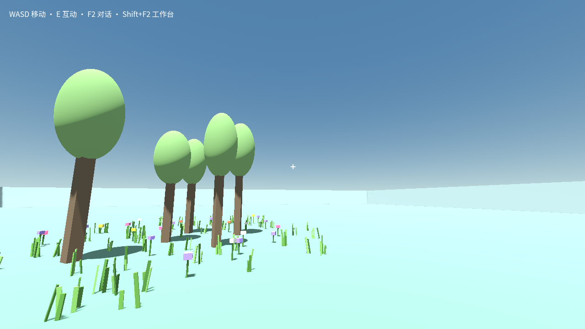
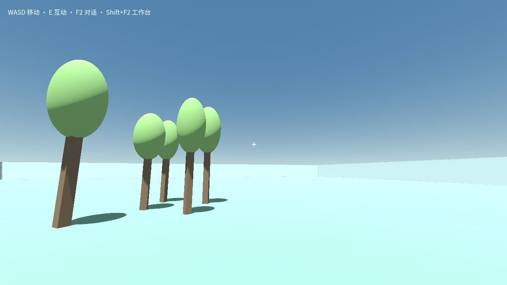

# 环境组：在原树木世界继续添加花草

本次是已有树木世界的普通玩家后续创造，不是重建世界或首次独立成功率试验。原始输入：

> 在这些树周围长些花草，让这里看起来像一片树林。

使用冻结成品 `32cd879d364d-c0acf0e3-b793-467e-9dcb-1b8572953512`，沿实际玩家配置 `deepseek-v4.1-flash-expires-on-0910` / `max`，模型窗口 1000000、单次输出配置 384000。走普通聊天入口，没有启用 CREATION_EVAL 或增加评测请求、token、整轮时长上限。原始受限试验报告仍保留，不能将它改写为本轮结果。

## 结果与证据范围

- 2026-09-12 04:11:45 至 04:16:33（北京时间），模型完成 12 次实际请求，全部有回执，没有玩家澄清。审阅两次正常权限请求：本世界的地被脚本/场景修改与最新源码 check，均仅 `allow-once`。
- 新增草丛与五色方块花，保留原来五棵树。新旧 `world/creation.json` 字节哈希均为 `cad172e162ad16131231da8c421efc673e4ee9fa74cc73cd70437d463f4567d5`，没有通过测试驱动修改作品、位置或进度。
- 检查通过后，测试控制器沿正常预览、采用、保存操作完成交付；冷重开保持同一世界及新 build，实例重新创建。此阶段新增模型请求为 0。
- 已人工查看下方真实 1280×720 冷重开截图：树边确实出现绿色草叶和彩色花，原树仍可见；仍是较稀疏、简化的几棵树和地被，青色平地未改变，不能据此称为完整树林氛围或高质量美术。
- 退出审计的 `violations/pageErrors/shutdownFailures` 均为空，报告与 marker 完整性检查通过。没有真实鼠标键盘、窗口置前或 Pointer Lock。

## 值得调整的玩家体验

模型仍把拾取器覆盖不足作为使用方块花头和限制装饰数量的理由。这是被冻结包中旧指导的实际表现，不能提前计入后续指导修复效果。最终回复还大量展示 kind 枚举、文件路径、哈希和作业 ID；虽然准确说明尚待玩家采用，但这些开发细节不适合普通玩家的结果说明。

## 原始报告

- 原世界：`world-5493090c7bec`；沿用 session `bdfc696c-c3a5-4f9d-8846-f6dabe783b10`。
- 普通玩家报告：`D:/cm-promo-loop-0912/test-results/desktop-native-complete-VburCs/player-e6f3639a-e6f8-45ad-810d-71fe6ee1d268.json`，SHA-256 `714d9fbcd2a769476dbf09ff41c38b242e7cee00887d8e05d526a2bec4ad3cc1`。
- 正常采用及冷重开：`D:/cm-promo-loop-0912/test-results/desktop-native-complete-VburCs/adoption-9c43b564-53c2-48b2-a30e-fea4050854c3/report.json`。
- 冷重开原图：同一 adoption 目录中的 `reopened.png`，本目录图片为原文件直接复制，没有改图。
- 采用前 build：`gbd-928021fc19a7aa7a83b991d57cb4090c787d9d77bca71dc55e8294999404cabc`。
- 采用与冷重开 build：`gbd-ab38206ec5380522c93245686d4762b0457a6a38f03b81a54d43803aec0eb769`。
