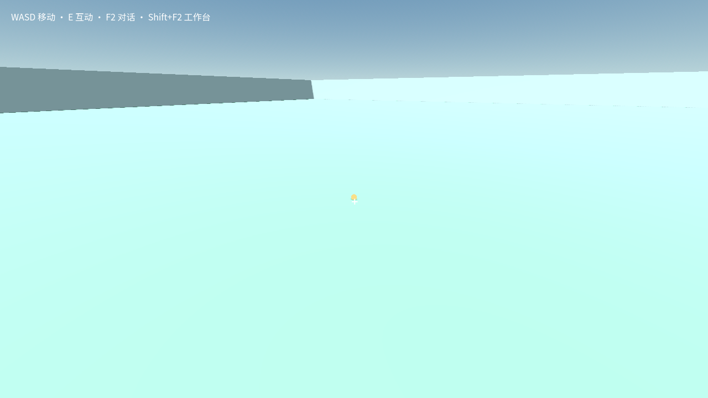

# FLIGHT01 澄清复验

原句仍为 **我想要驾驶歼20。** 新隔离 profile 使用冻结 `964d96d0` Windows 成品，DeepSeek Flash high，40 请求／10 分钟上限。

**澄清桥成功，飞机仍未生成。** 一次 playerClarification 完整回答四问，均按公开第一选项：街机手感、出生点附近 E 登机、只飞行（含加力／起落架／HUD）、低空绕场。原问题、全部选项、选择原因和答案见 result.json。没有暗改原句或提前写飞机源码。

约 4 分 30 秒后，实际任务以 error 结束：第 8 次模型请求返回 `EMPTY_MODEL_RESPONSE`，HTTP 200，正文为空。该次耗时 74,508 毫秒，记录 outputTokens=16,384、reasoningTokens=16,384。已用 8/40 次，仍余 32 次；这不是累计请求或十分钟额度耗尽。单次输出全部为推理是明确诊断线索，不能把驱动的 TASK_SETTLED_UNVERIFIED 当成实现成功。

工具记录只有读取、能力发现与澄清，没有源码写入，也没有候选／check。测试驱动未追加重试，未尝试采用或虚构驾驶验证。后续审计确认产品内部曾在第 7 次纯推理空响应后自动执行一次 silent-turn nudge；第 8 次仍以相同 16,384 上限返回纯推理，才报告 EMPTY_MODEL_RESPONSE。两次均计入 8/40 用量，不能把「驱动未追加」写成「产品没有自动重试」。

已查看截图：1280×720，仅底座与 HUD，没有飞机。无真实输入、焦点或 Pointer Lock，未用裸引擎替代验收；退出审计三项均为空。

原始报告：`D:/cm-promo-flight-clarified-0912/test-results/desktop-native-complete-BKI6gF/report.json`。本目录 result.json 保留完整澄清、失败码、最后一次用量、冻结成品与证据 SHA；原始报告和账本未修改。
