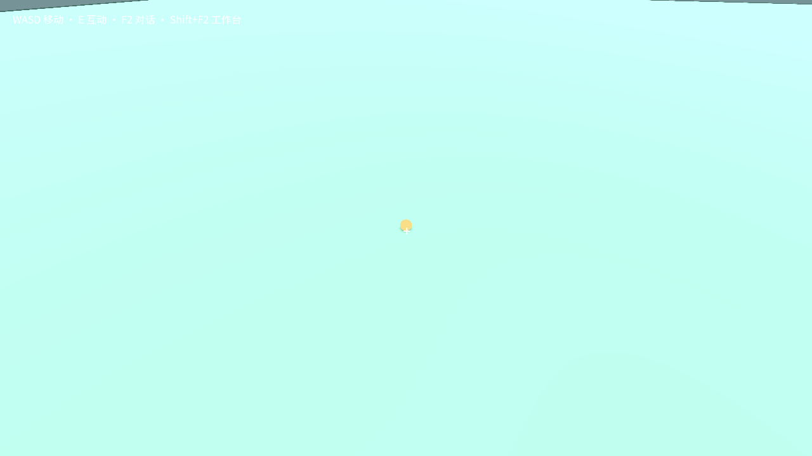

# 原白狗世界：观察组件真实维护通过

使用 `bafb5b180bce` 冻结成品，在原 `desktop-native-complete-gZUpyt` 隔离档中验证；没有操作用户使用中的档案或预制 demo 的 `VO4Pki`。

通过严格 headless 普通桥调用界面按钮所用的真实 renderer API：读取不可编辑的 upgradeId → 明确发起 `upgrade-observer` → 正常 check → 采用 → 刷新捕获 → 保存 → 冷重开。没有调用 provider 设置、agentPrompt 或模型，也没有直接修改作品源码。

结果：维护 operation `6eb50255-96ca-40eb-bb70-f15a06c6eeaa` 达到 `applied`，10 项实机检查通过。仅 `craftmine_shared/scene_mesh_picker.gd` 文件哈希发生变化；所有普通源码逐文件 SHA 完全相同，完整 `snapshot.state.body` 在采用前、采用后及冷重开后一致。旧报告、profile marker 与旧评测预算账本保持原 SHA。`task_metric_calls` 为 **17 → 17**，新增模型请求为 **0**；两次产品启动的退出审计均无违规、页面错误或关闭失败。

原 build：`gbd-9a9fe1be91f435e7568a629f1fc2b699f7cdc9e0ba2557384dadf883672f06f3`。升级及冷重开 build：`gbd-7b60a21e33f588fd879fc0415bbe4ae758f535dfbea9fcaa3e39f104d5dd545e`。世界始终为 `world-8a3c95aad901`，重开获得新实例和新的普通 captureId。

**证据范围：当前保留视角朝向地面，before surface 为 ground。** 已人工查看升级前和冷重开后的真实图片，两者都是同一地面视角。因此本次证明维护链、普通源码和进度保留、当前捕获恢复，不宣称实机验证了狗对象/旧 prop 的选中，也不据此评价白狗画面。

## 原始记录与驱动修正

成功报告：`D:/cm-promo-loop-0912/test-results/desktop-native-complete-gZUpyt/observer-upgrade-046b6c2c-55b6-40a7-ae67-66e7b6d46996/report.json`。before.png、after.png、reopened.png 均在同一目录，本目录图片是原文件直接复制。

首次维护之前发现并修复两个驱动假设，失败报告均另外保留：

- `observer-upgrade-e984ca94-cdd5-4f09-8e04-852ec83ca66f`：白狗是正式 backup.restore 的激活档，数据不在默认目录。驱动改为只读调用现有 `resolveActiveDirectory` 验证并解析正式 pointer/activation；该次尚未启动产品。
- `observer-upgrade-a263a69b-93e2-4898-8654-858f54825f69`：`godotWorld.request` 已解包 result，驱动应读取 `snapshot.state.body`。该次在发起维护前结束，模型计数未变、退出审计干净。

修正没有更改产品判据、旧报告、指针或源码；随后仅发起一次真实维护操作并完成全部检查。没有为拍摄狗对象额外转场或重跑。
