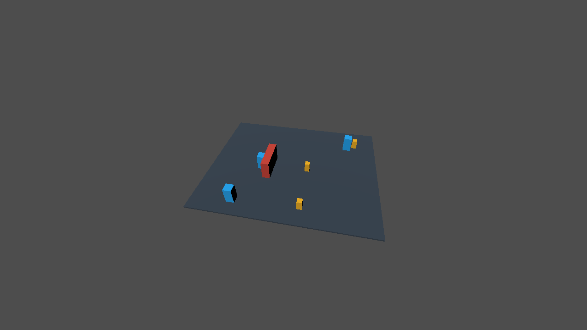

# GU6：Beehave 最小运行时追随与停止试验

2026-09-12。基线 `0ce0ba9f`，独立工作树 `D:/cm-gu6-beehave-0912`。结论：固定 Beehave 运行时可作为同伴或敌人的**行为调度底座**；在真实 Godot Web 物理帧里，宿主编写的动作通过它完成追随、到距停止、撤销目标中断、运动中停用与重新启用。墙体反例表明这套最小组合没有寻路能力，不能称为完整战斗或普通玩家创作验收。

## 固定来源与依赖

- 来源：[bitbrain/beehave，提交 58a0df12330114e330f47fc1469132f016c056bc](https://github.com/bitbrain/beehave/tree/58a0df12330114e330f47fc1469132f016c056bc)。本地 `plugin.cfg` 为 **2.9.4-dev**，不是稳定发布版。
- 原克隆 `D:/cm-agent-godot-0912/test-results/external-resources-20260912/beehave` 保持干净；清单摘要 `101d9c033ac53e1a053d55b5de94c85920dacb9e95b46e6e494fba59e9edf19e`。入口要求提交完全匹配且无未提交修改，拒绝软链接。
- 被复制的 21 个上游文件全部保持逐字节一致：12 个 GDScript、8 个引用的 SVG 图标和 `addons/beehave/LICENSE`。许可为 MIT，Copyright (c) 2023 bitbrain，原文随证据保留。没有下载额外素材，也没有把其他仓库内容套用这一许可。
- 包含 `BeehaveTree`、`BeehaveNode`、`Blackboard`、`Composite`、两个 reactive composite、`Leaf`、`ActionLeaf`、`ConditionLeaf`、`BeehaveDebuggerMessages`、global debugger、global metrics。
- `BeehaveTree._ready()` 无条件调用 `BeehaveGlobalDebugger.register_tree()`；其他节点会引用 `BeehaveDebuggerMessages`。因此最小可运行闭包并非 Tree/Action 两个文件。工程显式声明两个 global autoload，没有启用 editor plugin。metrics 在本 fixture 默认不启用单树监视，仍保留其运行时依赖。
- 排除 editor debugger UI、plugin.gd/plugin.cfg、GUT、示例工程和其他行为节点。选择的上游 `@tool` 声明没有删改，导入时始终在 LPAC 内执行。已逐文件检查所选脚本；存在 EngineDebugger API，但未发现自建进程或网络 API。静态检查不能替代沙箱。

## 宿主适配与物理场景

只新建试验工程、Web preset 和 `beehave-follow-trial.gd`，没有修改原克隆、玩家 profile、正式控制器、picker 或产品能力声明。Compatibility、single-threaded Web、无 GDExtension、启动不 focus canvas。

树结构是 `SelectorReactive(SequenceReactive(HasTarget, Follow), Stop)`。`HasTarget`、`Follow`、`Stop` 是本次编写的叶节点：检查黑板目标有效标志，设置 CharacterBody3D 速度并调用 `move_and_slide()`；距目标约 0.5 米时停下；`interrupt()` 清零速度。Beehave 负责选择、重复 tick 和中断传播，具体感知、移动算法及停止实现仍需开发者提供。

三个独立角色分别验证开放直线、静态阻墙、目标无效。地面仅为可视平面；角色不施加重力，只测试水平物理运动及与静态墙体的碰撞。没有玩家角色、输入事件、导航网格、战斗伤害、动画或进度接口。

目标 x4→x7、撤销/恢复目标、disable/enable 都是明示的 fixture 条件设置，**不作为玩家移动或角色位移证据**。角色位移来自 60 Hz 的逐帧 `global_position`，共 391 样本；检查限制单帧位移不超过速度 2 m/s 对应步长，反对用 teleport 冒充运动。根节点先采样，子行为树随后 tick，因此转换后的稳定区间从下一帧之后开始检查。

| 场景 | 实际结果 |
| --- | --- |
| 直线追随 x4 | 角色 x0→3.499998，170–180 帧位置不变且速度为零 |
| 181 帧目标改为 x7 | 210 帧 x4.466664，继续真实移动 |
| 211 帧撤销目标 | 212–230 帧停在 x4.499997，中断计数增加 |
| 231 帧恢复目标 | 240 帧 x4.799997、速度约 2 m/s，证明停用前确实在移动 |
| 241 帧停用行为树 | 242–270 帧停在 x4.833330，速度零且中断计数再次增加 |
| 271 帧重新启用 | 390 帧 x6.499995，375–390 帧静止 |
| 墙体反例 | 角色止于 x0.999872；仍有碰撞及执行中的动作，距目标超过 2.9 米，不能记为到达或绕路成功 |
| 无效目标反例 | 角色 x始终为0，移动动作调用数为0 |

## 实际执行与证据

最终运行：`test-results/gu6-beehave-lcVbY7`。已有 release broker SHA-256 `88f3ee05b68fae0c413bbec936b4d68ef38a49c18661f15d6f9ac2f163a06232`，策略 `craftmine.windows.lpac-registry.v1`，固定引擎 `4.7.2-stable`。没有通过受信任 probe runner 绕开外部脚本隔离。

LPAC import/exportWeb 均 succeeded，进程边界、网络 preflight、cleanup 和 recovery journal 均由完整回执验证。请求 ID、task、inputHash、sourceBinding、实际源文件清单及 hash 与宿主期望一致；导出文件逐个核对摘要后才打开 Web。

最终工程清单摘要：`43e6392126c09b35397de77d27893945b460c949a195b39a79debbdb18369720`。逐帧证据文件 SHA-256：`9384ef16d86123f23f78e99641222908149492133635ca46499d24e4337a8ed0`。

独立 headless Chromium/profile，SwiftShader；仅允许本次 loopback origin，初始化阻断 Pointer Lock 和 focus。实际请求计数均为0，无 Pointer Lock、页面错误或运行时脚本错误；私有浏览器和 HTTP server 均正常关闭。没有模型调用或玩家输入，没有给玩家配置新增任何预算。

两个 native 阶段各有11条系统目录、网卡和 TCP listen 等受限环境诊断，原始日志全部保留，不能声称 native stderr 为空。Web 的3条启动消息未出现脚本错误。

归档：[manifest.json](../evidence/gu6-beehave-20260912/manifest.json) 包含真实请求、回执、native 日志、源清单、逐帧轨迹、截图、许可和早期诊断报告；PCK/WASM 保留在私有 test-results。源码和宿主验证器摘要见同目录 `provenance.json`。

首次 `TrNckm` 已获得正确的动作轨迹，但宿主用了 JSON 键顺序比较及沿用 Kenney 的像素颜色数阈值而误报失败。修为对象结构比较；启动依赖引擎和完整物理轨迹，颜色数量仅作描述。原失败报告未改。第二次 `DOclVF` 停用时角色已因目标无效停住，不作为“中断运动”的证明；最终新增恢复目标后再停用，完整重跑成功。两次较早报告独立归档，不与最终样本混用。

## 复现与下一步

```powershell
node scripts/try-beehave-runtime.mjs
node --test tests/godot-agent/beehave-trial.test.mjs tests/godot-agent/external-receipt.test.mjs
```

入口固定现有源码克隆、broker 和引擎路径；不运行上游安装命令。import/export 的180秒取消保护、Web30秒等待只属于开发者诊断基础设施，不用于玩家模型任务。SIGINT/SIGTERM 取消当前阶段并阻止后续阶段；本轮没有额外开展强制取消故障测试。

11项离线测试通过，包括真实回执归因、归档 hash、上游文件逐字节一致、无位移却自报成功、teleport、停止漂移、停用前未移动、缺失目标、缺失碰撞和残缺证据反例。

下一阶段可沿用现有作品包契约封装明确的运动/感知叶节点，再接已有控制器提供的目标与动作接口。仍需分别验证导航、动态障碍、目标释放、树的反复创建/销毁、存档恢复、跨世界独立实例及正式普通创作流程。这里没有证明性能收益、模型调用节省或任意 Beehave 树都安全有效。


