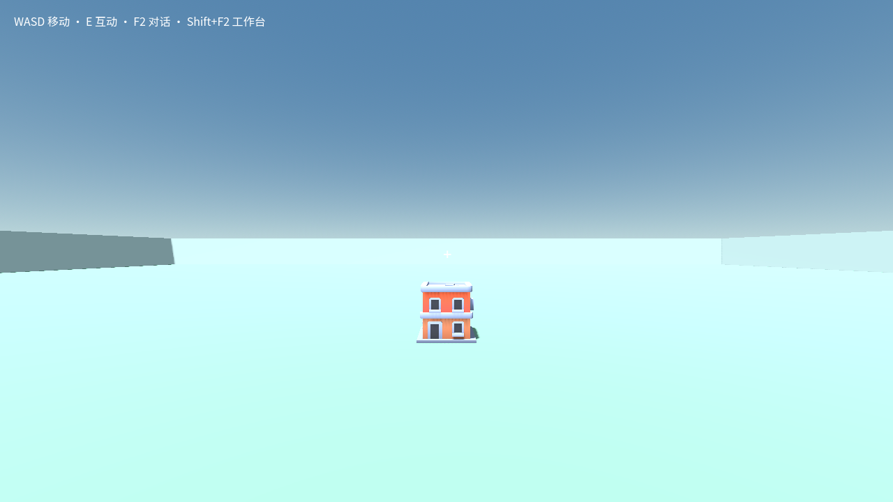

# GU6：正式源包检查、采用与冷重开

日期：2026-09-12。本次补齐上一切片未证明的产品流程：使用未修改的 sealed 客户端，正常导入建筑和道路包，经核心实际执行器检查、预览、采用，再关闭进程并冷重开同一独立 profile。

## 实际结论

完整成功运行记录为 `D:/cm-gu6-formal-0912/test-results/desktop-native-complete-QaRnRb/report.json`，20 个流程步骤通过。它使用普通 `package.request importSource`，不是调用派生 fixture 代替正式 job。两次客户端退出码均为 0，退出审计中的 violations、pageErrors、shutdownFailures 都为空，无强制退出。

| 模块 | 实际核心 check job | 候选采用 |
| --- | --- | --- |
| Building | `gjob-f982ead04dc6f47bb11f6cda1344742c854b4368b7e095657650573da26e7387`，passed | `gcan-7546855e69e37f8f8692e68a9432c583bd5e3e107ec0522859cd6723d9b27e95` |
| Road | `gjob-e18ea6263953f25e3ba6ef1ddc83a801cdd6272b444266db5383d554312ece03`，passed | `gcan-aa31f1101e75c0aebdad6ccde765ddd56c04777c0ae949ffbefe0d882c58ff29` |

世界为 `world-f58b259b9562`。最后采用及冷重开后的 build 均为 `gbd-a93ac26602fb2948f94efdb130cb94b62685b4128b0bf94e6b35f45c308a4c78`。运行实例从 `d3c4b5e1ef86cff122521916` 变为 `ba5603a7703d7e897a2a66ca`，证明重新创建了运行实例；源 revision/manifestHash、两个包实体 ID 及完整基础 snapshot.state 保持一致。

两份 job 都由 `craftmine-windows-broker-v1` 实际执行，import、compile、check 和 output.passed 均为 true。保留的检查标准是既有的六项：runtime.ready、runtime.frame、runtime.no-errors、runtime.snapshot、runtime.isolation、runtime.recovery；没有降低检查标准，也没有将这六项扩充解释为任意玩法验收。

## 客户端与输入隔离

精确 sealed 包：

`D:/cm-agent-godot-0912/desktop/build/releases/2ae18b25a7cf-87f15497-e89a-4f99-ae8b-df6762a663e9/output/win-unpacked`

commit：`2ae18b25a7cf88e2cf810082a84c17c09092ce3d`。driver 核对 build-manifest 的格式、应用 ID、commit，并检查 app.asar 内已编译的 offscreen/unfocusable/Pointer Lock 防护。记录 SHA-256 身份，不将其称为数字签名。

本次不需要生产代码改动。既有 `readHeadlessProfile` 要求专用 test-results/desktop-native-* 根、内部 profile、marker/token 和父 IPC；既有包文件选择器在此保护模式只读取该 root 下的 component.zip。driver 把两个固定 zip 依次放入这一路径，每次使用新的 importSource 操作和新 grant。没有把文件路径、context 或 archiveBase64 塞入页面参数，没有打开文件选择对话框。

实际流程为：

`protected controller → worldPanel(package.request) → native package service/file grant → installSource → core source transaction → real managed executor check → candidatePreview → candidateApply → ordinary world.open after restart`

driver 不调用模型、不发送玩家 prompt，不使用鼠标/键盘模拟、Pointer Lock 或窗口置前。窗口可见/可聚焦/offscreen 状态和退出审计均保存。实际生效的每轮局部等待只保护此有限的 model-free 验收，不改变玩家创作的 token、模型调用或整轮限制。

## 身份和结果复核

新增合同断言将 import receipt 的 worldId、jobId、源 revision/manifestHash 与实际 passed job 对齐；检查 kind=check、实际 executor、import/compile/check 标志及六项检查结果；preview、apply record 与运行观察必须指向该 job 的同一 build/candidate。冷重开要求新的 instanceId、相同的 build、源 pin、实体列表和完整基础 snapshot.state。

合同断言已对完整成功运行的原始记录重读通过，负例证明错误世界、其他 passed job、错源 pin、失败检查项、错采用 build、旧 runtime instance 或缺失实体不能通过。原始核心 job 记录和导入/采用调用结果随证据归档，不能用另一轮派生工程结果填补。

## 取消与失败记录

最新 driver 支持专用 out 下的 `cancel.request` 和 SIGINT/SIGTERM。取消立即通知 pending 请求，轮询会察觉停止，随后走普通 quit/清理；客户端仍活着时不因一次读取超时直接重启。退出未完成会明确记录 forcedStop/失败。

独立取消验收在 `desktop-native-complete-qAq3qM`：走正常 primaryMode create、world.create 后写入 cancel.request，客户端正常退出，审计三类错误均为空。该记录预期为 cancelled、passed=false；它证明取消控制，不是完整源包链成功记录。正常完整记录 QaRnRb 使用 world.open 完成冷开；最新 driver 另外显式加入冷开 primaryMode create，这一普通入口已由取消验收的首次启动验证，未另行重复两包完整链。

保留的早期 driver 失败：

- `desktop-native-complete-sak5JC`：headless ready 早于主窗口创建，driver 过早断言窗口数并关闭；已改为等待实际 offscreen 窗口。没有将其认定为成品输入防护失败。
- `desktop-native-complete-RR3YFE`：两包实际检查/采用和首次干净退出已完成，但冷开遗漏 world.open，停在产品入口；该独立测试子树经身份核对后强制结束，记录 forced teardown，不算冷开成功。
- 修正后的 QaRnRb 是另一个全新 profile，从创建到两包采用再冷开完整重跑，通过后两次都正常清理。

## 未覆盖及新发现

这不是玩家模型创作、输入操作或任意玩法验收。包保留默认放置位置，建筑和道路重叠在源场景原点；截图证明正式运行画面及建筑可见，不证明道路可被单独选择。没有修改模块参数，因此基础快照一致不能当作“模块参数已具备存档迁移”证明。

实际观察暴露一个后续问题：初始空场的 sceneObjectSelection 为 blocked/nearer-or-tied-physics-hit；导入后及冷开后变为 fallback/unsupported-mesh-type，sceneObjectRefs 为空。源包检查和采用确实通过，但通用准星选择导入 GLB 的能力尚未通过，应另开选择器兼容修复与验收；本轮没有擅改该生产逻辑。

## 文件与复现

- [证据摘要](../evidence/gu6-formal-packages-20260912/summary.json)
- [完整正式流程记录](../evidence/gu6-formal-packages-20260912/formal-client-report.json)
- [取消控制记录](../evidence/gu6-formal-packages-20260912/cancel-control-report.json)
- [Building 核心 job](../evidence/gu6-formal-packages-20260912/building-core-check.json)
- [Road 核心 job](../evidence/gu6-formal-packages-20260912/road-core-check.json)

```powershell
$env:CRAFTMINE_PACKAGED_ROOT='D:/cm-agent-godot-0912/desktop/build/releases/2ae18b25a7cf-87f15497-e89a-4f99-ae8b-df6762a663e9/output/win-unpacked'
node tests/godot-agent/formal-package-client.mjs
node --test tests/godot-agent/formal-package-protocol.test.mjs tests/godot-agent/formal-package-evidence.test.mjs
```

协议与证据测试 9 项全部通过。`CRAFTMINE_DESKTOP_DEPS_ROOT` 可指向已安装 electron-builder/asar 的受信任桌面依赖目录；只用于读取 sealed archive 防护代码，不运行未审查项目。



## 整合新控制器和资源库后的同版本复验

完整包 `09f7443a1aeb59307cffe01623d6ff18975578ca` 已重新构建并核验：1,614 个 payload 文件、1,018,211,519 字节，源码 ZIP SHA-256 `4ae8f5ee7d2b11cf30965fec731e2452c6ea1b9e8f852e727f4b3266d3b16127`。包含新的控制器文件组、GLB 选择器和 ZIP 资源库改动。它是未签名的本地 unpacked preview，没有安装到用户目录。

新独立 profile `desktop-native-complete-B5N3AE`、世界 `world-f5f279a52bf3` 走完 22 个步骤：本版完整 runner 明确包含冷开后的 create mode 和 world.open。建筑 job `gjob-f0ed0b7ddb5031a26d5acbc60a82ab8f5b88eaaca9cc26a81fa870408ea27cb4`、道路 job `gjob-600149dc03dc45f987ae33b57d0a695b6af204cbcca5ba0b677e9efb03dc5473` 均由实际执行器检查通过。正常预览、应用、保存和冷开后，最终 build 仍为 `gbd-e2f421c7bcf627a00d9b995f3d71c18084f3376c348fd6eaadd3cc2890413e68`，新实例保持相同源码和基础状态。

运行观察出现 `controllerEvidence.status=supported`、递增 physicsTick 及 V2 的 base-surface-arrays 范围。默认准星射线没有独立瞄准每个模块，因此空 `sceneObjectRefs` 不能用来证明或否定 GLB 定位；实际独立瞄准证据仍是另一个派生工程试验。两包仍使用默认原点，未新增参数修改或模型调用。两次客户端正常退出，输入、页面错误和清理审计均为空。

[整合包摘要](../evidence/gu6-integrated-package-20260912/summary.json) 与 [完整原始报告](../evidence/gu6-integrated-package-20260912/formal-client-report.json) 独立归档。整合后的协议与证据测试共 10 项通过。原 `2ae18b25` 报告没有改写，也未把本轮源包应用当作资源库引用安装已实现。
