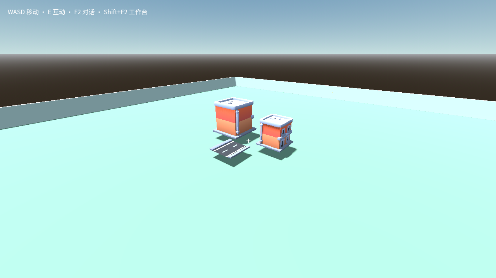
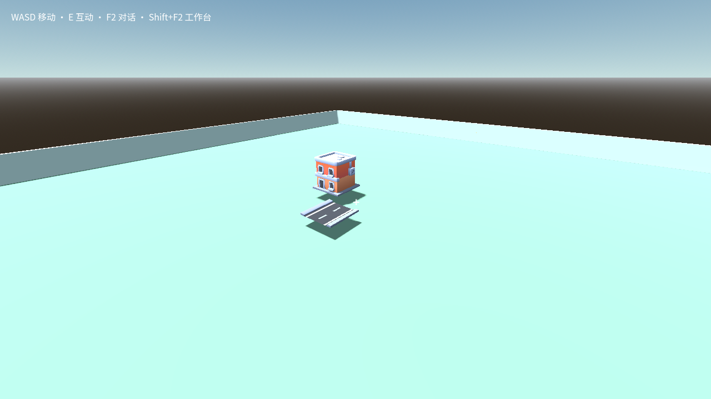

# GU6：Kenney 建筑与道路模块跨世界复用

日期：2026-09-12。基于 `e4f8504f`，本切片把已审阅的 Kenney City 建筑和道路做成现有包格式可消费的原型，并修复真实源组件导出中的 GLB 纹理依赖丢失问题。

## 完成结果

真实 Rust 数据目录中新建两个 creation-sandbox 源工程。A 世界通过既有 `createManagedPackageInstaller` 安装同一建筑包两次和道路包一次；从 A 的已安装建筑节点调用既有 `createManagedPackageSourceService.exportSource` 导出，随后把导出包和原道路包安装到 B。共五次源安装，已有 `craftmine.instances.json` 与 `craftmine.assets.lock.json` 记录五个不同的实体身份，没有新增安装注册表。

两个世界源工程分别复制为独立测试派生工程，通过既有 LPAC broker 运行固定 Godot 4.7.2 的 Web 导出；其隐式导入在同一隔离任务中完成。私有 headless 浏览器通过既有 CraftmineGame runtime `load/resume` 协议启动，随后执行宿主编写的参数/物理测试。A 的 17 项、B 的 12 项运行断言全部通过，浏览器脚本错误与 pageerror 均为 0，Pointer Lock/focus 请求均为 0。

| 检查 | 实际证据 |
| --- | --- |
| 同包重复安装 | A 的两个建筑 instance/entity ID 不同 |
| 参数隔离 | 改建筑 1 的缩放/朝向后，建筑 2 保持自己的参数 |
| 身份保护 | `configure({entity_id:...})` 被拒绝，安装身份不变 |
| 真实碰撞 | 五个模型各生成 1 个三角网格碰撞，物理射线命中对应 StaticBody3D |
| solid 参数 | solid=false 后射线不再命中该模块 |
| 跨世界复用 | B 从 A 导出的建筑带正确材质，和道路都可见且可碰撞 |
| 许可及来源 | roundtrip 原 LICENSE.md、README.md 字节哈希不变，显式声明引用及其 SHA 正确 |
| 正式状态 | 两世界正式 build 都保持原值；没有应用候选 |

源安装返回的 `source-saved-check-blocked` 原样保存：独立 Rust 环境没有登记核心执行器，不能将另行完成的 LPAC/Web 测试冒充这些 check job 已通过。模型视觉和碰撞使用独立测试派生工程，源 pin 在报告中保留；broker 的 sourceRevision=1 标识派生 fixture，sourceDigest 精确绑定包含测试文件的实际拷贝。

## 固定来源与包

上游：[KenneyNL/Starter-Kit-City-Builder](https://github.com/KenneyNL/Starter-Kit-City-Builder/tree/4535092b740b378b700efd9df9e27a631815b84a)，commit `4535092b740b378b700efd9df9e27a631815b84a`。

| 文件 | 字节 / SHA-256 |
| --- | --- |
| models/building-small-a.glb | 39,660 / `22ce989013bd16b1732e81798e343cf85f947e92b6c93825b18131feded48e07` |
| models/road-straight.glb | 6,148 / `008a6305de778439d1a99be78a3e0945c72a9bc9cc0bade1b51a666d5db01d0b` |
| models/Textures/colormap.png | `106cf02e0d6dccded6d9f90c2ae6a51eb94c6301645fea159e834c44ed4708a3` |

原 GLB 未改写。两个模型都引用相同的外部 `Textures/colormap.png`；纹理按原相对目录一起打包。保留代码 MIT 文件、上游 README 的 CC0 素材声明和来源哈希。没有携带上游玩法脚本、样例地图或字体，因此不把上游 OFL 字体误归 CC0，也不让字体进入这个原型包。

可复用包：

- [建筑包](../evidence/gu6-kenney-modules-20260912/building.zip)：23,409 bytes，archive SHA `351f4774db7a9c9fb8154bd79b96609267b15f7b3de05f52341b3629278766d5`。
- [道路包](../evidence/gu6-kenney-modules-20260912/road.zip)：18,350 bytes，archive SHA `3144cb5dedd450677282045f9aae9d78dbea84989fe940e55888b4b722537314`。
- [A 导出的建筑包](../evidence/gu6-kenney-modules-20260912/building-roundtrip.zip)：24,432 bytes，archive SHA `1de9fb46cc7f6b9d3e5d848979f9f2f5879fd3cdb1e690cba5769e0d3d04e958`。

生成器 `scripts/lib/kenney-city-package.mjs` 只适配这两个固定来源，验证 commit、上游干净工作树和每个模型/纹理哈希。输出为已有 `craftmine.package/1` / `craftmine.resource/1`、kind=object、`sceneInstall.mode=instance`，兼容 creation-sandbox 1.0.0 / Godot 4.7.2-stable。没有调用资产插件、重建引擎或执行上游 repo 脚本。

StaticBody3D 包装脚本不声明全局 class_name，避免多实例/包间全局类冲突。安装器给根节点写 `entity_id`，脚本只提供白名单参数：`model_scale_percent`（25–800）、`quarter_turns`（0–3）、`solid`、`label`（最多 80 字符）。配置先完整验证再修改；碰撞由真实 Mesh 的三角形生成，含模型缩放/朝向变换。实体身份不在可写参数中。

## 修复的通用导出缺陷

### GLB 纹理依赖

原 `godot-package-source.mjs` 仅扫描文本里的 res://、OBJ/MTL 引用，GLB 被当作不透明字节直接复制，导致外部纹理未进入闭包。本次增加有界 GLB v2 头/JSON/BIN chunk 解析，跟踪标准 images URI，按模型目录规范化相对路径，去重并经过原有 payload 及哈希约束。

明确支持：外部 png/jpg/jpeg/webp/svg 图像路径；嵌入 BIN / bufferView 保持原 GLB 字节。不支持并明确拒绝：外部 buffer URI（当前 managed source 不允许 .bin）、data URI、其他图片格式、未知 chunk、网络/绝对路径、编码或查询/fragment URI、规范化后逃逸工程根的路径。没有放宽 host/core 文件权限，也没有猜测任意 GLTF 扩展私有 URI。

### 明确的来源声明

原 exporter 总是生成 `licenses:{}`，仅在首次构造包保留 LICENSE 不能证明再次导出仍保留。现在组件 PackedScene 根可显式声明：

```gdscript
metadata/craftmine_attribution = "res://addons/kenney-city-building/attribution.json"
```

引用 JSON 使用 `craftmine.resource-attribution/1`，包含 licenses 对象及原声明文件的 res:// 引用。源导出只跟随这种明确声明，沿既有依赖闭包保留文件；导出 manifest 的 `licenses.sourceDeclarations` 记录包内 declaration 路径、重写后字节 SHA 和 `status=source-declared`。不存在明确声明时不推断版权；无引用 sidecar 不会被猜作许可。声明是来源文本，不是法律真实性认证，hash 只证明完整性。

roundtrip 测试同时证明：外部纹理仍在包内；原 MIT/CC0 声明字节不变；许可声明的路径重写到新命名空间；声明的 manifest 引用哈希对应实际打包字节。模型资源仍可在 B 真正导入并带材质渲染。

## 证据、验证和限制

[归档报告](../evidence/gu6-kenney-modules-20260912/summary.json) 包含两世界核心源 pin、五次源安装回执、现有实例映射、运行断言和截图。原始数据：`D:/cm-gu6-module-0912/test-results/kenney-module-ZG50OC/report.json`。归档保留两份 LPAC 请求/回执及 native 日志，严格验证完整绑定、拷贝清单摘要和执行器身份。两个 native 任务均成功导出并完成清理；常见 LPAC Windows 目录/网卡/监听拒绝诊断保留，不宣称 native stderr 为空。

验证命令：

```powershell
node --test tests/godot-agent/glb-dependencies.test.mjs tests/godot-agent/package-attribution.test.mjs tests/godot-final-install-assets/package-caller.test.mjs tests/godot-round2/R4/package-format.test.mjs
node tests/godot-agent/kenney-package-reuse.mjs
```

前一组共 19 项测试，覆盖容器/URI/闭包/来源声明负例及原包回归。GLB 扫描同时覆盖复制入包的 payload 和外部共享基类的 sourceRequirements 两个队列；共享基类 preload 的 GLB 所需纹理也会绑定精确哈希，缺失时不能以只满足基类/GLB 哈希混过检查。同一资源同时被组件与共享基类使用时，同时保留命名空间副本与原路径要求，不能因已放入 payload 就漏掉未改写的基类引用。后者用真实 core、真实 LPAC、WebGL2 和现有 runtime 协议验收。早期 fixture 的初始世界快照/创建批量格式不符以及探针类型推断错误记录仍留在独立 test-results，未算作成功。修正为现有合法快照与最多 16 文件的 create/后续 patch；修正探针字典类型，并接上既有 CraftmineGame load/resume，最终运行通过。

限制：这是宿主编写的复用/参数/物理 fixture，不是玩家自然语言创作或玩家输入验收；为隔离射线，测试将模块抬高 1 米，截图布局不是玩家作品。没有验证完整角色行走、模块参数持久化、进度迁移或正式应用。creation-sandbox 专用 creation.entities 当前只采集 Entity_ 声明实体，本包使用现有通用 scene 节点/包 entity_id，并未新增 creation.json 原生实体类型。初次包声明参数接口；再次源导出仍不自动重建泛化 interfaces 描述，脚本的 @export/configure 表面和实际行为被保留。




