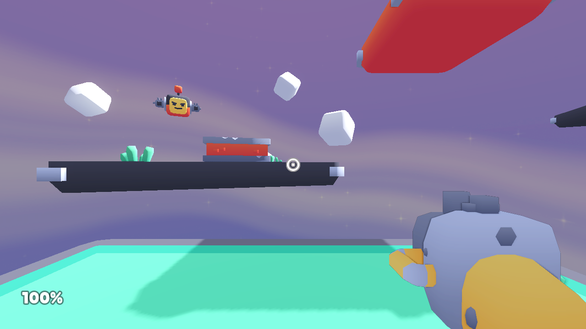
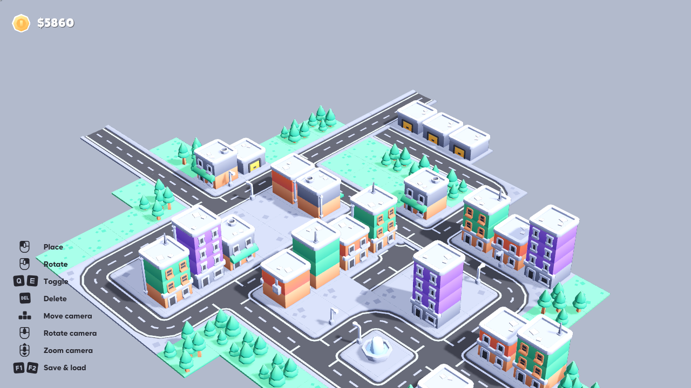

# GU6：Kenney 开源底座实际导入、Web 导出和画面验证

日期：2026-09-12。结论：两个固定上游工程均可通过现有 LPAC broker 在 Godot 4.7.2 的 Compatibility 路径完成导入和 Web 导出。FPS 已显示游戏场景；城市原始启动只显示 HUD，另一个明确标注的测试副本自动加载上游样例地图后显示城市模型。没有玩家输入或真实模型创作验收。

## 上游身份与许可证

| 工程 | 固定来源 | 源码清单 SHA-256 | 代码审阅 |
| --- | --- | --- | --- |
| FPS | [KenneyNL/Starter-Kit-FPS](https://github.com/KenneyNL/Starter-Kit-FPS/tree/185fd2326d74a5cf858cffc616f87cf9696f9cc0) | `dee33f92e1735b6fffd9c64035f1c91485f7997201c17af509624991cf97e39c` | 7 个 GDScript |
| City Builder | [KenneyNL/Starter-Kit-City-Builder](https://github.com/KenneyNL/Starter-Kit-City-Builder/tree/4535092b740b378b700efd9df9e27a631815b84a) | `170ff3676d188ba09d2fea672480300c762cd6ae904be4e031cb1c5b8563b257` | 6 个 GDScript |

两个工程均保留 `LICENSE.md` 的 MIT 声明、README 的素材 CC0 声明，以及 `fonts/license.txt`。字体均为 **Lilita，SIL Open Font License 1.1**，含 Reserved Font Name Lilita；不能将字体一并标为 CC0。MIT 文件与 README 中版权年份存在 2025/2026 差别，保留原文，没有擅自归一化。原始声明随证据目录的各 `*-licenses` 子目录保存。

上游目录保持只读且工作树干净，先复制到本工作树的独立 test-results。脚本逐个阅读：未发现 @tool、编辑器插件、GDExtension、外部进程或网络 API 调用；资源加载均来自工程路径或 City 的 user://map.res。后者没有在本次试验中测试玩家存取。自动扫描用于防止固定来源意外改变，不能替代沙箱。

## 实际分段结果

| 实例 | LPAC import | LPAC exportWeb | 浏览器启动 | 单独目视结论 |
| --- | --- | --- | --- | --- |
| FPS 最终适配 | 成功 | 成功，PCK 约 9.35 MB | Godot/WebGL2/Compatibility，页面异常 0 | 持枪、准星、敌人、平台和 HUD 可见 |
| City 原始启动适配 | 成功 | 成功，PCK 约 1.65 MB | 页面异常 0 | **仅 startup-only**：HUD 和空灰背景，无城市模型 |
| City 上游样例 fixture | 成功 | 成功 | 页面异常 0，记录 `Loading map...` | 建筑、道路、树木、喷泉和 HUD 可见 |

每个 import/export 都保存独立原始 broker 回执，且 `processVerification.verified`、`networkPreflight.verified`、`cleanup.verified` 全为 true。使用已经交付的 release broker，SHA-256 `88f3ee05b68fae0c413bbec936b4d68ef38a49c18661f15d6f9ac2f163a06232`，策略 `craftmine.windows.lpac-registry.v1`，与同目录 broker-identity.json 比对一致。引擎及 Web 模板由 broker 的编译固定哈希验证。

代码审查后补充了严格回执归因验证：进程退出码、schemaVersion、requestId、taskId、operation、inputHash、完整 sourceBinding 必须匹配宿主请求；sourceFiles 必须与审阅后暂存清单完全相同，按协议字段顺序重算 SHA-256，并同时匹配 sourceSnapshotDigest 和宿主记录的 modifiedDigest。仅有 broker 返回 succeeded 不够。新增验证器重新读取本次六份已保存真实回执，全部通过；四项测试包含错误绑定、暂存后源码变化但伪造一致新 snapshot hash、非法路径/清单/运输失败等负例。没有为这次验证重复运行引擎。

三次浏览器均使用独立 profile、headless Chromium、SwiftShader，初始化阻断 `requestPointerLock`、元素/window focus，仅允许本次 loopback origin。没有鼠标/键盘模拟、真实输入、窗口前置或页面点击。实际记录均为 pointerLock 请求 0、focus 请求 0、pointerLocked=false；浏览器关闭，临时 HTTP server 停止。没有把任何项目接入正式世界。

像素颜色统计只用于判断画面已输出，不证明模型内容正确；因此原始 City 的 46 种量化颜色并未被解释成“城市可视通过”。样例 City 的 458 种量化颜色也由截图目视确认后才标记场景可见。

## 精确适配

共同改动：

1. `project.godot` 的 features 从 Forward Plus 改为 GL Compatibility；添加 `renderer/rendering_method="gl_compatibility"` 与 mobile 同值。
2. 从仓库现有受信任 Web preset 生成 `export_presets.cfg`：Web、single-threaded、无 GDExtension、`html/focus_canvas_on_start=false`。没有修改上游主场景或输入映射。
3. 保留源码及许可副本，记录每个文件修改前后 SHA-256；上游资源大文件未纳入 Git。

FPS：`objects/player.gd` 实际有 3 个鼠标模式赋值，其中第 49、107 行原本为 CAPTURED，改为 VISIBLE；第 111 行原本已经是 VISIBLE，保持原样。共改变 2 处，验证最终 3 处全为 VISIBLE。首次 Web 启动记录了不支持 Compatibility 的 screen-space AA 警告，因此最终把 `anti_aliasing/quality/screen_space_aa=1` 改为 0 并重新完整导入/导出/启动，最终浏览器无该警告。

City 原始适配：只做共同改动，原空白启动证据保留。

City 样例 fixture：另建 `kenney-city-sample` 独立副本；在 `scripts/builder.gd` 的 `_ready()` 原有 `update_cash()` 后调用 `action_load_resources(true)`，将原函数签名扩展为 `action_load_resources(trial_load: bool = false)`，入口条件改为 `trial_load or Input.is_action_just_pressed("load_resources")`。使用上游原有 ResourceLoader/GridMap 逻辑加载 `res://sample map/map.res`，没有发送或模拟输入事件。这是宿主编写的加载样例测试条件，不是玩家建造城市的验收。

最终适配源码清单摘要分别为：

- FPS：`d090ede4ea8c7717512d9ae6c3ab22ef9915d38e9cb037d45e508ed71e2b4ed8`
- City 原始启动：`e4c15e56a6e187bba5e69eeae0c69b80899753ef4c4593cc61d8c04e5629096a`
- City 样例 fixture：`df05e0c3feca67caa6f70887c65840de1e5b5bf36554193ccbc57562191a30be`

## 保留的异常与边界

六个成功的 native 阶段日志均包含 11 条 Windows 目录解析、GetAdaptersAddresses、TCP listen 等拒绝访问诊断，日志原文保留。未见 GDScript 解析错误；浏览器运行没有脚本错误。这里依据真实私有 broker 回执判断隔离执行和清理成功，不把日志文字当成网络隔离证明，也不把 native stderr 宣称为空。

样例试验第一次 exportWeb 在准备阶段失败：`CreateAppContainerProfile HRESULT 0x80070057; no existing profile reused`。原测试 taskId 加上 broker profile 前缀超出短名称范围；缩短仅测试 taskId 后，重新完整 import/export 成功。失败回执保留为 `diagnostic-sample-long-profile-failed.json`，没有改 broker 权限或复用已有 profile。

还未验证：玩家走普通创作流程自动选取并适配底座；移动、战斗、建造、存取的交互行为；Craftmine 稳定实体身份、候选应用、进度迁移和资源包契约；正式安装/发布。City 自带 ResourceSaver/ResourceLoader 存档机制与我们的进度契约不是同一件事，FPS 也尚无适配后的进度接口。

## 证据与复现

已将摘要、源文件清单、六份 broker 回执及 native 日志、三个截图、许可声明、已知失败诊断归档到 [GU6 证据目录](../evidence/gu6-open-source-20260912/summary.json)。大型 PCK/WASM 留在私有 test-results。

- 最终 FPS 与原始 City：`D:/cm-gu6-open-source-0912/test-results/gu6-open-source-xR6rQy/report.json`
- 城市样例：`D:/cm-gu6-open-source-0912/test-results/gu6-open-source-Orq3hk/report.json`
- 早期 FPS SSAA 诊断：`gu6-open-source-272ti3`
- 原始 City 首次启动：`gu6-open-source-SQKC6W`
- 样例 profile 名称失败：`gu6-open-source-FUAywn`

受信任试验入口 `scripts/try-godot-open-source.mjs` 会复核固定 commit、上游干净状态及 broker SHA。它不会运行 repo 自带命令脚本；外部 Godot 代码全部交给 LPAC broker，没有使用 trusted probe runner。

```powershell
node scripts/try-godot-open-source.mjs
node scripts/try-godot-open-source.mjs kenney-city-sample
node --test tests/godot-agent/external-receipt.test.mjs
```

入口按当前独立源码下载目录与已交付 broker 路径固定配置。局部 import/export 有 180 秒取消保护；这不是玩家模型整轮限制。SIGINT/SIGTERM 请求取消当前阶段并阻止后续工程启动；浏览器阶段关闭私有 context。此取消路径做过代码检查，未将其计为本次真实取消故障验收。

### FPS 实际画面



### City 样例 fixture 实际画面



### City 原始启动记录


