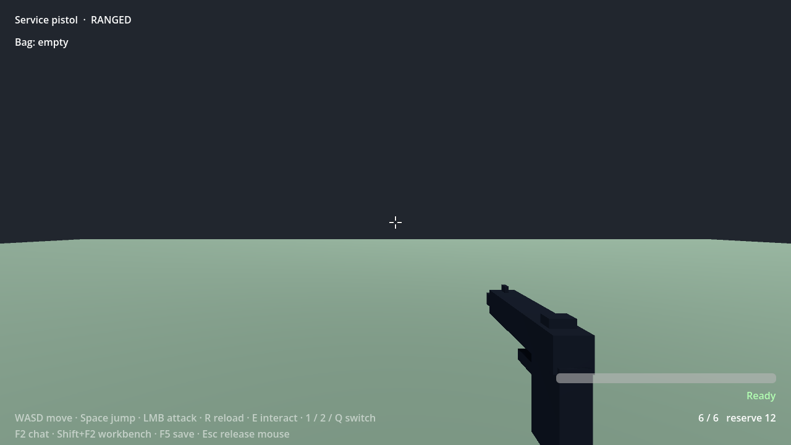
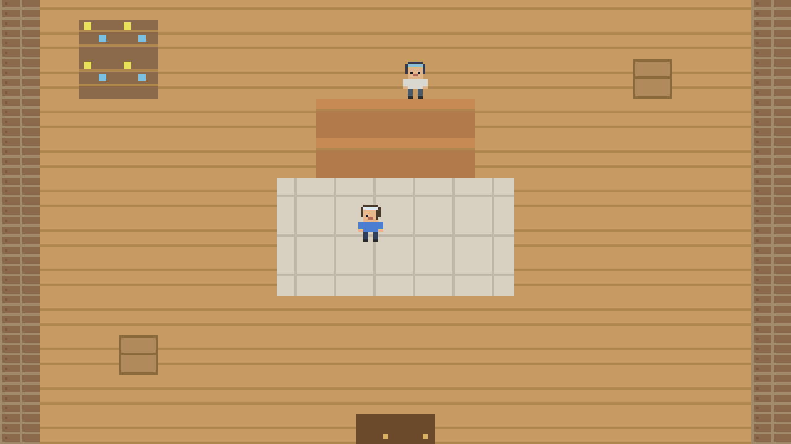
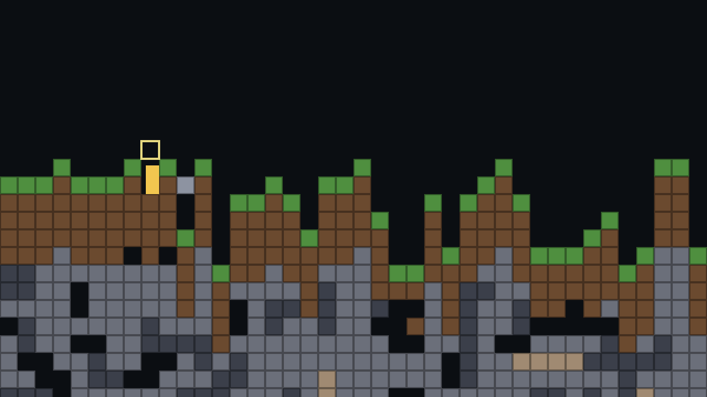

# GA27：同封存版本四旧底座实际回归

2026-09-12。本轮总体 **未通过（3/4）**。四个底座各有独立新 profile，通过已封存 `2a584796a9da32f6c8c5e597804d03fdefff638a` 客户端的普通 world.create 入口创建。第一人称、俯视和采矿通过真实初始化检查、实际加载、现有语义动作、保存与完整客户端冷开；横版在原生导入阶段失败，未取得运行时或冷开证据。没有更换横版模板制造通过结果。

| 底座 / 普通模板 | 真实结果 | 本轮实际玩法范围 |
| --- | --- | --- |
| first-person / blank | 创建、原初始化LPAC check、加载、save/cold通过 | 既有godotExplore执行30帧walk和30帧wait；位置 `[0,0.899999976,0]` → `[0,0.899999976,-2.250000477]` |
| top-down / town | 同链通过 | 既有godotPlayTown：采药、NPC交付、进入商店和购买；23个语义动作、22条实际检查；冷开保留64金币、bread×1、已领取任务奖励 |
| side-view / ruins | **初始化import失败** | 未执行godotPlayRuins；没有加载、截图、玩法或冷开通过声明 |
| mining-sandbox / mine-camp | 同链通过 | 既有godotPlayMine：实际移动、挖掘掉落、制作并放置砖块；78个语义动作、393条含逐步身份检查的断言；地形与完整进度冷开一致 |

这些范围不等于四个底座的全部玩法、输入手感、性能、模型创作能力或所有模板均通过。未运行玩家模型，也未访问用户profile或其他并行任务的世界。

## 产品与身份

封存目录：`D:/cm-agent-godot-0912/desktop/build/releases/2a584796a9da-2d754b04-1fd9-42af-a01c-6cb274b58219/output/win-unpacked`。

完整包1619文件、1,018,834,353字节；清单摘要 `fc87b540936b2dcf50c26c0e77a7943455c9d0a8adf7c9fd5c9b512833ed976b`。运行前后重新扫描逐文件hash完全一致。实际运行约132秒（00:21:16–00:23:28 UTC）。

| 底座 | world | 原初始化check job |
| --- | --- | --- |
| first-person | `world-c0697d68e604` | `gjob-7ad37a8d80d17a96683365290176db05227b2f6daa031ffe84f6c3d0a6ce26f2` |
| top-down | `world-f54dfe23d6d6` | `gjob-7566ae5f66c47ba313b57e257c6c5f24676f15c34b9e4845c4717d15f1dce1c1` |
| side-view | `world-fd55cf940cd2` | `gjob-e2cf1872e38556c0fc3ae90add0bedeeb082904357c74225a7395ed25c9866d6` |
| mining-sandbox | `world-b1de0fdf47d1` | `gjob-540aef3dae0962181a4bab930d3a0a3567108e3703c8dbe089b94dd888dfd650` |

三个成功实例均从实际 `godot.candidateList` 找到当前加载build对应candidate，再用其checkJobId调用普通 `godot.historyJob`。检查完整job的world/base/build、source revision/manifest/asset hash、candidate输出hash、executor及六项runtime断言；没有重新制造一条无关check替代初始化作业。保存使用 `godot.runtimeSave(freeze:true)`，cold用同一独立profile和同包；新runtime instanceId不同，build不变，完整 `craftmine.godot-progress/1` body逐字段一致，没有忽略玩家、计数或库存字段。

## 横版失败证据

原作业sourceRevision为1，manifestHash `29112926d99d0463a816ea802a7aba6c041c4e9773145332748399b33711f0c5`，build `gbd-8836ede78aff6173d3d0e4721e5599585962f676d32aa8c23fe8c1eab0ce2dbb`，outputHash `346d3011d0cbf87a18489913b04c1846f28184e4cd546d3d7b48d7aec7e970aa`。

封存executor自动按原策略重试一次已验证原生import崩溃；两次请求为 `im-8da9c139ecd5472c9cfdb320` 和 `im-d68fa341115745e8a6cf8314`，引擎退出码均为3221225477（`0xc0000005`）。broker进程退出0，报告引擎失败；cleanup verified/workRemoved均为true。两份日志没有GDScript解析错误，输出检查为 `runtime.not-run=false`。无法由现有日志确认原生崩溃根因，不能把它归咎于模型，也不能宣称横版运行时已通过。

broker SHA-256为 `36fafb48717429560d60b818d02e4d8bbea9e1ed26454206bb8733720ab7a12c`，使用原LPAC策略。失败的原始ledger、两次task/process/preflight/native日志及build源清单已归档。原封闭profile的 tasks.sqlite只以readonly方式提取作业身份/结果，不读取run token，输出为 `side-view-failed-jobs.json`；没有通过新Core进程启动恢复流程修改原数据库。

完整失败source保留于原证据目录的 `side-view/profile/plugins/data/craftmine.world/godot-builds/3f0bb419dec4ec3faea4d887922a9da0c2626239d030b1555e73028d37b3baf2/gbd-8836ede78aff6173d3d0e4721e5599585962f676d32aa8c23fe8c1eab0ce2dbb/source`。运行时任务仅复制它到新隔离工作树复现；本报告不回填后续修复结果。

## 后台约束与复核

实际调用只经过已有protected headless controller、worldNavigation/worldPanel及固定semantic入口，没有任意eval、鼠标/键盘模拟、focus或Pointer Lock请求。7个客户端均exit0，violations/pageErrors/shutdownFailures为空。首个阶段无模型配置或请求；内部世界初始化任务不是模型创作回合。现有固定动作数量/帧数边界属于开发者诊断，不是额外玩家token或整轮时限。

冷开先等待worldNavigationReady再world.open。本轮没有world.open错误重试；最终driver仅允许精确识别的WORLD_BUSY preflight等待后重试同一world，未知/timeout不重试。运行后补强了candidate source/output精确匹配断言，并重新读取本次原始记录复核全部三个成功案例，没有为了离线校验再次运行引擎。

6项离线证据测试通过，检查的是三通过/一失败的真实记录、完整冷开进度、失败不能冒充成功、原生双崩溃、归档/包hash及有限调用入口。**离线测试通过不改变本轮产品总体失败状态。**

原始目录：`D:/cm-ga27-legacy-bases-0912/test-results/desktop-native-complete-O5Cj5p`。
归档：[完整报告及清单](../evidence/ga27-legacy-bases-20260912/archive.json)。临时profile、Core数据库、Godot/WASM大文件不提交；精简源清单、日志、实际截图与完整报告保留。

```powershell
$env:CRAFTMINE_PACKAGED_ROOT='<上述固定2a封存目录>'
node tests/godot-agent/legacy-bases-client.mjs
node --test tests/godot-agent/legacy-bases-evidence.test.mjs
```

driver支持SIGINT/SIGTERM或证据根目录cancel.request正常退出。此次未额外制造取消故障；启动失败时立即记为该base失败并正常退出，再测试下一个独立profile。
后续独立诊断可设 `CRAFTMINE_LEGACY_BASE=side-view`，输出将明确标注单底座范围和requestedBases；不能把该诊断重新标成四底座全过。原O5Cj5p记录保持原样。

### 实际冷开画面

第一人称空白场景有地面、武器、准星和HUD；俯视画面为购买后的商店内玩家与NPC；采矿画面可见角色与地形。画面仅辅助检查，进度保全来自实际snapshot比较。






