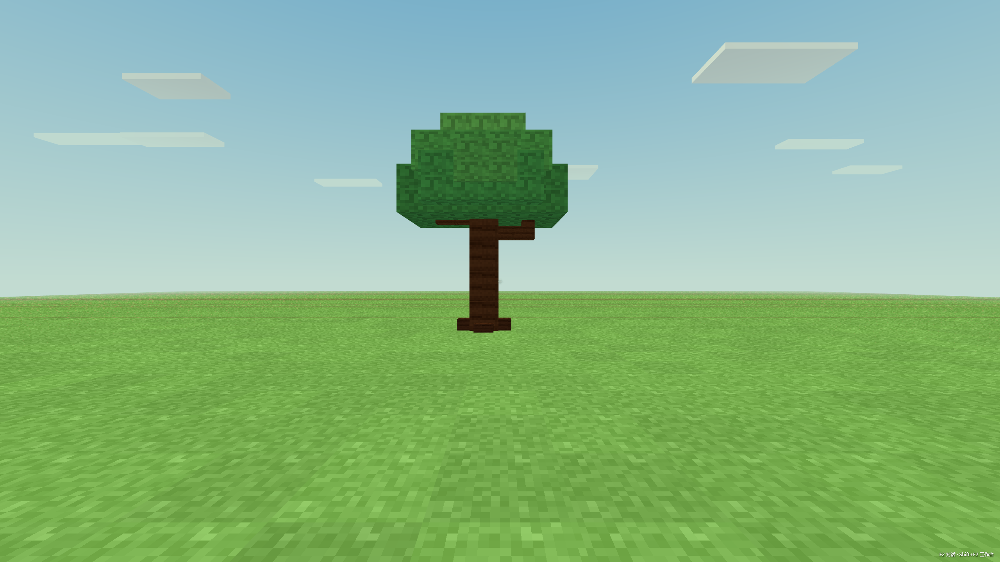

# Actual preview24 Web tree creation acceptance

Date: 2026-09-14. Result: passed, including a separate zero-model cold
continuation. The original failed driver reports remain unchanged.

The tested application was the actual extracted `PlayerFix-preview24-c04cef7e`
ZIP, not a source checkout. Full package inventory SHA-256:
`0eae486db1ff0d4b88cc9e2489aca86c1627ffe57642209f5d893392d8dadf64`.
The inventory was unchanged after each owned application shutdown.

## Actual player flow

The driver verified and saved the selected local Codex connection, normally
restarted its independent profile, and used the ordinary New World form to
create a blank `craftmine-web/5` world. It submitted exactly `生成一个树` through
the real Composer input and Send handlers with `gpt-6-astra`, `xhigh`, Auto.
The real author handshake confirmed those settings. No evaluation mode,
replacement model, token/call/whole-turn limit, OS input or Pointer Lock was used.

The author read the actual voxel contracts and empty asset library. Its first
patch used `leafy_tree`, which the normal resource-ID validator rejected. It
read the capabilities again and corrected the ID to `leafy-tree`; this original
tool error remains in the raw event stream. It created one tree with an actual
trunk, branches and leaf parts, then obtained a passing machine verification.
Its final answer correctly said the tree was a checked draft awaiting review
and player application, rather than claiming it was already in the world.

The separate frozen Codex review completed normally and the existing renderer
executed all five assertions: no errors, added object, grounded anchor, visible
object and actual drawable mesh. The driver opened the ordinary preview form,
read the actual preview renderer observation, and submitted the enabled ordinary
Apply form. Formal build became `v-a69f71f23b4846385348` in the same world
`91764f1b-8a9d-4616-9265-d46bb87dd4db`. The integration owner independently viewed
the applied screenshot and confirmed a recognizable complete tree on the ground,
with trunk, branches and crown, rather than a black or empty frame.

## Persistence and running state

The original run saved through the normal close lifecycle and reopened the
world. A driver assertion incorrectly demanded byte-equivalent *running* time:
the only difference was `behaviors.time`, advancing from `0.12330000000000002`
to `0.35150000000000003`. The original report preserves that failure.

The corrected cold continuation reused the already applied world and sent no
model requests. After normal application exit, the package's existing CoreClient
performed only a `world.read` and exited. The next normal world-list open read
the complete persisted world record through the actual bound renderer bridge
before saving again. The complete records, including build and full snapshot,
matched exactly. The actual renderer snapshot was compared separately with every
field retained: its only difference was `behaviors.time`, advancing from
`0.35150000000000003` to `0.4965`. Player state, inventory, gameplay and all other
fields were unchanged; no field was deleted to claim equality.

The cold frame shows the same tree. Dialogue IDs remained unchanged, with no
replayed creation or review. All four launches across the actual creation run
and its cold continuation exited normally with code 0 and empty violations,
page errors and shutdown-failure lists. The GPU lease was released afterward.

## Measured time and usage

| Operation | Observed elapsed | Reported tokens |
| --- | ---: | ---: |
| Author turn | 117.441 seconds | 179,507, including 153,344 cached input |
| Frozen Codex review | 50.603 seconds | 7,817 |
| Cold continuation | No model request | 0 |

The review overlapped the last part of the author turn. Composer Send to ordinary
application completion was about 157 seconds, so the two elapsed rows must not
be summed as wall time. Known reported author-plus-review tokens total 187,324.
Cache is counted once; reasoning tokens are included in output. Physical model
request count and billing cost are unknown. This includes the ordinary failed-ID
attempt and correction, not an artificially clean author trace.

## Evidence and limits

Read [the compact evidence](../evidence/legacy-tree-preview24-20260914/summary.json)
for complete snapshots, field differences, model usage, assertions, shutdown
audits and source artifact hashes. Original artifacts are preserved under
`D:/cm-final-legacy-tree/test-results/desktop-native-complete-ZKllfo/`:

- `report.json`: original actual creation/application evidence and clock failure.
- `cold-continuation-81b99cad-87e6-4cd1-901b-08a809a5c86d.json`: passed cold continuation.
- `agent-events.ndjson`: raw author events, including the rejected first ID.
- `legacy-tree-applied.png` and `legacy-tree-cold-confirmed.png`: real frames.
- The profile scratch directory retains the native frozen review diagnostic.

The earlier `SmfeyJ`, `USr22n` and `CTdRYW` directories retain driver preparation
failures, all before model submission: a refused main-navigation read and two
disabled-Send cases caused by changing host settings without refreshing the
renderer's cached selection. Their causes and explicit pre-send cancellations
are recorded in `driver-preparation-notes.json` in the parent test-results folder.
The final driver fixes use the ordinary world bridge and persisted settings
startup flow, not weaker product permissions.

The pure contract suite passes three tests and the driver passes syntax checks.
This acceptance verifies static tree creation, real review/render/application
and persistence. It does not claim a second live editing turn, freehand building
ergonomics or external-machine compatibility.
